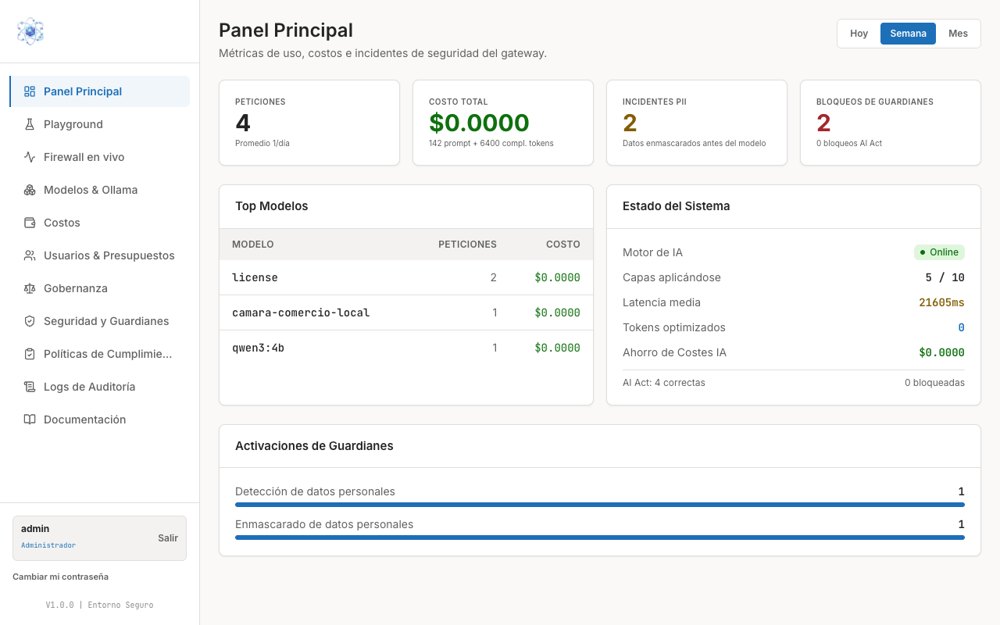
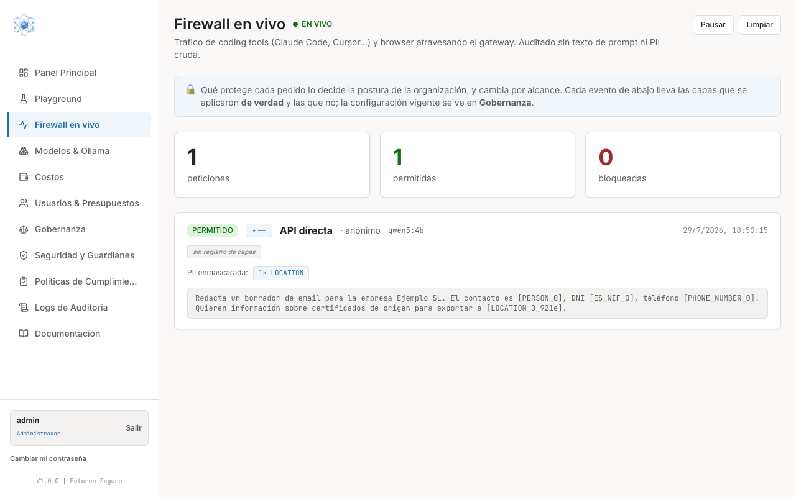
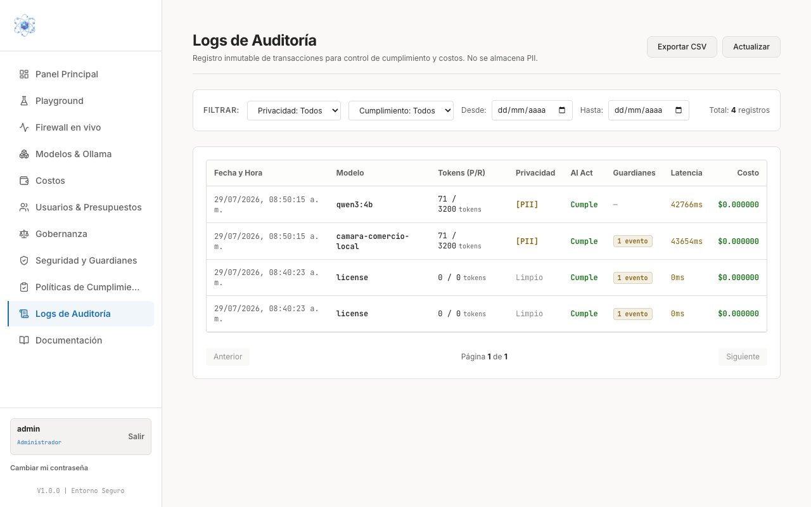

# Consultar la auditoría y el firewall en vivo

Esta guía le muestra las tres vistas con las que puede responder a la pregunta "¿qué está
pasando con la IA en mi organización?", de la más inmediata a la más formal:

1. **Panel Principal** — el resumen del período.
2. **Firewall en vivo** — el tráfico según ocurre, con la prueba visible de la protección.
3. **Logs de Auditoría** — el registro durable que se usa para cumplimiento.

## 1. El Panel Principal como resumen

Es la primera pantalla al entrar. Arriba a la derecha puede cambiar el período entre
**Hoy**, **Semana** y **Mes**; las cifras de la página se recalculan con esa selección.



Las cuatro tarjetas superiores son el titular del período:

- **Peticiones** — cuántas consultas han atravesado la pasarela, con el promedio diario.
- **Costo total** — el gasto acumulado, con el desglose de tokens de petición y de
  respuesta.
- **Incidentes PII** — cuántas veces se detectaron datos personales. La aclaración bajo la
  cifra lo dice con precisión: son **datos enmascarados antes del modelo**. No es una lista
  de fallos, es la cuenta de las veces que la protección hizo su trabajo.
- **Bloqueos de guardianes** — cuántas peticiones se detuvieron, con el detalle de cuántas
  lo fueron por AI Act.

Debajo encontrará:

- **Top Modelos** — qué modelos se están usando realmente y cuánto cuesta cada uno.
- **Estado del Sistema** — si el motor de IA está en línea, cuántas capas de protección se
  están aplicando sobre el total, la latencia media, los tokens optimizados y el ahorro
  asociado, más el recuento de peticiones correctas y bloqueadas por AI Act.
- **Activaciones de Guardianes** — qué protecciones concretas se dispararon en el período
  (por ejemplo, detección y enmascarado de datos personales).

!!! note "Para qué sirve esta pantalla"
    El Panel Principal es un resumen para mirar de un vistazo. Cuando necesite el detalle
    de un caso concreto, vaya al Firewall en vivo; cuando necesite evidencia para una
    auditoría, vaya a los Logs de Auditoría.

## 2. Firewall en vivo: ver la protección en acción

**Firewall en vivo** muestra el tráfico que atraviesa la pasarela según se produce, tanto
el de las herramientas conectadas como el del navegador. Los botones **Pausar** y
**Limpiar**, arriba a la derecha, le permiten congelar la vista para leer un evento con
calma o vaciar la pantalla.



Los tres contadores resumen lo que se lleva visto: **peticiones**, **permitidas** y
**bloqueadas**.

### Qué contiene cada evento

Cada tarjeta de evento le da, de un vistazo:

- El estado: **PERMITIDO** o **BLOQUEADO**.
- El origen de la petición, el modelo que la atendió y la hora.
- Las capas de protección que se aplicaron a ese pedido concreto.
- **PII enmascarada** — cuántos datos personales se sustituyeron y de qué tipo.
- El texto que realmente salió hacia el modelo.

### La prueba visible: el prompt enmascarado

Lo más valioso de esta pantalla es el recuadro con el texto de la petición, porque **ese es
literalmente el texto que recibió el modelo**. Donde el usuario escribió un nombre, un DNI
o un teléfono, el modelo recibió marcadores:

```text
Redacta un borrador de email para la empresa Ejemplo SL. El contacto es
[PERSON_0], DNI [ES_NIF_0], teléfono [PHONE_NUMBER_0]. Quieren información
sobre certificados de origen para exportar a [LOCATION_0_921e].
```

Cada marcador indica qué tipo de dato ocupaba ese lugar: `[PERSON_0]` una persona,
`[ES_NIF_0]` un documento de identidad, `[PHONE_NUMBER_0]` un teléfono, `[LOCATION_0_…]`
una localización. El dato original nunca salió de su organización.

El usuario, mientras tanto, no ve marcadores: recibe su respuesta con los datos reales ya
restaurados. Por eso esta pantalla es la mejor demostración de la protección ante un
responsable de cumplimiento — muestra la diferencia entre lo que se escribió y lo que se
envió.

!!! note "Lo aplicado, por evento; lo configurado, en Gobernanza"
    La propia pantalla lo advierte: qué protege cada pedido depende de la postura de la
    organización y cambia según el alcance. Cada evento indica las capas que se aplicaron
    **de verdad** y las que no; la **configuración vigente** se consulta en
    [Gobernanza](politicas.md). Un evento marcado como *sin registro de capas* significa
    exactamente eso: que para ese pedido no se guardó ese detalle.

## 3. Logs de Auditoría: el registro para cumplimiento

Mientras que el Firewall en vivo es una vista efímera de lo que pasa ahora, **Logs de
Auditoría** es el registro inmutable y persistente de las transacciones, pensado para el
control de cumplimiento y de costes.



### Filtrar y exportar

1. Entre en **Logs de Auditoría** desde el menú lateral.
2. Acote el conjunto con los filtros de la barra superior: **Privacidad**, **Cumplimiento**
   y el rango de fechas **Desde** / **Hasta**. A la derecha se indica el **total de
   registros** que cumplen el filtro.
3. Recorra los resultados con **Anterior** / **Siguiente** al pie de la tabla.
4. Pulse **Exportar CSV** para llevarse los registros a una hoja de cálculo o adjuntarlos a
   un expediente. **Actualizar** recarga los datos.

### Qué registra cada línea

| Columna | Contenido |
| --- | --- |
| **Fecha y Hora** | Cuándo se produjo la transacción. |
| **Modelo** | Qué modelo la atendió. |
| **Tokens (P/R)** | Tokens de petición y de respuesta. |
| **Privacidad** | **[PII]** si la transacción contenía datos personales que se enmascararon; **Limpio** si no había ninguno. |
| **AI Act** | Si la transacción **Cumple** con la política aplicable. |
| **Guardianes** | Cuántos eventos de guardianes se registraron para esa transacción. |
| **Latencia** | Cuánto tardó. |
| **Costo** | Cuánto costó. |

!!! warning "El registro no guarda prompts en claro"
    Ni los Logs de Auditoría ni el Firewall en vivo almacenan el texto original de las
    consultas ni los datos personales sin enmascarar. Se audita **sin texto de prompt ni
    PII cruda**: queda constancia de que hubo datos personales, de cuántos y de qué tipo,
    pero no de su contenido. Es deliberado — el propio registro de cumplimiento no puede
    convertirse en una nueva copia de los datos que protege.
