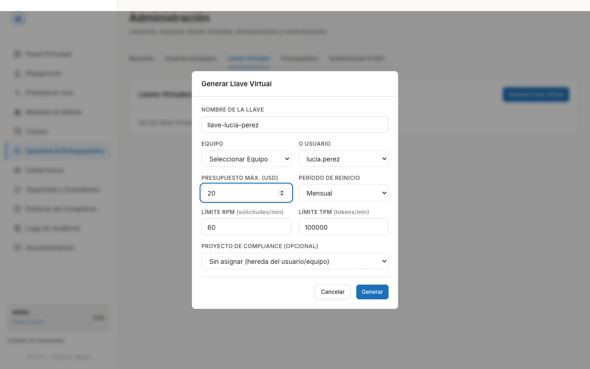
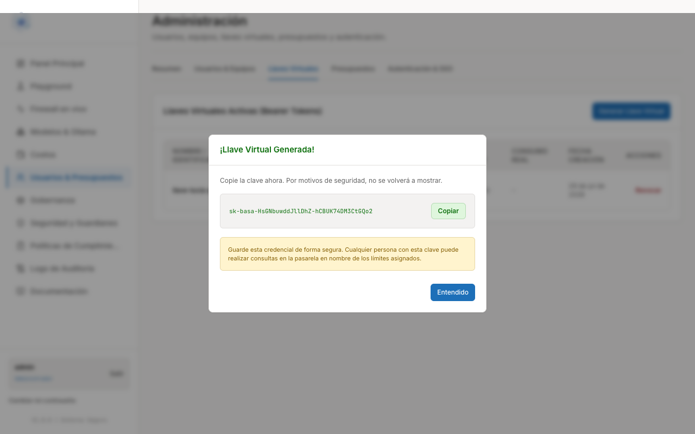
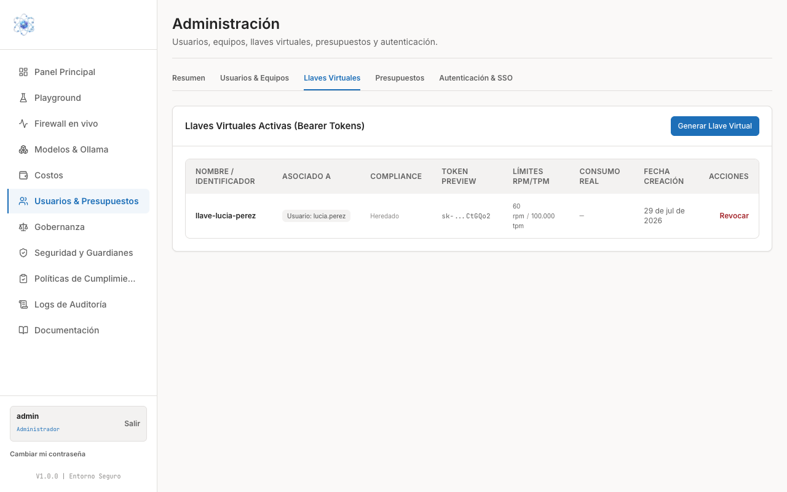

# Crear llaves de acceso

Al terminar esta guía habrá generado una **llave virtual**: la credencial que permite a
una aplicación o herramienta conectarse a la pasarela en nombre de una persona o de un
equipo, con sus propios límites de gasto y de uso.

Las llaves se gestionan en **Usuarios & Presupuestos**, pestaña **Llaves Virtuales**.

## Qué es una llave virtual

Una llave virtual es una credencial con formato `sk-sentinel-…` que se envía en la cabecera
`Authorization` de cada petición. Sirve para lo que no es el uso a través del panel:
una aplicación interna, un script, una herramienta de escritorio.

Frente a una contraseña de usuario, una llave virtual tiene tres ventajas:

- **Lleva sus propios límites**: presupuesto máximo en USD, período de reinicio y
  límites de peticiones y de tokens por minuto.
- **Está asociada a un equipo o a una persona**, de modo que el consumo se imputa a
  quien corresponde.
- **Se puede revocar de forma individual** sin tocar la cuenta de nadie.

Todo lo que pase por una llave atraviesa las mismas capas de protección y queda
registrado igual que el uso desde el panel.

## 1. Generar una llave

1. Entre en **Usuarios & Presupuestos** y abra la pestaña **Llaves Virtuales**.
2. Pulse **Generar Llave Virtual**.
3. Complete el modal:
      - **Nombre de la llave** — un nombre que diga a quién o a qué pertenece
        (por ejemplo, el nombre de la persona o de la aplicación).
      - **Equipo** *o* **Usuario** — elija uno de los dos, según a quién deba imputarse
        el consumo.
      - **Presupuesto máx. (USD)** — el gasto máximo de esta llave.
      - **Período de reinicio** — *Diario*, *Semanal*, *Mensual* o *Anual*.
      - **Límite RPM (solicitudes/min)** — por defecto `60`.
      - **Límite TPM (tokens/min)** — por defecto `100000`.
      - **Proyecto de compliance (opcional)** — si lo deja en *Sin asignar*, hereda el
        del usuario o del equipo.
4. Pulse **Generar**.

Los límites RPM y TPM son un freno técnico: acotan el ritmo de las peticiones para que
una integración mal configurada no consuma el presupuesto de golpe. Deje los valores
por defecto salvo que la aplicación necesite otra cosa.

## 2. Copiar la llave: solo se muestra una vez

Al generar la llave aparece el aviso **¡Llave Virtual Generada!** con la credencial
completa y un botón **Copiar**.

!!! warning "Cópiela ahora"
    *Copie la clave ahora. Por motivos de seguridad, no se volverá a mostrar.*
    Guárdela en el gestor de credenciales de su organización y entréguela a su
    destinatario por un canal seguro. Cualquier persona con esta clave puede realizar
    consultas en la pasarela dentro de los límites asignados.

    Si la llave se pierde, no hay forma de recuperarla: **revóquela** y genere una nueva.

Pulse **Entendido** para cerrar el aviso.

## 3. Consultar y revocar llaves

La tabla **Llaves Virtuales Activas (Bearer Tokens)** lista todas las llaves en vigor.

Columnas de la tabla:

| Columna | Qué muestra |
| --- | --- |
| Nombre / Identificador | El nombre que usted le dio a la llave |
| Asociado a | El usuario o el equipo al que se imputa el consumo |
| Compliance | El proyecto de compliance, o *Heredado* |
| Token preview | Solo los últimos caracteres (`sk-…XXXX`), para identificarla |
| Límites RPM/TPM | Los límites de ritmo configurados |
| Consumo real | El gasto acumulado de la llave |
| Fecha creación | Cuándo se generó |
| Acciones | **Revocar** |

**Revocar** deja la llave inservible de inmediato: las aplicaciones que la usen dejarán
de poder conectarse. Es una acción definitiva; para restablecer el servicio hay que
generar una llave nueva y actualizar la aplicación.

## Buenas prácticas

- **Una llave por persona o por aplicación.** Nunca comparta una misma llave entre
  varias personas o sistemas: si tiene que revocarla, no querrá dejar a todos sin
  servicio a la vez, y el consumo dejaría de ser atribuible.
- **Nombres que se entiendan.** El nombre es lo único que verá dentro de seis meses
  para decidir si esa llave sigue haciendo falta.
- **Revoque al dar de baja.** Cuando alguien deja la organización o una integración se
  retira, revoque su llave el mismo día.
- **Presupuesto ajustado.** Asigne a cada llave el presupuesto que realmente necesita;
  es la contención más simple frente a un uso inesperado.
- **Nunca en el código ni en un chat.** La llave va en la configuración de la
  aplicación o en el gestor de credenciales, no escrita dentro del código fuente ni
  enviada por mensajería.

!!! note "Herramientas de programación"
    Algunas herramientas de desarrollo se conectan a la pasarela por una vía distinta,
    con su propia sesión. Si su equipo técnico necesita ese modo de conexión, escriba a
    soporte@sentinel-dev.com.

## Siguiente paso

Continúe con [Presupuestos y límites de gasto](presupuestos.md) para añadir a estas
llaves los límites de persona y de equipo.
