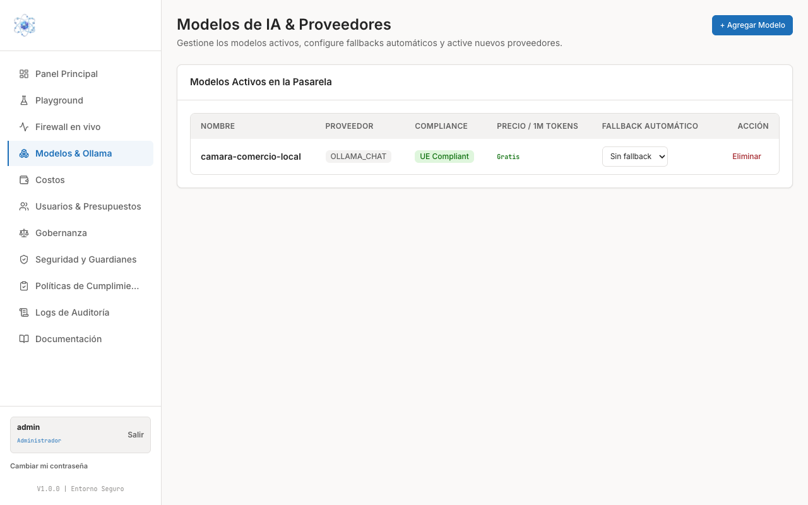
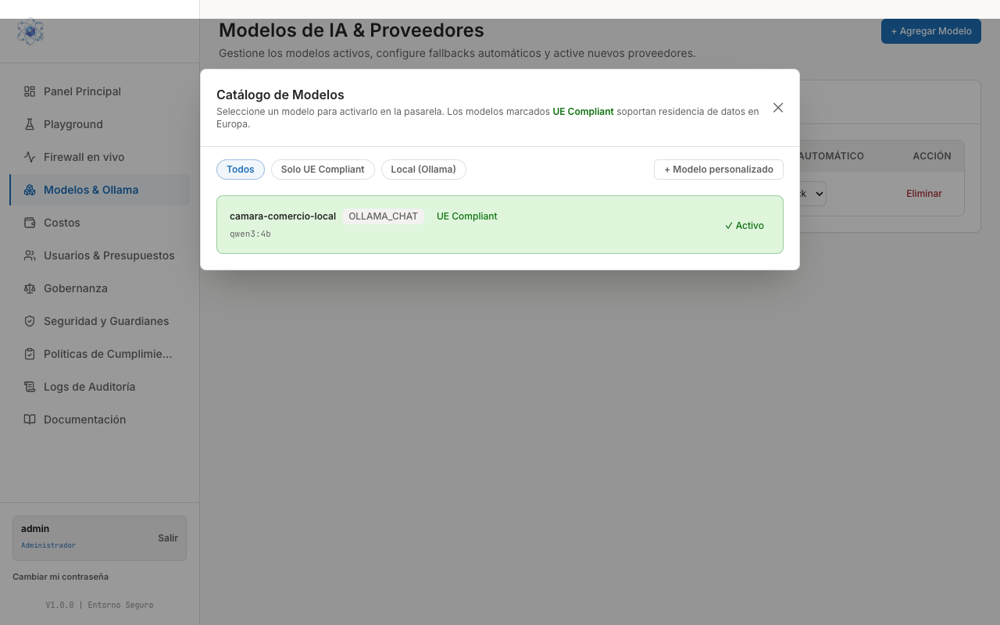

# Configurar modelos de IA

En esta guía dará de alta los modelos de IA que su organización podrá usar, decidirá
cuál actúa como respaldo si otro falla y retirará los que ya no necesite.

Todo se hace desde la opción **Modelos & Ollama** del menú lateral, que abre la página
**Modelos de IA & Proveedores**.

## Los modelos activos en la pasarela

La tabla **Modelos Activos en la Pasarela** es la lista de lo que sus usuarios pueden
seleccionar en el Playground, en el portal del Asistente Seguro y desde las herramientas
conectadas por llave virtual. Si un modelo no está en esta tabla, no existe para su
organización.

| Columna | Qué le dice |
| --- | --- |
| **Nombre** | El identificador que sus usuarios verán en el selector de modelo y que los desarrolladores usarán en el campo `model` de la API. |
| **Proveedor** | Quién sirve ese modelo. |
| **Compliance** | La etiqueta **UE Compliant** cuando el modelo soporta residencia de datos en Europa. |
| **Precio / 1M tokens** | El coste por millón de tokens que se aplicará al consumo de sus equipos. Un modelo local aparece como **Gratis**. |
| **Fallback automático** | El modelo de respaldo que atenderá la petición si este no responde. |
| **Acción** | **Eliminar** retira el modelo de la pasarela. |

### Qué significa "UE Compliant"

Es una marca de residencia de datos: los modelos marcados **UE Compliant** soportan que
el tratamiento ocurra en Europa. Es el criterio más simple para decidir qué ofrecer a los
equipos que trabajan con datos de personas.

### El modelo local que ya viene configurado

Su instalación llega con el modelo local **`camara-comercio-local`** ya activo: proveedor
`OLLAMA_CHAT`, **UE Compliant** y precio **Gratis**.

Es un modelo que corre en los servidores de su propia organización. Esto tiene dos
consecuencias prácticas:

- **Los datos no salen de sus servidores.** La consulta se procesa dentro de su
  infraestructura y no viaja a ningún proveedor externo.
- **El coste es cero.** No hay facturación por token, así que puede usarlo sin consumir
  presupuesto de los equipos.

!!! note "Úselo como red de seguridad"
    Por esas dos razones el modelo local es un buen candidato para el campo **Fallback
    automático** de los modelos externos y para los equipos que manejan información
    especialmente sensible.

## Añadir un modelo desde el Catálogo

1. En **Modelos & Ollama**, pulse el botón **+ Agregar Modelo** (arriba a la derecha).
2. Se abre el modal **Catálogo de Modelos**, con la lista de modelos disponibles para
   activar en la pasarela.

    

3. Acote la lista con los filtros de la parte superior:

    - **Todos** — todo el catálogo.
    - **Solo UE Compliant** — únicamente los modelos con residencia de datos en Europa.
    - **Local (Ollama)** — únicamente los modelos que corren en sus propios servidores.
    - **+ Modelo personalizado** — para dar de alta un modelo que no figure en el catálogo.

4. Cada entrada del catálogo muestra el nombre, el proveedor, la etiqueta **UE Compliant**
   cuando corresponde y el identificador técnico del modelo. Los que ya están dados de
   alta aparecen marcados como **Activo**.
5. Seleccione el modelo que quiera activar. Al cerrar el modal, el modelo nuevo aparece en
   la tabla **Modelos Activos en la Pasarela**.

!!! warning "Si el modelo nuevo no responde"
    Tras dar de alta un modelo puede pasar unos minutos hasta que quede disponible para
    atender peticiones. Si transcurridos unos minutos el modelo sigue sin responder,
    contacte con su soporte técnico en **soporte@basa-dev.com** indicando el nombre del
    modelo. No hay nada que deba hacer usted desde el panel.

## Configurar el fallback automático

El fallback es el modelo que atenderá la petición cuando el modelo elegido no esté
disponible, de forma transparente para el usuario.

1. Localice el modelo en la tabla **Modelos Activos en la Pasarela**.
2. Abra el desplegable de la columna **Fallback automático** en esa fila.
3. Elija el modelo de respaldo. El valor **Sin fallback** significa que, si ese modelo
   falla, la petición no se reintenta con ningún otro.

El fallback se configura modelo a modelo: cada fila tiene el suyo, así que puede dar
respaldo a los modelos críticos y dejar el resto sin él.

## Eliminar un modelo

1. Localice la fila del modelo en la tabla.
2. Pulse **Eliminar** en la columna de acciones.

El modelo deja de estar disponible en los selectores y en la API.

!!! warning "Revise antes los fallbacks y las integraciones"
    Antes de eliminar un modelo, compruebe que no está configurado como **Fallback
    automático** de otro y que ninguna herramienta conectada lo esté pidiendo por su
    nombre: esas peticiones dejarían de funcionar. El histórico de consumo del modelo
    permanece en los Logs de Auditoría.
