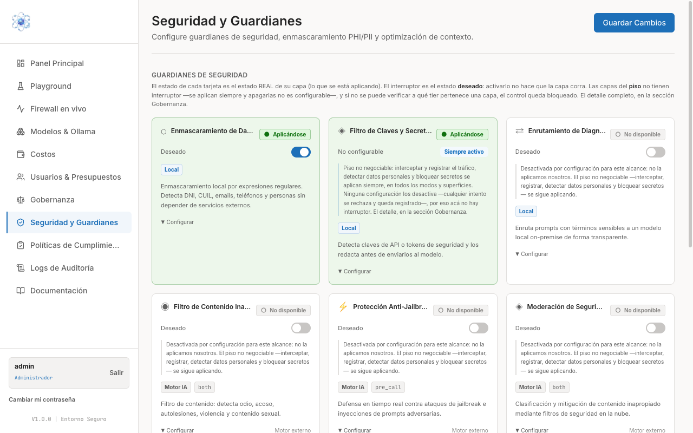
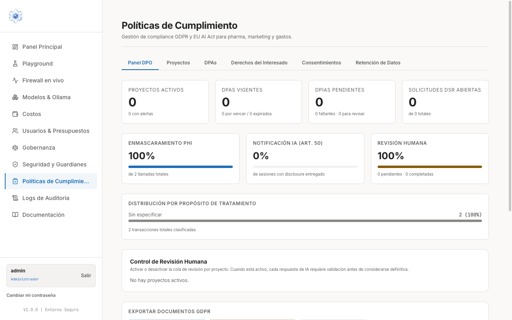
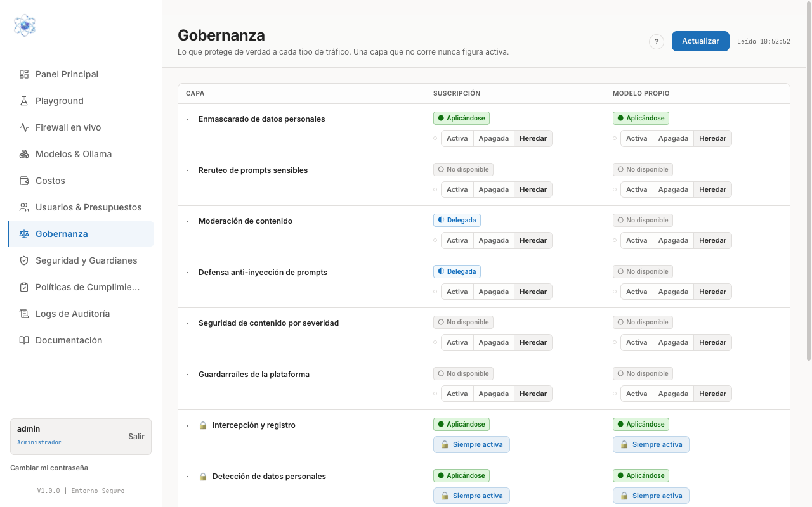

# Políticas de protección de datos

Tres pantallas del panel describen cómo se protege la información de su organización:
**Seguridad y Guardianes** (qué protecciones existen y cuáles están corriendo),
**Políticas de Cumplimiento** (la documentación y los indicadores de GDPR y AI Act) y
**Gobernanza** (la configuración vigente, capa por capa y alcance por alcance).

Esta guía le enseña a leerlas. Los ajustes de política son una decisión de su organización:
para cambiarlos, hable con su soporte técnico en **soporte@basa-dev.com**.

## Qué le pasa a una consulta: las cinco capas

Antes de leer las pantallas conviene tener presente el recorrido de una consulta. El
Playground lo muestra con nombre y número en su panel **Capas de Seguridad**:

| Capa | Qué hace |
| --- | --- |
| **01 · Enmascaramiento PHI/PII** | Detecta los datos personales del texto y los sustituye por marcadores antes de que nada salga. |
| **02 · Optimización de Contexto** | Reduce el texto que se envía al modelo, lo que baja el consumo de tokens y el coste. |
| **03 · Políticas de Cumplimiento** | Comprueba la consulta contra las políticas de la organización. |
| **04 · Canal de Enrutamiento LLM** | Decide por qué canal y hacia qué modelo va la petición ya protegida. |
| **05 · Restauración y Desenmascaramiento** | Devuelve los datos originales a la respuesta, ya en su organización, para que el usuario la lea completa. |

La consecuencia práctica: el modelo trabaja siempre con marcadores y el usuario siempre lee
datos reales. Puede comprobarlo usted mismo en
[Firewall en vivo](auditoria.md#2-firewall-en-vivo-ver-la-proteccion-en-accion), donde se ve
el texto enmascarado tal y como salió.

## Seguridad y Guardianes

Se abre desde **Seguridad y Guardianes** en el menú lateral. Es el inventario de
protecciones, presentado como una tarjeta por guardián.

Lo primero que hay que entender es la distinción que la propia página explica arriba:

- El **estado de la tarjeta** es el estado **real** de esa capa: lo que se está aplicando.
  **Aplicándose** significa que está corriendo ahora mismo; **No disponible** significa que
  no se aplica en este alcance.
- El **interruptor "Deseado"** es la intención, no el resultado: activarlo no hace por sí
  solo que la capa corra.

Fíese siempre de la etiqueta de estado, no del interruptor.

Cada tarjeta indica además dónde se ejecuta la protección — **Local** cuando se resuelve
dentro de su instalación, sin depender de servicios externos — y describe en una frase qué
detecta. En la instalación de la captura conviven, por ejemplo, el enmascaramiento local de
datos personales (detecta documentos de identidad, correos, teléfonos y personas), el filtro
de claves y secretos, el enrutamiento a un modelo local para prompts sensibles, el filtro de
contenido inapropiado, la protección anti-jailbreak y la moderación de seguridad.

!!! note "Las protecciones de base no se pueden apagar"
    Algunos guardianes aparecen como **No configurable · Siempre activo** y no tienen
    interruptor. Son el suelo no negociable del sistema: interceptar y registrar el tráfico,
    detectar datos personales y bloquear secretos se aplican siempre, en todos los modos y
    superficies. Ninguna configuración los desactiva.

## El aviso de "Detección NLP" en el panel principal

La detección de datos personales en producción la hace un **motor de lenguaje**, un servicio
propio de su instalación. El **Panel Principal** muestra su estado en la tarjeta *Estado del
Sistema* y, cuando hace falta, con un aviso arriba de todo que no se puede cerrar. Verá una de
estas tres cosas:

| Lo que ve | Qué significa | Qué hacer |
| --- | --- | --- |
| **Detección NLP · Activa** (verde) | Todo normal: los datos personales se detectan con el motor completo. | Nada. |
| **Detección NLP: no configurada — modo regex de desarrollo** (aviso gris) | Su instalación no tiene el motor de lenguaje conectado y detecta con patrones locales, que encuentran menos casos. | Es habitual en instalaciones de prueba. **No trabaje con datos reales de pacientes o clientes** hasta confirmarlo con soporte. |
| **El motor de detección de datos personales no responde** (aviso rojo) | El motor está conectado pero caído ahora mismo. | Avise a **soporte@basa-dev.com** indicando desde qué hora aparece el aviso. |

Cuando aparece el aviso rojo, el propio texto le dice qué le está pasando a las consultas,
porque hay dos comportamientos posibles y su organización tiene configurado uno:

- **Se están bloqueando.** Es la configuración recomendada y la que viene por defecto: sin
  garantía de detección no se envía nada al modelo. Los usuarios verán un mensaje de error al
  consultar; es el sistema protegiéndoles, no una avería del asistente.
- **Se están sirviendo con detección por patrones.** Las consultas siguen funcionando, pero
  con **menos cobertura**: un nombre y apellido sin tratamiento previo o un teléfono sin
  prefijo internacional pueden salir sin enmascarar. El aviso indica desde cuándo y cuántas
  consultas se han servido así.

En los dos casos, cada consulta afectada queda marcada en
[Logs de Auditoría](auditoria.md) con un estado propio, de forma que después se puede aislar
exactamente qué tráfico pasó durante la caída. El aviso desaparece solo cuando el sistema
comprueba que el motor volvió a responder.

!!! warning "Elegir entre bloquear y continuar es una decisión de su organización"
    Las dos opciones son legítimas y dependen de qué pesa más: la continuidad del servicio o
    la cobertura de la detección. Con datos de salud, la respuesta correcta es **bloquear**.
    Para revisar o cambiar esta configuración, hable con su soporte técnico en
    **soporte@basa-dev.com**.

## Políticas de Cumplimiento

Se abre desde **Políticas de Cumplimiento**. Es el espacio de trabajo de la persona
responsable de protección de datos: reúne la gestión documental de GDPR y del AI Act y los
indicadores que la acompañan.

La página se organiza en pestañas: **Panel DPO**, **Proyectos**, **DPAs**, **Derechos del
Interesado**, **Consentimientos** y **Retención de Datos**.

El **Panel DPO** es el resumen de entrada:

- Cuatro contadores de situación: **proyectos activos**, **DPAs vigentes**, **DPIAs
  pendientes** y **solicitudes DSR abiertas**.
- Tres indicadores de cobertura sobre el tráfico real: el porcentaje de **enmascaramiento
  PHI** sobre el total de llamadas, el de **notificación IA (art. 50)** sobre las sesiones
  con aviso entregado y el de **revisión humana**.
- La **distribución por propósito de tratamiento**, que reparte las transacciones
  clasificadas según para qué se trataron los datos.
- El **Control de Revisión Humana**, que permite activar o desactivar la cola de revisión
  por proyecto: cuando está activa, cada respuesta de IA requiere validación antes de
  considerarse definitiva.
- Un bloque para **exportar documentos GDPR**.

!!! note "Los indicadores se alimentan del uso real"
    Los porcentajes de esta página no se rellenan a mano: salen de las transacciones que
    han pasado por la pasarela. Un indicador bajo suele significar que falta configurar o
    documentar algo, no que el sistema falle.

## Gobernanza: la configuración vigente

Se abre desde **Gobernanza**. Es la respuesta a la pregunta "¿qué protege de verdad a cada
tipo de tráfico?". Una capa que no está corriendo nunca figura aquí como activa.

La pantalla es una matriz:

- **Las filas son las capas de protección**: enmascarado de datos personales, reruteo de
  prompts sensibles, moderación de contenido, defensa anti-inyección de prompts, seguridad
  de contenido por severidad, guardarraíles de la plataforma, intercepción y registro,
  detección de datos personales.
- **Las columnas son los alcances**, es decir, los distintos tipos de tráfico que atraviesan
  la pasarela. Una misma capa puede estar aplicándose en un alcance y no estar disponible en
  otro: por eso conviene mirar la fila entera antes de sacar conclusiones.

En cada celda verá el estado real de esa capa para ese alcance:

| Estado | Significado |
| --- | --- |
| **Aplicándose** | La capa está corriendo para ese tráfico. |
| **Delegada** | La protección la resuelve el proveedor del modelo, no la pasarela. |
| **No disponible** | La capa no se aplica en ese alcance. |
| **Siempre activa** (con candado) | Protección de base, no desactivable. |

Bajo cada estado están los controles de intención — **Activa**, **Apagada**, **Heredar** —
donde **Heredar** significa que esa capa sigue la política general en lugar de fijar una
propia. Las filas con candado no ofrecen esos controles.

El botón **Actualizar** recarga la matriz y la hora de la última lectura se indica al lado.

!!! warning "Para cambiar una política, contacte con soporte"
    Gobernanza y Seguridad y Guardianes son, ante todo, la vista fiable de lo que está
    aplicándose: úselas para verificar y para documentar. Cualquier cambio de la política de
    protección de su organización conviene acordarlo con su soporte técnico en
    **soporte@basa-dev.com**, que confirmará que la configuración deseada se traduce en
    capas realmente aplicadas. Después del cambio, compruebe el resultado en esta misma
    pantalla y en los eventos del [Firewall en vivo](auditoria.md).
