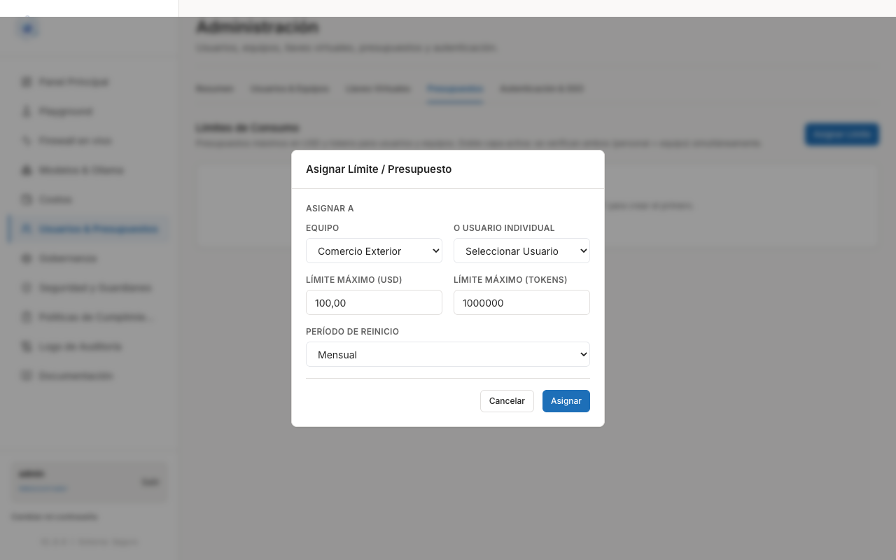
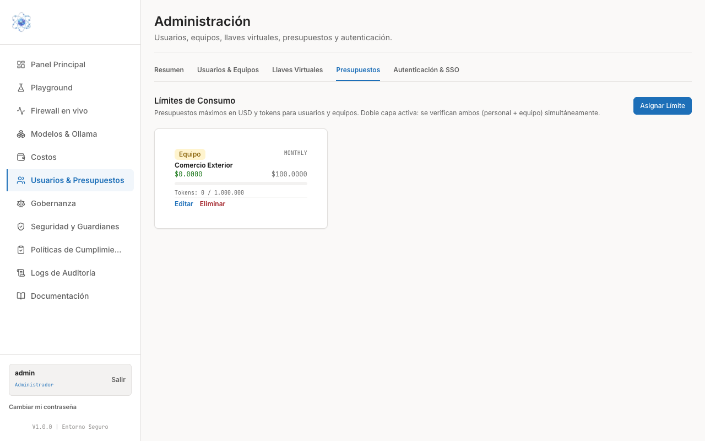
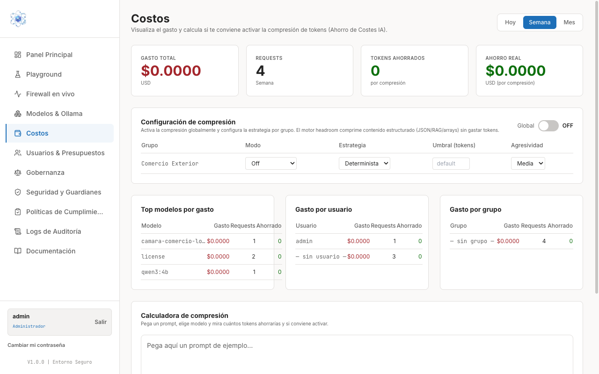

# Presupuestos y límites de gasto

Al terminar esta guía tendrá asignados límites de consumo a sus equipos y a sus
personas, y sabrá dónde vigilar el gasto real.

Los límites se configuran en **Usuarios & Presupuestos**, pestaña **Presupuestos**
(bloque **Límites de Consumo**).

## Cómo funciona: doble capa

La pasarela aplica dos límites a la vez, uno personal y uno de equipo:

!!! note "Doble capa activa"
    *Se verifican ambos (personal + equipo) simultáneamente.*

En la práctica: si una persona tiene su propio límite y además pertenece a un equipo con
límite, ambos deben permitirlo. Se detiene el consumo en cuanto se agota **el primero de
los dos**. Esto le deja acotar el gasto del área sin renunciar a acotar el de cada
persona dentro de ella.

## 1. Asignar un límite

1. Entre en **Usuarios & Presupuestos** y abra la pestaña **Presupuestos**.
2. Pulse **Asignar Límite**.
3. Complete el modal **Asignar Límite / Presupuesto**:
      - **Equipo** *o* **Usuario individual** — elija uno de los dos. Repita el proceso
        si quiere las dos capas.
      - **Límite máximo (USD)** — el gasto máximo del período.
      - **Límite máximo (Tokens)** — el volumen máximo de tokens del período.
      - **Período de reinicio** — *Diario*, *Semanal*, *Mensual* o *Anual*.
4. Pulse **Asignar**.

### USD y tokens

Los dos límites conviven y conviene entenderlos como controles distintos:

- **USD** controla el **coste**. Es la cifra que interesa a quien firma el gasto.
- **Tokens** controla el **volumen** de uso, independientemente de lo que cueste. Es
  útil cuando se trabaja con modelos locales, cuyo coste monetario es cero pero cuyo
  uso conviene acotar igualmente.

### Período de reinicio

El período determina cada cuánto vuelve el contador a cero. **Mensual** es la opción
habitual, porque encaja con el ciclo presupuestario. Elija **Diario** o **Semanal**
cuando quiera detectar pronto un uso desbocado, y **Anual** para partidas cerradas.

## 2. Comprobar el resultado

Cada límite asignado aparece como una tarjeta en **Límites de Consumo**, con la etiqueta
**Equipo** o de usuario, el período, el consumo actual frente al máximo en USD, una
barra de progreso y el contador de tokens consumidos sobre el total.

Cada tarjeta ofrece **Editar** (para ajustar importes o período) y **Eliminar** (para
retirar el límite). Al eliminar un límite, esa capa deja de aplicarse.

## 3. Relación con los otros límites

Además de los presupuestos de esta pestaña, existen límites en la propia llave de
acceso. Conviene tenerlos claros para no duplicar controles:

| Dónde se define | Qué controla | Para qué sirve |
| --- | --- | --- |
| **Presupuestos** (esta página) | Gasto en USD y tokens por período, de la persona y del equipo | Contención presupuestaria general |
| **Presupuesto máx.** de una llave | Gasto en USD de esa credencial concreta | Acotar una aplicación o integración |
| **Límite RPM / TPM** de una llave | Ritmo: solicitudes y tokens por minuto | Evitar que un fallo técnico consuma el presupuesto de golpe |

Los presupuestos de persona y de equipo se aplican a **todo** el consumo de esa persona
o ese equipo, venga del panel o de una llave. El presupuesto de una llave concreta se
suma como un tope adicional, solo para lo que pase por esa credencial. Consulte
[Crear llaves de acceso](llaves.md) para configurarlos.

## 4. Dónde vigilar el consumo

### Página Costos

En **Costos** verá el gasto real, con selector de período **Hoy / Semana / Mes**:

- Tarjetas de cabecera: **Gasto total** (USD) y número de **Requests** del período.
- **Top modelos por gasto** — qué modelos concentran el coste.
- **Gasto por usuario** y **Gasto por grupo** — a quién se imputa, con su número de
  peticiones. Son las dos vistas que se corresponden con las dos capas de presupuesto.

### Panel Principal

El **Panel Principal** ofrece la vista rápida del día a día: peticiones, coste,
incidentes de datos personales y bloqueos, junto con los modelos más usados y el estado
del sistema. Úselo para el vistazo diario y reserve **Costos** para el análisis del
gasto.

!!! note "Revise antes de que se agote"
    Compare periódicamente el consumo de **Costos** con los máximos de **Límites de
    Consumo**. Un equipo que llega al final de su presupuesto deja de poder trabajar
    hasta el siguiente reinicio del período o hasta que usted amplíe el límite.
