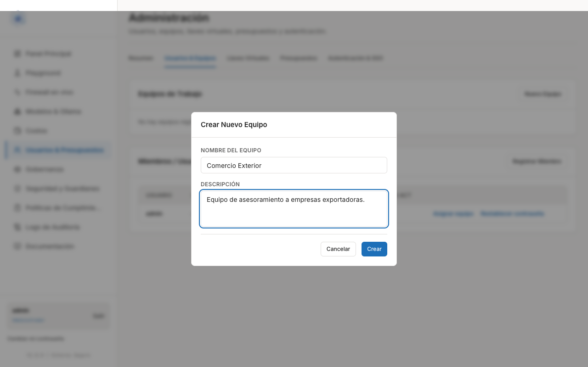
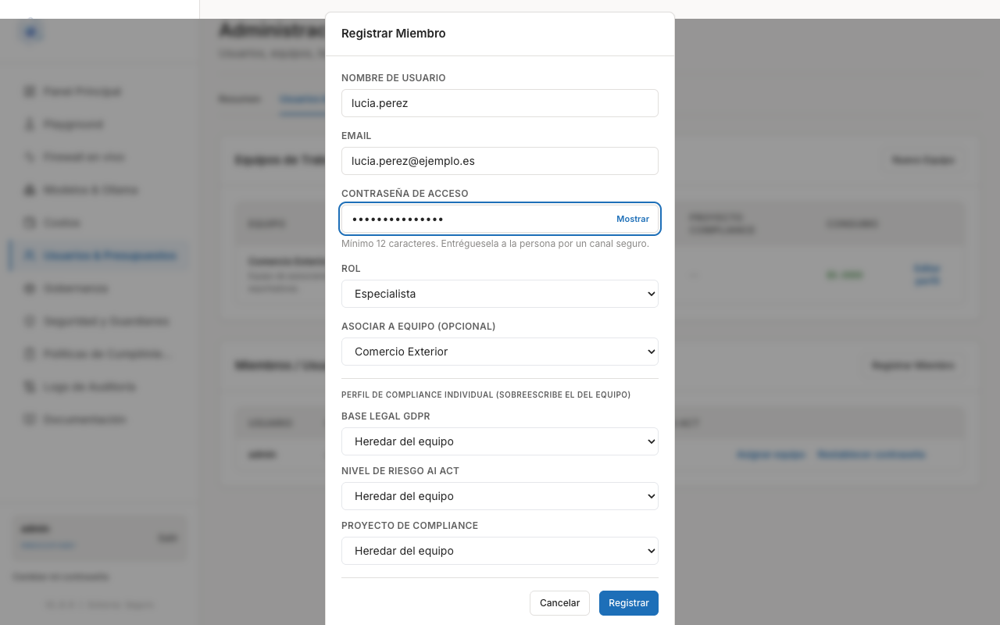
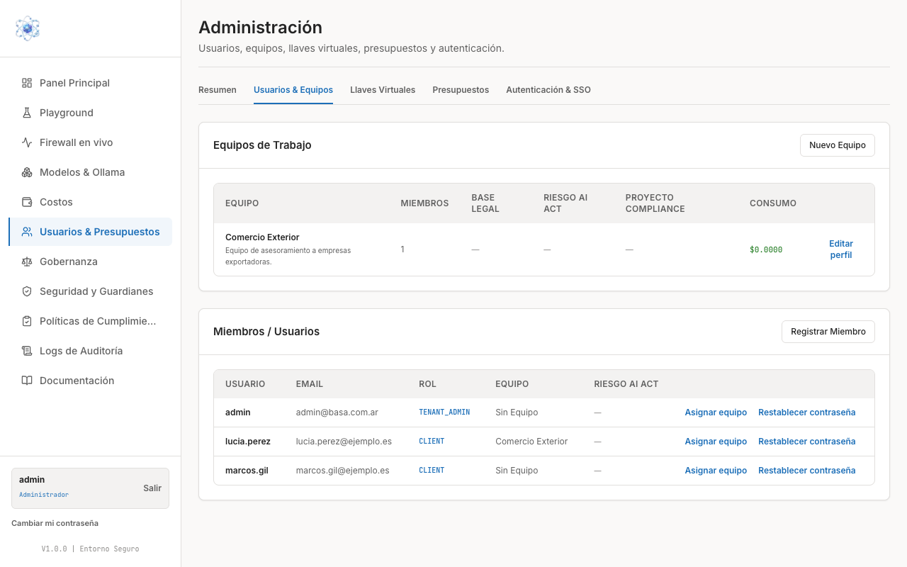

# Dar de alta usuarios

Al terminar esta guía, las personas de su organización podrán entrar a la pasarela con
su propio usuario, agrupadas en equipos y con su perfil de cumplimiento asignado.

Todo el trabajo se hace desde el menú lateral, en **Usuarios & Presupuestos**
(la página se titula **Administración**), pestaña **Usuarios & Equipos**.

!!! note "Orden recomendado"
    Cree primero el equipo y después las personas: así puede asociar a cada miembro a
    su equipo en el mismo momento del alta, sin un paso posterior.

## 1. Crear un equipo

Los equipos agrupan a las personas por área o proyecto y son la unidad sobre la que se
apoyan el perfil de cumplimiento y los presupuestos compartidos.

1. Entre en **Usuarios & Presupuestos** y abra la pestaña **Usuarios & Equipos**.
2. En el bloque **Equipos de Trabajo**, pulse **Nuevo Equipo**.
3. Rellene el modal **Crear Nuevo Equipo**:
      - **Nombre del equipo** — por ejemplo, el nombre del área.
      - **Descripción** — una línea que explique a quién agrupa.
4. Pulse **Crear**.

El equipo aparece en la tabla **Equipos de Trabajo** con sus columnas: número de
**Miembros**, **Base Legal**, **Riesgo AI Act**, **Proyecto Compliance** y **Consumo**
acumulado. El enlace **Editar perfil** de cada fila permite completar esos datos de
cumplimiento más adelante.

## 2. Registrar a una persona

1. En el bloque **Miembros / Usuarios**, pulse **Registrar Miembro**.
2. Complete el modal **Registrar Miembro**:
      - **Nombre de usuario** — con el que la persona iniciará sesión.
      - **Email**.
      - **Contraseña de acceso** — mínimo 12 caracteres. El enlace **Mostrar** le permite
        verla mientras la escribe.
      - **Rol** — *Especialista*, *Investigador*, *Desarrollador* o *Administrador*.
      - **Asociar a equipo (opcional)** — elija el equipo creado en el paso anterior.
      - **Perfil de compliance individual (opcional)** — ver el apartado siguiente.
3. Pulse **Registrar**.

!!! warning "Entregue la contraseña por un canal seguro"
    La contraseña que usted escribe es la que usará la persona para su primer acceso.
    Entréguesela por un canal seguro (nunca por un correo o un chat abiertos) y pídale
    que la cambie desde **Cambiar mi contraseña**, en la esquina inferior izquierda del
    panel, en cuanto entre por primera vez.

Reserve el rol **Administrador** para quien deba gestionar usuarios, llaves y
presupuestos. El resto de roles trabajan desde el portal del usuario final.

## 3. Perfil de compliance (opcional)

El modal de alta incluye un bloque **Perfil de compliance individual**, con tres campos
que por defecto están en **Heredar del equipo**:

- **Base legal GDPR** — la base sobre la que esa persona trata datos personales.
- **Nivel de riesgo AI Act** — la clasificación de riesgo aplicable a su uso de IA.
- **Proyecto de compliance** — el proyecto al que se imputa su actividad.

Déjelos en **Heredar del equipo** salvo que esa persona concreta necesite valores
distintos: en ese caso, el valor individual **sobreescribe** el del equipo. Así basta
con definir el perfil una vez en el equipo y ajustar solo las excepciones.

## 4. Comprobar el resultado

La tabla **Miembros / Usuarios** muestra a todas las personas dadas de alta con su
**Email**, **Rol**, **Equipo** y **Riesgo AI Act**.

Cada fila ofrece además dos acciones:

- **Asignar equipo** — mueve a la persona a un equipo, o la cambia de equipo. Úselo con
  quien se dio de alta sin equipo (aparece como *Sin Equipo*).
- **Restablecer contraseña** — fija una contraseña nueva para esa persona; entréguesela
  igualmente por un canal seguro. Es la vía cuando alguien pierde el acceso.

!!! note
    Cada usuario puede cambiar su propia contraseña desde **Cambiar mi contraseña**.
    Usted, como administrador, no necesita conocer la contraseña actual de nadie para
    restablecerla.

## Siguiente paso

Con las personas dadas de alta, continúe con
[Crear llaves de acceso](llaves.md) si van a conectar herramientas propias, y con
[Presupuestos y límites de gasto](presupuestos.md) para acotar el consumo.
