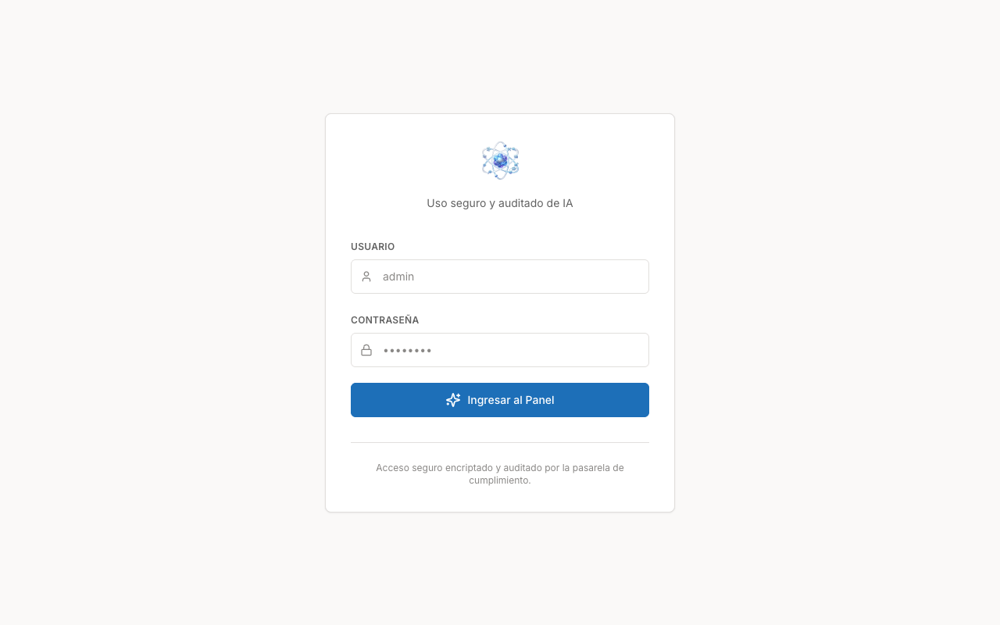
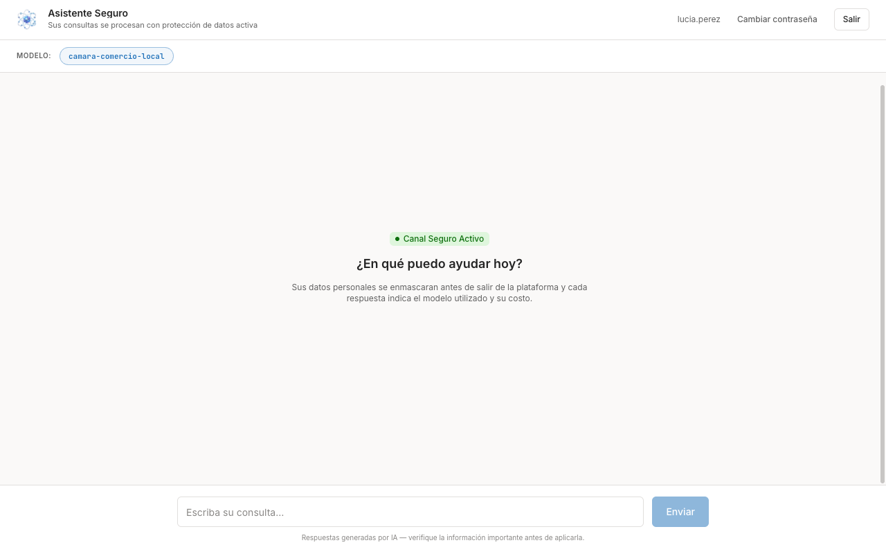
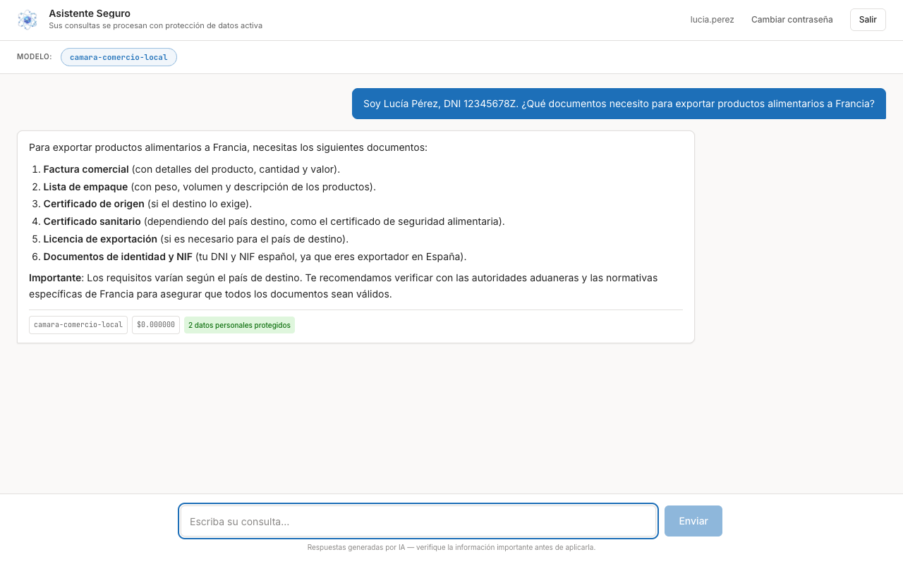

# Primeros pasos

Esta guía le acompaña desde que recibe sus credenciales hasta su primera consulta al
Asistente Seguro. No necesita conocimientos técnicos: si sabe usar un buscador, sabe
usar esta herramienta.

## 1. Reciba sus credenciales

Su organización no permite registrarse por cuenta propia. Es el administrador quien
crea su cuenta y le entrega:

- La **dirección web** de la pasarela (algo como `https://ia.suorganizacion.es`).
- Su **nombre de usuario**.
- Una **contraseña de acceso** inicial, entregada por un canal seguro.

!!! note "Guarde esas credenciales en un gestor de contraseñas"
    Son personales e intransferibles: todo lo que se consulte con su usuario queda
    registrado a su nombre. No las comparta con compañeros — si alguien más necesita
    acceso, pídale al administrador que le cree su propia cuenta.

## 2. Entre a la plataforma

1. Abra la dirección web que le facilitó el administrador.
2. Escriba su **Usuario** y su **Contraseña**.
3. Pulse **Ingresar al Panel**.

Si el acceso falla, revise que no haya espacios de más al copiar y pegar. Si aun así no
entra, contacte a su administrador: solo él puede restablecer su contraseña.

## 3. Conozca el Asistente Seguro

Al entrar verá el **Asistente Seguro**, con el mensaje *"Sus consultas se procesan con
protección de datos activa"*. Es su espacio de trabajo con la IA.

Los elementos que le interesan son cuatro:

| Elemento | Dónde está | Para qué sirve |
| --- | --- | --- |
| **Modelo** | Arriba a la izquierda | Indica qué modelo de IA atenderá su consulta. Su organización decide cuáles están disponibles. |
| **Canal Seguro Activo** | En el centro | Confirma que la protección de datos está funcionando. |
| **Caja de consulta** | Abajo | Donde escribe lo que quiere preguntar. |
| **Cambiar contraseña / Salir** | Arriba a la derecha | Su cuenta y el cierre de sesión. |

## 4. Escriba su primera consulta

1. Haga clic en la caja **"Escriba su consulta…"**.
2. Redacte su pregunta con normalidad, en lenguaje natural. Cuanto más contexto dé,
   mejor será la respuesta.
3. Pulse **Enviar**.
4. Espere: según el modelo y la carga del sistema, la respuesta puede tardar desde unos
   segundos hasta cerca de un minuto.

!!! tip "Puede escribir datos reales"
    No hace falta que anonimice usted los nombres, los DNI o los teléfonos antes de
    preguntar. La plataforma los enmascara automáticamente antes de que salgan y se los
    devuelve completos en la respuesta. Lo explicamos en
    [Cómo se protegen sus datos](proteccion-datos.md).

## 5. Entienda lo que muestra cada respuesta

Bajo cada respuesta aparece una fila de etiquetas con el resumen de lo ocurrido.

- **Nombre del modelo** — qué modelo de IA respondió a esa consulta concreta.
- **Costo** — lo que ha consumido esa consulta. Si su organización usa un modelo alojado
  en sus propios servidores, verá un importe de cero.
- **N datos personales protegidos** — cuántos datos personales se detectaron y se
  enmascararon antes de enviar su consulta. En el ejemplo de arriba son dos: el nombre y
  el DNI.

Ese contador es su comprobante: si escribe datos personales y ve un número mayor que
cero, la protección ha actuado.

## 6. Cambie su contraseña

Le recomendamos cambiar la contraseña inicial la primera vez que entre.

1. Pulse **Cambiar contraseña**, arriba a la derecha.
2. Introduzca la contraseña actual y la nueva.
3. Confirme. La nueva contraseña debe tener **al menos 12 caracteres**.

!!! warning "Si olvida su contraseña"
    No existe recuperación por correo electrónico. Escriba a su administrador para que
    le restablezca el acceso.

Cuando termine de trabajar, pulse **Salir** para cerrar la sesión, sobre todo si usa un
equipo compartido.

## 7. Verifique siempre la información importante

Al pie de la pantalla verá este aviso permanente:

> Respuestas generadas por IA — verifique la información importante antes de aplicarla.

Tómeselo en serio. La IA redacta con seguridad incluso cuando se equivoca: puede citar
un plazo, un requisito documental o una cifra que no sean correctos. Úsela como
borrador y como ayuda para pensar, y contraste con la fuente oficial todo lo que vaya a
comunicar a un tercero o a incorporar a un expediente.

## Siguientes pasos

- [Cómo se protegen sus datos](proteccion-datos.md) — qué ocurre con lo que escribe.
- [Conectar una aplicación o herramienta](conectar-herramienta.md) — para perfiles
  técnicos que quieran integrar la pasarela en sus propias aplicaciones.
- [Extensión del navegador](extension.md) — protección cuando usa asistentes de IA web.
