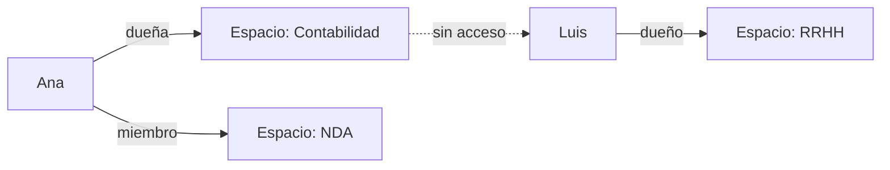

# Eleia Hub: espacios, presupuesto y protección de documentos

Guía para el administrador de una instancia con **Eleia Hub** (el chat de espacios de trabajo
con documentos) activo. Cubre el aislamiento de espacios entre personas, cómo se ve el gasto
de cada una, y qué avisa la interfaz sobre la protección de datos personales en los documentos
que se suben.

**Para quién**: el tenant admin que opera la instancia y responde consultas de las personas
que usan Eleia Hub.

!!! note "Leyenda de estado"
    🟢 **HOY** — funciona y está verificado · 🔵 **OBJETIVO** — roadmap, no implementado.

---

## Espacios de trabajo: quién ve qué 🟢

Cada persona en Eleia Hub ve **únicamente** los espacios de los que es miembro. Al entrar sin
ningún espacio asignado, ve un estado vacío con dos acciones: crear uno propio o pedirle a su
administrador que la agregue a uno existente.

Quien crea un espacio queda como su dueña y puede, desde el panel "Miembros" del espacio:

- Ver la lista de miembros y su rol (dueño / miembro).
- Agregar a otra persona por nombre de usuario.
- Quitar a un miembro.
- Transferir la propiedad del espacio.

Un miembro que no es dueño ve la misma lista en modo solo lectura. Dentro de un espacio, cada
persona ve únicamente **sus propios hilos** de conversación — el "hilo principal" del espacio
también es suyo, nunca compartido.

Intentar abrir un espacio ajeno por una URL o identificador conocido responde "No tenés acceso
a este espacio" sin cargar ningún dato — nunca revela si el espacio existe.

### Espacios "sin asignar" tras una migración 🟢

Una instalación que ya tenía espacios de trabajo antes de esta funcionalidad los deja, al
actualizar, en estado "sin asignar": nadie es miembro todavía. El admin los ve y les asigna un
dueño desde:

- El panel de administración (Guardian), en **Usuarios & Presupuestos → Espacios sin
  asignar**.
- El propio Eleia Hub, en el botón "Sin asignar" del encabezado (visible solo para roles
  administradores).

## Presupuesto: autoservicio, nunca una sesión de admin 🟢

Eleia Hub lee el presupuesto de **cada persona con su propia sesión** — nunca con una cuenta de
administrador de fondo. Antes de enviar una pregunta o subir un documento, el Hub verifica el
presupuesto disponible; si está agotado, bloquea localmente con el mismo mensaje neutro que
usaría un rechazo real del servidor ("Alcanzaste tu presupuesto. Contactá a tu administrador"),
para que la persona nunca note la diferencia entre un bloqueo local y uno del backend.

En el panel de administración, **Costos → Gasto por usuario** ya incluye la actividad que una
persona hizo dentro de sus espacios (antes quedaba invisible bajo la cuenta de servicio del
Hub). Una tabla separada, **Protección de documentos por persona**, cuenta los documentos
protegidos — sin costo, un documento cuenta una sola vez aunque se haya troceado en varios
pedidos al enmascarar.

## Protección de documentos: un resumen por documento, no por trozo 🟢

Al subir un documento grande, Eleia Hub lo trocea antes de enmascararlo (los documentos
grandes tardan demasiado para enmascararse de una sola vez). Todos los trozos de una misma
subida comparten un identificador de documento — es lo que hace que un mismo dato (por
ejemplo, un nombre repetido en distintas filas de una planilla) reciba **siempre el mismo
placeholder** dentro de ese documento, y que la protección se resuma **una sola vez por
documento**, no por trozo.

Tras cada subida, la persona ve un resumen con el conteo por tipo de dato protegido (DNI,
email, nombre, etc.), no un aviso genérico. Un documento subido antes de que este mecanismo
existiera se marca con un aviso de "esquema anterior" y una sugerencia de reenviarlo — solo si
la instalación tiene configurada la fecha de corte (`MASKING_DETERMINISM_SINCE`); sin esa
configuración, ningún documento se marca (mejor no avisar que avisar mal).

## Ninguna marca de motor visible 🟢

Ni el Hub ni el panel muestran en ningún punto el nombre del motor de documentos, del
proveedor de detección de datos personales, ni del motor de enrutamiento de modelos que
Eleia usa internamente — todos los mensajes de error y textos de interfaz usan un vocabulario
neutro ("el servicio de documentos", "el servicio de protección de datos"). Una prueba
automática (`tools/check-branding-neutral.js`, corrida en CI) verifica que ningún término
prohibido aparezca en el HTML servido ni en el build de producción del panel.
