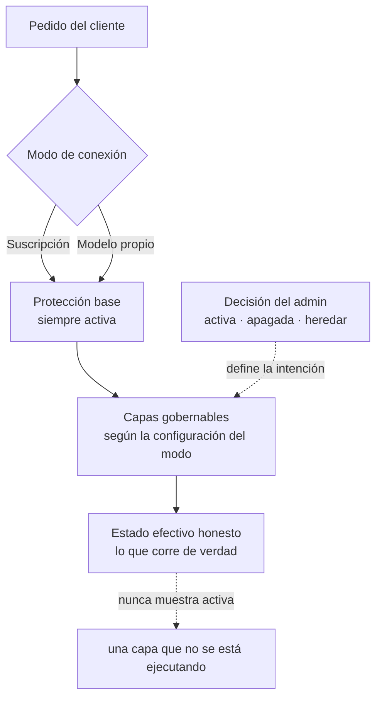

# Gobernanza del firewall

Cómo el operador decide **qué capas de protección aplican a cada tipo de tráfico** y, sobre
todo, cómo la instancia distingue lo que un admin **desea** de lo que **realmente corre**.
Hay una protección base que ninguna configuración puede apagar, y capas opcionales que se
gobiernan por modo de conexión — con un estado honesto que nunca muestra como activa una capa
que no se está ejecutando.

**Para quién**: el tenant admin y el compliance officer que operan la instancia y necesitan
responder, con confianza, "¿qué está protegiendo hoy a mi tráfico?".

!!! note "Leyenda de estado"
    🟢 **HOY** — funciona y está verificado · 🟡 **PARCIAL** — existe con límites
    documentados · 🔵 **OBJETIVO** — roadmap explícito, no implementado. Nada marcado
    🔵 se describe como si existiera.

---

## Los dos ejes: el deseo y la realidad

La gobernanza separa dos cosas que antes se confundían: la **decisión** del admin (quiero esta
capa activa) y el **estado efectivo** (esta capa está corriendo de verdad sobre el tráfico).
No son lo mismo — una capa deseada puede no aplicarse porque le falta una credencial, porque la
aporta el proveedor del modelo en su extremo, o porque el plano de ejecución todavía no la
confirmó. La pantalla de **Gobernanza** del panel muestra siempre la realidad, no la intención.



La regla de oro: **una capa que no se aplica no es lo mismo que tráfico desprotegido, y ninguna
de las dos se disfraza**. La vista de estado lo dice con todas las letras. 🟢

---

## Los dos modos de conexión

El tráfico viaja en uno de dos modos, y el estado de una capa puede diferir entre ellos:

| Modo | Qué es | Quién protege |
|---|---|---|
| **Suscripción** | El tráfico va contra la suscripción de la propia organización. | El producto **más** el proveedor del modelo, que aporta parte de las protecciones en su extremo. |
| **Modelo propio** | El tráfico va contra un modelo administrado por la instancia (incluidos los locales). | **Solo** el producto: no hay nadie más protegiendo. |

Por eso una misma capa puede figurar *delegada* en Suscripción (la cubre el proveedor) y *no
disponible* en Modelo propio (no la cubre nadie más): la pantalla lo muestra por separado, una
columna por modo. El detalle de cómo se conecta cada modo está en
[Integraciones](../integrations/index.md) y [Modelo propio / local](../integrations/modelo-propio.md).

---

## La protección base (siempre activa)

Cuatro capas forman el **piso no-negociable**: se aplican siempre, en los dos modos, y ninguna
configuración las apaga. Cualquier intento de desactivarlas se rechaza y queda registrado.
🟢

| Capa | Qué hace |
|---|---|
| **Intercepción y registro** | Cada pedido se intercepta y queda auditado con su atribución. Es lo que hace del producto un firewall y no un proxy. |
| **Detección de datos personales** | Detecta datos personales en el texto — corre aunque el enmascarado esté apagado, así el pedido nunca queda sin relato. |
| **Bloqueo de secretos** | Detecta claves y tokens antes de que salgan de la organización. |
| **Evaluación de cumplimiento** | Evalúa cada pedido contra la política activa y lo deja registrado. |

En el panel, estas capas aparecen con un candado y la etiqueta *Siempre activa*: no tienen
control porque no son configurables, y un interruptor gris insinuaría que existe una forma de
apagarlas.

!!! warning "Precisión sobre la cobertura de detección"
    Lo que el pipeline **detecta** se registra o bloquea según la política; ninguna detección
    automática garantiza cobertura total. La cobertura de datos personales depende del modo del
    despliegue (patrones en desarrollo, motor NLP completo en producción — su endurecimiento es
    🟡). Un despliegue productivo con datos de pacientes debe operar con el motor NLP habilitado
    y validar contra sus propios casos. Ver [Guardrails y políticas de seguridad](index.md#guardrails-y-politicas-de-seguridad).

---

## Las capas gobernables

El resto de las protecciones —enmascarado de datos personales, reruteo de prompts sensibles,
moderación de contenido, defensa anti-inyección, seguridad por severidad y guardarraíles de la
plataforma— son **gobernables**: el admin decide si aplican, por modo de conexión, con tres
valores por control.

| Decisión | Efecto |
|---|---|
| **Activa** | Aplicar esta capa en este modo. |
| **Apagada** | No aplicar esta capa en este modo. |
| **Heredar** | Sin decisión propia: vale el valor por defecto del producto (o lo que fije la organización). |

El caso de uso que motiva el enmascarado como capa gobernable: en **herramientas de código** el
enmascarado rompe el código, así que conviene poder apagarlo solo ahí sin apagarlo en el chat.
Apagar el enmascarado **no** apaga la detección — la protección base sigue viendo el dato; lo
que cambia es que no lo transforma.

### Cómo se resuelve una decisión

Gana el alcance más específico que tenga una decisión propia; un alcance en *Heredar* cede al
siguiente:

```text
una herramienta declarada → el modo de conexión → toda la organización → el valor por defecto
```

Cada control se guarda solo, al instante: no hay botón "Guardar" global, así que no queda
ningún cambio pendiente que se pierda al salir de la pantalla. 🟢

---

## El estado honesto y sus cinco estados

Cada capa, en cada modo, reporta uno de cinco estados. Se distinguen por color **y forma** —
nunca por texto solo— para que se lean de un vistazo:

| Estado | Significa |
|---|---|
| **Aplicándose** | Corre sobre el tráfico de ese modo, confirmado. No es una intención declarada. |
| **Delegada** | No la aplica el producto: la aporta el proveedor del modelo en su propio extremo. El tráfico no queda desprotegido. |
| **Requiere credencial** | Está deseada pero le falta una credencial: no se aplica y no cuenta como protección. |
| **Degradada** | Venía aplicándose y dejó de confirmarse. Se reporta degradada, jamás activa. |
| **No disponible** | No se aplica en ese modo. Es el estado por defecto: sin confirmación, no se afirma nada. |

El estado por defecto ante cualquier duda es **No disponible** (fail-closed): la instancia
prefiere decir "no lo puedo confirmar" antes que afirmar una protección que no está corriendo.
🟢

!!! note "El deseo y la realidad pueden diferir — a propósito"
    El control refleja la **decisión**; el badge refleja el **estado efectivo**. Que estén
    separados es el punto de la gobernanza: si ponés una capa en *Activa* pero le falta una
    credencial, el control dirá *Activa* y el estado dirá *Requiere credencial*. La vista de
    estado es la fuente de verdad sobre lo que corre.

---

## Ajuste fino por herramienta

Además de por modo, una capa gobernable puede relajarse para **una herramienta concreta** (por
ejemplo, apagar el enmascarado solo en herramientas de código). Está en la sección **Avanzado**
del panel, plegada por defecto.

Esta relajación tiene una garantía de alcance: **solo aplica al tráfico cuya herramienta está
declarada en la Connection** (el operador la fijó al provisionar la credencial). El tráfico cuya
herramienta se *deduce* del cliente —un dato que el cliente puede falsear— **no se relaja
nunca**: para ese tráfico la relajación se ignora y vale el nivel de abajo. Una relajación por
herramienta jamás puede debilitar la protección base. 🟢

---

## Límites honestos

- La **vista de estado**, la **protección base** y la **configuración por modo** (deseo,
  resolución en cascada y estado efectivo) funcionan y están verificadas. 🟢
- El **registro durable de un bloqueo** como evento de auditoría propio, y la **retención
  configurable** de esos registros, son 🔵 **OBJETIVO** de una spec posterior: hoy el bloqueo
  se refleja en el monitor en vivo, pero su asiento durable e independiente es roadmap.
- La **atribución por pedido** en el plano de modelo propio (qué capa exacta actuó sobre cada
  petición) se endurece junto con el motor y es 🟡 mientras esa integración se completa: cuando
  no puede afirmarse con certeza, la instancia **no** inventa una atribución.

Nada de lo anterior afecta la garantía central: la protección base se aplica siempre, y ninguna
capa figura *aplicándose* sin confirmación.

---

## Relacionado

- [Guardrails y políticas de seguridad](index.md#guardrails-y-politicas-de-seguridad) — el mapa
  entidad→acción (MASK / BLOCK / ALLOW) que la protección base y el enmascarado aplican, y cómo
  se administra la política activa.
- [Compliance](../compliance/index.md) — el marco legal (GDPR / EU AI Act) que la evaluación de
  cumplimiento de la protección base implementa.
- [Modelo propio / local](../integrations/modelo-propio.md) — cómo se conecta el modo *Modelo
  propio* y por qué ahí solo protege el producto.
- [Integraciones](../integrations/index.md) — las superficies (CLI, IDE, extensión de
  navegador) cuyo `tool_type` habilita el ajuste fino por herramienta.
- [Operaciones & troubleshooting](../operations/index.md) — cómo se observa en vivo el efecto de
  las capas sobre el tráfico gobernado.
