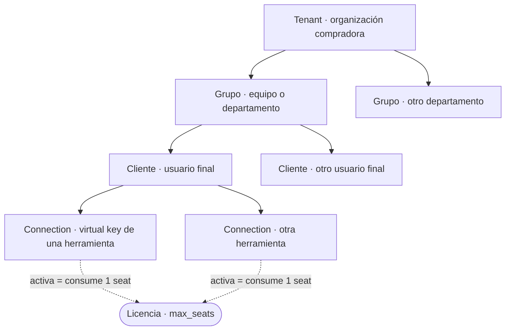
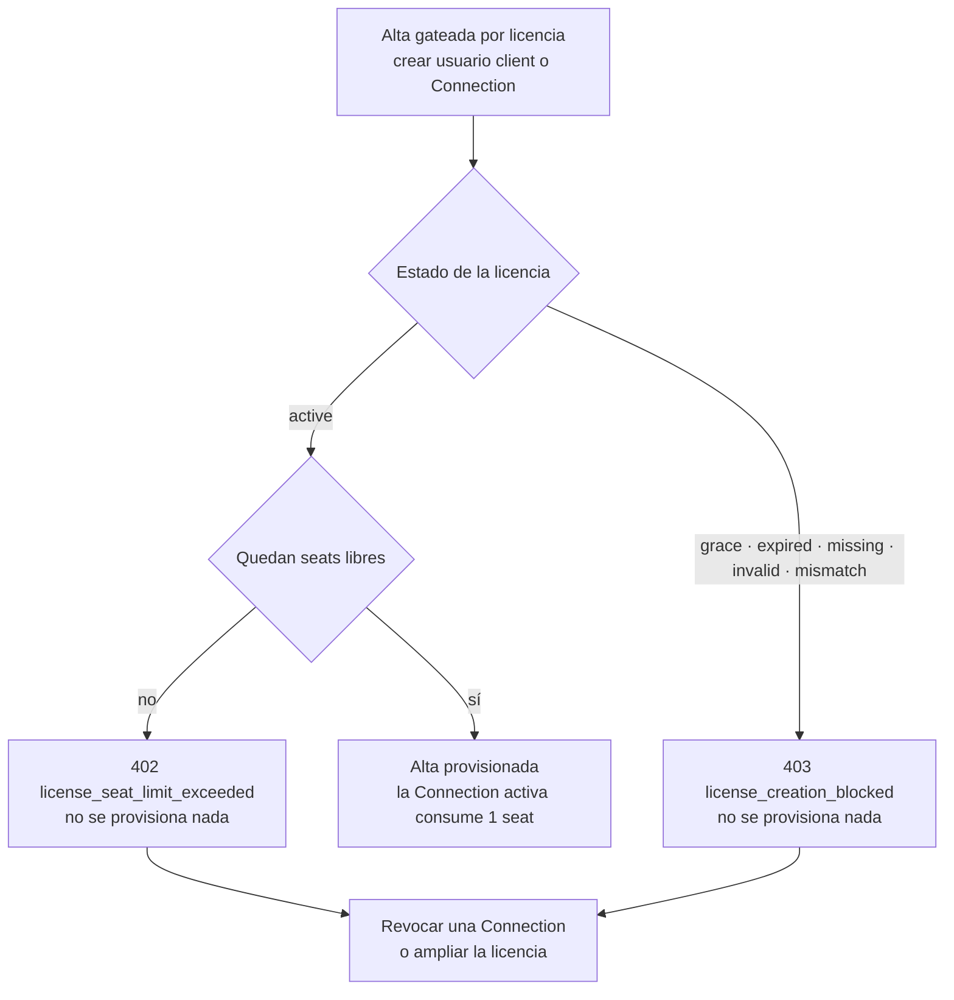

# Administración

Guía para el **operador** de una instancia del producto: cómo se organiza un despliegue
(tenants, grupos, clientes y Connections), quién puede hacer qué (roles), cómo se gobierna el
contenido que atraviesa el gateway (políticas de seguridad), cómo se controla el gasto
(budgets) y cómo funciona el licenciamiento offline por seats.

**Para quién**: el tenant admin que opera la instancia y el compliance officer; útil también
para el distribuidor que prepara el training de administración del cliente final.

!!! note "Leyenda de estado"
    🟢 **HOY** — funciona y está verificado · 🟡 **PARCIAL** — existe con límites
    documentados · 🔵 **OBJETIVO** — roadmap explícito, no implementado. Nada marcado
    🔵 se describe como si existiera.

---

## El modelo de la instancia

### Jerarquía: de tenant a Connection

Un **tenant** es la organización compradora: la raíz de toda la jerarquía de datos de la
plataforma. De él cuelgan los grupos, de los grupos los clientes (usuarios finales) y de cada
cliente sus **Connections** — una credencial por herramienta (una virtual key `sk-sentinel-...`).



La anotación de abajo es la que importa para el dimensionamiento: **el seat de licencia lo
consume la Connection activa, no el usuario** — un cliente con tres herramientas conectadas
consume tres seats. El detalle está en [Licencias y seats](#licencias-y-seats).

Todo objeto administrable (grupos, usuarios, Connections, políticas, presupuestos,
auditoría) pertenece a un tenant. El aislamiento efectivo entre tenants se aplica hoy
**a nivel de aplicación**: todas las consultas están acotadas al tenant. Las tablas
tienen además row-level security (RLS) habilitado y forzado en la base de datos, pero el
contexto de tenant por request todavía no se establece, así que RLS como defensa activa
está pendiente de activarse. 🟡

### Modelo de entrega: una instancia por cliente

El modelo de entrega del producto es **una instancia por cliente** (on-premise /
air-gapped): cada despliegue opera con exactamente **un tenant activo**, anclado por
configuración con la variable `SENTINEL_DEPLOYMENT_TENANT_ID`. La licencia del despliegue
está emitida para ese tenant y no habilita ningún otro (fail-closed). 🟢

El modelo de datos soporta además un modo *cloud* con varios tenants conviviendo en una
misma instancia; la **operación SaaS multi-tenant** como servicio gestionado es
🔵 **OBJETIVO** de roadmap, no una modalidad ofrecida hoy.

---

## Roles y permisos (RBAC)

La plataforma define cuatro roles canónicos:

| Rol | Alcance | Qué puede hacer |
|---|---|---|
| **Super admin** | Cross-tenant | Operación por encima de los tenants (solo tiene sentido en modo cloud multi-tenant). No se crea automáticamente: se siembra de forma explícita. Dentro de un tenant equivale a un tenant admin. |
| **Tenant admin** | Su tenant (= la instancia) | Administración completa: usuarios y grupos, Connections, presupuestos, políticas de seguridad, compliance, auditoría y salud de la licencia. Es el rol del operador. |
| **Compliance officer** (en la consola: **Auditor**) | Su tenant | Ver y editar políticas de seguridad y configuración de compliance, ver auditoría, exportar reportes, aprobar revisiones humanas y consultar el detalle de salud de la licencia. **No** gestiona usuarios, grupos, Connections ni presupuestos, y **no** ve guardianes ni gobernanza. |
| **Client** | Su propio uso | Usuario final que consume IA a través de sus Connections. El rol en sí no consume seat: los seats los consumen sus **Connections activas** (ver [Licencias y seats](#licencias-y-seats)). |

Los usuarios *client* pueden llevar una **etiqueta de perfil** (`display_label`, p. ej.
`clinician`, `developer`) que refina permisos puntuales heredados: un client con perfil
`developer` puede gestionar las Connections **del tenant** (hoy sin acotación por dueño);
uno con perfil `clinician` participa en la aprobación de revisiones humanas. 🟢

Matriz de permisos vigente en la instancia:

| Acción | Tenant admin | Compliance officer | Client |
|---|:---:|:---:|:---:|
| Crear / desactivar usuarios y grupos | ✅ | ❌ | ❌ |
| Crear / revocar Connections (virtual keys) | ✅ | ❌ | solo perfil `developer` (las del tenant) |
| Crear / editar presupuestos | ✅ | ❌ | ❌ |
| Editar políticas de seguridad | ✅ | ✅ | ❌ |
| Ver / editar compliance | ✅ | ✅ | ❌ |
| Ver auditoría / exportar reportes | ✅ | ✅ | ❌ |
| Aprobar revisión humana | ✅ | ✅ | solo perfil `clinician` |
| Usar la IA por el gateway | ✅ | ✅ | ✅ |
| Detalle de salud de licencia | ✅ | ✅ | ❌ |

!!! info "El rol «Auditor» de la consola"
    La pantalla de usuarios permite dar de alta a alguien con el rol **Auditor**: es el
    *compliance officer* de la tabla de arriba, con el nombre que usan los clientes. 🟢
    Sirve para el caso de uso habitual, mostrarle la auditoría y el compliance a dirección
    sin entregarle el panel entero: ve los logs de auditoría y sus exportaciones, el tablero
    y los reportes de compliance, el consumo y las conexiones en vivo, y no puede crear
    usuarios, generar Connections, administrar modelos ni entrar a gobernanza. No consume
    seat de licencia.

    **Todavía no es un rol de solo lectura**, y la consola lo dice en el momento del alta:
    con los permisos vigentes también puede editar la política de protección de datos
    (incluso desactivar la que está activa), cambiar los plazos de conservación de los
    registros, ajustar la configuración de costos y usar el chat interno. Un rol de
    auditoría **estrictamente de solo lectura** es 🔵 **OBJETIVO** de roadmap.

!!! warning "Fail-closed en la administración"
    Todos los endpoints de administración exigen una **sesión JWT válida** de un usuario
    activo; sin token (o con token vencido) la respuesta es `401`. Las **virtual keys**
    (`sk-sentinel-…`) sirven exclusivamente para inferencia: **jamás** resuelven a una sesión
    de administración, por diseño.

!!! tip "Bootstrap del primer administrador"
    En el primer login de la instancia, entrar como `admin` con la contraseña elegida la
    fija y crea la cuenta como tenant admin (mínimo **12 caracteres**; no hay ninguna
    credencial de fábrica). Sólo funciona mientras la instalación **no tenga dueño**: en
    cuanto existe un usuario administrativo, es un login normal. Hacé ese primer login
    apenas termine el deploy, antes de exponer el panel — mientras no exista el dueño, el
    primer login gana. El paso a paso está en la
    [guía de instalación](../install-deploy/index.md).

Una matriz de permisos **granular y scopeada por tenant** (permisos finos por recurso) es
🔵 **OBJETIVO** de roadmap; la matriz de arriba es la vigente hoy.

---

## Guardrails y políticas de seguridad

Toda petición que atraviesa el gateway pasa por la **política de seguridad activa** antes
de llegar a cualquier proveedor LLM. La política es provider-agnóstica: aplica igual sea
cual sea el modelo de destino y la superficie de entrada (CLI, IDE, extensión de
navegador — ver [Integraciones](../integrations/index.md)). 🟢

### Acciones por entidad

El pipeline de detección del gateway identifica entidades sensibles (PII/PHI) y la
política decide qué hacer con **cada tipo de entidad**:

| Acción | Efecto |
|---|---|
| `MASK` | La entidad se reemplaza por un placeholder (`[PERSON_0]`, `[DNI_0]`, …) antes de salir hacia el LLM y se **restaura el valor real** en la respuesta que ve el usuario. El dato detectado no sale de la instancia; la experiencia no se rompe. |
| `BLOCK` | La petición se rechaza por completo: el contenido no sale de la instancia. |
| `ALLOW` | La entidad pasa sin transformación (para tipos que la organización considera no sensibles). |

Configuración por defecto de una instancia nueva:

```json
{
  "PERSON": "MASK",
  "PHONE_NUMBER": "MASK",
  "EMAIL_ADDRESS": "MASK",
  "US_SSN": "BLOCK",
  "MEDICAL_LICENSE": "BLOCK",
  "DNI": "MASK",
  "CUIL": "MASK"
}
```

!!! warning "Precisión sobre la cobertura de detección"
    Lo que el pipeline **detecta** se enmascara o bloquea según la política; ninguna
    detección automática garantiza cobertura total. La cobertura depende del modo del
    despliegue: el modo de desarrollo detecta por **patrones**; el **motor NLP completo**
    es la configuración prevista para producción con PHI y su endurecimiento es 🟡. Un
    despliegue productivo con datos de pacientes debe operar con el motor NLP habilitado
    y validar la política contra sus propios casos.

### Modos de la política

Además del mapa entidad→acción, cada política tiene tres interruptores:

- **`gdpr_mode`** — activa el tratamiento GDPR (minimización y registro asociado).
- **`ai_act_mode`** — activa el bloqueo por categorías del AI Act (usos prohibidos).
- **`headroom_mode`** — habilita la optimización de contexto para reducir tokens.

El marco legal que estos modos implementan (bases legales, niveles de riesgo del AI Act)
está descrito en [Compliance](../compliance/index.md).

### Gestión

- Hay **una sola política activa** a la vez; activar otra desactiva la anterior. Se
  pueden mantener varias políticas guardadas y alternar entre ellas.
- La última política existente **no puede borrarse** (la instancia nunca queda sin
  política: fail-closed).
- Se administran desde el panel o por API (`GET/PUT /api/v1/security/policy` para la
  activa, `GET/POST/PUT/DELETE /api/v1/security/policies` para el catálogo), con rol
  tenant admin o compliance officer.
- El efecto de la política se observa en vivo en el **monitor del gateway**
  (`GET /api/v1/gw/monitor`): el before/after real de cada petición gobernada.

La detección de **secretos** (API keys, tokens, credenciales en prompts) y el bloqueo por
AI Act se aplican en el mismo punto de paso, junto con la auditoría *metadata-only*: el
registro de auditoría guarda qué se detectó y qué acción se tomó, **nunca** el contenido.
🟢

### Qué capas aplican a cada tráfico

Qué protecciones corren, y sobre qué tipo de tráfico, se decide en la
[Gobernanza del firewall](gobernanza.md): una **protección base** que ninguna configuración
apaga, y capas opcionales que el admin gobierna por modo de conexión — con un estado honesto
que nunca muestra como activa una capa que no se está ejecutando. 🟢

---

## Budgets y control de costes

El control de gasto se define en el panel y lo aplica el motor del gateway en cada
petición. 🟢

**Por Connection (virtual key)** — al crear una Connection se fijan:

| Campo | Descripción | Default |
|---|---|---|
| `max_budget` | Tope de gasto (USD) de la key | sin tope |
| `budget_duration` | Ventana de reinicio del tope | `30d` |
| `models` | Lista blanca de modelos que la key puede usar | todos |
| `rpm_limit` / `tpm_limit` | Rate limit (requests y tokens por minuto) | `60` / `100000` |
| `expires_at` | Expiración de la key | sin expiración |

**Por usuario o por grupo** — un presupuesto (`/api/v1/budgets`, solo tenant admin) se
asigna a *un* usuario **o** a *un* grupo (nunca ambos, y a lo sumo uno por
usuario/grupo), con:

- `max_spend_usd` — tope de gasto en la ventana,
- `max_tokens` — tope de tokens,
- `reset_period` — período de reinicio.

**Consulta de gasto** — el gasto acumulado contra su tope se consulta por key
(`GET /api/v1/keys/{id}/spend`), por usuario (`GET /api/v1/users/{id}/spend`) y por grupo
(`GET /api/v1/users/groups/{id}/spend`).

**A nivel tenant** — como el despliegue opera con un tenant único, el agregado del tenant
es la suma de la instancia y se observa en el panel de analítica y costes; no existe hoy
un tope de gasto *tenant-wide* como objeto propio (los topes se definen por key, usuario
y grupo).

---

## SSO

**Microsoft Entra ID por OpenID Connect: 🟢 HOY.** La instancia acepta el inicio de sesión
con las cuentas del directorio corporativo del cliente, si la licencia trae el flag `sso`
y el tenant tiene el proveedor configurado. La sesión que emite es **la misma** que la del
acceso local: aguas abajo nada distingue una de otra.

**El acceso con usuario y contraseña sigue siendo el respaldo permanente** — no hay forma
de dejar la instancia accesible *solo* por el directorio. Cualquier fallo del camino SSO
(licencia sin el flag, tenant sin configurar, directorio caído) degrada **únicamente** ese
camino; el formulario local no se entera. En una instalación aislada de red el SSO
sencillamente no está. 🟢

🟡 **La configuración del proveedor se carga por API, no por el panel**: la pestaña
«Autenticación & SSO» muestra el estado —Entra pasa de «Próximamente» a «Activo» cuando la
licencia y la configuración están— pero **no** tiene formulario de alta. El alta la hace el
operador con `PUT /api/v1/auth/sso/config`, que cifra el secreto al recibirlo; ver
[Instalación de SSO](../install-deploy/sso.md). 🔵 El formulario en el panel es roadmap.

🔵 **Google Workspace, Okta, Auth0, Keycloak y SAML 2.0 genérico** siguen siendo roadmap,
igual que el mapeo de grupos del directorio a roles y el aprovisionamiento SCIM. La vista
los lista como «Próximamente»: no los comprometas en un despliegue como si existieran.

La operatoria completa de instalación —los datos que aporta el cliente, el registro de la
URI de retorno en su directorio y los errores frecuentes— está en
[Inicio de sesión con el directorio (SSO)](../install-deploy/sso.md).

---

## Licencias y seats

El licenciamiento es **100% offline**: un archivo de licencia firmado (Ed25519) que la
instancia verifica localmente con la clave pública embebida (o provista por archivo).
**La verificación jamás llama a casa**: no hay egress, no hay servidor de licencias, no
hay telemetría. Funciona igual en un despliegue air-gapped. 🟢

### El archivo de licencia

La licencia se emite para **un tenant** e incluye, entre otros campos, `max_seats`,
`expiry` y `grace_days`. Se inyecta por configuración — el mismo binario/imagen sirve
para cualquier cliente cambiando solo estas variables:

| Variable | Rol |
|---|---|
| `SENTINEL_LICENSE_TOKEN_FILE` (o `SENTINEL_LICENSE_TOKEN` inline) | El archivo de licencia (`.lic`) |
| `SENTINEL_LICENSE_PUBLIC_KEYS_FILE` | Keyset público de verificación (default: el embebido) |
| `SENTINEL_DEPLOYMENT_TENANT_ID` | Tenant del despliegue — debe coincidir con el de la licencia |
| `SENTINEL_LICENSE_RECONCILE_INTERVAL_SECONDS` | Intervalo del job de reconciliación de seats (`<=0` lo desactiva) |
| `SENTINEL_LICENSE_HARD_BLOCK` | `true` = endurecer el modo degradado a bloqueo total (ver abajo) |
| `SENTINEL_DEPLOYMENT_KEY_FILE` | Clave de despliegue para los reportes de true-up (volumen persistente) |

!!! danger "Licencias de demo: jamás en producción"
    Existe además `SENTINEL_ALLOW_DEV_LICENSE=true`, que acepta licencias emitidas con el
    keyset de **desarrollo** (demos y entornos locales). Sin esa variable, una licencia
    de demo se evalúa como `invalid` — comportamiento correcto. No habilitarla nunca en
    un despliegue productivo.

### Qué consume un seat

Un seat es una **Connection activa** del tenant: una virtual key activa y no expirada.
El conteo no es por usuario — desactivar un usuario client **no** libera seats; lo que
libera un seat es **revocar sus Connections**. El propio error al agotar la licencia lo
indica: "Revocá una Connection o ampliá la licencia".

### Qué pasa al agotar los seats

Con los seats agotados, las altas gateadas por licencia (crear un usuario client o una
Connection) se **bloquean antes de provisionar nada**:



El error de seats agotados es explícito:

```text
HTTP 402
license_seat_limit_exceeded: 50/50 seats activos — la licencia no permite
crear más. Revocá una Connection o ampliá la licencia.
```

El tráfico de los usuarios existentes **no se corta**: solo se bloquea el alta. Una
instancia **sin licencia válida** arranca igual, pero rechaza toda creación de seats con
`403 license_creation_blocked` — fail-closed: "sin token" jamás significa "ilimitado".

### Estados de la licencia y modo degradado

El ciclo de vida se evalúa con el reloj local: `active → grace → expired`.

| Estado | Crear seats | Tráfico existente | Notas |
|---|:---:|:---:|---|
| `active` | ✅ | ✅ | Único estado que permite altas |
| `grace` | ❌ | ✅ **siempre** | Vencida dentro de los `grace_days`: urge renovar, pero el cliente opera |
| `expired` | ❌ | ✅ (default) / ❌ con hard block | Vencida más allá del grace |
| `missing` / `invalid` / `mismatch` | ❌ | ✅ | Sin token, firma inválida, o licencia de otro tenant |

El **modo degradado** por defecto es *read-only para creación*: en `grace`, `expired` u
`over_seat` (ver reconciliación) las altas se bloquean y el servicio sigue. Con
`SENTINEL_LICENSE_HARD_BLOCK=true`, los estados `expired` y `over_seat` cortan **todo** el
tráfico del gateway (`/api/v1/gw`) con un `403` de mensaje genérico — el detalle del motivo va a
los logs del servidor, nunca al cliente sin autenticar. `grace` **jamás** corta tráfico,
con o sin hard block.

Dos guardas adicionales operan en segundo plano:

- **Reconciliación de seats** — un job periódico recuenta seats contra `max_seats` y
  publica el estado por tenant; si detecta `over_seat` (drift), las altas quedan
  bloqueadas hasta que una corrida vuelva a `ok`. Toda transición queda auditada.
- **Anti-rollback de reloj** — si el reloj local aparece *detrás* de la marca monotónica
  registrada, la evidencia de expiración deja de ser confiable y la creación se degrada
  hasta que el reloj la supere. El episodio queda auditado.

### Salud de la licencia para monitoreo

`GET /api/v1/health/license` expone la salud en **dos niveles**:

=== "Sin autenticación (probe de monitoreo)"

    Solo metadata mínima — apto para un health check externo sin filtrar
    dimensionamiento:

    ```bash
    curl -s https://<host>/api/v1/health/license
    ```

    ```json
    {"status": "active", "clock_rollback_suspected": false}
    ```

=== "Autenticado (tenant admin / compliance officer)"

    Con sesión JWT de un rol de operación, la respuesta agrega el detalle:
    `reason`, `expiry`, `grace_days`, `max_seats`, `seats_used`, el resumen de la
    última reconciliación y la identidad de la cadena de auditoría (`chain`, con la
    génesis que el emisor registró en el onboarding).

El endpoint nunca devuelve el token crudo ni material de claves — solo metadata. El probe
anónimo se integra a los chequeos de salud del stack descritos en
[Operaciones](../operations/index.md).

### Renovación sin phone-home (true-up)

La renovación (true-up) también es offline: la instancia genera un reporte firmado con la
clave de despliegue y el operador lo envía al emisor **fuera de banda**. En ningún punto
del ciclo de vida la instancia inicia conexiones salientes por licenciamiento.

El emisor valida cada reporte también offline: **firma** de la clave de despliegue +
**continuidad de la cadena** de auditoría contra el reporte anterior (anti-truncado: un
reporte al que le "faltan" eventos no valida). En el onboarding el emisor registró la
**clave pública** de la clave de despliegue y la **génesis** de la cadena (el
`license_id` inicial); cada true-up posterior debe encadenar con el anterior.

**Génesis `unlicensed`** — si el primer arranque de la instancia fue **sin** archivo de
licencia (estado soportado), la génesis de la cadena queda registrada como `unlicensed` y
la auditoría la ancla automáticamente a la **primera licencia con firma válida** que se
instale. El emisor acepta esa génesis solo con ese anclaje apuntando al `license_id` del
onboarding y sin eventos licenciados previos — el operador no tiene que coordinar nada
adicional. La génesis efectiva la reporta `GET /api/v1/health/license` (nivel
autenticado, campo `chain`).

### Rotación de claves

Dos claves distintas, dos procedimientos — ninguno interrumpe el servicio:

- **Claves de emisión de licencias** — el keyset público admite **varios `key_id` en
  paralelo**: el emisor publica un keyset con la clave vieja y la nueva, emite las
  licencias nuevas con la nueva y retira la vieja cuando no quedan licencias vivas
  firmadas con ella. En la instancia solo hay que actualizar el archivo apuntado por
  `SENTINEL_LICENSE_PUBLIC_KEYS_FILE`.
- **Clave de despliegue (true-up)** — se regenera en la propia instancia y se re-registra
  su clave pública con el emisor fuera de banda. **La génesis no cambia** y la
  continuidad de los reportes de true-up se preserva.

Detalle completo del flujo (emisión, enforcement fail-closed y postura de propiedad
intelectual del artefacto): [Licenciamiento offline](../install-deploy/licensing.md).

---

## Relacionado

- [Licenciamiento offline](../install-deploy/licensing.md) — el modelo completo de
  licencias por seats y la respuesta canónica de preventa sobre la protección del
  artefacto instalado.
- [Install / Deploy](../install-deploy/index.md) — el flujo de instalación de punta a
  punta: bloque de configuración de licencia, bootstrap del primer admin y seed de
  clients.
- [Purga de retención](purga-retencion.md) — cómo se enciende y se ensaya el proceso
  que elimina las filas vencidas del registro de auditoría: las 7 perillas, el CLI
  `--run-now` y el procedimiento de encendido seguro.
- [Eleia Hub: espacios, presupuesto y protección de documentos](eleia-hub-workspaces.md) —
  guía específica para instancias con el chat de espacios de trabajo activo: aislamiento
  entre personas, gasto por usuario y qué avisa la interfaz sobre PII en documentos.
- [Operaciones & troubleshooting](../operations/index.md) — chequeos de salud del stack
  (incluido el probe de licencia) y gotchas operativos verificados en despliegues reales.
- [Compliance](../compliance/index.md) — el marco legal (GDPR / EU AI Act) que los modos
  de la política de seguridad implementan.
- [Integraciones](../integrations/index.md) — las superficies (CLI, IDE, extensión de
  navegador) que consumen las Connections gobernadas por estas políticas.
