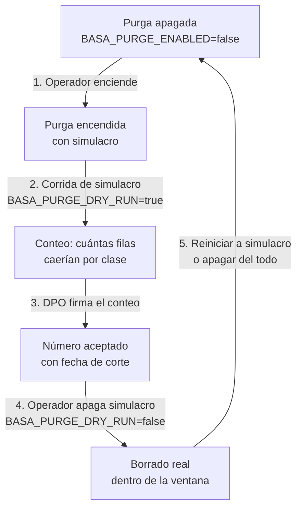

# Purga de retención: el borrado que se enciende a mano

Cómo se enciende —y cómo se ensaya antes de encender— el proceso que elimina las filas
vencidas del registro de auditoría. No es un interruptor más: es un **borrado
irreversible** sobre datos del cliente, y por eso viene **apagado de fábrica** y su
encendido es un paso explícito del operador, no algo que una actualización de producto
pueda hacer sola.

**Para quién**: el **operador** (tenant admin) que enciende la purga y el **compliance
officer / DPO** que firma el conteo del simulacro antes del borrado real. La definición
de los plazos por clase —qué se retiene y por cuánto— está en
[Compliance → DPA · DSR · Retención](../compliance/dpa-dsr-retention.md); esta página
es **sólo** la operación de la purga.

!!! note "Leyenda de estado"
    🟢 **HOY** — funciona y está verificado · 🟡 **PARCIAL** — existe con límites
    documentados · 🔵 **OBJETIVO** — roadmap explícito, no implementado. Nada marcado
    🔵 se describe como si existiera.

---

## Qué hace la purga (y qué no)

La retención del producto tiene dos caras: la **declaración** (el DPO fija los plazos,
la pantalla los muestra, el DPA los promete) y el **borrado** (un proceso en el backend
que elimina las filas vencidas de cada clase, midiendo la edad contra el reloj de la
base de datos). Desde spec 018 (US1) el borrado es real: el proceso existe y está
cableado en el arranque del backend — pero **viene apagado**, y ésa es una decisión, no
un olvido.



**Qué borra:**

- Las **filas vencidas de `audit_logs`** por clase, en lotes con pausa para no bloquear
  la tabla más caliente del producto.
- Al purgar la clase `prompt_content`, el **`response_text` de las revisiones humanas
  vencidas** pasa a `NULL` (la fila de la revisión persiste como metadato — el DPO
  tiene que poder demostrar que la revisión ocurrió; lo que muere es el contenido).
- Un **rastro auditable** metadata-only: una entrada por clase en el `purge_log` de la
  política y una fila resumen por corrida en `audit_logs` (clase `config_audit`). El
  rastro **jamás** contiene contenido: la purga no puede reintroducir lo que vino a
  borrar.

**Qué NO borra:**

- Los **registros de licencia** no se borran nunca. Los protege un **sello interno**
  que la propia caja deja escrito dentro de cada registro de licencia — no el nombre
  que figure en la columna «modelo». Un pedido que se autodenomine `license` es
  tráfico normal y se purga por su plazo (es a propósito: si bastara con llamarse
  `license` para no borrarse, cualquiera con una clave de API se compraría un registro
  inmortal).
- Las **filas que ninguna clase reclama** (residuo) se **cuentan y se reportan, pero no
  se borran**. El officer ve el residuo antes de apretar el botón; nada se elimina por
  no encajar en una clase.

---

## Las 7 perillas

Todas se configuran en el entorno del contenedor (`.env` del despliegue o el compose).
Las 7 llegan al contenedor en el compose de producción
(`deploy/docker/compose.prod.yml`); los defaults de abajo son los que el compose fija
y son los que se publican en `.env.example` — **ningún default que escribas al operar
debe contradecirlos**.

| Perilla | Default | Qué hace |
|---|---|---|
| `BASA_PURGE_ENABLED` | `false` | **Interruptor maestro.** En `false` el scheduler ni arranca y no se elimina ninguna fila: la instalación queda configurada pero inerte. En `true` (con **reinicio del backend** — se lee al arrancar, no en caliente) el proceso arranca y, salvo simulacro, borra las filas vencidas. Viene apagado a propósito: un proceso que borra hacia atrás no se enciende solo con una actualización de producto. La primera vez que arranque se encontraría con todo lo acumulado en la vida de la instalación y se lo llevaría de una — y lo borrado no vuelve. Se apaga también, ya en operación, para una instalación con un legal hold en curso. |
| `BASA_PURGE_DRY_RUN` | `true` | **Simulacro.** En `true` la corrida hace todo menos borrar: resuelve la fecha de corte, **cuenta** las filas que caerían y deja el rastro marcado como simulacro. Nada se elimina. Es la segunda mitad de la red del encendido: aun con el interruptor en `true`, la instalación cuenta antes de borrar, y el DPO firma sobre un número real —«se van 412.000 filas de esta clase, con esta fecha de corte»— en vez de enterarse del alcance leyendo el rastro de lo ya borrado. Se pasa a `false` recién cuando ese número está mirado y aceptado, y es el único cambio de esta lista que hay que hacer una sola vez y con alguien mirando. |
| `BASA_PURGE_INTERVAL_SECONDS` | `3600` | Cada cuánto **despierta** el proceso a mirar si está en ventana, en segundos. No es «cada cuánto borra»: si el momento cae fuera de `BASA_PURGE_WINDOW` no hace nada y se vuelve a dormir. Bajarlo no borra más rápido, sólo engancha la ventana antes. |
| `BASA_PURGE_WINDOW` | `02:00-05:00` | Ventana horaria en la que se permite borrar, `HH:MM-HH:MM` en la hora local de la instalación (ver `BASA_PURGE_WINDOW_TZ`). El registro de auditoría es la tabla más caliente del producto —con el monitor, la analítica, los costes y el export leyendo encima— y el borrado compite con esos lectores: se trabaja de madrugada para que nadie note que existe. Una ventana que cruza medianoche (`23:00-02:00`) es válida. |
| `BASA_PURGE_WINDOW_TZ` | `Europe/Madrid` | Zona horaria (nombre IANA) con la que se interpreta `BASA_PURGE_WINDOW`. El contenedor corre en UTC: sin esto, «las 02:00» serían las 04:00 de la sede en verano y las 23:00 del día anterior en una instalación de LATAM — o sea, borrando en hora punta. |
| `BASA_PURGE_BATCH_SIZE` | `5000` | Filas por lote. Lo acumulado en la primera corrida puede ser meses de tráfico: borrar millones de filas de un golpe bloquea la tabla un rato largo y le tumba la pantalla al officer. Se converge por lotes. |
| `BASA_PURGE_BATCH_PAUSE_MS` | `200` | Pausa entre lotes, en milisegundos: le devuelve la tabla a los lectores calientes entre lote y lote. Es la perilla de **cortesía** — se sube si la instalación acusa el borrado; bajarla a 0 lo convierte en el vecino ruidoso de su propia tabla. |

!!! warning "Las 6 perillas de la corrida no surten efecto con la purga apagada"
    Salvo `BASA_PURGE_ENABLED`, todas dicen «sólo surte efecto con
    `BASA_PURGE_ENABLED=true`». Con el interruptor maestro en `false` el scheduler ni
    arranca, así que el resto de las perillas se lee pero no se aplica.

!!! warning "`BASA_PURGE_ENABLED` se lee al arrancar — pide reinicio"
    El interruptor maestro se lee al **arrancar el backend**, no en caliente. Cambiarlo
    en el `.env` y recargar el proceso no alcanza: hay que **reiniciar el backend**.
    El resto de las perillas (simulacro, intervalo, ventana, lote, pausa) **sí** se
    releen en cada corrida y se pueden girar sin reinstalar.

---

## Corrida manual por CLI (`--run-now`)

Para una corrida fuera de la ventana —un DPO que acaba de acortar un plazo y quiere el
efecto ya, sin esperar a las 02:00— el purgador se invoca a mano:

```bash
python -m src.services.retention.purger --run-now
```

`--run-now` es el único flag del CLI. Dice **CUÁNDO** (saltea la ventana horaria) y
**no** dice SI BORRA: el simulacro se gobierna por `BASA_PURGE_DRY_RUN` (default
`true` = cuenta sin borrar), que el CLI **no toca**. Los dos ejes son ortogonales a
propósito — uno es el cuándo y el otro es el si borra — y la combinación más pedida es
justamente la cruzada: «corré ahora y decime cuánto se iría».

```bash
# Simulacro inmediato (default — cuenta sin borrar):
python -m src.services.retention.purger --run-now

# Borrado real inmediato (BASA_PURGE_ENABLED=true + BASA_PURGE_DRY_RUN=false en el entorno):
BASA_PURGE_DRY_RUN=false python -m src.services.retention.purger --run-now
```

El CLI es una **cáscara** sobre `run_once`: corre una pasada por todas las clases y
escribe el `ResultadoCorrida` a stdout. Devuelve `0` siempre que la corrida termine —
una clase en `error` no es un fallo del proceso, es un hecho de esa clase que ya viaja
en el resultado y en el log. La corrida manual **no** escribe rastro en tabla (el
rastro auditable de `purge_log` + `config_audit` es sólo de la corrida REAL; el
simulacro no escribe, así que el log es lo único que le queda al operador en ese modo).

---

## El procedimiento de encendido seguro

El encendido no es un solo paso: es una **secuencia con seguro doble** diseñada para
que nadie encienda un borrado retroactivo sin haber visto el número. El compose de
producción trae `BASA_PURGE_ENABLED` en `false` por una razón explícita — si estuviera
en `true`, un `docker compose pull` encendería solo un `DELETE` retroactivo sobre
datos del cliente sin que nadie hubiera decidido nada. El encendido es un paso del
operador, con reinicio del backend y con el conteo del simulacro ya firmado.

### Paso 1 — Verificar que la purga está apagada

Antes de tocar nada, confirmá que `BASA_PURGE_ENABLED=false` y que el scheduler no
está corriendo. El endpoint de salud del backend expone `purge_scheduler_running`
(booleano): con la purga apagada (el default) es `false` — es lo esperado, no una
avería.

### Paso 2 — Encender con simulacro

```bash
# En el .env del despliegue:
BASA_PURGE_ENABLED=true
BASA_PURGE_DRY_RUN=true   # ya es el default, pero dejalo explícito
```

Reiniciá el backend (el interruptor maestro se lee al arrancar). Con esto el scheduler
arranca y, en cada tick de `BASA_PURGE_INTERVAL_SECONDS`, si está dentro de la ventana
hace una corrida que **cuenta sin borrar**.

### Paso 3 — Disparar el simulacro y leer el conteo

No esperes a la ventana: dispará la corrida a mano y leé el resultado.

```bash
python -m src.services.retention.purger --run-now
```

El resultado te da, por clase, cuántas filas caerían y con qué fecha de corte, más el
**residuo** (filas que ninguna clase reclama y que **no se van a borrar**). Llevá ese
conteo al DPO y que firme sobre el número real —«se van 412.000 filas de esta clase,
con esta fecha de corte»— antes de pasar a borrado real.

### Paso 4 — Encender el borrado real

Cuando el conteo esté mirado y aceptado:

```bash
# En el .env del despliegue:
BASA_PURGE_DRY_RUN=false
```

Esto **no** pide reinicio (`BASA_PURGE_DRY_RUN` se relee en cada corrida, no al
arrancar). La próxima corrida —dentro de la ventana, o inmediata con `--run-now`—
borra de verdad. Es el único cambio de esta lista que se hace **una sola vez y con
alguien mirando**.

### Paso 5 — Volver a simulacro o apagar

Tras la corrida real, volvé a `BASA_PURGE_DRY_RUN=true` (simulacro) o
`BASA_PURGE_ENABLED=false` (apagado total, con reinicio). No dejes el borrado real
encendido sin motivo: la purga no es un modo permanente, es un acto puntual.

!!! tip "Legal hold"
    Si la instalación entra en un legal hold (una retención judicial o regulatoria que
    prohíbe borrar), apagá `BASA_PURGE_ENABLED=false` y reiniciá. El scheduler deja de
    arrancar y no se borra ninguna fila mientras dure el hold.

---

## Qué ver en el health del backend

El endpoint de salud del backend expone `purge_scheduler_running` (booleano): indica
si el hilo de purga está vivo.

| `BASA_PURGE_ENABLED` | `purge_scheduler_running` | Lectura |
|---|---|---|
| `false` (default) | `false` | La instalación está configurada pero inerte. Es lo esperado. |
| `true` | `true` | El scheduler está vivo y despierta en cada intervalo. |
| `true` + intervalo ≤ 0 | `false` | El scheduler no arranca (doble compuerta: interruptor **e** intervalo > 0). |

---

## Límites honestos

- El purgador y el scheduler están cableados en el arranque del backend y la corrida es
  real (borra, deja rastro, cuenta residuo). 🟢
- El scheduler que despierta al purgador sigue siendo un **esqueleto**: en producción
  nadie invoca la purga por sí solo todavía, pero el purgador ya es invocable a mano
  por CLI (`--run-now`). 🟡
- El `response_text` de revisiones humanas con `created_at` `NULL` o no válido
  (residuo FR-004) se cuenta y se reporta, pero no se anula: es un residuo que el
  purgador no puede alcanzar. 🟡

Nada de lo anterior afecta la garantía central: con la purga apagada (el default) no
se borra ninguna fila, y encenderla es un acto explícito del operador.

---

## Relacionado

- [DPA · DSR · Retención](../compliance/dpa-dsr-retention.md) — las clases de retención
  (qué se retiene y por cuánto), los plazos por tier y la definición de la política que
  la purga ejecuta. La purga es el motor; los plazos que la gobiernan se configuran ahí.
- [Configuración (variables de entorno)](../api-reference/configuration.md) — la
  referencia generada de todas las variables del producto, incluidas las 7 perillas de
  la purga (fuente: `.env.example`).
- [Operaciones & troubleshooting](../operations/index.md) — chequeos de salud del
  stack (incluido `purge_scheduler_running`) y gotchas operativos verificados.
- [Administración](index.md) — el modelo de la instancia, roles que operan compliance
  y la jerarquía tenant → grupo → cliente → Connection.
