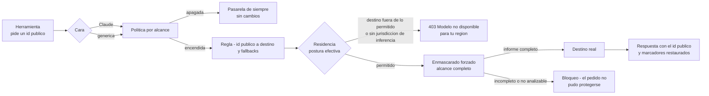

# Redirección de modelos

La **redirección de modelos** permite que una herramienta que pide un modelo (por ejemplo, el
«Opus» de Claude Desktop o de Claude Code) reciba la respuesta de **otro modelo que elige el
administrador**: un despliegue de la nube de la organización, un modelo económico, un modelo de
pesos abiertos alojado por un tercero. Es una política **apagada por defecto**, se enciende por
alcance desde la sección **Modelos** del panel y todo lo que se redirige sale **enmascarado** y
sujeto a una **postura de residencia** que decide cumplimiento, no el administrador de empresa.

**Para quién**: el administrador de empresa que publica y mapea modelos, el responsable de
cumplimiento que fija la residencia y las relajaciones, y el super admin de la instalación.

!!! warning "Estado: 🟡 hasta la verificación en vivo"
    Todo lo que describe esta página está cubierto por pruebas automatizadas con un proveedor
    **simulado**; **ninguna** integración se probó todavía en vivo contra un proveedor real, y la
    extensión no está activada en ninguna instalación entregada. Por eso nada de lo que sigue se
    marca 🟢: lo que se probó en vivo, y solo eso, pasará a 🟢 cuando exista la evidencia. Lo
    único 🟢 hoy es lo que la base garantiza **sin** la extensión (ver [Límites](#limites-y-estado)).

!!! note "Leyenda de estado"
    🟢 **HOY** — funciona y está verificado en vivo · 🟡 **PARCIAL** — existe y tiene pruebas
    automatizadas, sin verificación en vivo o con límites documentados · 🔵 **OBJETIVO** — roadmap
    explícito, no implementado. Nada marcado 🔵 se describe como si existiera.

---

## Cómo funciona

Cuatro piezas, todas **datos** que se editan desde el panel (sumar un cliente o un destino nunca
toca código):

| Pieza | Qué es |
|---|---|
| **Cara** | El «idioma» con el que la pasarela se presenta a una herramienta. Hay dos: la **cara Claude** (la que esperan Claude Desktop, Cowork y Claude Code) y la **cara genérica** de formato de chat estándar (la que entienden la mayoría de las CLI de terceros). |
| **Id público** | El nombre de modelo que ve y pide la herramienta (en la cara Claude, uno por nivel: `opus`, `sonnet`, `haiku`; en la genérica, un alias neutro). |
| **Destino** | El modelo real, en un proveedor concreto, que responde: una **entrada del catálogo** con su credencial, su ficha de cumplimiento, su ventana de contexto y su precio. |
| **Regla** | Id público (o nivel) → destino principal + destinos de respaldo (*fallbacks*) ordenados, con una estrategia de elección. |

- **Alcance de la política**: empresa, grupo, usuario o conexión. Gana el más específico
  (conexión › usuario › grupo › empresa); entre dos grupos, gana el de menor identificador, de modo
  que todos los planos resuelvan igual. 🟡
- **Sin política y sin postura, nada cambia**: la pasarela es la de siempre, con los mismos
  errores, la misma lista de modelos y las mismas filas de auditoría. Una empresa o grupo a quien
  no se le encendió la política no ve ningún id publicado ni destino ajeno. 🟡
- **Fidelidad**: un destino es *nativo* si habla el mismo protocolo que la cara (se reenvía casi
  tal cual) o *traducido* si la pasarela convierte el protocolo. Lo que un destino traducido no
  soporta (por ejemplo, un PDF sin visión, o las herramientas de búsqueda web y ejecución de
  código del proveedor original) **se rechaza con un 400 claro**, nunca se ignora en silencio.

---

## La pantalla «Modelos»

Con la extensión activa, el ítem **Modelos** del menú pasa a ser una pantalla única con las
pestañas del catálogo y las de la redirección:

| Pestaña | Para qué sirve | Quién escribe |
|---|---|---|
| **Destinos** | Las entradas del catálogo: modelo real, proveedor, ventana, precio, capacidades, ficha de cumplimiento, semáforo. | Admin de empresa (la ficha de residencia, solo cumplimiento) |
| **Modelos publicados** | Los ids públicos por cara y alcance, con etiqueta. | Admin de empresa |
| **Reglas** | Id público o nivel → destino + fallbacks, con estrategia. | Admin de empresa |
| **Política** | Encendida o apagada por alcance. | Admin de empresa |
| **Residencia** | Región, postura por defecto, posturas explícitas, relajaciones, semáforo. | Cumplimiento y super admin (el admin de empresa solo lee y puede **endurecer**) |
| **Habilitación** | Reglas que dejan un destino bloqueado hasta que alguien lo habilita con motivo. | Super admin (instalación); cumplimiento o admin (empresa, solo agregan) |
| **Vista previa** | Qué destino resolvería un pedido de prueba, sin enviarlo. | Cualquier rol de administración |
| **Kits** | La configuración lista de cada herramienta para un alcance. | Admin de empresa |
| **Fidelidad** | Prueba de un destino con conversaciones sintéticas de cada herramienta. | Admin de empresa |
| **Costos** | Costo por destino, con tokens de caché y aprovechamiento. | Lectura |

El panel muestra la marca de la instalación; ningún texto de la pantalla ni de los errores nombra
componentes internos del producto.

---

## Destinos: el catálogo

Cada destino es una entrada del catálogo. Se da de alta desde **Destinos** con el proveedor, el
nombre real del modelo, la ventana de contexto, el precio por millón de tokens (entrada, salida y,
si el proveedor lo informa, lectura y escritura de caché) y las **capacidades** que declara
(herramientas, visión, razonamiento, marcas de caché, afinidad de sesión).

- **Credenciales**: se guardan cifradas (con rotación de clave), son de **solo escritura** (el panel
  y la API nunca las devuelven) y se referencian por nombre. Una credencial puede ser de la empresa
  o de la instalación (se comparte entre las entradas que la usan). Para Azure se **adopta** la de la
  instalación por referencia a una variable del servidor, sin copiar el secreto. 🟡
- **Verificación de despliegue (Azure)**: al dar de alta o editar una entrada de Azure, el
  producto hace una prueba mínima contra el recurso; si el nombre no corresponde a un despliegue
  existente, la entrada queda **inactiva** con el motivo «El despliegue … no existe en el recurso
  configurado» hasta que **Verificar despliegue** pase. 🟡
- **Versión de API (Azure)**: usá `2025-04-01-preview` o posterior; con una anterior el panel avisa (sin bloquear) y, para las herramientas y el razonamiento de Claude Desktop/Code, el producto sube la versión solo en esa llamada y deja la de la credencial para el chat. 🟡
- **Ficha de cumplimiento**: por entrada, la **entidad responsable** (quien opera la inferencia),
  la **jurisdicción de la entidad**, la **jurisdicción de control** (la de quien posee el 50 % o más
  de la entidad o la controla), la **jurisdicción de inferencia** (dónde se procesa) y si hay
  **retención cero**. Son datos que no se presumen: vacíos significan «sin cargar». Solo
  cumplimiento y el super admin escriben esos cinco campos; si el admin de empresa intenta cambiar
  uno recibe `403` y el resto de la ficha sigue siendo editable por él. 🟡
- **Semáforo**: junto a cada destino, **Dentro de la región** (inferencia, entidad y control dentro
  de la región), **Estándar** o **Sin clasificar**. Se evalúa contra la región de la instalación o de
  la empresa, no contra una regla fija. 🟡
- **Gasto**: el costo se descuenta del presupuesto con el precio del **destino real**, de una única
  fuente de precios (la del catálogo). Sin precio cargado, la entrada queda al final de cualquier
  regla «más barato». 🟡

### Ejemplo: Kimi K3 por OpenRouter

OpenRouter es un **agregador**: una sola clave y una sola dirección que reparte el pedido entre
varios proveedores finales. Se da de alta desde **Modelos → Dar de alta modelos**:

1. **Proveedor**: OpenRouter. **Modelo**: `moonshotai/kimi-k3` (el id exacto que figura en la lista
   pública de OpenRouter; si el motor no lista el modelo, se escribe a mano).
2. **Credencial**: la clave de OpenRouter (solo escritura).
3. **Proveedores permitidos** (obligatorio): la lista de proveedores finales a los que se puede
   mandar el pedido, por ejemplo `fireworks, together`. Sin la lista, el alta se rechaza con un `422`
   que lo explica. Cada pedido sale además con **retención cero** y sin recolección de datos, y
   **solo** hacia esa lista; nada de eso lo puede relajar el cliente ni la entrada.
4. **Ficha de cumplimiento** (después del alta, por cumplimiento): la **jurisdicción de inferencia,
   la entidad y el control son los del proveedor final de la lista, no los de OpenRouter** ni los de
   quien desarrolló el modelo: el país de la empresa que creó Kimi K3 no dice dónde se procesa el
   pedido. Con proveedores finales en jurisdicciones distintas, la ficha se carga por el más
   restrictivo o se separa en una entrada por proveedor. Sin jurisdicción de inferencia, el destino
   se rechaza.

| Dato | Valor de ejemplo (lista pública de OpenRouter, 7-oct-2026; verificá los vigentes) |
|---|---|
| Ventana de contexto | 1 048 576 tokens |
| Imágenes | sí (marcar *Imágenes* en las capacidades) |
| Herramientas | sí |
| Precio por millón de tokens | entrada 0,62 US$ · salida 15 US$ |

Con la entrada dada de alta y su ficha cargada, una **regla** puede mover un id de Claude de Azure a
este destino sin tocar el cliente (ver [Ids publicados y reglas](#ids-publicados-y-reglas)). 🟡
(el alta, la regla y el pedido están cubiertos por pruebas con un proveedor simulado; sin
credencial ni prueba en vivo)

---

## Ids publicados y reglas

1. **Publicar** un id para una cara y un alcance. En la cara Claude, el id tiene que ser uno que la
   **versión instalada** de la herramienta reconozca (el panel exige el prefijo `claude`): Claude
   Code descarta los ids que no reconoce. La etiqueta que ve la persona es del tipo
   el **id pedido**: por defecto la persona no ve a qué destino va (ni en la lista de modelos ni en
   las respuestas, que siempre traen el id público). Mostrar el destino
   («Sonnet · servido por *destino*») o una etiqueta propia son opciones **por id**, en *Modelos
   publicados → Etiqueta*; las filas que ya tenían una elección la conservan. En ambos casos la
   lista lleva la ventana real del destino. En la cara genérica, el id es un alias neutro
   («rápido», «pro»).
2. **Regla**: id público (o nivel) → destino principal y fallbacks. Si el principal falla, no tiene
   credencial o la residencia lo excluye, responde el siguiente; la auditoría registra la
   sustitución y su motivo.
3. **Estrategia** de la regla: **en orden** (el orden de la lista) o **más barato** (el de menor
   precio del catálogo; el costo registrado es siempre el del destino que respondió).
4. **Id no publicado**: `404` «Modelo no disponible para tu organización.», sin revelar el motivo.
   Un `claude-*` no publicado cae a la regla de su nivel (inferido del nombre) solo con la política
   encendida; sin regla, el mismo `404`.
5. **Llaves con lista de modelos permitidos**: la lista se evalúa contra el **id público**; el
   nombre interno del destino nunca se evalúa ni se acepta de un cliente. Un cliente tampoco puede
   mandar su propia dirección de API ni credenciales hacia el destino: se ignoran. 🟡

### Modelos por grupo de personas

Los ids publicados y las reglas tienen **alcance**: toda la empresa, un **grupo**, una persona o una
conexión (gana el más específico). Con eso se arma, sin código, que cada grupo vea y use modelos
distintos. Ejemplo de dos grupos de una misma empresa, con los tres niveles de Claude sirviéndose desde
Azure y un cuarto id que va a Kimi K3:

| Pieza | **Grupo «Todos»** | **Grupo «Solo Azure»** |
|---|---|---|
| Ids de la familia (`claude-opus-…`, `claude-sonnet-…`, `claude-haiku-…`) | publicados para **toda la empresa**, con una regla de empresa hacia Azure | los mismos (los hereda de la empresa) |
| Id extra (por ejemplo `claude-sonnet-…-kimi`) | publicado con **alcance de grupo «Todos»** y una regla del mismo alcance hacia Kimi K3 | no existe para este grupo |
| Perfil de acceso | sin restricción de proveedor | perfil de empresa que **incluye solo el proveedor Azure**, asignado al grupo |

Qué ve y qué recibe cada grupo:

- **La lista de modelos** de la llave de cada persona trae solo lo suyo: «Todos» ve los tres ids más
  el extra; «Solo Azure» ve únicamente los tres que van a Azure.
- **Un pedido de «Solo Azure» al id del otro grupo** recibe el error neutro «Modelo no disponible
  para tu organización.» (`404`), que no nombra ni destinos ni proveedores: para ese grupo el id no
  existe.
- **Una regla de un grupo no aplica a otro**: mover el nivel *Sonnet* a Kimi con una regla de alcance
  «Todos» deja a «Solo Azure» en Azure con el mismo id.
- **El perfil de acceso es el cinturón de seguridad**: un grupo restringido a Azure por su perfil
  **nunca llega a Kimi**, aunque una regla de la empresa (por error) lo mande ahí. Si detrás de esa
  regla hay un destino de Azure, el pedido cae a él; si no lo hay, la persona recibe «Este modelo
  no está permitido para tu perfil.» (`403`) y no sale nada hacia el destino. La lista de modelos
  tampoco muestra el id que solo iría a un destino no permitido.

Cómo armarlo, en orden: (1) dar de alta los dos destinos y cargar sus fichas; (2) en *Modelos
publicados*, publicar los tres ids con alcance **Empresa** y el extra con alcance **Grupo**; (3) en
*Reglas*, una regla por id con el mismo alcance que su id; (4) en la pestaña *Acceso*, crear el
perfil «Solo Azure» (incluir el proveedor Azure) y asignarlo al grupo; (5) comprobar con la
**vista previa** y con la lista de modelos de una llave de cada grupo. 🟡 (cubierto por pruebas de
integración con dos grupos y proveedores simulados; sin prueba en vivo)

!!! note "Qué grupo cuenta"
    La pasarela toma el grupo de la persona a la que pertenece la llave. Una llave o una persona sin
    grupo solo ve lo publicado con alcance de la llave, de la persona o de la empresa: no hay un
    «grupo por defecto» implícito.

---

## Residencia y enmascarado por defecto

La residencia es una **postura** que restringe a qué destinos se puede llegar según su
jurisdicción. La región de la instalación es un **dato** (no código): en la línea América, la
región `AMERICAS` agrupa el continente americano completo (Norte, Centro, Caribe y Sur) y se puede
editar.

!!! warning "`AMERICAS` es un criterio de riesgo, no de legalidad"
    La región ordena los destinos por riesgo para decidir qué sale enmascarado y qué se rechaza.
    **No** significa que enviar datos a un país de la lista sea lícito ni que el producto «cumpla»
    con una norma. El marco normativo de esta instalación es la **Ley 25.326 y los criterios de la
    AAIP**; el Reglamento General de Protección de Datos europeo y la Ley de IA de la Unión Europea
    **no rigen** en esta línea. La base legal de las transferencias internacionales de datos personales
    (Ley 25.326, art. 12: cláusulas contractuales o consentimiento) la cubre quien opera la
    instalación, **por fuera del sistema**: el producto solo decide si un pedido sale, si sale
    enmascarado o si se rechaza.

### Postura por defecto de la región

Todo pedido redirigido sin una postura explícita se rige por la **postura por defecto** de la región
de la empresa (si no tiene, la de la instalación):

| Valor | Destino dentro de la región | Destino fuera de la región |
|---|---|---|
| `reject_offregion` (valor de fábrica del mecanismo) | sin enmascarado forzado | rechazado (`403`) |
| `masked_offregion` | sin enmascarado forzado | enmascarado forzado |
| **`masked_all`** (el que se siembra en esta línea) | enmascarado forzado | enmascarado forzado |
| `allow` | sin enmascarado forzado | sin enmascarado forzado |

En esta línea la instalación se siembra con `masked_all`: **todo lo redirigido sale enmascarado**,
dentro o fuera de `AMERICAS`, con el analizador en modo **fail-closed** (si el analizador no
responde, el pedido se bloquea, aunque la instalación esté configurada para «degradar»). 🟡

Reglas que valen con **cualquier** valor:

- Un destino **sin jurisdicción de inferencia** cargada se rechaza siempre (`403`), con cualquier
  postura, fila o relajación.
- «En región» exige que la jurisdicción de **inferencia**, la de la **entidad** y la de **control**
  estén dentro de la región. Una nube con servidores en la región pero con jurisdicción de control
  fuera (o sin cargar) **no** cuenta como en región.
- El enmascarado que impone la postura por defecto es un **piso**: agregar posturas explícitas
  nunca lo quita. Solo lo quitan una **relajación** (abajo) o un cambio de la postura por defecto.

### Respaldo en código: cuando falta la región

Si para un pedido redirigido no hay región cargada que lo resuelva, el producto **no sale en claro
por falta de datos**. Hay dos estados, y `GET /api/v1/redirect/health` (sin sesión, solo estado)
informa cuál rige con `503`:

| Estado (`reason`) | Cuándo | Qué pasa con lo redirigido |
|---|---|---|
| `region_row_missing` | la región del perfil se conoce pero no hay fila que la resuelva (sin datos sembrados, o fila borrada). También ocurre si el perfil resuelve a `eu` por el valor por defecto del compose de producción y no existe una fila para esa región | todo sale enmascarado y fail-closed, y solo a destinos dentro de las jurisdicciones que el código asocia a la región; el resto, `403` |
| `region_unresolved` | la región del perfil no se puede determinar | todo lo redirigido se rechaza con `403` |

Mientras rige el respaldo, ninguna postura de ningún rol quita el enmascarado ni amplía el alcance,
y las relajaciones no tienen efecto. Si se quiere conservar el comportamiento de rechazo fuera de
región sin fila, hay que **sembrar la fila** de la región con `default_posture = reject_offregion`.
En una instalación con la extensión activa, la región se carga sola al arrancar desde los archivos
de datos que indica el operador; si esa carga falla, rige el respaldo y el estado lo informa. 🟡

### Posturas explícitas

Cumplimiento y el super admin pueden fijar posturas por alcance: *apagada*, *enmascarado forzado
fuera de región* o *solo jurisdicciones permitidas* (el panel pre-completa la lista con la región).
El **administrador de empresa** solo puede **endurecer**: una fila suya menos estricta que la vigente
se rechaza con `422 posture_less_strict`, y sus filas nunca quitan el enmascarado de cumplimiento.
Una postura explícita **no** habilita un destino sin jurisdicción de inferencia. 🟡

### Relajaciones del enmascarado forzado

Quitar el enmascarado forzado es una decisión explícita, con motivo y registrada, y es de
**cumplimiento o del super admin**. Hay dos formas:

- **Por región**: cambiar la postura por defecto de `masked_all` a `masked_offregion` (el super admin
  lo hace sobre la fila de la instalación; cumplimiento crea una fila propia de su empresa). Los
  destinos **en región** salen sin forzado; los de fuera, enmascarados.
- **Por destino**: una relajación sobre una entrada del catálogo. Se acepta **solo** si la ficha tiene
  cargadas las jurisdicciones de inferencia, entidad y control, declara **retención cero** y, en un
  agregador, tiene una lista de proveedores permitidos no vacía; de lo contrario, `422` con el
  motivo y el destino sigue enmascarado. Si la ficha cambia y deja de cumplir, o cambia el
  proveedor, la dirección, el modelo real o la lista de proveedores, la relajación se **revoca
  sola** y queda registrado. Nunca hay relajaciones sembradas.

Ninguna relajación habilita un destino sin jurisdicción de inferencia ni vuelve alcanzable un
destino fuera de una postura *solo jurisdicciones permitidas*. 🟡

!!! info "Quién puede relajar"
    Las relajaciones, las regiones y la postura por defecto las escriben **cumplimiento** y el
    **super admin**, por su rol real. El administrador de empresa recibe `403`. Esa garantía se
    apoya en que el rol de cumplimiento (y el de super admin) **solo lo asigna un super admin**: un
    administrador de empresa no puede designarse a sí mismo ni a otra persona como responsable de
    cumplimiento (ver [Quién asigna los roles de cumplimiento](index.md#quien-asigna-los-roles-de-cumplimiento)).
    En esta línea no se define ningún «tenant operador» que dé autoridad de instalación a un
    administrador de empresa.

---

## Enmascarado forzado de alcance completo

Cuando el enmascarado es forzado, el **alcance es completo**, no solo el último mensaje: se
enmascara todo texto que sale hacia el destino —el prompt de sistema, todos los turnos de la
persona y del asistente (el cliente reenvía el historial entero en cada pedido), los argumentos y
resultados de herramientas, las descripciones de herramientas y los valores de los campos
desconocidos— y los datos vuelven restaurados en la respuesta, incluso en *streaming*. Se
describe como **seudonimización reversible de identificadores detectados**: no es anonimización.
Lo no detectado no se enmascara; ningún detector garantiza un recall del 100 %.

- **PDF**: un PDF con texto se **convierte a texto**, se enmascara y viaja como texto. La lectura
  corre en un proceso aparte, con topes de memoria, de tiempo y de expansión, para que un PDF hostil
  no afecte al resto del servicio.
- **Binarios que devuelve una herramienta se reemplazan, no se envían**: una imagen, un audio o un
  documento que **una herramienta del agente devuelve dentro de un `tool_result`** y no se puede
  analizar (la captura con la que Cowork revisa su resultado, por ejemplo) se cambia por una nota de
  texto neutra y el binario **nunca sale** hacia el destino; la tarea sigue. La auditoría registra
  `unanalyzable_replaced` (cuántos) y los nombres de tipo, sin contenido. Un PDF con texto devuelto
  por una herramienta sigue el camino normal (se convierte a texto y se enmascara). Es una decisión
  de la instalación: la alternativa más estricta (bloquear) cortaba las tareas de Cowork. 🟡
- **Lo que adjunta la persona y no se puede analizar se bloquea**: nunca se «envía igual». Un pedido con algo no analizable
  recibe un bloqueo: `400` en la cara Claude y `403` en la cara genérica, con el texto *«El pedido no
  pudo protegerse para este destino y fue bloqueado. Probá en una conversación nueva.»* La auditoría
  guarda solo el **nombre del tipo** (nunca contenido):

| Causa (nombre en la auditoría) | En lenguaje de administrador |
|---|---|
| `image`, `audio` | la **persona** adjuntó una imagen o un audio: no se analizan (los de una herramienta se reemplazan por una nota) |
| `pdf_no_text` | PDF escaneado o sin capa de texto (no hay lectura de imágenes) |
| `pdf_error` | PDF corrupto o protegido |
| `pdf_timeout` | el PDF tardó más del plazo en leerse (por defecto 20 s) |
| `pdf_resource_limit` | el PDF excede un tope: páginas, tamaño, memoria, expansión o texto |
| `pdf_request_limit` | el pedido trae más PDF de los permitidos (por defecto 5) o excede el plazo total (30 s) |
| `pdf_unavailable` | el lector de PDF no está instalado en el motor |
| `document_url`, `document` | adjunto por dirección o identificador, u otro tipo de documento |
| `structural_entity` | se detectó un dato personal en una posición que no se puede reescribir sin romper el pedido (un identificador de herramienta, un nombre de herramienta…) |
| `redacted_thinking`, `unknown_block`, `cache_control`, `too_deep` | bloque de razonamiento redactado, de tipo desconocido, marca de caché con forma inválida, o anidación excesiva |

- **Falsos positivos**: con el analizador real, un identificador de herramienta o un valor que el
  detector lea como dato personal bloquea el pedido (`structural_entity`). Es la postura segura
  (*fail-closed*); la frecuencia real se mide en la verificación en vivo. 🟡
- **Destinos nativos y razonamiento firmado**: un bloque de razonamiento firmado cuyo texto cambió
  al enmascarar no puede reenviarse a un destino nativo del proveedor original (la firma dejaría de
  valer): se bloquea con `masking_required`. Hacia un destino traducido, la pasarela reconstruye la
  firma. Esta parte queda 🟡 hasta probarla con un destino nativo real.
- **Conteo de tokens**: con el enmascarado forzado vigente, `count_tokens` nunca reenvía la
  conversación: responde una **estimación local** o `404`.
- **Latencia**: analizar todo el historial es costoso. Una **caché de análisis** recuerda, por
  segmento de texto, solo *dónde* hubo detecciones (jamás el texto, el valor ni el marcador); el
  enmascarado es idéntico con y sin ella. En una medición local con un analizador simulado, el
  segundo turno de una conversación larga pasó de 299 a 8 llamadas al analizador (≈ 97 % menos); la
  cifra con el analizador real queda 🟡 hasta la verificación en vivo. Se apaga con
  `MASKING_ANALYSIS_CACHE_ENABLED=false`.
- **Exenciones opcionales (apagadas)**: el operador puede, de forma explícita, dejar sin analizar el
  prompt de sistema y/o las definiciones de herramientas (`MASKING_EXEMPT_SYSTEM_PROMPT`,
  `MASKING_EXEMPT_TOOL_DEFINITIONS`). Vienen apagadas, un pedido no puede encenderlas, y la
  auditoría registra el **nombre** de lo exento. Los secretos se siguen inspeccionando.

---

## Habilitación explícita (reglas de bloqueo)

El producto puede dejar **bloqueado por defecto** un destino que cumple una regla por datos
(proveedor, host de la API o jurisdicción de inferencia, de entidad o de control) hasta que
cumplimiento o un administrador lo **habilite con motivo** (queda registrado; habilitar no
relaja la residencia). **De fábrica las tres listas están vacías**: ningún destino nace bloqueado y
todo se decide desde el panel. Las reglas de una empresa solo se aplican a las entradas de esa
empresa y solo **agregan** (endurecen). 🟡

---

## Matriz de compatibilidad por herramienta y proveedor

**Herramientas** (qué cara usan; detalle y síntomas en las páginas de cada una):

| Herramienta | Cara | Estado |
|---|---|---|
| Claude Desktop (Chat, Cowork, Code) | Claude | 🟡 [guía](../integrations/claude-desktop.md) |
| Claude Code | Claude | 🟡 [guía](../integrations/claude-code.md) |
| CLI de formato de chat estándar (opencode, Aider en modo estándar, Continue, Cline/Roo, Zed) | Genérica | 🟡 [guía](../integrations/cli-formato-openai.md) |
| Codex CLI | — (requiere una superficie de «Responses» que el producto no expone) | 🔵 |

**Proveedores** (como destinos del catálogo):

| Proveedor | Estado | Qué respalda esa marca |
|---|---|---|
| Azure (despliegues propios de la organización) | 🟡 | Es el **primer** destino a probar en vivo; hoy, solo pruebas con proveedor simulado y la verificación de despliegue |
| DeepSeek, Qwen, GLM, Kimi, MiniMax (API oficial o `openai_compatible`) | 🟡 | Dados de alta y ruteados en pruebas con proveedor simulado; **sin credencial real**, sin verificación |
| OpenRouter | 🟡 | Cada pedido sale con retención cero, sin recolección de datos y solo hacia la lista de proveedores permitidos de la entrada; **sin credencial real**, sin verificación |
| Modelos locales (servidor propio) | 🟡 | Solo con el interruptor de la instalación (`CATALOG_ALLOW_PRIVATE_API_BASE`, pensado para una sola empresa); las empresas cargan únicamente `https` hacia hosts públicos |

Los modelos chinos y económicos son un caso de uso de primera clase. Con las listas de bloqueo
vacías, se dan de alta y salen **enmascarados** por la postura por defecto; solo una relajación por
destino de cumplimiento (alojador nombrado, jurisdicciones cargadas, retención cero) los libera del
forzado cuando están alojados en la región. La API oficial de un proveedor con control fuera de la
región nunca cuenta como «en región».

---

## Qué queda en la auditoría

La auditoría es **solo metadatos**: jamás texto de pedidos, datos personales, tokens ni secretos. Por
pedido redirigido registra el id pedido y el destino real, la cara, la fidelidad, la regla aplicada,
la postura (`default_posture_applied`), si el destino estaba en región, el alcance del enmascarado
(`masking_scope`), la relajación aplicada si la hubo (`masking_relaxation`), los **nombres** de campos
quitados, las causas de no analizable, los binarios de herramientas reemplazados por una nota (`unanalyzable_replaced`, solo conteo y tipo), la sustitución por fallback con su motivo y, si el destino
informa caché, los tokens de lectura y escritura de caché. Los cambios de política, regiones,
posturas, relajaciones y fichas quedan en el registro de cambios con quién, qué rol y el motivo.

## Límites y estado { #limites-y-estado }

- 🟢 **Sin la extensión, la pasarela es la de siempre**: mismas respuestas, errores, lista de
  modelos y filas de auditoría, con una batería de no-regresión de 26 casos y la pantalla de
  descubrimiento sin nombres de componentes internos.
- 🟡 **La política, las dos caras, el catálogo y las posturas** están implementados y con pruebas
  automatizadas con proveedor simulado; **faltan las pruebas en vivo** (Azure primero).
- 🟡 **Residencia**: toda esta sección está 🟡 hasta la **revisión legal**. `AMERICAS` es un criterio
  de riesgo; el producto no afirma que una transferencia sea lícita ni que se «cumpla» una norma.
- 🟡 **Perfiles de acceso**: rigen en la **pasarela** (las herramientas externas), **no** en el chat de
  la propia consola: un usuario al que un perfil le quita un modelo gobernado puede seguir usándolo
  desde el chat de la consola, y el chat de la consola no sirve las entradas del catálogo de la
  redirección. El semáforo del catálogo tampoco alimenta la residencia de los proyectos de
  cumplimiento de la base.
- 🟡 **Caché del proveedor** (marcadores estables por conversación, afinidad de sesión, marcas de
  caché): el mecanismo está probado localmente; el efecto real sobre los aciertos de un proveedor
  (objetivo: aprovechar ≥ 60 % de la caché desde el segundo paso) **no está medido**.
- 🟡 **Tokens de caché en la auditoría**: figuran en las filas del camino de suscripción; las filas del
  camino con llave del producto (el motor las escribe antes de la respuesta) todavía **no** los
  llevan — 🔵 pendiente de un cambio chico de la base.
- 🔵 **Lectura de imágenes (OCR)**: no existe; imágenes y PDF escaneados se bloquean.
- 🔵 **Codex CLI**: sin camino gobernado (el producto no expone la superficie «Responses»), aunque la
  pestaña **Kits** pueda generar un kit con ese nombre: no usarlo contra esta pasarela.
- 🔵 **Modo sombra** (calcular el destino sin servirlo): reservado, no se ofrece.

## Relacionado

- [Gobernanza del firewall](gobernanza.md) — las capas gobernables y el estado honesto de la
  protección, sobre las que se apoya el enmascarado forzado.
- [Roles y permisos](index.md#roles-y-permisos-rbac) — quién es cumplimiento y quién asigna ese rol.
- [Integraciones & matriz](../integrations/index.md) — las superficies y las guías de Claude Desktop,
  Claude Code y las CLI de formato estándar.
- [Operaciones: activar y vigilar la redirección](../operations/index.md#7-redireccion-de-modelos) — activación,
  `GET /api/v1/redirect/health`, seeds y vuelta atrás.
- [Compliance](../compliance/index.md) — el marco normativo de la instalación y el módulo de proyectos.
