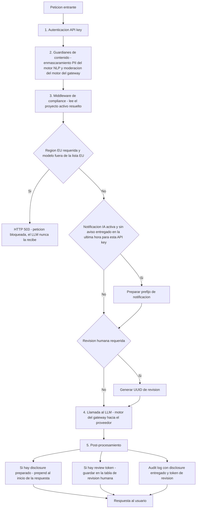
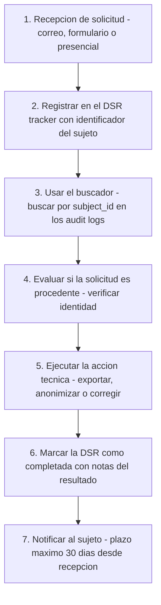
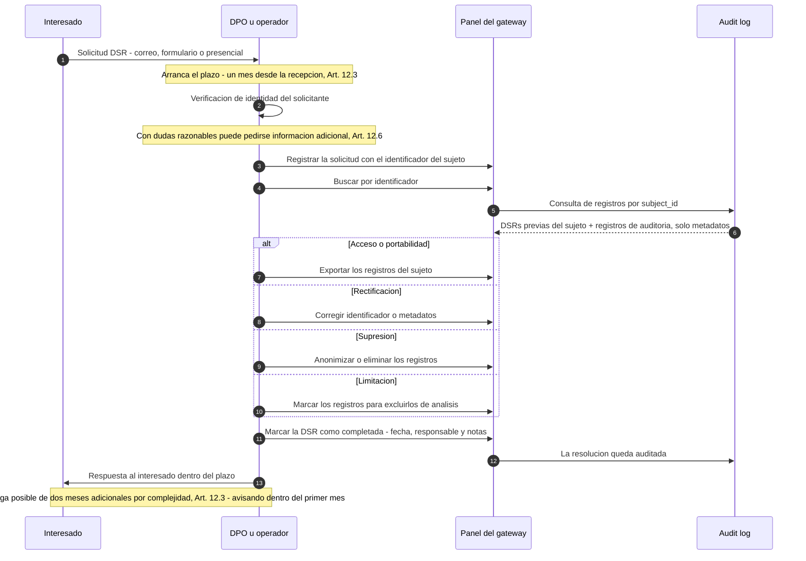

# DPA · DSR · Retención

Esta página cubre la operativa diaria de compliance: registro de DPAs, derechos del
interesado (DSR) con sus plazos GDPR, políticas de retención, panel DPO, cómo se aplican
los controles en el pipeline de chat y el checklist antes de producción. La visión general
del marco legal y los Proyectos de Compliance están en **[Compliance](index.md)**.

**Para quién**: administradores del sistema, DPO (Delegado de Protección de Datos) y
responsables de seguridad TI en centros sanitarios.

!!! note "Leyenda de estado"
    🟢 **HOY** — funciona y está verificado · 🟡 **PARCIAL** — existe con límites
    documentados · 🔵 **OBJETIVO** — roadmap explícito, no implementado. Nada marcado
    🔵 se describe como si existiera.

---

## Cómo se aplican los controles en cada llamada

Cuando un usuario envía un mensaje al chat, la plataforma ejecuta este flujo **por cada
llamada**:



Detalles del enforcement, verificados en el comportamiento real: 🟢

- **Región EU** — si el proyecto exige región EU y el modelo enrutado **no** empieza por
  `azure-`, `bedrock-`, `vertex-` u `ollama-`, la petición se rechaza con **HTTP 503**
  antes de salir de la instancia.
- **Notificación IA** — el aviso se antepone **una vez por hora por API key** (se comprueba
  contra el audit log), no en cada mensaje, para no interrumpir el flujo de conversación
  continuamente.
- **Revisión humana** — cada respuesta bajo un proyecto con revisión humana genera un token
  UUID que queda en el audit log y en la cola de revisiones pendientes. Es un modelo
  híbrido: marca para supervisión, **no bloquea** la respuesta.

### Ejemplo de respuesta con disclosure activo

```
ℹ️ Este servicio utiliza inteligencia artificial para generar respuestas.
Las respuestas generadas por IA deben ser revisadas por un profesional
cualificado antes de ser aplicadas. (EU AI Act Art. 50)

[Respuesta del LLM aquí]
```

Ese es el mensaje predeterminado en español; el campo **Mensaje de notificación** del
proyecto lo reemplaza si está definido.

---

## Registro de DPAs

### Qué es

Un **DPA (Data Processing Agreement)** es el contrato obligatorio entre el responsable del
tratamiento (el hospital) y cada encargado del tratamiento (el proveedor del LLM) que exige el
**Art. 28 GDPR**.

**Sin DPA firmado con el proveedor del LLM, no se pueden enviar datos de pacientes.**

### Proveedores y su cobertura

| Proveedor | DPA estándar cubre Art. 9 | Región EU disponible | Recomendación |
|-----------|--------------------------|---------------------|---------------|
| **Azure OpenAI** (Microsoft) | ✅ Sí — Microsoft Online Services DPA | ✅ Sí (`swedencentral`, `francecentral`) | **Recomendado para PHI** |
| **AWS Bedrock** (Amazon) | ✅ Sí — AWS BAA | ✅ Sí (`eu-west-1`, `eu-central-1`) | **Recomendado para PHI** |
| **Google Vertex AI** | ✅ Sí — Google Cloud DPA | ✅ Sí (`europe-west1`) | Válido con DPA firmado |
| **OpenAI directo** | ⚠️ Solo Enterprise | ❌ No garantizado | **No recomendado para PHI** sin Enterprise |
| **Ollama (local)** | ✅ N/A — procesamiento local | ✅ Siempre | Ideal para datos muy sensibles |

### Campos del registro

| Campo | Qué registrar |
|-------|--------------|
| **Proveedor** | Nombre legal del encargado (ej: `Microsoft Ireland Operations Ltd.`) |
| **Tipo** | `Estándar` (DPA del proveedor), `Adenda personalizada`, `Enterprise` |
| **Región de procesamiento** | Donde procesará los datos: `EU`, `US`, `Global` |
| **Cubre Art. 9** | Marcar solo si el DPA cubre explícitamente datos de categoría especial |
| **Fecha de firma** | Fecha en que el contrato entró en vigor |
| **Fecha de vencimiento** | Fecha de renovación (el panel muestra alerta 30 días antes) |
| **Referencia del documento** | URL interna o número de expediente del DPA firmado |

### Estados del DPA

El estado **se calcula automáticamente** a partir de la fecha de vencimiento — no es un
campo que se edite a mano:

| Estado | Significado | Acción requerida |
|--------|-------------|-----------------|
| 🟢 **Activo** | DPA vigente | Ninguna |
| 🟡 **Por vencer** | Vence en menos de 30 días | Renovar o negociar prórroga |
| 🔴 **Expirado** | Vencimiento pasado | **Detener uso del proveedor** hasta renovación |

---

## Derechos del Interesado (DSR)

### Qué es

Los artículos 12–22 del GDPR otorgan a las personas físicas derechos sobre sus datos. El centro
tiene obligación de responder en el plazo de **un mes** — en la práctica, **30 días
calendario** — desde la recepción (Art. 12(3)), prorrogable **dos meses más** en casos
complejos, informando al interesado dentro del primer mes.

Este módulo proporciona un registro de solicitudes y una herramienta de búsqueda para localizar
qué datos del sujeto están en el sistema.

### Tipos de solicitudes

| Tipo | Artículo GDPR | Qué implica técnicamente |
|------|---------------|-------------------------|
| **Acceso** | Art. 15 | Exportar todos los registros del sujeto en el audit log |
| **Rectificación** | Art. 16 | Corregir datos incorrectos (identificador, metadatos) |
| **Supresión** ("derecho al olvido") | Art. 17 | Anonimizar o eliminar registros del sujeto |
| **Portabilidad** | Art. 20 | Exportar datos en formato estructurado (JSON/CSV) |
| **Limitación** | Art. 18 | Marcar registros para no procesarlos en análisis |

### Flujo de trabajo recomendado



### El flujo DSR paso a paso, con plazos

El mismo flujo visto como interacción entre el interesado, el operador y la evidencia del
sistema — con los plazos GDPR marcados:



### Qué devuelve la búsqueda

La búsqueda por identificador devuelve, **solo con metadatos**: 🟢

- las **DSRs previas** registradas para ese mismo sujeto (tipo, estado, fecha de recepción), y
- hasta **100 registros de auditoría** más recientes del sujeto, con fecha, modelo usado,
  si se detectó PII y el estado de compliance de cada llamada.

Cada solicitud nace en estado **abierta** y se cierra marcándola **completada**, con fecha
de finalización, responsable (`handled_by`) y notas del resultado — esa es la evidencia de
que la DSR se atendió en plazo.

### Sobre el identificador del sujeto

El sistema **no almacena nombres ni NIF** — solo el identificador interno pseudonimizado que la
API key del cliente envía. Para poder responder una DSR necesitas:

1. Conocer qué identificador usa tu sistema para ese paciente
2. Buscarlo en el audit log

!!! warning "Custodia del mapeo de pseudonimización"
    Si usas pseudonimización, el mapeo `identificador → persona real` debe estar en un sistema
    separado bajo custodia del DPO, nunca en este gateway.

### Exportar el expediente del sujeto (Art. 15 / 20) 🟢

Para el derecho de **acceso** (Art. 15) y **portabilidad** (Art. 20), el sistema genera un CSV con
los registros de auditoría del sujeto:

`GET /api/v1/reports/dsar/{identificador_del_sujeto}` · rol **admin** o **compliance officer**

- El identificador puede ser el **nombre de usuario** o el **ID interno** del sujeto.
- Devuelve una fila por llamada auditada —fecha, modelo, tokens, coste, si se detectó PII y qué
  entidades se enmascararon, estado de compliance, si se entregó el disclosure de IA, token de
  revisión humana, propósito de tratamiento y latencia— **solo metadatos**, nunca el texto del
  prompt ni de la respuesta.
- Un sujeto sin registros devuelve un **CSV vacío (200)**, no un error.

!!! warning "Límites vigentes — no prometer de más"
    - **Tope de 1.000 registros** 🟡 — el export devuelve hasta los **1.000** registros de auditoría
      más recientes del sujeto. Para un sujeto con más historial el CSV no es exhaustivo; si una
      DSAR lo exige, complementá con una consulta directa a la base bajo control del DPO.
    - **Sin acotado por tenant** 🔵 — hoy la búsqueda es **global** a la instalación (no filtra por
      tenant). El acotado por tenant llega con **spec 017**.

---

## Políticas de Retención

### Qué es

El **Art. 5(1)(e) GDPR** prohíbe conservar datos personales más tiempo del necesario. Este módulo
permite configurar por cuánto tiempo se guardan los distintos tipos de registros.

### Clases de retención y valores por defecto

La retención se configura por **clase de registro**. La clase de cada fila del audit log se
deduce de su tipo con un mapeo determinista (no depende de quién la escribió); son cuatro:

| Clase (`log_type`) | Por defecto | Qué agrupa |
|---|---|---|
| **`config_audit`** | 730 días | Cambios de configuración del sistema — trazabilidad de decisiones administrativas |
| **`security_events`** | 365 días | Bloqueos de guardianes y alertas de seguridad — detección de patrones de ataque, ENS |
| **`usage_metadata`** | 365 días | Metadatos de uso (tokens, coste, modelo, timestamp) y, como clase de resguardo, todo registro de tráfico que no sea configuración ni seguridad |
| **`prompt_content`** | 90 días | Contenido de prompts/respuestas (ver la nota de abajo) |

Los **mínimos y topes que se validan** al guardar —y cómo cambian en tier estricto— están en
**[Rangos de retención por tier](#rangos-de-retencion-por-tier)**.

!!! note "El audit log es solo de metadatos; el único texto durable es la respuesta en revisión humana"
    La auditoría del sistema es **solo de metadatos**: ninguna fila del audit log guarda el texto
    de los prompts ni de las respuestas — la clase `prompt_content` está **vacía** en el audit log,
    y así debe seguir. Si en un log apareciera contenido de prompts o respuestas, no es
    configurable — es un **hallazgo de seguridad** que debe reportarse de inmediato.

    El **único contenido durable** de la caja es el campo `response_text` de una **revisión
    humana**: cuando un proyecto exige revisión humana, la respuesta revisada se conserva para que
    el revisor la pueda leer. Ese texto es lo que gobierna el plazo de `prompt_content` (90 días
    por defecto): al purgar esa clase, el `response_text` de las revisiones vencidas se anula (la
    fila de la revisión persiste como metadato). Si no se usa revisión humana, no hay contenido
    durable que retener.

### Cómo ajustar la retención

1. Ir a **Políticas de Cumplimiento → Retención de Datos**
2. Modificar los días para cada tipo según la DPIA del centro
3. Completar el campo de justificación (este texto va a la DPIA)
4. Guardar

Cada cambio guarda además **quién** lo hizo y **cuándo** — la configuración de retención es
en sí misma evidencia auditada.

### Purga automática de registros vencidos 🟢

Desde **spec 018** la purga es real: un proceso en el backend elimina las filas vencidas de cada
clase (edad medida contra el reloj de la base de datos). **Viene apagada de fábrica** y sólo se
enciende como un acto explícito del operador — un borrado retroactivo no debe activarse solo con
una actualización de producto.

**Doble compuerta** (las dos deben estar en verde para que se borre):

1. `SENTINEL_PURGE_ENABLED=true` — interruptor maestro. Con `false` (el default) el proceso ni
   arranca. Se lee **al arrancar el backend**, así que encenderlo pide reinicio.
2. Un **intervalo** de despertar > 0 (`SENTINEL_PURGE_INTERVAL_SECONDS`, 3600 s por defecto). El tick
   no es la purga: sólo despierta al proceso a mirar si está dentro de la **ventana**
   (`SENTINEL_PURGE_WINDOW`, `02:00-05:00` en `SENTINEL_PURGE_WINDOW_TZ`); fuera de ventana, se vuelve a
   dormir.

**Simulacro primero** (`SENTINEL_PURGE_DRY_RUN`, `true` por defecto): aun con la purga encendida, la
corrida hace todo **menos borrar** — resuelve la fecha de corte, **cuenta** las filas que caerían y
deja el rastro marcado como simulacro. El DPO firma sobre un número real —«se van 412.000 filas de
esta clase»— antes de pasar a borrado real. Pasar `SENTINEL_PURGE_DRY_RUN=false` es el último cambio, y
se hace una sola vez, con alguien mirando.

**Qué borra, con red:**

- **Filas vencidas de `audit_logs`** por clase, en **lotes** (`SENTINEL_PURGE_BATCH_SIZE`) con una
  **pausa** entre lotes (`SENTINEL_PURGE_BATCH_PAUSE_MS`) para no bloquear la tabla más caliente del
  producto.
- Al purgar `prompt_content`, el `response_text` de las **revisiones humanas** vencidas pasa a
  `NULL` (la fila de la revisión persiste como metadato).
- **Los registros de licencia no se borran nunca:** los protege un sello interno, no el nombre de su
  columna «modelo». Un pedido que se autodenomine `license` es tráfico normal y se purga por su
  plazo.

**Dos seguros más:**

- **Piso de plazo:** un plazo por debajo del mínimo aborta **esa clase** (no la corrida entera):
  queda en `error`, sin borrar ni una fila, y las otras clases siguen.
- **Residuo fail-closed:** las filas que **ninguna clase reclama** y ya pasaron el corte más antiguo
  se **cuentan y se reportan, pero no se borran** (`filas_no_clasificadas`). El officer ve el
  residuo antes de apretar el botón; nada se elimina por no encajar en una clase.

**Rastro auditable:** cada corrida real deja evidencia solo-metadatos — una entrada por clase en el
registro de purga de la política (las últimas 50) y una fila resumen por corrida en el audit log
(clase `config_audit`). El simulacro no escribe borrado, sólo su conteo.

!!! note "Estado del scheduler en el health"
    El endpoint de salud del backend expone `purge_scheduler_running` (booleano): indica si el hilo
    de purga está vivo. Con la purga apagada (el default) es `false` — es lo esperado, no una avería.

### Rangos de retención por tier 🟢

Al guardar una política, el plazo de cada clase se valida contra un **mínimo** (y, para
`prompt_content`, un **tope**) que dependen del **tier de enforcement** de la instalación. Fuera de
rango, la API responde **HTTP 422** indicando la clase y el piso/tope concretos; **ninguna** política
del lote se guarda.

| Clase | Mínimo (estándar) | Mínimo (estricto) | Tope (estándar) | Tope (estricto) |
|---|---|---|---|---|
| `config_audit` | 365 días | 730 días | — | — |
| `security_events` | 30 días | 365 días | — | — |
| `usage_metadata` | 30 días | 365 días | — | — |
| `prompt_content` | 1 día | 1 día | 365 días | 90 días |

- **Tier estándar** es el default; **tier estricto** se activa con la capa de gobernanza
  `enforcement_tier_estricto` y **sube los mínimos** (y baja el tope de `prompt_content` de 365 a 90
  días — por privacidad, el contenido no puede retenerse más de lo permitido).
- Sólo `prompt_content` tiene tope; el resto sólo tiene piso. El piso de `config_audit` (≥ 365 en
  estándar) se preserva exactamente como antes.
- Esta validación se **apila** sobre el piso del propio purgador: ningún plazo hace que se borre una
  fila escrita el mismo día.

### Cómo documentar para la DPIA

El campo "Justificación" de cada tipo de log es el texto que va directamente en la sección de
retención de tu DPIA. Debe responder: *¿Por qué necesitamos estos datos durante este período?* Ej:

> "Los metadatos de uso se conservan 365 días para auditoría interna de costes y para poder
> responder a reclamaciones de facturación durante el año fiscal en que se generaron."

---

## Panel DPO

### Qué es

Vista consolidada para el Delegado de Protección de Datos. Muestra el estado de cumplimiento de
un vistazo sin necesidad de revisar cada sección.

### Indicadores y cómo interpretarlos

| Indicador | Verde | Amarillo | Rojo |
|-----------|-------|----------|------|
| **Proyectos Activos** | ≥1 activo, sin alertas | Activos con alertas (sin DPIA) | 0 activos |
| **DPAs Vigentes** | Todos activos | Alguno por vencer | Alguno expirado |
| **DPIAs Pendientes** | 0 pendientes | — | ≥1 proyecto alto riesgo sin DPIA |
| **Solicitudes DSR Abiertas** | 0 abiertas | ≥1 abierta | ≥1 abierta hace +25 días |
| **Enmascaramiento PHI** | >80% | 40–80% | <40% |
| **Notificación IA** | >90% | 50–90% | <50% (obligatorio desde ago. 2026) |
| **Revisión Humana** | >95% completadas | 80–95% | <80% |

Detalles verificados del cálculo: 🟢

- Un proyecto **sin base legal** cuenta como *bloqueado*; un proyecto de alto riesgo **sin
  referencia DPIA** cuenta como *alerta* y como *DPIA pendiente*.
- El panel también avisa cuando la **última revisión de una DPIA** supera los 365 días
  (revisión anual vencida).
- Las tasas de enmascaramiento y notificación se calculan sobre las llamadas de inferencia;
  los eventos de evidencia del licenciamiento **no inflan los denominadores**.
- El panel incluye la **distribución por propósito de tratamiento** declarado en las
  llamadas — útil para el Registro de Actividades de Tratamiento (RAT).

### Revisión DPO recomendada (mensual)

1. Comprobar que no hay DPAs expirados
2. Verificar que todos los proyectos alto riesgo tienen DPIA referenciada
3. Revisar DSRs abiertas — si alguna supera 25 días, escalar
4. Revisar tasa de notificación IA — debe ser ~100%
5. Revisar revisiones humanas pendientes en `/api/v1/compliance/review/pending`

---

## Escenarios de uso práctico

### Escenario A: Hospital con asistente clínico (caso típico)

**Configuración recomendada:**

- 1 proyecto activo: base legal Art. 9(2)(h), riesgo Alto Annex III
- Notificación IA: ✅ activada
- Revisión humana: ✅ activada (médico supervisa respuestas)
- Región EU: ✅ activada (usar Azure OpenAI `swedencentral` o Bedrock `eu-west-1`)
- DPA registrado: Microsoft Online Services DPA (cubre Art. 9)
- DPIA: obligatoria antes del despliegue en producción

**Flujo de revisión humana:**

1. Médico hace pregunta clínica
2. El sistema genera respuesta + review_token en audit log
3. Supervisor médico revisa `/api/v1/compliance/review/pending`
4. Aprueba o rechaza con notas

### Escenario B: Soporte administrativo (bajo riesgo)

**Configuración recomendada:**

- 1 proyecto activo: base legal Art. 6(1)(e) o Art. 9(2)(h) según contexto
- Notificación IA: ✅ activada (obligatoria en cualquier caso)
- Revisión humana: ❌ no necesaria para consultas administrativas
- Región EU: recomendada pero no bloqueante para datos administrativos
- Nivel de riesgo: Limitado

### Escenario C: Investigación con datos anonimizados

**Configuración recomendada:**

- Base legal: Art. 9(2)(j) — interés público / investigación
- Nivel de riesgo: Limitado o Mínimo (si los datos están verdaderamente anonimizados)
- Notificación IA: ✅ activada
- DPIA: recomendada aunque los datos sean anonimizados

---

## Referencia rápida de la API de compliance

Todo lo descrito en esta página se opera también por API (sesión JWT con rol **tenant
admin** o **compliance officer**; la revisión humana admite además el perfil `clinician`):

| Ruta | Qué hace |
|------|----------|
| `GET/POST /api/v1/compliance/projects` · `PUT/DELETE .../projects/{id}` | CRUD de Proyectos de Compliance |
| `GET/POST /api/v1/compliance/dpas` · `PUT/DELETE .../dpas/{id}` | CRUD del registro de DPAs |
| `GET/POST /api/v1/compliance/dsr` · `PUT .../dsr/{id}` | Registrar y actualizar solicitudes DSR |
| `GET /api/v1/compliance/dsr/search?subject_id=...` | Búsqueda de evidencia por identificador del sujeto |
| `GET /api/v1/compliance/review/pending` · `POST .../review/{token}` | Cola de revisiones humanas y envío del veredicto |
| `GET/PUT /api/v1/compliance/retention` | Consultar y ajustar las políticas de retención (el `PUT` valida rangos por tier → 422) |
| `GET /api/v1/reports/dsar/{id}` | Export CSV del expediente del sujeto, Art. 15/20 (ver [Exportar el expediente del sujeto](#exportar-el-expediente-del-sujeto-art-15-20)) |
| `GET /api/v1/compliance/dashboard` | Indicadores consolidados del panel DPO |

---

## Checklist antes de producción

### Legal / Organizativo

- [ ] DPIA completada y aprobada por el DPO para cada caso de uso de alto riesgo
- [ ] DPA firmado con cada proveedor de LLM que recibirá datos de pacientes
- [ ] Política de retención revisada y aprobada por el DPO
- [ ] Procedimiento de respuesta a DSR documentado (¿quién gestiona? ¿en qué plazo?)
- [ ] Registro de Actividades de Tratamiento (RAT) actualizado con este sistema
- [ ] Notificación a la AEPD si el tratamiento requiere inscripción

### Técnico

- [ ] Al menos 1 proyecto de compliance activo con base legal correcta, **asignado** a los
      grupos / usuarios que deben regirse por él
- [ ] DPA del proveedor LLM registrado con `cubre_art_9 = true`
- [ ] Notificación IA activada (obligatoria EU AI Act Art. 50 desde agosto 2026)
- [ ] Si se usan datos clínicos reales: `eu_region_required = true` y modelo `azure-*` o `bedrock-eu-*`
- [ ] Motor NLP de enmascaramiento de PII activado (ver **Seguridad → Guardianes** en la consola de administración)
- [ ] Políticas de retención por clase revisadas y configuradas según la DPIA (ver [Clases de retención](#clases-de-retencion-y-valores-por-defecto)); si se va a activar la purga, ensayada primero en simulacro
- [ ] Verificado que ningún log contiene contenido de prompts o respuestas (si aparece, reportarlo como hallazgo de seguridad)

### Verificación post-despliegue

- [ ] Panel DPO muestra 0 DPAs expirados y 0 DPIAs pendientes
- [ ] Tasa de notificación IA > 0% tras primeras llamadas de prueba
- [ ] Audit log registra `ai_disclosure_delivered = true` en primera llamada por sesión
- [ ] DSR de prueba creada, buscada y completada correctamente

---

## Relacionado

- [Compliance](index.md) — marco legal, niveles de riesgo del EU AI Act con lo que el
  producto hace en cada uno, y configuración de Proyectos de Compliance.
- [Purga de retención](../administration/purga-retencion.md) — cómo se enciende y se
  ensaya el proceso que ejecuta estos plazos: las 7 perillas, el CLI `--run-now` y el
  procedimiento de encendido seguro.
- [Administración](../administration/index.md) — roles que gestionan compliance, políticas
  de seguridad con modos GDPR / AI Act y auditoría metadata-only.
- [Operaciones](../operations/index.md) — runbook del operador: chequeos de salud del
  stack y gotchas verificados en formato síntoma → causa → fix.

---

*Actualizar esta guía cuando cambie la configuración de compliance o la normativa aplicable.*
