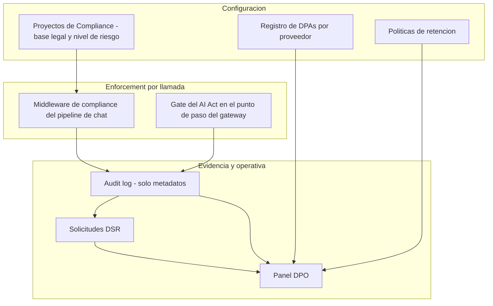
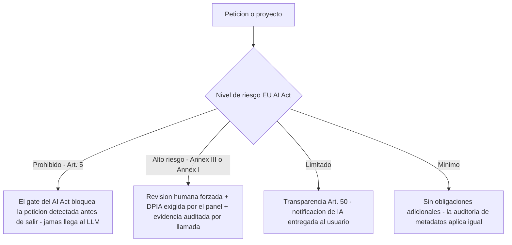

# Compliance

El producto incluye un módulo de compliance con los controles mínimos exigibles para
desplegar un gateway de IA en entornos sanitarios europeos: proyectos con base legal GDPR,
clasificación de riesgo del EU AI Act con enforcement real en el pipeline, registro de DPAs,
derechos del interesado y retención — todo con evidencia auditada de solo metadatos.

**Para quién**: administradores del sistema, DPO (Delegado de Protección de Datos) y
responsables de seguridad TI en centros sanitarios.

!!! note "Leyenda de estado"
    🟢 **HOY** — funciona y está verificado · 🟡 **PARCIAL** — existe con límites
    documentados · 🔵 **OBJETIVO** — roadmap explícito, no implementado. Nada marcado
    🔵 se describe como si existiera.

Esta sección se organiza en dos páginas:

- **Esta página** — visión general del marco legal, los niveles de riesgo del EU AI Act con
  lo que el producto hace en cada uno, y la configuración de **Proyectos de Compliance**
  (bases legales, configuración paso a paso).
- **[DPA · DSR · Retención](dpa-dsr-retention.md)** — registro de DPAs, derechos del
  interesado (DSR), políticas de retención, panel DPO, pipeline y checklist de producción.

---

## El módulo de un vistazo

El módulo separa **configuración** (lo que el DPO y el administrador definen),
**enforcement** (lo que se aplica en cada llamada) y **evidencia** (lo que queda registrado
y se consolida en el panel DPO):

Los marcos legales cubiertos:

| Marco legal | Artículos clave | Qué cubre este módulo |
|-------------|----------------|----------------------|
| **GDPR (Reglamento UE 2016/679)** | Art. 5, 9, 12–22, 28, 35 | Base legal, DPAs, DSRs, retención, DPIA |
| **EU AI Act (Reglamento UE 2024/1689)** | Art. 5, 50 | Bloqueo de prácticas prohibidas y notificación al usuario de interacción con IA |
| **ENS (Esquema Nacional de Seguridad)** | Medidas de trazabilidad | Retención mínima de eventos de seguridad (365 días) |

La configuración del módulo (proyectos, DPAs, DSRs, retención) se gestiona con rol
**tenant admin** o **compliance officer** — la matriz completa de permisos está en
[Administración](../administration/index.md).

!!! warning "No reemplaza la asesoría legal"
    Este módulo **no reemplaza** la asesoría legal. Proporciona controles técnicos; el DPO del
    centro debe validar que la configuración se alinea con su DPIA específica.

---

## Niveles de riesgo del EU AI Act y qué hace el producto

El EU AI Act clasifica los sistemas de IA en niveles de riesgo. El producto actúa distinto
en cada nivel — dos son **enforcement duro** en runtime y dos son **transparencia y
evidencia**:

Qué significa cada nivel al configurar un proyecto:

| Nivel | Descripción | Obligaciones |
|-------|-------------|-------------|
| **Riesgo Mínimo** | Chatbots informativos generales, sin decisiones sobre personas | Sin obligaciones adicionales |
| **Riesgo Limitado** | Sistemas que interactúan con humanos | Art. 50: **notificación obligatoria desde ago. 2026** |
| **Alto Riesgo — Annex III** | Sistemas usados en diagnóstico, triaje, decisiones clínicas | Registro en EUDB, DPIA, supervisión humana, logs 10 años |
| **Alto Riesgo — Annex I (MDR)** | Producto sanitario con marcado CE (Directiva MDR 2017/745) | Requisitos de producto sanitario + EU AI Act acumulados |

Y qué hace el producto en cada uno, verificado en el comportamiento real:

- **Prohibido (Art. 5)** 🟢 — el gate del AI Act inspecciona el contenido en el punto de
  paso y **bloquea** las prácticas prohibidas que detecta (p. ej. social scoring) antes de
  que la petición salga hacia ningún proveedor. La detección es por patrones: lo detectado
  se bloquea; la cobertura depende del catálogo de patrones activo.
- **Alto riesgo (Annex III / Annex I)** 🟢 — al guardar un proyecto con nivel alto, el
  producto **fuerza la revisión humana** automáticamente (no es opcional: el servidor la
  activa aunque el formulario la deje apagada). Cada respuesta genera un token de revisión
  auditado. El panel DPO marca en rojo los proyectos de alto riesgo **sin referencia DPIA**
  y avisa cuando la última revisión de la DPIA supera los 365 días. Además, si el gate
  detecta contenido de aplicación de alto riesgo, marca la llamada con una advertencia de
  supervisión humana (flag, no bloqueo).
- **Limitado** 🟢 — transparencia del Art. 50: la notificación de uso de IA se antepone a
  la respuesta (una vez por hora por Connection, ver el
  [pipeline](dpa-dsr-retention.md)).
- **Mínimo** 🟢 — sin obligaciones adicionales; la auditoría de metadatos y los guardianes
  de contenido aplican igual que en cualquier llamada.

!!! tip "Asistente clínico en hospital"
    Para un asistente clínico en hospital, el nivel correcto es **Alto Riesgo — Annex III**
    (categoría 5(a): sistemas de IA para el diagnóstico o tratamiento de enfermedades). Esto
    activa la obligación de DPIA, notificación IA y revisión humana.

---

## Proyectos de Compliance

### Qué es

Un **Proyecto de Compliance** es la unidad central de configuración. Define las reglas que
se aplican a las llamadas al chat mientras el proyecto esté activo.

Puedes tener múltiples proyectos, pero en la práctica un centro sanitario típico necesita uno
por entorno de uso (ej: `Asistente Clínico`, `Soporte Administrativo`, `Investigación`).

### A qué llamadas aplica un proyecto

Cada llamada resuelve **un** proyecto activo siguiendo la jerarquía de asignación, en este
orden: **Connection (virtual key) → usuario → grupo**. Gana la asignación más específica.

!!! warning "Asignación explícita — 🟡 sin fallback global"
    Una llamada cuya jerarquía **no** tiene ningún proyecto activo asignado no recibe los
    controles de proyecto (región EU, notificación IA, revisión humana). Los guardianes de
    contenido y la auditoría aplican igual, pero los controles de proyecto exigen
    asignación. Recomendación operativa: asigná el proyecto **a nivel de grupo** para que
    todos sus usuarios y Connections queden cubiertos por defecto.

### Campos y su significado

| Campo | Tipo | Qué controla |
|-------|------|-------------|
| **Nombre** | Texto | Identificador del proyecto (ej: "Asistente Clínico H. Valle Verde") |
| **Descripción** | Texto | Contexto libre del proyecto para el equipo |
| **Base legal** | Selector | La justificación GDPR para tratar datos de salud. **Obligatorio.** |
| **Notas de base legal** | Texto | Matices de la base elegida (ej: alcance del consentimiento) |
| **Categoría de datos** | Texto | Tipo de datos que maneja (ej: `health_data`, `administrative`) |
| **Nivel de riesgo AI Act** | Selector | Clasifica el sistema según los Annexos del EU AI Act. Default de un proyecto nuevo: **Limitado** |
| **Activo** | Boolean | Solo los proyectos activos aplican sus reglas al pipeline. Un proyecto nuevo nace **inactivo**: hay que activarlo explícitamente |
| **Forzar región EU** | Boolean | Bloquea llamadas a modelos fuera de la UE |
| **Notificación IA** | Boolean | Entrega aviso legal de uso de IA al usuario (Art. 50). **Activada por defecto** |
| **Revisión humana** | Boolean | Genera token de revisión por cada respuesta para supervisión clínica. **Forzada automáticamente** en proyectos de alto riesgo |
| **Referencia DPIA** | Texto | Número de documento de la evaluación de impacto (ej: `DPIA-2026-001`) |
| **Versión DPIA** | Texto | Versión del documento DPIA vigente |
| **Última revisión DPIA** | Fecha | El panel DPO avisa cuando supera los 365 días |
| **Mensaje de notificación** | Texto | Texto del aviso IA. Si está vacío, usa el mensaje predeterminado en español |

### Bases legales disponibles

| Opción | Cuándo usarla |
|--------|--------------|
| `Art. 9(2)(h)` — Prestación sanitaria | **La más común.** Asistentes clínicos, diagnóstico, historia clínica. Requiere supervisión de profesional sanitario. |
| `Art. 9(2)(j)` — Interés público / investigación | Proyectos de investigación anonimizados. Requiere DPIA y medidas adicionales. |
| `Art. 9(2)(a)` — Consentimiento explícito | Solo si tienes consentimiento firmado del paciente. No recomendado para uso clínico rutinario. |
| `Art. 6(1)(c)` — Obligación legal | Para procesos obligatorios por ley (ej: notificación de enfermedades de declaración obligatoria). |
| `Art. 6(1)(e)` — Misión de interés público | Para entidades públicas. No cubre datos de categoría especial por sí solo; combinar con Art. 9. |

Un proyecto **sin base legal** cuenta como *bloqueado* en el panel DPO: la base legal no es
un campo informativo, es el prerrequisito de todo lo demás.

### Cómo configurar un proyecto básico paso a paso

1. Ir a **Políticas de Cumplimiento → Proyectos → Nuevo Proyecto**
2. Nombre: `Asistente Clínico [Nombre del centro]`
3. Base legal: `Art. 9(2)(h) — Prestación sanitaria`
4. Nivel de riesgo: `Alto Riesgo — Annex III`
5. Activar: **Notificación IA** y **Revisión humana** (con nivel alto, la revisión humana
   queda forzada aunque no la marques)
6. Si los datos son sensibles: activar **Forzar región EU**
7. Referencia DPIA: completar cuando el DPO entregue el documento
8. Guardar → **Activar el proyecto**
9. **Asignar el proyecto** al grupo (o a usuarios / Connections concretos) que debe regirse
   por él — sin asignación, sus reglas no aplican a ninguna llamada

---

## Límites y estado

- 🟢 **Enforcement de proyecto** — región EU, notificación IA y revisión humana operan en
  el pipeline en cada llamada con proyecto resuelto.
- 🟢 **Gate del AI Act** — las prácticas prohibidas detectadas se bloquean antes de salir;
  el alto riesgo detectado se marca con advertencia de supervisión.
- 🟡 **Cobertura de detección** — el gate y los guardianes trabajan sobre lo que detectan;
  la detección por patrones es el default y un despliegue productivo con PHI exige el motor
  NLP de detección como precondición (ver [Overview](../overview/index.md)).
- 🟡 **Asignación de proyecto** — sin fallback global: las llamadas fuera de la jerarquía
  asignada no reciben controles de proyecto (ver arriba).

---

## Relacionado

- [DPA · DSR · Retención](dpa-dsr-retention.md) — la operativa diaria: registro de DPAs,
  gestión de solicitudes DSR con plazos GDPR, retención, panel DPO y checklist de producción.
- [Administración](../administration/index.md) — roles RBAC que gestionan compliance, y las
  políticas de seguridad con sus modos GDPR / AI Act.
- [Overview & arquitectura](../overview/index.md) — dónde encaja el enforcement de
  compliance dentro del pipeline por request del producto.
