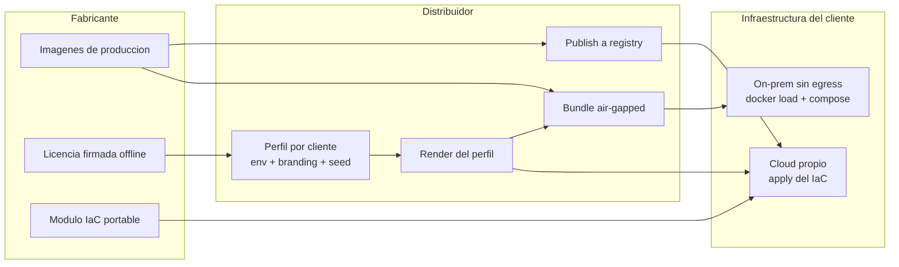
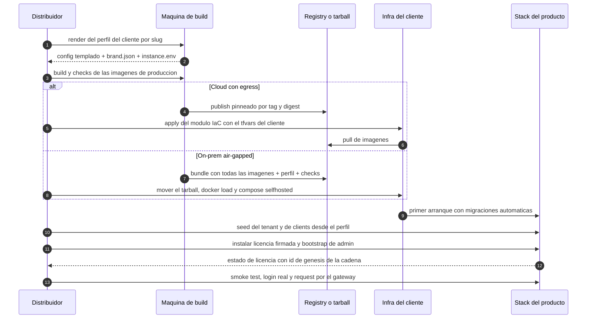

# Install / Deploy

Guía de despliegue para el **distribuidor** (el partner que revende la plataforma bajo su
propia marca, la instala, da el training y el soporte) y para el **operador** que administra
una instalación. Cubre el modelo de entrega, los artefactos que componen un despliegue y el
flujo de instalación de punta a punta.

**Para quién**: el distribuidor que empaqueta e instala el producto bajo su marca, y el
operador técnico del lado del cliente que administra la instalación. Todo se opera sobre
artefactos de release — no se necesita acceso al código fuente del producto.

Páginas de esta sección:

- [Infraestructura](infrastructure.md) — arquitectura de despliegue objetivo: cloud, on-prem/air-gapped, secretos y storage.
- [Licenciamiento](licensing.md) — licenciamiento offline por seats y postura de IP del artefacto.
- [Partner enablement](partner-enablement.md) — el programa de capacitación y certificación para que un partner nuevo instale de forma autónoma.
- [White-label & branding](../white-label/index.md) — el branding pack y la marca como configuración en runtime.

!!! warning "Nota de honestidad (léala antes que nada)"
    Esta guía distingue explícitamente lo **implementado hoy** de lo **forward-looking**:
    describe el **estado-objetivo** (cómo debe desplegarse en producción) y, en cada bloque,
    marca qué es real hoy y qué falta construir. Nada aspiracional se declara como hecho.
    Lo que existe hoy: el compose de producción con imágenes multi-stage
    (backend/frontend/docs), el **licenciamiento offline con enforcement fail-closed**, el
    onboarding-as-data (perfil por cliente + seed por slug), el bootstrap de admin, la
    herramienta de **bundle air-gapped** y un **módulo IaC portable** que valida con checks
    estáticos pero cuya aplicación end-to-end sobre un entorno real sigue **pendiente de
    validación** — hasta entonces, el camino verificado en vivo es el compose de producción.
    **El secrets manager gestionado y los datos gestionados (DB/cache) siguen siendo
    estado-objetivo.** Ver la tabla de estado.

**Leyenda de estado** (se usa en toda la documentación):

| Marca | Significado |
|---|---|
| 🟢 **HOY** | Implementado y verificable en la versión actual del producto |
| 🟡 **PARCIAL** | Existe la base, falta endurecerlo para producción |
| 🔵 **OBJETIVO** | Roadmap / estado-objetivo, no existe aún |

---

## Cómo fluyen los artefactos (visión conceptual)

El fabricante nunca toca la infraestructura del cliente: entrega **artefactos**, el
distribuidor arma el **perfil por cliente** y el despliegue se materializa por uno de dos
caminos — cloud con egress (IaC + registry) o on-prem/air-gapped (bundle autocontenido).
El mismo código y las mismas imágenes sirven para ambos: **el despliegue por cliente es
configuración + seed, nunca un fork**.



Los tres actores y su frontera de responsabilidad:

| Actor | Responsabilidad |
|---|---|
| **Fabricante** | Construye el producto, publica imágenes/tarball + branding pack + módulo IaC + licencia firmada. No instala, no opera, no ve datos. |
| **Distribuidor (usted)** | Empaqueta el perfil del cliente, corre el despliegue (o acompaña al cliente), da training y soporte, gestiona licencias/seats. |
| **Cliente final** | Es dueño de su infra (cuenta cloud / datacenter), aplica el IaC, custodia sus secretos y sus datos. |

---

## Estado actual vs objetivo (resumen ejecutivo)

| Pieza del deploy | Estado-actual | Estado-objetivo (producción cliente) | Estado |
|---|---|---|---|
| Orquestación | Compose de **producción**: backend, frontend, motor y docs; on-prem/air-gap se levanta con `--profile selfhosted` (suma db y redis). Existe además un **módulo IaC portable** (red/datos/cache/cómputo/secretos/ingress, workspace por cliente, guard de región EU) validado por checks estáticos; su aplicación e2e sobre un entorno real está pendiente. El compose dev es **sólo desarrollo** | Módulo IaC + compose de producción (v1) / k8s con bundle firmado (v2) | 🟡 |
| Imágenes backend/frontend/docs | Imágenes de **producción** multi-stage: sin reload, deps pinneadas, frontend compilado servido estático, con checks. Build: `make -C deploy build`; validación: `make -C deploy check` | Igual, publicadas/empaquetadas por release | 🟢 |
| Imagen del motor | Pinneada por **tag+digest** en el stack de referencia | Pin por digest en todos los despliegues | 🟡 |
| Base de datos / cache | Contenedores `postgres:16-alpine` / `redis:7-alpine` con volumen local (perfil `selfhosted` del compose de producción) | Postgres y Redis **gestionados** (RDS/Cloud SQL/Azure DB · ElastiCache/MemoryStore) | 🔵 |
| Secretos | El módulo IaC **genera secretos por instalación** (aleatorios, fuertes, outputs sensibles; exige state remoto **cifrado**); la licencia y las keys de proveedor viajan aparte, **cifradas** en el perfil. En el camino compose: archivos env de la instalación (los defaults de desarrollo jamás salen a un cliente — hay un check que lo verifica) | Secrets manager gestionado (AWS SM / GCP SM / Vault) **o cifrado sin servidor** para v1/air-gapped, inyectando env al arrancar | 🟡 |
| TLS + DNS | En el árbol de release: DNS por cliente derivado del slug + TLS terminado por **proxy auto-HTTPS en la VM**; pendiente la validación e2e aplicada. En dev: HTTP plano en puertos altos. En **LAN sin dominio público** el proxy emite con su **CA interna**, y entonces hay que distribuir esa CA a los puestos — el **kit de confianza** (`deploy/release/trust-kit/`) la exporta, la instala en el almacén de máquina y **verifica con un handshake real**; ver [Operaciones §5.1](../operations/index.md#51-confianza-del-certificado) | TLS terminado + DNS por cliente, región EU | 🟡 |
| Onboarding de cliente | Perfil por cliente + seed idempotente desde YAML (`seed_clients_from_config(db, tenant_slug, path)`) | Igual, invocado por el flujo de instalación | 🟢 |
| Tenant por slug | Modelo `Tenant.slug` único; on-prem = 1 tenant (default `…0001`) | Igual; cloud = N tenants aislados por RLS | 🟢 / 🟡 (RLS cableada en las tablas, pero el enforcement por request está pendiente: el aislamiento efectivo hoy es a nivel de aplicación) |
| Bootstrap de admin | Primer login `admin` crea `tenant_admin` **sólo mientras la instalación no tenga dueño** (ningún usuario con rol administrativo) y con un mínimo de 12 caracteres; email `admin@basa.com.ar`. En el camino IaC la credencial inicial se emite **una sola vez** como output sensible | Igual + rotación de credencial obligatoria post-instalación | 🟢 (rotación por API/UI: `POST /users/me/password` y reseteo de admin `POST /users/{id}/password`) |
| Branding white-label | Naming neutro en el código (`AIEngineClient`/`engine_*`, errores del motor reescritos a naming neutro); el render del perfil produce el `brand.json` del cliente | Branding pack (nombre/logo/paleta) por cliente como **config-as-data en runtime** (sin recompilar) | 🟡 |
| Licenciamiento offline | **Implementado fail-closed**: verificación Ed25519 offline al arranque; gate de seats en las altas (`402` seats agotados / `403` licencia no activa); estados `active`/`grace`/`expired`; `BASA_LICENSE_HARD_BLOCK` corta las rutas de servicio; `GET /api/v1/health/license`; auditoría hash-chained + true-up firmado; sin phone-home | Igual | 🟢 |
| Bundle air-gapped | Herramienta de bundle en el árbol de release: tarball autocontenido con **todas** las imágenes + compose de producción + perfil renderizado + checks + manifiesto con digests; validada en el gate del release | Igual, por release; v2 con bundle firmado para k8s | 🟢 |

---

## El modelo de entrega (óptica del distribuidor)

La plataforma se distribuye bajo un modelo **install + N licencias**, no como SaaS operado
por el fabricante. Como distribuidor, usted es el dueño de la relación con el cliente final:

- **Usted revende bajo su propia marca (o co-marca).** Ningún nombre del motor interno ni de
  proveedor LLM aparece en la UI, la API pública, los errores ni los logs — el código usa
  naming neutro (`AIEngineClient`/`engine_*`) y los errores del motor se reescriben antes de
  exponerse. Esto es 🟢 en el core; el branding visual (nombre de producto, logo, paleta) se
  aplica por cliente — ver [White-label & branding](../white-label/index.md).
- **Usted da el training y el soporte de nivel 1/2.** Instala (o acompaña la instalación),
  capacita, resuelve incidencias y escala al fabricante sólo los bugs de producto.
- **El fabricante no instala al cliente final ni opera servidores.** No tiene acceso a la
  infraestructura del cliente, no ve sus datos y el producto no hace phone-home. El
  fabricante entrega **artefactos** (imágenes/tarball, branding pack, perfil por cliente,
  módulo IaC, licencia) y usted o el cliente los despliegan.
- **El cliente levanta el stack donde quiera.** El cliente final es dueño de su
  infraestructura (su VPC, su cuenta cloud o su datacenter on-prem/air-gapped). El **mismo
  código** corre **single-tenant on-premise** (un tenant por instalación, apto para modelos
  locales Ollama/vLLM) y **multi-tenant cloud**. El despliegue por cliente es
  **configuración + seed, nunca un fork**.
- **Licencias = seats.** El contrato fija N seats. Un **seat = una Connection activa** (una
  `APIKey` activa y no expirada por herramienta/persona) — **no el usuario**: desactivar un
  usuario no libera seats; revocar sus Connections sí. El enforcement de seats es offline,
  firmado y **fail-closed** (🟢 implementado hoy) — ver [Licenciamiento](licensing.md).

---

## Qué se entrega (deliverables)

Por cada cliente/despliegue, el distribuidor arma un paquete con:

1. **Imágenes de producción o tarball air-gapped.**
    - **Cloud con egress** → imágenes de producción publicadas en un registry desde el que el
      cliente pueda hacer `pull` (backend, frontend, docs y el motor pinneado por digest). 🟢
      Las imágenes de producción de `backend`/`frontend`/`docs` **existen hoy**: multi-stage,
      sin reload, dependencias pinneadas y el frontend compilado servido como estático. Se
      construyen con `make -C deploy build` y se validan con `make -C deploy check`; la
      publicación pinneada por tag+digest la hace el script de publish del árbol de release.
    - **On-prem / air-gapped (sin egress)** → **tarball** autocontenido generado por la
      herramienta de bundle del release: `docker save` de **todas** las imágenes (db, redis,
      motor@digest, backend, frontend, docs y el proxy TLS — una imagen fuera del tarball =
      pull en runtime = instalación rota sin egress) + el compose de producción + el perfil
      renderizado + los checks + un **manifiesto con digests** para verificar el install. 🟢
      La herramienta existe y se valida en el gate del release. El sitio de documentación de
      producto viaja como una imagen más del release (`basa-docs:<brand>-<version>`, una por
      marca, 100% estática y 0-egress).

2. **Branding pack.** Nombre de producto, logo, favicon, paleta y datos de contacto de
   soporte del distribuidor. Se aplica como **config-as-data en runtime** (el frontend carga
   la configuración de branding al arrancar, no se hornea en la imagen), nunca tocando
   código. 🟡 El código ya es marca-neutro y el render del perfil ya produce el `brand.json`
   por cliente; el mecanismo de branding-por-config-en-runtime es lo que falta formalizar.
   Detalle completo en [White-label & branding](../white-label/index.md).

3. **Perfil por cliente (onboarding-as-data).** 🟢 Es el corazón del "config + seed, never
   fork". Un directorio por cliente en el árbol de release, que se crea copiando el perfil
   de ejemplo y editando datos, **jamás código**:
    - **`client.env`**: identidad del despliegue — `tenant` (nombre + `slug` único),
      `deployment_mode` (`on_premise` | `cloud`), dominio base y región. Del slug se
      **derivan** el dominio del producto (`<slug>.<dominio-base>`) y el workspace de IaC —
      una sola fuente de identidad.
    - **`branding.env`**: el branding pack como variables (nombre, tagline, contacto de
      soporte, paleta).
    - **`seed.yaml` / `config/clients.yaml`**: lista de clients (personas/herramientas) con
      sus Connections (una virtual key por `tool_type`), Budget en USD y toggles por-key
      (`redact_enabled`, `compression_mode`, `allowed_models`, `allowed_tools`, `rpm_limit`,
      `tpm_limit`, `upstream_mode`). El schema está documentado en el `clients.example.yaml`
      que acompaña al producto. Sumar un cliente o un demo = **editar el YAML y correr el
      seed**, nunca tocar código.
    - **`config.yaml.tmpl`**: plantilla de configuración del motor; el render sustituye
      **sólo** las variables del perfil y **falla** si queda alguna sin resolver.
    - El **render** (`render_profile.sh <slug>`) produce el directorio `rendered/` con el
      config templado, el `brand.json` y un `instance.env` consolidado, listo para el
      cómputo cloud o el compose on-prem. Verifica que el slug del perfil coincida con el
      directorio. **Los secretos NO viven en el perfil**: se generan por instalación; la
      licencia y las keys de proveedor viajan aparte, cifradas.

4. **Módulo IaC portable.** 🟡 Un módulo parametrizado por cliente con submódulos de
   red/base de datos/cache/cómputo/secretos/ingress — ver
   [Infraestructura](infrastructure.md). Puntos de diseño verificables en el módulo:
    - **Un workspace por cliente** sobre state remoto **cifrado** del distribuidor
      (aislamiento entre despliegues; hay un check que lo verifica).
    - **Región default EU**: el apply **falla** fuera de EU salvo override explícito y
      auditable (`allow_non_eu=true`) — residencia de datos por diseño.
    - **Secretos generados por instalación** (aleatorios, fuertes, outputs sensibles) —
      cero defaults compartidos entre clientes.
    - Outputs: `product_url` + `admin_bootstrap` (credencial inicial, **sensible**, se emite
      una sola vez y se rota con `-replace`).
    - Se usa **OpenTofu, no Terraform**: como el distribuidor **entrega el IaC a terceros**
      y la licencia de Terraform es **BSL**, OpenTofu (fork MPL, drop-in, mismos `.tf` y
      `tofu apply`) evita el riesgo de licenciamiento en la redistribución.
    - **Límite honesto**: el módulo valida con los checks estáticos del release
      (`make -C deploy check`), pero su aplicación end-to-end sobre un entorno real sigue
      pendiente de validación. Hasta entonces, el camino verificado en vivo es el compose de
      producción sobre una VM provisionada a mano — en on-prem/air-gap,
      `docker compose --profile selfhosted up -d` (el perfil suma db y redis).

5. **Licencia firmada (Ed25519).** 🟢 Implementado con enforcement **fail-closed**: archivo
   de licencia offline que habilita N seats, verificado al arranque con la clave pública —
   ver [Licenciamiento](licensing.md).

---

## Flujo de instalación de punta a punta

Así se ve una instalación completa, del render del perfil al smoke test. Los pasos de
build, perfil, bundle, seed, bootstrap y licencia son 🟢 y se corren hoy tal cual; el
camino IaC es 🟡 (módulo real, validación e2e aplicada pendiente).



### Paso a paso

0. **Build + validación de artefactos** (en la máquina de build, con red):
   `make -C deploy build` (imágenes de producción) y `make -C deploy check` (todos los
   checks del release: imágenes, marca blanca, secretos, IaC, docs). 🟢
1. **Perfil del cliente**: copiar el perfil de ejemplo a un directorio con el `slug` del
   cliente, editar `client.env` / `branding.env` / `seed.yaml`, y renderizar con
   `render_profile.sh <slug>`. El render falla si el slug no coincide o si quedan variables
   sin resolver en el config del motor. 🟢
2. **Publicar o empaquetar**:
    - *Cloud*: publish de las imágenes al registry del distribuidor, pinneadas por
      tag+digest.
    - *Air-gap*: generar el bundle (`bundle.sh <slug>`), mover el tarball al host destino
      (USB/SFTP), `tar xzf` + `docker load -i images.tar`, y levantar con el compose de
      producción: `--profile selfhosted`, `--env-file profile/instance.env` y el env de
      secretos de la instalación. Verificar contra el manifiesto de digests. 🟢
3. **`tofu apply` (camino cloud)** con el `tfvars` del cliente (región EU, tamaños de
   DB/cómputo, dominio, `tenant` name+slug, `deployment_mode`): `tofu init` sobre el state
   remoto cifrado del distribuidor → `tofu workspace new <slug>` → `tofu apply
   -var-file=envs/<slug>/…`. Fuera de EU el apply **falla** sin `allow_non_eu=true`.
   Outputs: `product_url` + `admin_bootstrap`. 🟡 (módulo real; validación e2e aplicada
   pendiente)
4. **Secretos generados, no hardcodeados.** El módulo IaC genera `POSTGRES_PASSWORD`, la
   clave maestra del motor, `FERNET_SECRET_KEY` y `JWT_SECRET_KEY` (aleatorios, fuertes) y
   los inyecta como variables de entorno; el state remoto va cifrado y los outputs son
   sensibles. **Los defaults de desarrollo jamás llegan a un cliente** — el gate del release
   incluye checks de que no haya secretos default en runtime ni secretos en claro en el
   state. En el camino compose, los secretos van en el env de la instalación. 🟡
5. **Arranque + migraciones.** El backend corre `alembic upgrade head` al bootear, creando
   el esquema multi-tenant. El motor corre sus propias migraciones de base de datos. ⚠️ En
   el **primer boot** el motor puede reportarse `unhealthy` por timeout aunque haya
   arrancado bien — ver [el gotcha](#gotcha-boot).
6. **Seed del tenant por slug.** Se crea el `Tenant` (name + `slug` +
   `deployment_mode=on_premise` para instalaciones single-tenant; el default determinista
   termina en `…0001`). El slug es la clave del despliegue por cliente. 🟢
7. **Bootstrap de admin — ANTES de crear cualquier otro usuario.** El primer login como
   `admin` crea un `tenant_admin` con la password que se envía en ese primer login (mínimo
   **12 caracteres**: si es más corta, la respuesta es `422` y no se crea nada). El email del
   bootstrap es `admin@basa.com.ar` — un TLD reservado tipo `.local` rompía la validación, ver
   [el gotcha](#gotcha-email). El bootstrap **sólo corre mientras la instalación no tenga
   dueño**, es decir mientras no exista ningún usuario cuya existencia pruebe que hubo un
   administrador (`tenant_admin`, `super_admin` o `compliance_officer`: ninguno se puede crear
   sin sesión admin): es lo que evita que en un despliegue ya poblado cualquiera que llegue al
   login se cree un `tenant_admin` y se apropie del tenant. Los clients sembrados por el
   perfil (paso 8) **no** cuentan como dueño —los siembra la config, no una persona—, así que
   el orden 7→8 no bloquea la instalación; el orden importa por otra razón: mientras no exista
   el dueño, **el primer login gana**. Hacer este paso inmediatamente después del arranque y
   **antes de exponer el host** a la red del cliente. En el camino IaC, la credencial inicial sale **una sola vez**
   de `tofu output -raw admin_bootstrap` y se rota con `-replace`. **Rotar la credencial
   inmediatamente** con `POST /api/v1/users/me/password` o el botón *Cambiar mi contraseña*
   de la barra lateral ([gotcha](#gotcha-password)). 🟢
8. **Seed de clients + branding.**
    - En un despliegue desde perfil, el seed corre **dentro del contenedor del backend** con
      el `seed.yaml` renderizado del perfil (`docker compose exec backend python
      scripts/apply_profile_seed.py <slug> /profile/seed.yaml`); por debajo invoca
      `seed_clients_from_config(db, tenant_slug="<slug>", path=...)`, que siembra de forma
      **idempotente** cada persona/herramienta: `User role="client"` + N Connections (una
      `APIKey` por `tool_type`) + Budget, todo tenant-scoped. Devuelve las **keys en claro
      SÓLO de las Connections recién creadas** — se entregan una vez al cliente y no se
      pueden recuperar después (sólo queda el hash). 🟢
    - Los clients sembrados **no tienen login**: llevan un `password_hash` centinela
      (`!seeded-client-no-login`) que no verifica en ningún formato. Consumen por su
      Connection (virtual key), no por contraseña.
    - Se aplica el **branding pack** (configuración del frontend) — ver
      [White-label & branding](../white-label/index.md). 🟡
9. **Instalación de la licencia + registro de génesis.** 🟢 Se coloca el archivo de licencia
   Ed25519 que habilita los N seats contratados (montado por el perfil); el backend la
   verifica offline al arranque. El enforcement es **fail-closed**: sin licencia activa las
   altas de Connections/usuarios se rechazan (**403**; **402** al agotar seats) y, con
   `BASA_LICENSE_HARD_BLOCK`, se cortan además las rutas de servicio del gateway
   (`/api/v1/gw/...`). Verificar con `GET /api/v1/health/license` y **registrar en el
   onboarding** el `chain.genesis_license_id` de esa respuesta: es la génesis de la cadena
   de auditoría de la instalación, contra la que se verifican después los true-ups. Ver
   [Licenciamiento](licensing.md).
10. **Smoke test post-deploy**:
    - `docker ps` → **4** contenedores `Up`/`healthy` (backend, frontend, motor, docs) — **6**
      si se levantó con `--profile selfhosted`, que suma db y redis — (o los tasks
      equivalentes en v2).
    - `curl` a `/health/readiness` del motor → 200; `GET /health` del backend → 200 (es una
      respuesta **estática de liveness**, no verifica la DB); `GET /api/v1/health/license` →
      estado de la licencia.
    - Login como `admin` desde el navegador en la **URL/dominio real** (no `localhost`).
    - Apuntar `ANTHROPIC_BASE_URL` de un Claude Code al gateway — `https://<host>/api/v1/gw`
      (la request atraviesa `POST /api/v1/gw/v1/messages`) — con una virtual key sembrada →
      verificar bloqueo/masking; abrir `/monitor` y ver el before/after real. Ver
      [Integraciones](../integrations/index.md).
    - En el camino IaC, correr además los checks post-apply del árbol de release: sin
      secretos default en runtime, sin secretos en claro en el state, y todos los recursos
      en región EU.

---

## Gotchas de instalación verificados

Todos verificados en despliegues reales o en el comportamiento actual del producto.

### On-prem sin egress: clonar/pull falla { #gotcha-egress }

En redes sin salida a Internet, `git clone` devuelve **403** y `docker pull` no resuelve.
Para código, usar un **espejo** accesible desde esa red. Para imágenes, entregar el
**tarball air-gapped** (`docker save`/`docker load`, ver deliverables). Recordar además que
**el acceso a los proveedores de LLM también requiere egress**, salvo que se usen **modelos
locales** (Ollama/vLLM) — en air-gapped puro, la lista de modelos del perfil debe apuntar
sólo a modelos locales. Con modelo local el egress en runtime es **cero**; con proveedores
externos, el único egress necesario es hacia ellos (vía NAT/proxy). La verificación de
licencia es 100% offline — jamás llama a casa.

### El motor se reporta `unhealthy` en el primer boot (no es un fallo) { #gotcha-boot }

En el primer arranque el motor tarda varios minutos (migraciones de base de datos) y el
timeout del healthcheck de `docker compose` puede agotarse **aunque el contenedor haya
arrancado bien**. Verificar con `docker logs <contenedor-del-motor>` (si dice "Application
startup complete" y `/health/readiness` responde 200, está sano). **Solución**: correr
`docker compose --profile selfhosted up -d` **de nuevo** — como db/redis/motor ya quedan
corriendo, la segunda pasada sólo levanta el resto del stack y es rápida.

### Bootstrap de admin con email `.local` rompe la pestaña de Usuarios { #gotcha-email }

El bootstrap de admin usa un email hardcodeado. Con un TLD reservado
(`.local`/`.test`/`.example`/`.invalid`), una versión reciente de `email-validator`
(dependencia de Pydantic) lo rechaza como inválido y devuelve **500** en cualquier respuesta
que incluya la lista de usuarios — rompía toda la pestaña "Usuarios & Presupuestos".
**Corregido en el producto** (el bootstrap usa `admin@basa.com.ar`). Para un despliegue que
**ya** tiene un admin con el email viejo, corregir a mano en la base:

```bash
docker exec <db-container> psql -U <user> -d <db> \
  -c "UPDATE users SET email='admin@basa.com.ar' WHERE username='admin';"
```

### La consola web parte secretos/URLs de más de ~80 caracteres { #gotcha-consola }

Al pegar en una consola web (sin GUI) una URL o secreto de más de ~80 caracteres, la consola
inserta un **salto de línea real** en medio del texto, rompiendo la autenticación con un
error confuso ("Malformed input to a URL function" / "Authentication failed"). **Solución**:
partir cualquier secreto/URL larga en variables de shell cortas (≤25-30 chars cada una) en
líneas separadas, y concatenarlas al usarlas:

```bash
P1="mitad1delaclave"
P2="mitad2delaclave"
echo "${P1}${P2}" | wc -c   # verificar longitud antes de usarla
```

### "Sin usuario" en el desglose de costos — no es un bug { #gotcha-sin-usuario }

El gasto se atribuye a una persona sólo cuando ésta tiene una **llave personal** en el motor,
creada automáticamente recién al asignarle un perfil de presupuesto. Las consultas hechas
**antes** de asignar presupuesto viajan con la llave maestra compartida y aparecen como "Sin
usuario". No es retroactivo. Explicarlo en el training para no confundirlo con un fallo de
atribución.

### Rotar la password de un usuario ya creado { #gotcha-password }

Hay **dos** caminos, y la diferencia importa: uno exige la contraseña actual y el otro no.

```bash
# a) Cada persona, la suya (cualquier rol). Exige la ACTUAL: el token de sesión sigue siendo
#    válido en un equipo ajeno y no alcanza como prueba de identidad.
#    En la UI: "Cambiar mi contraseña", en el bloque de sesión de la barra lateral.
curl -X POST http://<host>/api/v1/users/me/password \
  -H "Authorization: Bearer $TOKEN" -H "Content-Type: application/json" \
  -d '{"current_password": "...", "new_password": "..."}'

# b) El administrador, la de otro (reseteo). NO pide la actual: no la conoce.
#    En la UI: "Restablecer contraseña", en Usuarios & Presupuestos.
curl -X POST http://<host>/api/v1/users/<user_id>/password \
  -H "Authorization: Bearer $TOKEN_ADMIN" -H "Content-Type: application/json" \
  -d '{"new_password": "..."}'
```

El mínimo es **12 caracteres** (`422` con el detalle en español si no llega); el reseteo
devuelve `404` si el usuario no existe. La contraseña anterior deja de funcionar de inmediato.

**No rotar por SQL.** Esta sección documentaba antes un
`UPDATE users SET password_hash='<sha256-del-nuevo-valor>'`: el almacenamiento pasó a bcrypt
(sal por hash + coste de cómputo) y escribir un sha256 a mano **degrada** la credencial a un
formato invertible con una tabla precomputada. El verificador todavía acepta el formato viejo
—para no dejar afuera a los usuarios ya cargados, que se convierten solos en su siguiente
login— así que ese `UPDATE` "funcionaría" sin avisar de nada.

**Emergencia: se perdió la contraseña del único admin.** El bootstrap del primer login ya no
corre (la instalación tiene dueño) y no hay otro admin que resetee. Con acceso al host, se
rota **desde dentro del contenedor y con el hasher del producto** (nunca escribiendo el hash a
mano). Es una acción de última instancia: deja constancia de quién tuvo acceso al servidor.

```bash
docker compose exec -T backend python - <<'PY'
from src.auth.passwords import hash_password, validar_password
from src.database import SessionLocal
from src.models.user import User

NUEVA = "reemplazar-por-la-nueva-de-12-o-mas"
validar_password(NUEVA)          # revienta si no llega al mínimo
db = SessionLocal()
u = db.query(User).filter(User.username == "admin").first()
assert u, "no existe el usuario admin"
u.password_hash = hash_password(NUEVA)
db.commit()
print("contraseña de 'admin' rotada")
PY
```

---

## Mantenimiento: actualización del motor

La imagen del motor se **fija por tag+digest**. Para actualizar el motor:

1. Cambiar el **digest** en el compose de producción / módulo IaC.
2. Correr **ambas** validaciones:
    - la **suite de contract tests** del producto — vive en la suite del backend:
      `docker compose run --rm --no-deps backend pytest tests/contract -q` — firmas de los
      hooks del guardrail y del hook de autenticación del motor + ejecución sobre
      `/v1/messages`;
    - `make -C deploy check`, que valida los **artefactos del release** (no corre los
      contract tests).
3. Si pasan → adoptar el nuevo digest. Si fallan → **no reescribir los hooks a ciegas**:
   investigar el cambio de firma del motor. **Actualizar el motor = correr tests, no
   parchear.**

---

## Relacionado

- [Infraestructura](infrastructure.md) — la topología objetivo detrás del módulo IaC: red, datos gestionados, secretos, TLS/DNS y el camino on-prem.
- [Licenciamiento](licensing.md) — cómo funciona el enforcement fail-closed de seats, los estados de licencia y la cadena de auditoría cuya génesis se registra en la instalación.
- [Inicio de sesión con el directorio (SSO)](sso.md) — la operatoria de instalación del acceso con Microsoft Entra ID: los datos que aporta el cliente, el registro de la URI de retorno en su directorio y el acceso local como respaldo permanente.
- [White-label & branding](../white-label/index.md) — el branding pack del perfil y la marca como configuración en runtime, sin recompilar.
- [Operaciones](../operations/index.md) — el runbook día-2 para operar la instalación una vez desplegada.
- [Integraciones](../integrations/index.md) — cómo apuntar las herramientas de los usuarios finales al gateway tras el smoke test.
