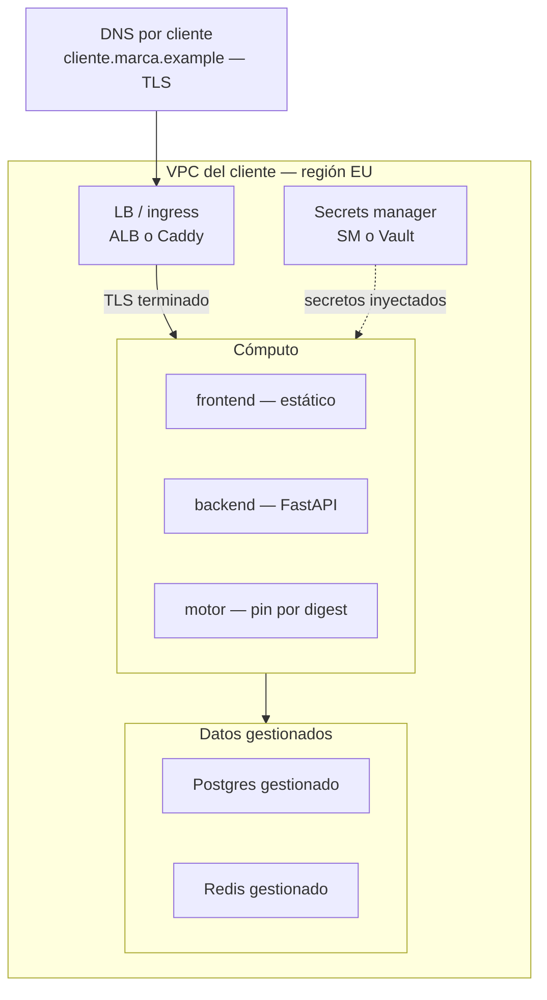
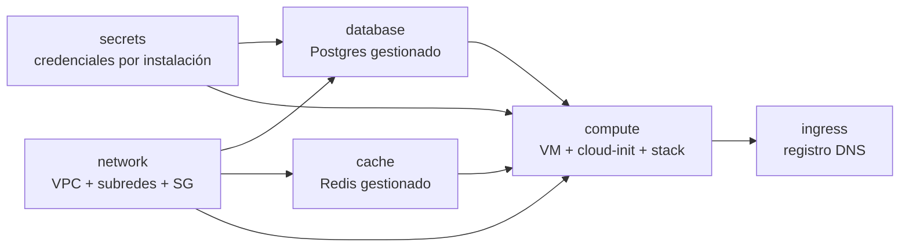
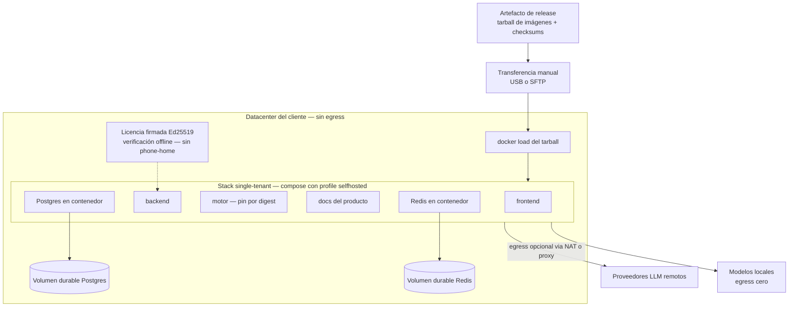

# Infraestructura

Arquitectura de despliegue de la plataforma: red, datos, cómputo, secretos y TLS/DNS, tanto
en cloud como on-prem/air-gapped, y el módulo de infraestructura-como-código que la
provisiona por cliente. Complementa la [guía de instalación](index.md), que cubre el flujo
de punta a punta.

**Para quién**: el distribuidor que planifica y ejecuta el despliegue por cliente, y el
equipo de infraestructura del cliente final que aloja la instalación en su cuenta cloud o
su datacenter.

**Leyenda de estado**:

| Marca | Significado |
|---|---|
| 🟢 **HOY** | Implementado y verificable en la versión actual del producto |
| 🟡 **PARCIAL** | Existe la base, falta endurecerlo para producción |
| 🔵 **OBJETIVO** | Roadmap / estado-objetivo, no existe aún |

!!! note "Estado"
    Tres capas con madurez distinta. 🟢 El **stack de contenedores** de producción existe
    hoy: compose de producción con **4 servicios** (backend, frontend, motor, docs) — **6**
    con `--profile selfhosted`, que suma db y redis. 🟡 El **módulo de
    infraestructura-como-código** (OpenTofu) existe como código en el paquete de deploy y
    se valida en el gate del release (`tofu validate` + checks de aislamiento y de
    secretos), pero no es todavía el camino ejercitado del despliegue de referencia — hoy
    ese camino es una VM con el compose de producción. 🔵 El **plano de datos gestionado**
    en operación real y el **secrets manager con servidor** siguen siendo estado-objetivo.

## Topología objetivo en cloud

La instalación de cada cliente vive en **su propia VPC**, en región EU. El tráfico entra
por un único punto (LB/ingress con TLS terminado), el cómputo corre el stack de
contenedores, y los datos viven en servicios gestionados en subredes privadas. Los
secretos se generan por instalación y se inyectan al arrancar.



El flujo: el dominio por cliente resuelve al LB/ingress, que termina TLS y enruta al
cómputo (frontend estático, backend FastAPI y el motor pinneado por digest); el cómputo
consume Postgres y Redis gestionados en subredes privadas; el secrets manager (o el
mecanismo sin servidor, ver [Secretos](#secretos-por-instalacion)) inyecta las
credenciales como variables de entorno al arrancar.

## Componentes

### Red

VPC dedicada del cliente, subredes privadas para cómputo/datos, sólo el LB expuesto.
Región **EU** por defecto (residencia de datos).

Lo que define el módulo `network` 🟡 (código validado, ver
[el módulo por dentro](#el-modulo-iac-por-dentro)):

- **VPC propia** con un CIDR privado dedicado (`10.40.0.0/16`), DNS interno habilitado.
- **Subredes públicas y privadas en 2 zonas de disponibilidad** — los servicios de datos
  gestionados exigen un grupo de subredes multi-AZ.
- **Internet gateway** para las subredes públicas y **NAT gateway** para el egress de las
  privadas (el único egress necesario del cómputo: los proveedores LLM y, si aplica, el
  registry de imágenes).
- **Security group de la aplicación con SOLO el puerto 443 de entrada.** La base de datos
  y el cache aceptan tráfico únicamente **por referencia a ese security group** — no por
  CIDR: nada que no sea la app puede abrirles conexión.

*Excepción acotada*: la ruta del firewall de coding tools (clients de tipo `base_url`)
tiene **GDPR-routing = N/A** — no se fuerza endpoint EU en esa ruta; la garantía se
traslada a masking/audit/allowlist (excepción documentada del principio de residencia EU).

### Datos gestionados (cloud)

**Postgres** (RDS / Cloud SQL / Azure DB) y **Redis** (ElastiCache / MemoryStore)
gestionados en vez de los contenedores `postgres:16-alpine`/`redis:7-alpine` del compose.
Backups y HA quedan del lado del proveedor gestionado. 🔵 en operación real; el código que
los provisiona existe en el módulo 🟡:

- El módulo `database` crea un **Postgres 16 gestionado** en las subredes privadas con
  **storage cifrado**, **backups automáticos con 7 días de retención**, **snapshot final
  obligatorio** antes de cualquier destroy y **protección de borrado activada**. Su
  security group sólo acepta el puerto 5432 **desde el security group de la app**. La
  contraseña la genera el módulo de secretos — jamás un default.
- El módulo `cache` crea un **Redis gestionado** de un nodo en las mismas subredes
  privadas, con security group que sólo acepta el puerto 6379 desde la app.
- El backend y el motor los consumen simplemente cambiando las variables de conexión
  `POSTGRES_*`/`REDIS_*` — adiós al almacenamiento efímero del compose de desarrollo.

### Cómputo

- **v1 (hoy portable)**: una VM (EC2/GCE/Azure VM) corriendo `docker compose` con el
  stack, con **Caddy** al frente (**auto-TLS**, sin ALB) y secretos con **SOPS/age**
  (cifrados en el artefacto, **sin servidor** de secrets manager). Es el camino más corto
  y el que refleja el estado actual del producto. 🟡
- **v2 (objetivo)**: **k3s + Helm + Zarf** con las imágenes de producción. **No ECS/EKS**:
  ECS Anywhere **no corre air-gapped** y el modelo de entrega es on-prem/air-gapped → k3s
  (Kubernetes liviano) + Helm (charts) + Zarf (empaquetado/registry air-gapped). 🔵

El módulo `compute` implementa la v1 🟡: una VM Debian estable (imagen oficial del
proveedor), **disco raíz cifrado**, IP pública fija, y un arranque por **cloud-init** que
deja el producto corriendo por HTTPS sin intervención manual:

1. Escribe en el host el **compose de producción**, el **perfil renderizado del cliente**
   (entorno de instancia, branding y configuración del motor) y un archivo de secretos con
   **permisos 0600 de root** — nada de secretos en los logs de cloud-init.
2. Escribe la configuración de **Caddy**: termina TLS en 443 con auto-HTTPS y enruta las
   rutas de API (`/api/*`) al backend y todo lo demás al frontend estático.
3. Si la instalación es air-gapped (`image_source = tarball`), **carga las imágenes desde
   el bundle** con `docker load` en lugar de hacer pull de un registry.
4. Levanta el stack completo (`docker compose up -d` con el compose de producción más el
   overlay de ingress).

### Secretos por instalación { #secretos-por-instalacion }

Cada instalación genera **sus propios secretos** (aleatorios, fuertes); jamás se comparten
entre clientes ni se versionan en claro.

- **Generación por instalación** 🟡: el módulo `secrets` genera en cada provisión la
  contraseña de Postgres, la clave maestra del motor, `JWT_SECRET_KEY`,
  `FERNET_SECRET_KEY` (derivada al formato de 32 bytes url-safe base64 que exige Fernet) y
  la **credencial admin de bootstrap**. Todos los valores son aleatorios y quedan marcados
  como sensibles; viven en el **state remoto, que por eso debe estar CIFRADO**. La
  credencial de bootstrap se emite **una sola vez** y es **rotable** por recurso (ver
  [el módulo por dentro](#el-modulo-iac-por-dentro)).
- En **cloud**, el estado-objetivo es un **secrets manager con servidor** (AWS Secrets
  Manager / GCP Secret Manager / HashiCorp Vault) proveyendo `POSTGRES_PASSWORD`, la clave
  maestra del motor, `FERNET_SECRET_KEY`, `JWT_SECRET_KEY` y las keys de proveedor LLM,
  inyectadas como variables de entorno al arrancar. 🔵
- En **v1 / air-gapped** (sin un secrets manager gestionado) la alternativa es **SOPS/age**:
  los secretos viajan **cifrados en el artefacto** y se descifran al desplegar, **sin
  servidor**. Así viajan hoy el archivo de licencia y las keys de proveedor dentro del
  perfil del cliente. 🟡
- En cualquier caso, **nunca** el `.env` en claro con los defaults inseguros del compose
  de desarrollo: rotá **todos** los valores por defecto antes de exponer la instalación.
- Cifrado en reposo 🟢: `FERNET_SECRET_KEY` cifra en reposo los secretos de servicio y la
  referencia de credencial OAuth (`oauth_credential_ref`) de la ruta
  `subscription-passthrough`.

### TLS + DNS por cliente

Certificado + dominio propio del cliente terminando en el LB/ingress. El módulo `ingress`
🟡 crea el **registro DNS tipo A** del dominio del producto apuntando a la IP fija de la
VM; el dominio **deriva del slug del cliente** y el TLS lo termina **Caddy en la VM**
(auto-HTTPS, sin gestión manual de certificados). En el objetivo cloud completo, un ALB o
equivalente puede asumir esa terminación. 🔵

## El módulo IaC por dentro { #el-modulo-iac-por-dentro }

El paquete de deploy incluye un módulo de infraestructura-como-código que provisiona todo
lo anterior **por cliente**. Se ejecuta con **OpenTofu** (`tofu`), no con Terraform: el
distribuidor **entrega el IaC a terceros** y la licencia de Terraform es BSL; OpenTofu es
el fork MPL drop-in (mismos `.tf`, mismo flujo). 🟡 El módulo existe como código y se
valida en el gate del release; el camino ejercitado de despliegue hoy sigue siendo la VM
con compose.

**Principio: un cliente = un workspace.** Cada cliente del distribuidor vive en un
**workspace propio** con **state aislado** y un **prefijo de recursos derivado del slug**
del tenant — dos clientes del mismo distribuidor no comparten state ni pueden colisionar
en nombres de recursos.

Composición y dependencias de los seis submódulos:



| Módulo | Qué crea |
|---|---|
| `network` | VPC dedicada, subredes públicas/privadas en 2 AZs, internet gateway, NAT para el egress, security group de app con sólo 443 de entrada |
| `secrets` | Los secretos de la instalación: contraseña de Postgres, clave maestra del motor, secretos JWT/Fernet y credencial admin de bootstrap — aleatorios, sensibles, cero defaults |
| `database` | Postgres 16 gestionado en privadas: storage cifrado, backups 7 días, snapshot final, protección de borrado, acceso sólo desde el SG de la app |
| `cache` | Redis gestionado en privadas, acceso sólo desde el SG de la app |
| `compute` | VM Debian con disco cifrado e IP fija; cloud-init escribe perfil + secretos (0600) + Caddy y levanta el compose de producción |
| `ingress` | Registro DNS del dominio del producto (derivado del slug) apuntando a la IP de la VM |

**Guard de residencia EU.** La región por defecto es EU (`eu-central-1`). Si se apunta a
una región fuera de EU, **el apply falla** — salvo override explícito y auditable con
`allow_non_eu=true`. La residencia EU es el default que hay que decidir romper, no al
revés.

**Flujo por cliente** (backend de state remoto **cifrado**, workspace por slug, perfil
renderizado del cliente):

```bash
cd deploy/terraform
tofu init            # backend de state remoto CIFRADO
tofu workspace new <slug-cliente>        # state AISLADO por cliente
tofu apply -var-file=envs/<slug-cliente>/<slug-cliente>.tfvars
tofu output product_url
tofu output -raw admin_bootstrap         # se emite UNA vez
```

- **Credencial admin de bootstrap**: se emite **una sola vez** por output sensible;
  rotarla es `tofu apply -replace` del recurso que la genera — no hay valores fijos que
  memorizar ni reutilizar.
- **Actualización de imágenes**: publicar el release, pegar los **digests** nuevos en el
  `tfvars` del cliente y correr `tofu apply` — la VM recrea el stack con las imágenes
  nuevas. Las imágenes viajan siempre **pinneadas por digest**.
- **Air-gapped**: con `image_source = tarball` el mismo módulo instala desde el bundle de
  imágenes en lugar de un registry.
- **Camino v2**: cuando llegue k3s+Helm+Zarf, se **reemplaza sólo el módulo `compute`** —
  network, database, cache, secrets e ingress quedan intactos. 🔵

## On-prem / air-gapped

El mismo código corre single-tenant en el datacenter del cliente, sin depender de
servicios cloud:



- **Artefacto**: tarball con todas las imágenes pinneadas por digest (incluido el sitio de
  documentación, `sentinel-docs:<brand>-<version>`) + checksums, que se mueve al host destino
  (USB/SFTP) y se carga con `docker load`. 🔵
- **Stack**: el compose de producción con `--profile selfhosted` levanta los **6**
  servicios (backend, frontend, motor, docs, db y redis). 🟢
- **Storage durable**: sin servicios gestionados, Postgres y Redis corren en contenedor
  con **volumen durable** en el host; los backups pasan a ser responsabilidad del
  operador.
- **Egress**: el único egress necesario es hacia los proveedores LLM (vía NAT/proxy). Con
  **modelos locales** (Ollama/vLLM en la lista de modelos del perfil) el egress es
  **cero**.
- **Licencia**: la verificación de licencia es **100% offline** — jamás llama a casa. Ver
  [Licenciamiento](licensing.md).
- **Camino v2**: paquete **Zarf** (bundle con SBOM + firma cosign). 🔵

!!! tip "Gotcha relacionado"
    En redes sin egress, `git clone` y `docker pull` fallan y los proveedores LLM remotos
    no son alcanzables — ver los
    [gotchas de instalación](index.md#gotcha-egress).

## Límites

- **Residencia EU con una excepción documentada** — la ruta de coding tools tipo
  `base_url` tiene GDPR-routing = N/A; la garantía en esa ruta es masking/audit/allowlist,
  no el endpoint EU.
- **Aislamiento multi-tenant en cloud** 🟡 — el aislamiento por filas (RLS) está cableado
  en el esquema, pero el contexto por request no se establece aún: el aislamiento efectivo
  hoy es a nivel de aplicación. Para instalaciones single-tenant (on-prem) esto no aplica:
  hay un solo tenant por instalación.
- **Módulo IaC no ejercitado end-to-end** 🟡 — validado en el gate del release, pero el
  despliegue de referencia actual corre por el camino VM + compose de producción.
- **Secrets manager con servidor** 🔵 — hoy los secretos generados viven en el state
  remoto cifrado y se inyectan por entorno; la integración con un secrets manager
  gestionado es estado-objetivo.
- **Datos gestionados en operación** 🔵 — el código de provisión existe, pero la operación
  de referencia actual usa contenedores con volumen durable.

## Relacionado

- [Guía de instalación](index.md) — el flujo de instalación de punta a punta, los
  deliverables por cliente y los gotchas verificados en despliegues reales.
- [Licenciamiento](licensing.md) — verificación offline fail-closed apta para air-gap, y
  la postura de IP del artefacto instalado.
- [Operaciones & troubleshooting](../operations/index.md) — chequeos de salud del stack
  desplegado y gotchas operativos síntoma → causa → fix.
- [White-label & branding](../white-label/index.md) — el perfil por cliente y el branding
  pack que el despliegue consume como configuración, nunca como fork.
