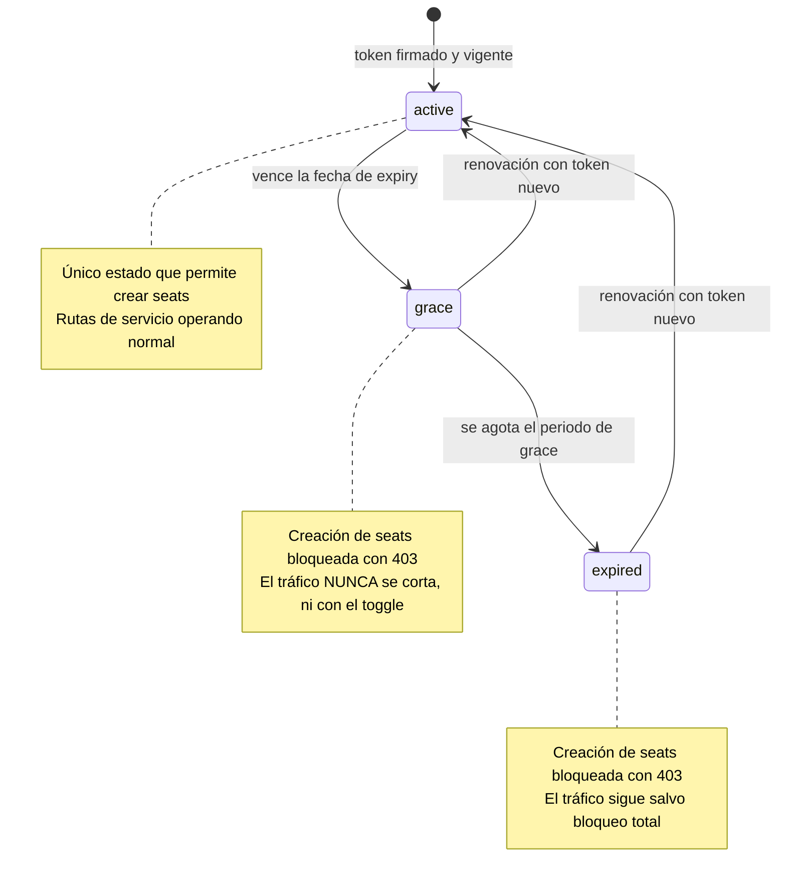
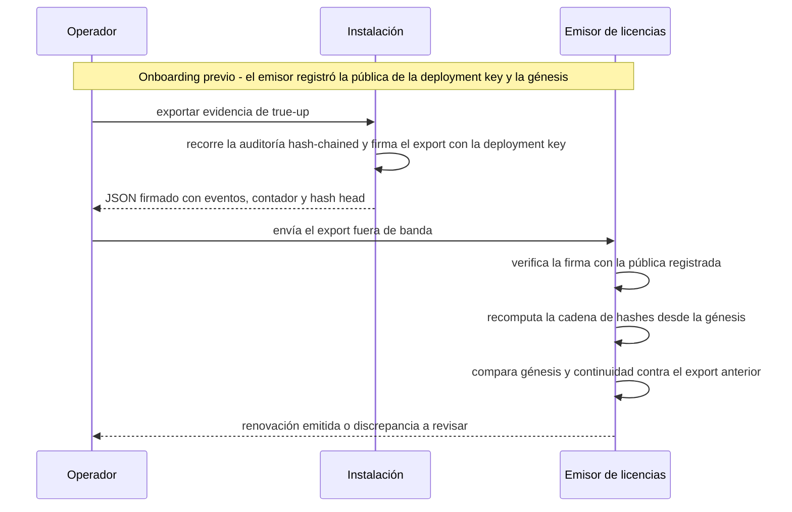

# Licenciamiento

Licenciamiento offline por seats — verificación de firma al arranque, gate de altas
fail-closed, ciclo de vida con periodo de gracia, evidencia de true-up firmada — y la postura
oficial de IP del artefacto instalado. Complementa la [guía de instalación](index.md).

**Para quién**: el **operador** que configura y renueva la licencia de una instalación, y el
**distribuidor/preventa** que necesita la respuesta canónica sobre protección del artefacto.

**Leyenda de estado**:

| Marca | Significado |
|---|---|
| 🟢 **HOY** | Implementado y verificable en la versión actual del producto |
| 🟡 **PARCIAL** | Existe la base, falta endurecerlo para producción |
| 🔵 **OBJETIVO** | Roadmap / estado-objetivo, no existe aún |

!!! success "Implementado hoy"
    🟢 **Todo lo de esta página es capacidad entregable hoy**: el licenciamiento offline
    está implementado y en **enforcement fail-closed** en la versión actual — verificación
    Ed25519 al arranque, gate de seats en las altas, estados de licencia, hard block
    opcional, endpoint de salud y auditoría encadenada. Sin phone-home. La
    [postura de IP del artefacto](#postura-ip) aplica además como postura de producto.

## Ciclo de vida de la licencia

La licencia atraviesa tres estados con el **reloj local** del despliegue: `active` mientras
no venció, `grace` durante el periodo de gracia posterior al vencimiento y `expired` cuando
el grace se agota. El **bloqueo total** (hard block) no es un cuarto estado sino un *modo*
que el operador activa por entorno: endurece `expired` y `over_seat` cortando también las
rutas de servicio del gateway.



El bloqueo total **no es un cuarto estado**: es el toggle de entorno
`SENTINEL_LICENSE_HARD_BLOCK`, que no cambia el estado de la licencia sino lo que ese
estado *hace*. Y no aplica solo a `expired` — `over_seat`, que publica la
reconciliación, recibe el mismo trato:

| Condición | Toggle apagado (default) | Toggle encendido |
|---|---|---|
| `grace` | Altas bloqueadas (403) · tráfico sigue | Igual — el grace **jamás** corta tráfico |
| `expired` | Altas bloqueadas (403) · tráfico sigue | Rutas de servicio del gateway cortadas (403) |
| `over_seat` | Altas bloqueadas (403) · tráfico sigue | Rutas de servicio del gateway cortadas (403) |

En los dos casos de corte, el *discovery* (`GET /gw`) queda abierto para diagnóstico.

Puntos clave del ciclo, todos 🟢:

- **Las transiciones ocurren en caliente.** Un job periódico de reconciliación re-evalúa el
  estado con el reloj local: un proceso vivo transiciona `active → grace → expired` **sin
  reinicio**. Con la licencia en fichero, reemplazarlo por el token renovado también se
  aplica en el siguiente tick, sin reiniciar.
- **`grace` avisa, no castiga.** En grace la renovación urge, pero el cliente opera: se
  bloquean las altas y el tráfico existente sigue — el bloqueo total **jamás** aplica en
  grace, ni siquiera con el toggle activo.
- **Estados degradados = mismo trato que no-activo.** Token ausente (`missing`), corrupto o
  con firma inválida (`invalid`) o emitido para otro tenant (`mismatch`) bloquean la
  creación igual que `grace`/`expired`: fail-closed — "sin token" jamás significa
  "ilimitado". El backend **arranca igual** en cualquiera de estos estados (una licencia
  vencida degrada el servicio, nunca lo mata) y deja el motivo en logs y auditoría.

## Modelo de licenciamiento offline

- **Seat = Connection activa.** Un seat consumido = una `APIKey` **activa y no expirada**
  para el tenant. El conteo de seats se deriva del propio esquema de datos del producto, no
  de un servicio externo. **El seat no es el usuario**: desactivar un usuario client **no**
  libera seats; revocar sus Connections **sí**.
- **Licencia Ed25519 firmada, verificada offline al arranque.** El fabricante firma con su
  clave privada un artefacto de licencia (tenant/slug, N seats, fecha de expiración, features
  habilitadas). El despliegue verifica la firma con la **clave pública** embebida — no puede
  falsificarse sin la clave privada del fabricante. El token crudo **nunca se persiste** en
  la base de datos: vive en memoria tras la verificación.
- **Gate de seats fail-closed en las altas.** `POST /api/v1/keys` y `POST /api/v1/users`
  pasan por el gate de licencia **antes de aprovisionar nada**: una request rechazada no
  crea filas ni toca el motor de análisis — solo deja el evento de auditoría del rechazo.
  Respuestas:
    - **402** con los seats agotados — el mensaje indica el remedio: revocar una Connection
      o ampliar la licencia.
    - **403** si la licencia no está activa (ausente, inválida, de otro tenant, en grace o
      expirada), si la reconciliación publicó `over_seat` para el tenant, o si se sospecha
      un rollback de reloj.
- **Reconciliación periódica.** Un job (intervalo configurable, default 300 s) recuenta los
  seats activos contra el tope de la licencia y publica `over_seat` si hay drift: la
  creación queda bloqueada hasta que una corrida posterior vuelva a `ok`. El mismo tick
  re-evalúa el ciclo de vida (transiciones de estado en caliente).
- **Anti-rollback de reloj.** La reconciliación mantiene una **marca monotónica**: si el
  reloj local aparece *detrás* de la marca, la evidencia deja de ser confiable — la creación
  se degrada hasta que el reloj supere la marca y el episodio queda auditado.
- **Hard block opcional.** Con `SENTINEL_LICENSE_HARD_BLOCK=true`, además de bloquear las altas,
  `expired` y `over_seat` **cortan las rutas de servicio del gateway** — mensajes, conteo de
  tokens, modelos, identidad e inspección bajo `/api/v1/gw/...` responden 403. El discovery
  (`GET /api/v1/gw`) queda abierto para diagnóstico, y el mensaje al cliente es **fijo y
  genérico**: el corte corre antes de resolver identidad, así que jamás se filtra estado
  interno (seats, expiry) a un caller sin autenticar.
- **Salud de la licencia.** `GET /api/v1/health/license` responde en dos niveles: el tier
  **anónimo** devuelve sólo `{status, clock_rollback_suspected}`; admin y compliance officer
  ven el detalle completo. Ver [Verificar el estado](#verificar-el-estado).
- **Auditoría hash-chained + true-up firmado.** Los eventos de licenciamiento (transiciones
  de estado, rechazos por tope, `over_seat`, rollback de reloj) quedan en una auditoría
  **encadenada por hash** y la renovación se apoya en un **true-up firmado** — el rastro
  verificable que ancla la postura de IP. Ver [True-up y renovación](#true-up).
- **Sin phone-home.** La verificación es **100% offline**: apta para on-prem y air-gapped.
  Jamás llama a casa — no hay llamada de vuelta al fabricante ni se filtran datos de uso del
  cliente. Coherente con el modelo de entrega: el fabricante no opera servidores del
  cliente. Ver [Infraestructura](infrastructure.md) para la topología air-gapped.

## Configurar la licencia en el despliegue

El despliegue inyecta **configuración, no builds**: la misma imagen opera para cualquier
cliente cambiando solo estas variables de entorno. Bloque de referencia para el compose de
producción (placeholders — reemplazar por los valores del despliegue):

```yaml
environment:
  # Token de licencia: por fichero (recomendado, la renovación se aplica en
  # caliente) o inline con SENTINEL_LICENSE_TOKEN.
  SENTINEL_LICENSE_TOKEN_FILE: /app/config/licenses/<cliente>.lic
  # Keyset de claves públicas del emisor; si se omite se usa el embebido.
  SENTINEL_LICENSE_PUBLIC_KEYS_FILE: /app/config/licenses/<keyset-publico>.pem
  # Tenant del deployment: debe coincidir con el tenant del token.
  SENTINEL_DEPLOYMENT_TENANT_ID: <tenant-id-del-deployment>
  # Intervalo de la reconciliación en segundos; un valor <= 0 desactiva el job.
  SENTINEL_LICENSE_RECONCILE_INTERVAL_SECONDS: "300"
  # true = expired / over_seat cortan también las rutas de servicio del gateway.
  SENTINEL_LICENSE_HARD_BLOCK: "false"
  # Clave privada del deployment para firmar los exports de true-up:
  # volumen persistente, JAMÁS versionada.
  SENTINEL_DEPLOYMENT_KEY_FILE: /app/config/licenses/deployment_key.pem
volumes:
  - ./licenses:/app/config/licenses
```

Notas de operación, todas 🟢:

- **Fail-closed**: sin token válido el backend **arranca igual** pero bloquea la creación de
  seats (403). Un despliegue de producción necesita este bloque desde el día uno.
- **Licencias de demo**: los tokens de demostración (identificados por su key id de
  demostración) requieren el opt-in explícito `SENTINEL_ALLOW_DEV_LICENSE=true`. Sin el opt-in
  se rechazan como inválidos — **solo** para entornos dev/demo, nunca en producción.
- **Tolerancia a blips de I/O**: si en runtime el fichero de token o el keyset quedan
  momentáneamente ilegibles (una rotación de secret no atómica, un blip del volumen), un
  estado con firma ya validada **se conserva** durante unos pocos ticks de reconciliación en
  vez de degradar en falso; si la ilegibilidad persiste, fail-closed igual.
- **Rotación de claves del emisor**: el keyset soporta **múltiples key ids** — se publica un
  keyset con el id viejo y el nuevo, se emite con el nuevo y se retira el viejo cuando no
  queden licencias vivas firmadas con él.
- **Rotación de la deployment key**: se regenera en la instalación y se re-registra la
  pública con el emisor; la génesis de la cadena **no cambia** y la continuidad de los
  exports se preserva.

## Verificar el estado { #verificar-el-estado }

Smoke de un despliegue recién configurado (en desarrollo, `http://localhost:8091`):

```bash
curl -s http://localhost:8091/api/v1/health/license
# → {"status":"active","clock_rollback_suspected":false}
```

Ese es el tier **anónimo**: suficiente para un probe de operación ("¿la licencia está
sana?") sin filtrar dimensionamiento. Autenticado con rol **admin** o **compliance
officer**, la misma ruta agrega el detalle completo: `reason`, `expiry`, `grace_days`,
`max_seats`, `seats_used`, el bloque `chain` (génesis efectiva de la cadena de auditoría,
anclaje y contador de eventos — lo que el onboarding debe registrar) y el resumen de la
última reconciliación por tenant.

`GET /health`, en cambio, es una respuesta **estática de liveness** — no verifica licencia
ni base de datos; para licencia, siempre `/api/v1/health/license`.

## True-up y renovación { #true-up }

La renovación se apoya en evidencia **firmada y encadenada** que el operador exporta de la
instalación y el emisor verifica offline. En el onboarding el emisor registró dos anclas:
la **clave pública** de la deployment key y la **génesis** (el `license_id` inicial de la
cadena).



Del lado del operador es un comando:

```bash
docker compose exec backend python scripts/generate_trueup.py > trueup-$(date +%F).json
```

El JSON viaja al emisor **fuera de banda** (correo, portal del distribuidor — no hay canal
de red del producto hacia el fabricante). La verificación del emisor comprueba tres cosas:

1. **Firma** del export con la pública de la deployment key registrada en el onboarding.
2. **Cadena**: recomputa los hashes de todos los eventos desde la génesis — cualquier evento
   alterado o eliminado rompe la cadena.
3. **Continuidad** contra el export anterior (anti-truncado): el contador y el hash head del
   export previo deben aparecer intactos dentro del nuevo — no se puede "olvidar" historia
   entre renovaciones.

**Génesis efectiva**: la reporta `/api/v1/health/license` (tier admin, campo `chain`). Si el
**primer arranque** fue sin licencia (estado soportado), la génesis queda `unlicensed` y la
cadena se ata al primer `license_id` con firma válida mediante un evento de **anclaje de
génesis**; la verificación acepta una génesis `unlicensed` **solo** con ese anclaje
apuntando al `license_id` del onboarding y sin eventos licenciados previos. El emisor
registra el `license_id` emitido; no hace falta coordinar nada más.

## Postura de IP del artefacto — respuesta canónica a "¿qué protección tiene la imagen instalada?" { #postura-ip }

Pregunta recurrente del ciclo de venta on-prem (hospitales incluidos): *"el equipo de IT del
cliente va a abrir la imagen y mirar el código — ¿qué protección tienen?"*. Respuesta oficial
de producto; usarla tal cual en training y preventa — es postura, **aplica hoy**.

**Lo que se responde (tres capas):**

1. **La imagen copiada no trabaja.** El producto exige una licencia firmada (Ed25519,
   offline) atada al tenant: sin licencia activa no da de alta Connections ni usuarios y el
   hard block corta las rutas de servicio (fail-closed 🟢, implementado hoy); moverla a otro
   sitio deja rastro verificable en la renovación (true-up firmado + auditoría
   hash-chained, 🟢).
2. **El contrato es el ancla.** EULA vía distribuidor con no-reverse-engineering,
   no-redistribución y derechos de auditoría — el mismo modelo con el que operan GitLab EE
   (cuyo código enterprise es literalmente público), Grafana Enterprise o Metabase EE. El
   estándar on-prem del mercado es ese: el código se puede ver; usarlo sin licencia es
   incumplimiento contractual.
3. **El valor está en el stream, no en el código congelado.** Librería de compliance viva
   (AI Act, recognizers por región), parches, certificación y soporte del fabricante. Una
   copia es un producto de compliance congelado, sin licencia ni respaldo — exactamente lo
   que un DPO de entorno regulado no puede firmar.

**El giro a favor**: que el hospital inspeccione la imagen es *bueno para la venta* — va a
verificar que el sistema **no exfiltra nada** (0 egress en air-gap, auditoría metadata-only,
sin phone-home). La transparencia de comportamiento es argumento de confianza; ofrecerla
proactivamente (SBOM en v2 vía Zarf — ver [Infraestructura](infrastructure.md)).

**Lo que NO se promete jamás**: código "protegido", "encriptado" u ofuscado como mecanismo de
seguridad. Técnicamente no existe en hardware del cliente (una imagen se abre con dos
comandos; Python se descompila) y prometerlo deja mal parado al canal ante el primer pentest
del propio cliente. Si el canal pide "algo más", existe un pack de **fricción** opcional
(imágenes sin fuentes ni tests, bytecode) — se ofrece como prolijidad del artefacto, nunca
como protección.

## Límites conocidos

- 🟢 **Enforcement fail-closed completo** en la versión actual: verificación offline,
  gate 402/403, ciclo de vida en caliente, hard block, salud en dos niveles, auditoría
  encadenada, true-up y anti-rollback de reloj — todo lo descrito arriba.
- 🟡 **Aislamiento por tenant del gate**: el entitlement queda anclado al tenant del
  deployment y el gate rechaza altas para un tenant sin entitlement; en la versión actual
  (despliegues single-tenant) todas las altas caen en el tenant del despliegue, así que el
  enforcement **por-tenant** fino se vuelve efectivo cuando el despliegue opera múltiples
  tenants reales.
- 🟡 **Detalle de salud por rol**: el tier detallado responde a admin y compliance officer;
  no hay aún un tier intermedio para usuarios client autenticados (ven lo mismo que el
  anónimo, por diseño conservador).

## Relacionado

- [Instalación](index.md) — dónde encaja el bloque de licencia en el compose de producción
  y en el checklist de verificación del despliegue.
- [Infraestructura](infrastructure.md) — la topología on-prem/air-gapped donde la
  verificación offline es requisito, no opción.
- [Administración](../administration/index.md) — Connections, usuarios y roles: el objeto
  que consume seats y quién ve el detalle de la licencia.
- [Compliance](../compliance/index.md) — el marco de auditoría del producto al que
  pertenecen los eventos encadenados de licenciamiento.
