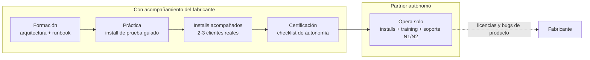

# Partner enablement

Programa de capacitación y certificación para que un **partner** nuevo (en esta
documentación, también «distribuidor») llegue a instalar y operar el producto **de
forma autónoma** bajo su propia marca: qué perfil necesita su ingeniero, por qué
etapas pasa, qué provee cada parte en cada etapa y con qué criterios se certifica la
autonomía.

**Para quién**: el ingeniero del partner que va a ser responsable de las
instalaciones, y el responsable del partner que decide asignar la dedicación de su
equipo al programa.

**Leyenda de estado** (se usa en toda la documentación):

| Marca | Significado |
|---|---|
| 🟢 **HOY** | Implementado y verificable en la versión actual del producto |
| 🟡 **PARCIAL** | Existe la base, falta endurecerlo para producción |
| 🔵 **OBJETIVO** | Roadmap / estado-objetivo, no existe aún |

---

## El programa en una vista

El camino completo va de cero a partner autónomo en cuatro etapas. El fabricante
acompaña fuerte al principio y se retira gradualmente; al certificarse, el partner
opera solo y el fabricante queda únicamente en la emisión de licencias y la
escalación de bugs de producto.

La lógica del programa: **la autonomía se certifica con evidencia, no se declara por
tiempo transcurrido**. Cada etapa tiene un criterio de salida verificable; no se
avanza por calendario sino por capacidad demostrada.

---

## Prerequisitos del ingeniero del partner

El programa asume un perfil técnico base; **no es un curso de las tecnologías
subyacentes**. Si el perfil no está completo, la etapa de formación se alarga en
proporción.

Perfil requerido:

- **Contenedores**: manejo cotidiano de Docker y Docker Compose (levantar stacks,
  leer logs, ejecutar comandos dentro de contenedores).
- **Infraestructura como código (básico)**: leer y aplicar un módulo parametrizado
  (el producto usa OpenTofu; alcanza con experiencia en cualquier IaC declarativo).
- **SQL básico**: ejecutar consultas y updates puntuales contra PostgreSQL (algunos
  pasos operativos del producto hoy son por SQL — ver los
  [gotchas de instalación](index.md#gotchas-de-instalacion-verificados)).
- **Shell / línea de comandos**: soltura con scripts, variables de entorno y
  transferencia de archivos (SFTP/USB para el camino air-gapped).
- **Acceso a la infra objetivo**: según el mercado del partner, acceso cloud (cuenta
  propia o del cliente) o acceso a la red on-prem del cliente.

---

## Las etapas

### 1 · Formación

- **Objetivo**: que el ingeniero entienda el producto y el modelo de entrega antes de
  tocar una instalación real.
- **Actividades**: arquitectura de tres capas, modelo de entrega
  fabricante→partner→cliente, recorrido completo del
  [flujo de instalación](index.md), modelo de
  [licenciamiento offline](licensing.md), módulo de compliance y los gotchas
  verificados.
- **Provee el fabricante**: el material — esta documentación completa — y las
  sesiones de formación.
- **Provee el partner**: el ingeniero con el perfil requerido y su dedicación.
- **Criterio de salida**: el ingeniero explica el flujo de instalación de punta a
  punta y el ciclo de licencia sin leer el runbook.
- **Duración típica**: 2–4 días (estimado).

### 2 · Práctica en entorno de prueba

- **Objetivo**: un install completo de práctica, guiado, sin cliente real.
- **Actividades**: armar un perfil de cliente desde el ejemplo, renderizarlo,
  desplegar con el compose de producción, sembrar tenant y clients, instalar una
  licencia de demo, correr el smoke test completo.
- **Provee el fabricante**: el perfil de ejemplo, los artefactos de release y una
  licencia de entorno de prueba.
- **Provee el partner**: el entorno (una VM o equivalente) y el tiempo del ingeniero.
- **Criterio de salida**: instalación de práctica funcionando, smoke test verde,
  ejecutado por el ingeniero del partner con guía del fabricante.
- **Duración típica**: ~1 día (estimado).

### 3 · Installs acompañados (2–3 clientes reales)

- **Objetivo**: transferir la operación real con red de seguridad.
- **Actividades**: el **primer install real lo lidera el fabricante** con el
  ingeniero del partner ejecutando; el segundo y tercero los **lidera el partner**
  con el fabricante revisando. Cubren el camino de despliegue que el partner va a
  operar en su mercado real (cloud, on-prem o air-gapped — el programa se adapta al
  camino, no al revés).
- **Provee el fabricante**: acompañamiento y revisión, más la licencia firmada de
  cada cliente.
- **Provee el partner**: los clientes reales y la ejecución.
- **Criterio de salida**: 2–3 instalaciones reales completadas, las últimas lideradas
  por el partner.
- **Expectativa honesta**: los primeros installs reales toman **2–3×** el tiempo de
  un install maduro (estimado) — es curva de aprendizaje esperada, no un problema.

### 4 · Certificación de autonomía

- **Objetivo**: cierre formal — verificar el checklist de autonomía punto por punto.
- **Provee el fabricante**: la revisión del checklist y el alta del partner como
  autónomo.
- **Criterio de salida**: checklist completo (ver abajo).
- **Duración típica**: ~medio día (estimado).

**Duración típica del programa completo: entre una semana y media y tres semanas**
(estimado), dependiendo del perfil de entrada del ingeniero y del camino de
despliegue del mercado del partner (air-gapped suma logística).

---

## Checklist de autonomía

El partner queda certificado cuando su ingeniero demuestra, sobre instalaciones
reales, que puede:

- [ ] Armar un perfil de cliente desde cero y renderizarlo sin errores.
- [ ] Desplegar por el camino de su mercado (cloud / on-prem / air-gapped) hasta el
      stack completo levantado.
- [ ] Sembrar tenant y clients, instalar la licencia del cliente y registrar los
      datos de onboarding que pide el [licenciamiento](licensing.md).
- [ ] Ejecutar el smoke test completo y validar masking/bloqueo en vivo.
- [ ] Diagnosticar los síntomas frecuentes con el
      [runbook de operaciones](../operations/index.md) sin escalar al fabricante.
- [ ] Enumerar los gotchas verificados de instalación y sus fixes.
- [ ] Configurar las [superficies de integración](../integrations/index.md) que usan
      los usuarios finales de su cliente.

---

## Después de la certificación: quién hace qué

| Queda del lado del **partner** | Queda siempre del lado del **fabricante** |
|---|---|
| Instalar clientes nuevos (solo) | Emitir y renovar licencias firmadas |
| Training a los usuarios de su cliente | Publicar releases y artefactos |
| Soporte de primer y segundo nivel | Bugs de producto escalados |
| Gestión de seats y renovaciones con su cliente | Evolución del producto y su documentación |

El canal post-certificación es simple: el partner escala **sólo bugs de producto**;
todo lo demás lo resuelve con esta documentación.

---

## Documentación para el cliente final

Además de esta documentación (que es **suya**, del partner/operador), el entregable de
una instalación incluye un **sitio de documentación para el cliente final**: guía del
administrador de la organización (altas de usuarios y equipos, llaves virtuales,
presupuestos, modelos, auditoría y políticas) y guía del usuario (asistente seguro,
protección de datos, conexión de aplicaciones por API, extensión del navegador).

Características del sitio de cliente:

- **Separado por construcción de este sitio**: no contiene material de operación,
  licenciamiento ni programa de partners. Lo que usted está leyendo nunca se entrega
  al cliente.
- **Con la marca del cliente**: se genera desde la misma fuente marca-neutra con un
  overlay derivado del brand-pack del perfil (`profile/brand.json` del bundle).
- **Offline**: funciona sin red y desde `file://` (se entrega como zip o desplegado
  junto al stack), con búsqueda incluida.
- Las capturas de pantalla se toman de una instalación real con datos ficticios.

El partner entrega este sitio al administrador del cliente durante el install y lo usa
como material del training de usuarios.

---

## Límites y estado

- 🟢 **El material de soporte del programa existe hoy**: el
  [runbook de instalación](index.md) de punta a punta, el perfil de cliente de
  ejemplo, el compose de producción reproducible y el
  [runbook de operaciones](../operations/index.md).
- 🟡 **El programa como proceso formal está en formalización**: las etapas y
  criterios de esta página son el camino oficial, pero el programa todavía no corrió
  completo con un partner real — las duraciones son estimaciones y se ajustarán con
  los primeros onboardings.
- 🔵 **Certificación con artefacto formal** (constancia/registro de partners
  certificados): estado-objetivo, no existe aún.
- 🟡 **El sitio de documentación del cliente final existe** (fuente `docs-cliente/`
  del repo) pero su generación todavía no está integrada al pipeline de release: por
  ahora se construye y brandea a mano por instalación.

---

## Relacionado

- [Install / Deploy](index.md) — el flujo de instalación de punta a punta que el
  programa enseña, con sus deliverables y gotchas verificados.
- [Licenciamiento](licensing.md) — el ciclo de licencia offline cuyo onboarding y
  renovación el partner ejecuta del lado del cliente.
- [Operaciones & troubleshooting](../operations/index.md) — el runbook día-2 con el
  que el partner da soporte de primer y segundo nivel.
- [Integraciones & matriz](../integrations/index.md) — las superficies que el partner
  configura para los usuarios finales de su cliente.
