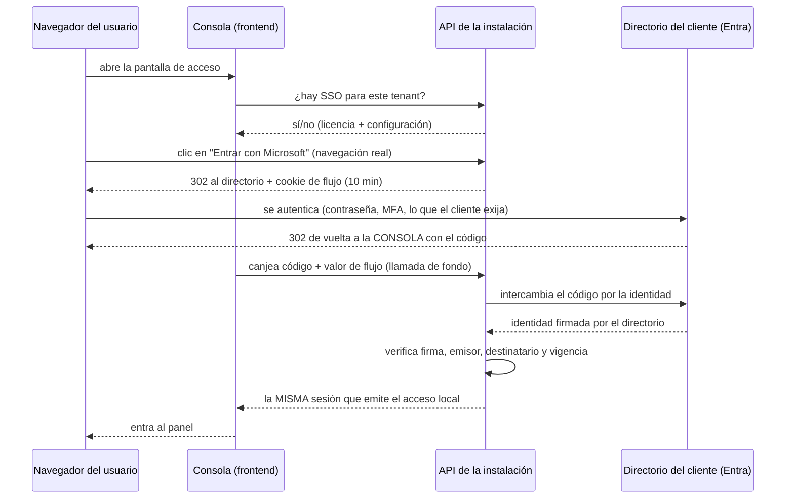

# Inicio de sesión con el directorio corporativo (SSO)

Cómo se instala el acceso a la consola con las cuentas del directorio del cliente
(Microsoft Entra ID, OpenID Connect): qué datos hay que pedirle al cliente, cómo se
registra la URI de retorno en **su** directorio, cómo se carga la configuración en la
instalación y por qué el acceso con usuario y contraseña **no se apaga nunca**.
Complementa la [guía de instalación](index.md).

**Para quién**: el **operador** que instala y el **distribuidor/preventa** que coordina
con el equipo de identidad del cliente. La parte del directorio la ejecuta el
administrador de Entra **del cliente**, no el fabricante.

**Leyenda de estado**:

| Marca | Significado |
|---|---|
| 🟢 **HOY** | Implementado y verificable en la versión actual del producto |
| 🟡 **PARCIAL** | Existe la base, falta endurecerlo para producción |
| 🔵 **OBJETIVO** | Roadmap / estado-objetivo, no existe aún |

!!! info "Alcance de esta versión"
    🟢 **Microsoft Entra ID** por OpenID Connect (*authorization code*), con descubrimiento
    automático del directorio y verificación de firma contra las claves públicas del propio
    directorio. 🔵 Google Workspace, Okta, Auth0, Keycloak y SAML 2.0 genérico siguen siendo
    roadmap: la consola los lista como **Próximamente** y no se comprometen en un despliegue.

## Lo que hay que reunir antes de empezar

Tres datos los da el cliente, uno lo aporta la licencia y uno lo decide la instalación.
Sin los cinco, el camino SSO no arranca.

| Qué | Quién lo da | Dónde vive |
|---|---|---|
| **Directory (tenant) ID** del directorio | Administrador de Entra del cliente | Configuración del tenant en la instalación |
| **Application (client) ID** de la aplicación registrada | Administrador de Entra del cliente | Configuración del tenant en la instalación |
| **Client secret** de esa aplicación | Administrador de Entra del cliente | Cifrado en la instalación — **jamás en claro** |
| **Flag `sso` en la licencia** | El fabricante, al emitir la licencia | Token de licencia firmado |
| **URI de retorno** (*redirect URI*) | La instalación — se **registra** en el directorio del cliente | Variable de entorno + app registration |

!!! warning "El perfil configura, la licencia autoriza"
    Cargar los tres datos **no** habilita nada por sí solo: la superficie SSO está detrás
    del flag `sso` de la licencia y es *fail-closed*. Sin ese flag, las rutas responden
    **403** y el botón de la pantalla de acceso **no se dibuja**. La configuración del
    tenant persiste igual — si más adelante se re-emite la licencia con el flag, el SSO
    empieza a operar sin volver a tocar nada. Ver [Licenciamiento](licensing.md). 🟢

## El flujo, de punta a punta

El directorio devuelve el navegador a la **consola**, no a la API: el usuario nunca
aterriza mirando una respuesta cruda. Es la consola la que canjea el código por la sesión
con una llamada de fondo, así el token de sesión viaja en el cuerpo de una respuesta y
**no por la barra de direcciones** —donde quedaría en el historial, en la cabecera
`Referer` y en los registros de cualquier proxy intermedio.



Dos consecuencias de instalación que salen de este dibujo:

- **La consola y la API se sirven desde el MISMO origen.** La consola llama a la API por
  rutas relativas y la cookie del flujo se emite en ese origen; separarlos en dos orígenes
  distintos rompe el retorno. En el despliegue estándar esto ya es así: el ingress publica
  la consola y la API bajo el mismo origen, enrutando `/api/*` al backend y el resto al
  contenedor que sirve la consola. 🟢
- **La sesión que emite el SSO es idéntica a la del acceso local.** Aguas abajo nada
  distingue una de otra: mismos roles, misma caducidad, misma auditoría. El SSO cambia
  *cómo se prueba la identidad*, no qué puede hacer después. 🟢

## 1. Registrar la aplicación en el directorio del cliente

Lo ejecuta el administrador de Entra **del cliente**, en su propio portal. El fabricante no
necesita —ni debe pedir— acceso al directorio.

1. **Registrar una aplicación** nueva en el directorio (*App registrations → New
   registration*).
2. **Agregar la URI de retorno bajo la plataforma «Web»**, con este valor exacto:

    ```
    https://<origen-de-la-consola>/sso/callback
    ```

3. **Generar un client secret** y anotar su **valor** (no su identificador) en el momento
   de crearlo — el portal deja de mostrarlo después.
4. Anotar el **Directory (tenant) ID** y el **Application (client) ID** de la página de
   resumen.

!!! danger "Plataforma «Web», nunca «Single-page application»"
    La URI apunta a una ruta que sirve la consola, así que la tentación es registrarla
    como SPA. **Es un error y falla en el canje, no en el acceso**: quien intercambia el
    código es el servidor de la instalación, con el client secret, no el navegador.
    Microsoft documenta que *«Applications can't use a `spa` redirect URI with non-SPA
    flows»*, y es explícito sobre el caso exacto de una instalación como esta:
    *«the Microsoft identity platform returns an error if you attempt to use a `spa`
    redirect URI **without** an `Origin` header»*. El canje lo hace el servidor, que no
    manda esa cabecera nunca — así que una URI marcada `spa` rompe justo ahí. Registrarla
    como **Web**, que es la categoría de los clientes confidenciales: *«It's required for
    web apps and web APIs, which can store the `client_secret` securely on the server
    side»*.

    La regla espejo —*«prevents the use of client credentials in all flows in the presence
    of an `Origin` header»*— es la del sentido contrario: castiga mandar el secreto
    **desde** el navegador. No es la que aplica acá, y conviene no confundirlas al
    diagnosticar.

!!! warning "El mismo texto, carácter por carácter, en tres lugares"
    El valor de la URI de retorno tiene que ser **idéntico** en los tres: lo registrado en
    el directorio, la variable de entorno de la instalación, y la ruta que sirve la
    consola. El protocolo exige que la URI del canje sea la misma que la del inicio, y la
    instalación manda **el mismo texto** en los dos pasos, leído de un solo lugar.

    Microsoft es explícito sobre la comparación: la URI *«must exactly match one of the
    redirect URIs you registered»*, y *«Redirect URIs are case-sensitive and must match the
    case of the URL path of your running application»*. Una barra final de más, una
    mayúscula distinta o un puerto que no coincide y el directorio corta con
    **`AADSTS50011`** — *«InvalidReplyTo - The reply address is missing, misconfigured, or
    doesn't match reply addresses configured for the app»*.

    La consola compara su ruta de retorno igual de literal: con una barra final de más el
    navegador vuelve a la pantalla de acceso normal, **sin mensaje de error**, como si no
    hubiera pasado nada. Es el modo de fallo más confuso de los dos.

Restricciones del directorio que conviene tener a mano al elegir el origen de la consola:

- **`https` obligatorio.** *«Redirect URIs must begin with the scheme `https`, with
  exceptions for some localhost redirect URIs»* — `http://` solo se acepta contra
  `localhost`, y **solo** para desarrollo.
- **Sin barra final agregada.** Como la URI lleva segmento de ruta (`/sso/callback`), el
  directorio **no** le agrega barra final: *«Redirect URIs that contain a path segment are
  not appended with a trailing slash in the response»*. Registrarla con barra final la
  convierte en otra URI distinta.
- **Máximo 256 caracteres** por URI, y sin los caracteres especiales `! $ ' ( ) , ;`.

### Qué claim de identidad emite el directorio

La instalación identifica a la persona **por su dirección de correo** y la busca entre los
usuarios de ese tenant. Pide los ámbitos `openid profile email`, y toma el claim `email`
si está; si no, `preferred_username`. Ese segundo valor **no tiene formato garantizado**:
Microsoft lo define como *«The primary username that represents the user. It could be an
email address, phone number, or a generic username without a specified format»*. En los
directorios de organización suele ser el UPN, pero conviene medirlo y no darlo por
sentado.

!!! warning "Verificar qué correo emite el directorio ANTES de sembrar usuarios"
    Microsoft documenta que el claim `email` está *«Present by default for guest accounts
    that have an email address»* y que para los usuarios propios del directorio la
    aplicación lo obtiene pidiendo el ámbito `email` — pero el valor sale del atributo de
    correo del usuario, y **si ese atributo está vacío, el claim no viene**. En ese caso la
    instalación cae al UPN, que en muchos directorios es
    `usuario@empresa.onmicrosoft.com` y **no** el correo corporativo.

    Consecuencia concreta: si los usuarios se sembraron con `persona@empresa.com` y el
    directorio emite el UPN, **no hay coincidencia**. En vez de reconocer a la persona que
    el administrador preparó, el aprovisionamiento automático da de alta una identidad
    **duplicada**: la misma persona con dos fichas, y la que se sembró queda sin usar. No
    deja a nadie fuera, pero desacopla el alta de lo que el cliente preparó, y el asiento
    se consumirá cuando esa ficha duplicada reciba su Connection. Pedirle al cliente un
    token de prueba, o mirar el atributo de correo de un usuario piloto, antes del alta
    masiva.

## 2. Configurar la instalación

Una variable nueva obligatoria, una opcional que **solo** se usa en desarrollo, y la clave
de cifrado que el despliegue ya exige — todas en el servicio de backend:

```yaml
environment:
  # URI de retorno. Obligatoria y EXPLÍCITA: apunta a la consola, no a la API.
  # Debe ser byte a byte la misma que se registró en el directorio del cliente.
  BASA_SSO_REDIRECT_URI: "https://<origen-de-la-consola>/sso/callback"
  # Clave de cifrado en reposo. El client secret del directorio se guarda cifrado
  # con ella; sin la clave, el canje falla (ver más abajo).
  FERNET_SECRET_KEY: "<clave-fernet-del-despliegue>"
  # SOLO desarrollo sobre HTTP plano: relaja el atributo Secure de la cookie de
  # flujo. En producción se OMITE — el default protege la cookie.
  # BASA_SSO_COOKIE_INSECURE: "true"
```

Notas de operación:

- **La URI de retorno no tiene default.** Si falta, el camino SSO corta con un error
  explícito (`sso_redirect_uri_no_configurado`) en vez de deducirla de la petición
  entrante. Deducirla la haría manipulable por cabecera, y caer en silencio a la URL de la
  API daría un flujo que parece sano y aterriza en una página de JSON. 🟢
- **El client secret nunca se guarda en claro** ni aparece en registros, ni en respuestas
  de error, ni en el mensaje de ninguna excepción. La instalación guarda una referencia
  cifrada y la descifra únicamente en el momento del canje. 🟢
- **El descubrimiento se cachea en memoria** por proceso, con vencimiento de una hora. Un
  cambio de configuración del directorio se recoge **solo**, al vencer ese caché, o de
  inmediato si se reinicia el servicio.

## 3. Cargar los tres datos del cliente

!!! warning "🟡 Hoy la carga es un paso asistido, no autoservicio"
    En la versión actual **la consola muestra el estado del proveedor pero no tiene un
    formulario para darlo de alta**, y tampoco hay endpoint público de administración para
    escribirlo: la fila de configuración se inserta en la instalación durante el
    onboarding. La pestaña **Autenticación & SSO** del panel pasa de «Próximamente» a
    «Activo» sola, en cuanto la configuración existe y la licencia la habilita —
    ese es hoy el mecanismo de verificación de este paso, no el de carga. 🔵 El alta
    autoservicio desde el panel es roadmap.

La configuración es **una fila por tenant y por tipo de proveedor**, con:

- `provider_type` — `entra` en esta versión.
- `config` — el Directory (tenant) ID y el Application (client) ID del cliente.
- `client_secret_encrypted` — el secreto **cifrado**, nunca el valor original.
- `enabled` — el interruptor operativo del tenant.

!!! warning "La fila tiene que pertenecer al tenant del despliegue"
    La instalación busca la configuración con el tenant declarado en
    `BASA_DEPLOYMENT_TENANT_ID` —el mismo que ancla la licencia, ver
    [Licenciamiento](licensing.md)— y busca a las personas por correo **dentro de ese
    mismo tenant**. Una fila cargada contra otro tenant no se encuentra: el flujo responde
    «este tenant no tiene un proveedor SSO habilitado» aunque la configuración exista y
    esté bien.

El cifrado usa la misma clave del despliegue (`FERNET_SECRET_KEY`) que protege el resto de
los secretos en reposo, así que el valor cifrado se obtiene desde la propia instalación:

```bash
docker compose exec -it backend python -c \
  "import getpass; from src.services.encryption_service import encrypt; \
   print(encrypt(getpass.getpass('client secret: ')))"
```

El secreto se tipea, **no se pasa como argumento**: un secreto en la línea de comandos
queda en el historial del intérprete y en la lista de procesos de la máquina. Lo que
imprime el comando es el valor cifrado, que es lo único que se guarda.

!!! danger "Sin clave de cifrado, el SSO falla en el último paso y el motivo no se ve"
    Si `FERNET_SECRET_KEY` no está configurada, el comando de arriba **imprime `None`** en
    vez de un valor cifrado — ese es el aviso temprano. Si aun así se carga la
    configuración, el descifrado también devuelve vacío y el flujo se corta **del lado de
    la instalación**, por credencial incompleta, con el mensaje genérico de identidad no
    verificada. Al directorio no llega nunca: perseguir el problema en el portal del
    cliente es tiempo perdido. **Verificar la clave antes de cargar la configuración.**

## 4. Verificar la instalación

Tres comprobaciones, en orden. Cada una aísla una capa distinta.

1. **La licencia habilita el flag.** Sin sesión, contra la instalación:

    ```bash
    curl -s -o /dev/null -w '%{http_code}\n' \
      https://<origen-de-la-consola>/api/v1/auth/sso/available
    # 403 → la licencia NO trae el flag `sso` (o no hay licencia válida)
    # 200 → la licencia lo habilita; el cuerpo dice si además hay configuración
    ```

2. **El tenant tiene configuración habilitada.** Con el 200 anterior, mirar el cuerpo:
   `{"enabled": true, "provider_type": "entra"}` es el estado listo. `{"enabled": false}`
   significa licenciado pero sin proveedor habilitado. La respuesta **no** devuelve el
   client ID ni el directory ID: es una ruta que se consulta sin sesión y esos son datos
   del cliente.

3. **El botón aparece y el flujo cierra.** Con `enabled: true`, la pantalla de acceso
   muestra **«Entrar con Microsoft»**; con `403` el botón **no existe en la página** (no
   está escondido: no se dibuja). Completar un acceso real con un usuario piloto del
   directorio y confirmar que entra al panel.

## El acceso con usuario y contraseña no se apaga nunca

Es una **regla de producto**, no una opción de configuración: no existe forma de dejar la
instalación accesible *solamente* por el directorio. 🟢

Todo fallo del camino SSO —flag apagado, tenant sin configurar, URI de retorno mal puesta,
directorio caído, identidad no verificable— **degrada únicamente ese camino**, con un
error explícito. Los rechazos por **identidad** —el directorio no devolvió una identidad
verificable, o la persona está dada de baja— dejan además **registro de auditoría**; los
de licencia, configuración y protección del flujo quedan en los registros del servidor.
El formulario de usuario y contraseña sigue
operando sin enterarse. En una instalación aislada de red, el SSO sencillamente no está y
la consola funciona igual.

Esto es deliberado y conviene decirlo en la venta: una caída del directorio corporativo
—o un error en su configuración— **no deja al cliente fuera de su propia consola**. El
administrador local entra siempre.

## Qué pasa con los usuarios la primera vez que entran

El acceso por directorio aprovisiona la identidad local en el momento, buscando **por
correo dentro del tenant**. Cuatro situaciones, y ninguna de ellas cambia el rol de nadie:

| Situación de la persona | Qué hace la instalación |
|---|---|
| Sembrada en el alta y sin usar todavía | Se activa **esa misma** identidad, sin pasar por el control de licencia: no hay identidad nueva que licenciar. |
| No existe localmente | Alta automática con rol de usuario final, **pasando por el mismo control de licencia** que un alta manual. |
| Ya existe y está activa | Solo inicia sesión. No se toca nada de su ficha. |
| Existe pero fue dada de baja | **Se rechaza.** El directorio no reactiva una baja administrativa. |

!!! warning "El alta automática pasa por el control de licencia — pero el asiento no es el usuario"
    Un alta nueva por directorio pasa por el **mismo control de licencia** que un alta
    manual: con los asientos al tope el alta se rechaza con el error de tope, y con la
    licencia degradada o ausente se rechaza toda creación. La persona no entra.

    Ahora bien, **lo que consume un asiento es la Connection activa, no la ficha de
    usuario** — es el mismo criterio que rige en todo el producto, no una excepción del
    SSO. Dar de alta la identidad no incrementa el conteo por sí solo; el asiento se
    consume cuando esa identidad recibe su Connection. Ver
    [Licenciamiento](licensing.md) y
    [Qué consume un seat](../administration/index.md#que-consume-un-seat).

    La consecuencia de dimensionado sigue en pie, y es la que importa en la venta: en un
    directorio grande, **cualquiera que exista en él y llegue a la consola se da de alta
    solo**. Dimensionar contra la población que **va a usar** el producto, no contra el
    tamaño del directorio, y sembrar por adelantado a los usuarios previstos.

**El directorio nunca promueve a nadie.** El rol de alta es fijo y ningún dato del
directorio —grupos, roles, cargos— se traduce a permisos: si el administrador local puso
un rol de lectura, sigue siendo de lectura entre en la consola como entre. El mapeo de
grupos del directorio a roles es 🔵 roadmap explícito, no está comprometido.

## Errores frecuentes

Todos degradan solo el camino SSO. En todos, el acceso con usuario y contraseña sigue
disponible.

| Lo que se ve | Qué pasó | Dónde se arregla |
|---|---|---|
| El botón no aparece en la pantalla de acceso | La licencia no trae el flag `sso`, o el tenant no tiene proveedor habilitado | Licencia (fabricante) o configuración del tenant |
| `AADSTS50011` en la pantalla del directorio | La URI de retorno del pedido no coincide con ninguna registrada — barra final, mayúsculas, esquema o puerto | Igualar los tres valores: directorio, variable de entorno, origen de la consola |
| «Falta la URI de retorno del SSO» | `BASA_SSO_REDIRECT_URI` sin configurar | Configuración del despliegue |
| «Este tenant no tiene un proveedor SSO habilitado» | No hay fila de configuración, o está deshabilitada | Configuración del tenant |
| «No se pudo iniciar el flujo con el proveedor» | No se llegó al directorio, o su descubrimiento está caído o mal apuntado | Red / salida hacia el directorio, o el Directory ID |
| «El proveedor no devolvió una identidad válida» | Client secret vencido o mal cargado, clave de cifrado ausente, firma/emisor/destinatario que no validan, **o el directorio no emitió ni correo ni nombre de usuario principal** | Secreto y clave de cifrado de la instalación, o los atributos del usuario en el directorio |
| Lo mismo, y en los **registros del servidor** un rechazo por tipo de cliente | La URI se registró como *Single-page application* en vez de *Web* | Cambiar la plataforma en el registro del directorio |
| «El proveedor no devolvió un email verificable» | Segunda barrera: el directorio emitió un correo **en blanco**. Con Entra, la falta total de correo y UPN cae en la fila anterior, no en esta | Atributos del usuario en el directorio del cliente |
| «El flujo SSO expiró o no es válido» | Pasaron más de 10 minutos entre el inicio y el retorno, o la cookie del flujo se manipuló | Reintentar el acceso |
| «No hay flujo SSO en curso en este navegador» | El retorno llegó a **otro navegador** —o a otro perfil, o a una ventana privada— distinto del que inició el acceso | Reintentar el acceso desde el mismo navegador |
| «La cuenta local está desactivada» | La persona fue dada de baja en la instalación | Alta local, si corresponde reactivarla |

Los detalles técnicos del intercambio con el directorio quedan en los registros del
servidor —pueden citar configuración— y **nunca** viajan al navegador: al usuario le llega
el veredicto, no la causa. Para diagnosticar, mirar los registros del backend. Ver
[Operaciones](../operations/index.md).

## Límites conocidos

- 🟢 **El flujo completo con Entra ID** está implementado: descubrimiento automático,
  verificación de firma contra las claves del directorio con algoritmo fijado por lista
  blanca, protección del flujo contra falsificación de petición, aprovisionamiento
  automático y acceso local como respaldo permanente.
- 🟡 **La carga de la configuración es asistida**, no autoservicio: la consola muestra el
  estado del proveedor pero no lo da de alta (ver el paso 3).
- 🟡 **Un proveedor habilitado por tenant, y el tenant es el del despliegue.** La
  instalación resuelve la configuración contra `BASA_DEPLOYMENT_TENANT_ID`; en los
  despliegues de una sola organización —que es lo que se entrega hoy— eso es exactamente
  lo que se quiere. No hay selección entre varios directorios simultáneos.
- 🟡 **El descubrimiento se cachea por proceso** sin invalidación activa: no hay forma de
  forzar el refresco. Un cambio en el directorio del cliente se recoge al vencer el caché
  —hasta una hora— o antes si se reinicia el servicio.
- 🟢 **Las políticas de credencial del camino SSO son las del directorio del cliente.**
  Intentos fallidos, complejidad de contraseña, MFA y acceso condicional los aplica Entra
  antes de devolver la identidad: la instalación no custodia esa credencial y no la
  duplica.
- 🔵 **Google Workspace, Okta, Auth0, Keycloak y SAML 2.0**: roadmap. La consola los
  muestra como «Próximamente».
- 🔵 **Mapeo de grupos del directorio a roles**, aprovisionamiento SCIM y revocación de
  sesión desde el directorio: roadmap explícito, no comprometido.

## Relacionado

- [Instalación](index.md) — dónde encaja este bloque en el despliegue y el checklist de
  verificación que lo antecede.
- [Licenciamiento](licensing.md) — el flag que autoriza la superficie y los asientos que
  consume el aprovisionamiento automático.
- [Infraestructura](infrastructure.md) — el origen de la consola, TLS y la salida de red
  hacia el directorio del cliente.
- [Administración](../administration/index.md) — roles, usuarios y qué puede hacer una
  identidad una vez dentro.
- [Configuración](../api-reference/configuration.md) — la referencia de variables de
  entorno del despliegue.
- [Operaciones](../operations/index.md) — dónde mirar los registros cuando el camino SSO
  degrada.
