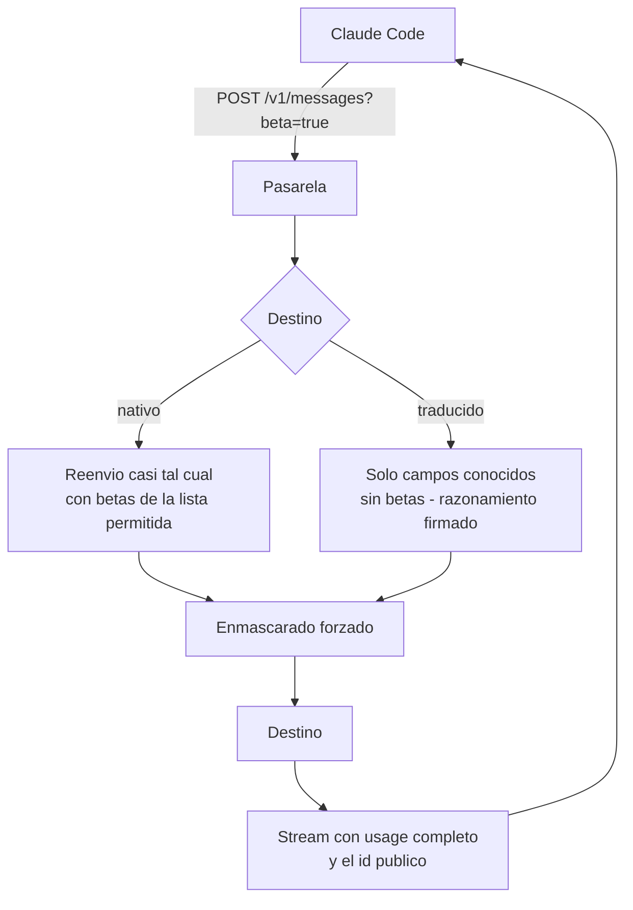

# Claude Code con la redirección de modelos

Cómo apuntar **Claude Code** a la pasarela con una **llave virtual del producto** para que sus
niveles (`opus`, `sonnet`, `haiku`) los sirvan los destinos que el administrador mapeó, con el
enmascarado y la residencia de la [redirección de modelos](../administration/redireccionamiento.md).
No reemplaza al modo por suscripción de la [matriz de integraciones](index.md): es el camino para
trabajar con **otros modelos** de forma gobernada.

**Para quién**: el desarrollador que configura Claude Code y el administrador que le arma el kit.

!!! warning "Estado: 🟡 sin verificación en vivo"
    Probado con pruebas de contrato y un corpus sintético de pedidos de la herramienta contra un
    proveedor **simulado**. No hay todavía una sesión real de Claude Code contra un destino real
    (Azure es el primero): nada de esta página está 🟢.

!!! note "Leyenda de estado"
    🟢 **HOY** — funciona y está verificado en vivo · 🟡 **PARCIAL** — existe, con pruebas
    automatizadas y/o límites documentados · 🔵 **OBJETIVO** — roadmap, no implementado.

---

## Cómo funciona

Claude Code habla el protocolo de mensajes de Anthropic. Con la política encendida, la pasarela
reconoce el id (`opus`, `sonnet`, `haiku` o un id publicado), aplica la regla, normaliza el pedido
para el destino y devuelve la respuesta con el id que Claude Code pidió.



- **Hacia un destino traducido** solo viajan los campos de primer nivel que el destino entiende
  (`model`, `messages`, `system`, `max_tokens`, `stop_sequences`, `stream`, `temperature`, `top_p`,
  `top_k`, `tools`, `tool_choice`, `metadata`); el resto (por ejemplo `safeguards`) se quita y solo
  su **nombre** queda en la auditoría. Las cabeceras `anthropic-beta` se descartan; hacia uno nativo
  pasan las de una lista permitida.
- **Razonamiento (`thinking`)**: los bloques que produce un destino traducido salen con una firma
  de la pasarela atada a ese destino; al volver en el turno siguiente, la pasarela los reconstruye
  solo para el destino que lo exige y descarta cualquier otro, sin error. El razonamiento de un
  destino nunca llega a otro.
- **Stream**: `usage` con los cuatro contadores desde el inicio; si el destino falla a mitad, el
  cliente recibe un evento de error neutro y el cierre **sin** `message_stop`.
- **Conteo de tokens**: para un destino traducido, o con el enmascarado forzado vigente, la
  pasarela responde una **estimación local** (o `404`) y **nunca** reenvía la conversación.

## Configuración

**Kit del panel (recomendado)**: **Modelos → Kits → Claude Code** genera `claude-code.env` con la
dirección de la pasarela, los ids por nivel y los ajustes que evitan fallas conocidas. La llave
nueva que emite el kit nace con 120 pedidos/min y 1 000 000 tokens/min; después se puede cambiar en
*Usuarios & Presupuestos → Llaves Virtuales → Editar límites*. 🟡

**A mano**:

```bash
# Cargar en el entorno o en el archivo de ajustes de Claude Code
ANTHROPIC_BASE_URL=https://<dominio>/api/v1/gw
ANTHROPIC_AUTH_TOKEN=<llave virtual del producto>
# Opcional: fijar los ids publicados por nivel
ANTHROPIC_DEFAULT_OPUS_MODEL=<id publicado>
ANTHROPIC_DEFAULT_SONNET_MODEL=<id publicado>
ANTHROPIC_DEFAULT_HAIKU_MODEL=<id publicado>
```

El kit suma ajustes de la herramienta que evitan fallas conocidas con gateways (por ejemplo
desactivar las betas experimentales, activar las pistas por cabecera y el descubrimiento de modelos
de la pasarela, y la ventana de compactación del destino con menor contexto). Si la máquina tiene
una **sesión de suscripción** abierta, usar un directorio de configuración aislado
(`CLAUDE_CONFIG_DIR=<ruta>`) para que la sesión personal no se mezcle con la llave del producto.

!!! warning "Suscripción personal hacia otro proveedor"
    Con la política encendida, una credencial de **suscripción personal** (OAuth) que se dirige a un
    destino de otro proveedor recibe `401 authentication_error` con un texto neutro: la suscripción
    solo sirve para el proveedor al que pertenece.

**Ids publicados**: tienen que ser ids que la versión instalada de Claude Code reconozca; si publica
uno que no reconoce, Claude Code lo descarta del lado del cliente (`unrecognized_model`). Un id
`claude-*` que no esté publicado cae a la regla de su nivel solo con la política encendida; sin
regla, `404`.

## Qué se conoce que pasa (síntomas por contrato) 🟡

| Lo que se ve | Causa | Qué hacer |
|---|---|---|
| `404` «Modelo no disponible para tu organización.» | El id no está publicado para el alcance de la llave, o la llave tiene lista de modelos que no lo incluye | Publicar el id o ajustar la llave; revisar los ids por nivel |
| `403` «Modelo no disponible para tu región.» | Rechazo de residencia (destino fuera de la postura, sin jurisdicción de inferencia o respaldo de región) | Cumplimiento revisa la postura y la ficha del destino; no es un problema de la llave |
| `400` «El pedido no pudo protegerse para este destino y fue bloqueado. Probá en una conversación nueva.» | Enmascarado forzado: algo no analizable (PDF escaneado; una imagen solo con `MASKING_IMAGES=filter`), analizador caído o un dato en una posición que no se puede reescribir | Quitar el adjunto, abrir una conversación nueva; si persiste, avisar al administrador |
| `400` `capability_rejected: …` al usar búsqueda web, apertura de páginas o ejecución de código del proveedor original | Esas herramientas son exclusivas del proveedor original; no existen en un destino traducido | Usar las herramientas locales de Claude Code o un destino nativo |
| `401 authentication_error` | Credencial de suscripción personal hacia un destino de otro proveedor, o llave inválida | Usar la llave virtual del producto |
| `529` con `x-should-retry` / `429` con `retry-after` | Saturación o límite de ritmo del destino | Reintentar con la espera indicada |
| Sesión larga que «se cuelga» | Un pedido grande con historial extenso tarda más en analizarse bajo enmascarado forzado | Una **caché de análisis** evita repetir el trabajo desde el segundo turno; la latencia real con el analizador definitivo no está medida (🟡) |

Un bloqueo del enmascarado forzado no se resuelve «reintentando»: el mismo pedido da el mismo
resultado.

## Límites 🟡

- 🟡 **Verificación**: pruebas con proveedor simulado y un corpus sintético; la lista real de
  cabeceras `anthropic-beta` y el comportamiento con un destino real están pendientes de la prueba en
  vivo.
- 🟡 **Latencia**: el tiempo agregado de la pasarela medido en proceso con un destino simulado
  instantáneo fue de unos pocos milisegundos; **no** incluye el analizador real ni la red.
- 🟡 **Modelos de razonamiento**: que el destino reciba el razonamiento reconstruido en el turno
  siguiente se probó con simulación; falta verlo con un destino real.
- 🔵 **Búsqueda web y ejecución de código del proveedor**: no existen en destinos traducidos.

## Relacionado

- [Redirección de modelos](../administration/redireccionamiento.md) — cómo el administrador publica
  los ids, mapea los destinos y fija residencia y enmascarado.
- [Claude Desktop con la pasarela](claude-desktop.md) — la otra herramienta de la cara Claude.
- [Integraciones & matriz](index.md) — Claude Code por suscripción y con modelo propio, y el resto de
  las superficies.
- [Gotchas verificados](gotchas.md) — los límites de las superficies ya probadas en vivo.
