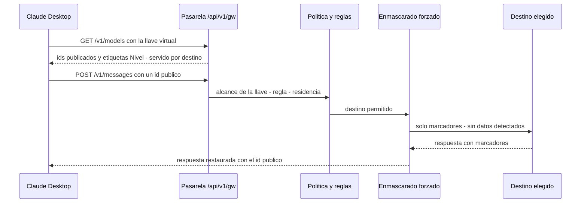

# Claude Desktop con la pasarela

Cómo conectar **Claude Desktop** (Chat, Cowork y Code) a la pasarela en modo de **gateway de
terceros**, de modo que la aplicación pida los modelos que el administrador publicó y reciba la
respuesta del destino que él eligió, con el enmascarado y la residencia de la
[redirección de modelos](../administration/redireccionamiento.md). Esta guía cubre la
configuración, los ids publicados y los síntomas que se conocen por contrato.

**Para quién**: el administrador que prepara la configuración de las personas y el soporte que
atiende tickets de Claude Desktop.

!!! warning "Estado: 🟡 sin verificación en vivo"
    La cara Claude está cubierta por pruebas de contrato con una pasarela real y un proveedor
    **simulado**. Todavía **no** se probó con la aplicación real y un destino real (Azure es el
    primero), así que nada de esta página está 🟢. Los síntomas son los que fija el contrato, no
    tickets reproducidos.

!!! note "Leyenda de estado"
    🟢 **HOY** — funciona y está verificado en vivo · 🟡 **PARCIAL** — existe, con pruebas
    automatizadas y/o límites documentados · 🔵 **OBJETIVO** — roadmap, no implementado.

---

## Cómo se conecta

La aplicación no habla con el proveedor: le pide la lista de modelos a la pasarela y después sus
mensajes. La pasarela responde con **ids públicos** (uno por nivel) y, por detrás, sirve cada uno con
el destino de la regla.

- **Autenticación**: la llave virtual del producto, por `Authorization: Bearer` (también se acepta
  `x-api-key`). La pasarela atribuye el pedido a la persona y a la conexión de esa llave.
- **Lista de modelos**: `GET /api/v1/gw/v1/models` responde en menos de 1 s, solo con los ids que la
  llave puede usar (si la llave tiene una lista de modelos permitidos, se evalúa contra el id
  público) y con la ventana de contexto real del destino. Nunca redirige.
- **Respuesta**: el campo `model` de cada respuesta es el **id público** que se pidió, no el del
  destino. En *streaming*, la pasarela agrega `ping` si el destino calla más de 15 s (las sesiones
  largas de Cowork no se cortan por inactividad).

## Configuración

Hay dos caminos, equivalentes:

1. **Kit del panel (recomendado)**: en **Modelos → Kits**, elegir *Claude Desktop (configuración
   gestionada)* y el alcance (empresa, grupo, usuario o conexión). El panel genera un
   `managed-settings.json` y un `LEEME.txt` con la dirección de la pasarela, el modo de
   autenticación, los modelos del alcance y los ajustes que evitan fallas conocidas. No lleva
   credenciales salvo que se pida: en ese caso emite una **llave nueva** del alcance y queda
   auditado. Se reparte con la gestión de dispositivos de la organización. 🟡
2. **A mano**, en la configuración de gateway de terceros de la aplicación:

| Ajuste | Valor |
|---|---|
| `inferenceProvider` | `gateway` |
| `inferenceGatewayBaseUrl` | `https://<dominio>/api/v1/gw` (la dirección del gateway desplegado, con el **mismo** `/api/v1/gw`) |
| `inferenceGatewayApiKey` | la llave virtual del producto |
| `inferenceGatewayAuthScheme` | `bearer` (el esquema `sso` queda en desuso: no usarlo) |
| Descubrimiento de modelos | activado (la aplicación toma la lista de la pasarela) |

**Ids publicados**: el administrador publica un id por nivel (por ejemplo `claude-opus-…`,
`claude-sonnet-…`, `claude-haiku-…`); tienen que ser ids que la **versión instalada** de la
aplicación reconozca. La etiqueta visible es del tipo «Sonnet · servido por *destino*».

!!! info "Conexión remota"
    Fuera de un entorno local, la dirección debe ser `https://`: la llave viaja en cada pedido.

## Qué se conoce que pasa (síntomas por contrato) 🟡

| Lo que ve la persona | Causa | Qué hacer |
|---|---|---|
| **«Failed to authenticate»** seguido de «Modelo no disponible para tu región.» | Rechazo de residencia: el destino queda fuera de la postura vigente, o no tiene jurisdicción de inferencia cargada, o el respaldo de región rige. La aplicación **antepone** «Failed to authenticate» a **todo** `403`; el texto que sigue es el de la pasarela | No es un problema de credenciales. El responsable de cumplimiento revisa la postura y la ficha del destino; el administrador, la regla (otro destino o un fallback) |
| Error «El pedido no pudo protegerse para este destino y fue bloqueado. Probá en una conversación nueva.» | Bloqueo del enmascarado forzado: algo no analizable (imagen, PDF escaneado, adjunto por dirección), el analizador caído, o un dato en una posición que no se puede reescribir. Es un **`400`** con su propio texto, no un `403` (por eso no lleva «Failed to authenticate») | Quitar el adjunto o abrir una conversación nueva; si se repite sin adjuntos, avisar al administrador (la auditoría muestra el tipo de causa, no el contenido) |
| «Modelo no disponible para tu organización.» (`404`) | El id no está publicado para el alcance de esa llave, o la llave tiene una lista de modelos que no lo incluye | Publicar el id para ese alcance o ajustar la llave |
| La aplicación no lista modelos o muestra un solo nivel | La política está apagada para ese alcance, o no hay reglas para un nivel | Encender la política y mapear los tres niveles |
| Una función no responde (búsqueda web, apertura de páginas, ejecución de código del proveedor original) | Esas funciones son exclusivas del proveedor original; hacia un destino traducido se rechazan con un `400` `capability_rejected`, nunca se ignoran en silencio | Es un límite del destino; usar un destino nativo si la función es imprescindible |
| Un PDF o una imagen «no se puede enviar» | Destino sin visión (rechazo claro) o, con el enmascarado forzado, adjunto no analizable | Convertir el adjunto a texto o quitarlo |
| El sondeo de arranque (`max_tokens` mínimo) no falla | Es lo esperado: la pasarela sube el mínimo a 16 y usa el parámetro que el destino exige; queda en la auditoría como parámetro ajustado | — |

## Límites 🟡

- 🟡 **Verificación**: contrato y pruebas con proveedor simulado; la prueba con la aplicación real y
  Azure está pendiente.
- 🟡 **Cobertura del enmascarado**: seudonimización reversible de identificadores **detectados**; con
  el enmascarado forzado el alcance es completo (todo el historial, herramientas y PDF con texto) y
  lo no analizable se bloquea.
- 🟡 **Caché**: los marcadores son estables por conversación para que el proveedor pueda reutilizar
  su caché; el efecto real sobre los aciertos no está medido.
- 🔵 **Lectura de imágenes (OCR)**: no existe; las imágenes se bloquean bajo enmascarado forzado.

## Relacionado

- [Redirección de modelos](../administration/redireccionamiento.md) — política, reglas, residencia y
  enmascarado por defecto, desde el lado del administrador.
- [Claude Code con la pasarela](claude-code.md) — la otra herramienta que usa la cara Claude.
- [Integraciones & matriz](index.md) — todas las superficies y su estado.
- [Códigos de error](../api-reference/errors.md) — qué hace cada status y cuándo reintentar.
