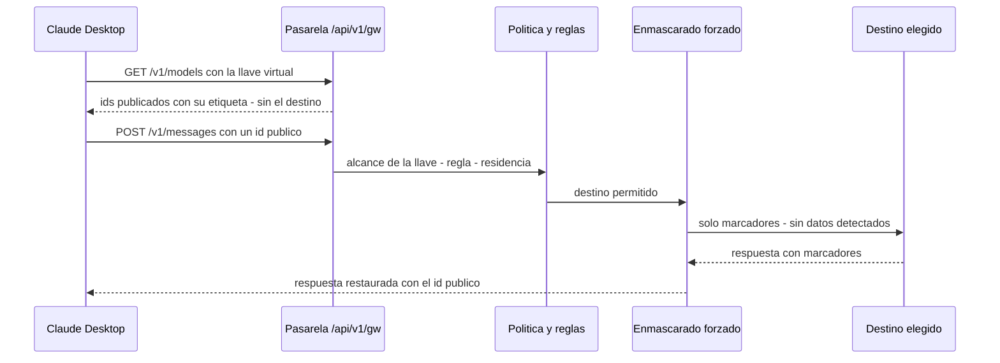

# Claude Desktop con la pasarela

Cómo conectar **Claude Desktop** (Chat, Cowork y Code) a la pasarela en modo de **gateway de
terceros**, de modo que la aplicación pida los modelos que el administrador publicó y reciba la
respuesta del destino que él eligió, con el enmascarado y la residencia de la
[redirección de modelos](../administration/redireccionamiento.md). Esta guía cubre la
configuración, los ids publicados y los síntomas que se conocen por contrato.

**Para quién**: el administrador que prepara la configuración de las personas y el soporte que
atiende tickets de Claude Desktop.

!!! warning "Estado: 🟡 pasos verificados en la misma base, sin prueba en vivo en esta instalación"
    Los pasos del cliente de esta página (dirección, esquema, descubrimiento, espacio de trabajo y
    carpeta de Cowork) se verificaron en vivo con la aplicación real sobre la **misma base** del
    producto, con destinos fuera de la UE. En **esta** instalación la cara Claude está cubierta por
    pruebas de contrato con una pasarela real y un proveedor **simulado**: la prueba en vivo con la
    aplicación y un destino real (Azure primero) está pendiente, así que lo que depende del destino
    real figura como 🟡 y no como 🟢.

!!! note "Leyenda de estado"
    🟢 **HOY** — funciona y está verificado en vivo · 🟡 **PARCIAL** — existe, con pruebas
    automatizadas y/o límites documentados · 🔵 **OBJETIVO** — roadmap, no implementado.

---

## Cómo se conecta

La aplicación no habla con el proveedor: le pide la lista de modelos a la pasarela y después sus
mensajes. La pasarela responde con **ids públicos** (uno por nivel) y, por detrás, sirve cada uno con
el destino de la regla.

- **Autenticación**: la llave virtual del producto, por `Authorization: Bearer` (también se acepta
  `x-api-key`). La pasarela atribuye el pedido a la persona y a la conexión de esa llave.
- **Lista de modelos**: `GET /api/v1/gw/v1/models` responde en menos de 1 s, solo con los ids que la
  llave puede usar (si la llave tiene una lista de modelos permitidos, se evalúa contra el id
  público) y con la ventana de contexto real del destino. Nunca redirige.
- **Respuesta**: el campo `model` de cada respuesta es el **id público** que se pidió, no el del
  destino. En *streaming*, la pasarela agrega `ping` si el destino calla más de 15 s (las sesiones
  largas de Cowork no se cortan por inactividad).

## Lo que configura el administrador

En la consola, antes de tocar el equipo de la persona.

1. **Una llave por conexión, con dueño**: *Usuarios & Presupuestos → Llaves Virtuales → Generar Llave Virtual*,
   herramienta **Claude Desktop**, asignada a la persona o al equipo responsable. Una llave por
   conexión permite que la política, la residencia y la auditoría se apliquen a esa conexión y no a
   todo el tenant. **Cargá estos límites** (la llave que emite el kit del panel ya nace con ellos, ver más abajo):

    | Campo | Valor recomendado | Por qué |
    |---|---|---|
    | Límite TPM (tokens/min) | **1 000 000** | Cada pedido de Claude Desktop manda 35 000–40 000 tokens (instrucciones, herramientas e historial). Con el valor por defecto de 100 000 entran 2 o 3 pedidos por minuto y el agente de Cowork, que encadena varios, recibe `429` y reintenta hasta 10 veces |
    | Límite RPM (pedidos/min) | **120** | Cowork y Code hacen ráfagas de pedidos cortos (herramientas, subagentes) |

2. **Destinos con su ficha** (*Modelos*): en cada modelo que va a servir a Claude Desktop, declarar
   la **ventana de contexto real** (de ella depende cuándo compacta la aplicación), las
   **capacidades** que acepta (**Imágenes**, **PDF**), la **salida máxima** real (la pasarela recorta
   el `max_tokens` del pedido a ese valor) y los **parámetros no soportados** (por ejemplo
   `temperature`). Un modelo con visión tiene que tener marcado *Imágenes*; si no, la
   pasarela le reemplaza las imágenes por una nota. Cómo dar de alta uno de OpenRouter (Kimi K3): ver
   [Destinos: el catálogo](../administration/redireccionamiento.md#destinos-el-catalogo).
3. **Redirección** (*Modelos → Routing*, pestañas *Modelos publicados*, *Reglas*, *Política*, *Residencia* y *Vista previa*): publicar en la **cara Claude** los ids de la familia
   (`claude-opus-…`, `claude-sonnet-…`, `claude-haiku-…`), una **regla** por id con su destino, la
   **política encendida** para la conexión y una **postura de residencia** que admita esos destinos.
   Sin política encendida, el id se manda tal cual al proveedor y falla. Usá la **vista previa** para
   comprobar que cada id resuelve a su destino antes de usar la aplicación.

!!! warning "Un destino fuera de la postura de la conexión desaparece del selector"
    Si la postura vigente no admite el destino (porque la inferencia, la entidad o el control quedan
    fuera de lo permitido, o la ficha no tiene jurisdicción de inferencia), el id **deja de
    resolverse** y no aparece en el selector. Es el comportamiento seguro; la vista previa lo muestra
    como descartado y cumplimiento ajusta la postura. Ver
    [Residencia y enmascarado por defecto](../administration/redireccionamiento.md#residencia-y-enmascarado-por-defecto).

### Cambiar el destino de un tier sin tocar el cliente

El administrador mueve, por ejemplo, `claude-sonnet-…` de Azure a Kimi K3 editando **la regla** de
ese id en *Modelos → Routing → Reglas* (cambiar el destino principal) y comprobando la vista previa.
El cliente sigue pidiendo el mismo id, ve la misma etiqueta y recibe en `model` el mismo id: nada se
reinstala ni se reconfigura. Lo único que cambia para la aplicación es la ventana de contexto del
destino nuevo. La auditoría registra, pedido por pedido, el destino real. 🟡 (cubierto por una
prueba de integración con un proveedor simulado; sin prueba en vivo)

### Quién ve qué: grupos

No siempre son tres modelos ni los ve toda la empresa. Con **grupos** se arma, por ejemplo, un grupo
*Todos* y un grupo *Solo Azure*; el procedimiento está en
[Modelos por grupo de personas](../administration/redireccionamiento.md#modelos-por-grupo-de-personas). 🟡

## Configurar el cliente paso a paso

Claude Desktop **sin iniciar sesión**, en el equipo de la persona:

1. **Help → Troubleshooting → Enable Developer Mode**.
2. **Developer → Configure Third-Party Inference…** (en español, *Configurar inferencia de
   terceros*). La pantalla tiene un menú a la izquierda: *Conexión*, *Espacio de trabajo*,
   *Conectores*, *Límites*, *Plugins*, *Egreso*…
3. Completar cada sección como indican las tablas de abajo.
4. **Apply Changes → Save & Restart** y salir del todo de la aplicación antes de volver a abrirla.

!!! tip "Alternativa: el kit del panel"
    En **Modelos → Kits** se genera un `managed-settings.json` con la dirección, el esquema, los
    modelos del alcance y los ajustes que evitan fallas conocidas, para repartirlo con la gestión de
    dispositivos. Si lleva credencial, emite una **llave nueva** del alcance y queda auditado. Esa llave
    nace con **120 pedidos/min y 1 000 000 tokens/min** (los de la tabla de arriba), aplicados en la
    pasarela y en el motor; con una llave generada a mano hay que cargarlos. 🟡

    La dirección del gateway sale de la variable `REDIRECT_GATEWAY_URL` del entorno (la URL pública
    de la pasarela con su puerto, p. ej. `https://elea.example.com:8091/api/v1/gw`). Sin esa
    variable, la ruta la deduce de los encabezados del pedido; si no puede resolverla (el host es
    interno de compose), el kit sale con el marcador `REEMPLAZAR_CON_LA_URL_DE_LA_PASARELA` y el
    panel lo avisa. Configurá la variable para que el kit salga listo para repartir. 🟡

!!! tip "Cambiar los límites de una llave que ya existe"
    *Usuarios & Presupuestos → Llaves Virtuales → Editar límites* cambia los pedidos/min y los
    tokens/min de la llave sin emitir otra. El cambio rige de inmediato en la pasarela y en el motor;
    si el motor no responde, el panel lo avisa y no cambia nada (los dos lugares nunca quedan con
    valores distintos). Solo el rol administrador puede hacerlo. 🟡

### Conexión

| Campo | Valor | Para qué |
|---|---|---|
| Proveedor | Gateway | Todo va a la pasarela, nada a Anthropic |
| Tipo de credencial | Clave de API estática | La llave virtual de la persona |
| URL base del gateway | `https://<dominio>/api/v1/gw` | **Sin `/v1` al final**: la aplicación lo agrega. Con `/v1` el pedido sale a una ruta que no existe |
| Clave de API de gateway | la llave virtual (`sk-…`) | Identifica a la persona y su política |
| Esquema de autenticación | `bearer` | La pasarela acepta Bearer. **No uses `sso`** (en desuso) |
| Descubrimiento de modelos | **Activado** | El selector se arma con los ids publicados para esa llave |
| Lista de modelos | **Vacía** | Solo hace falta si se publican ids que no son de la familia Claude; entonces se carga cada id con su etiqueta |
| Usar 1M de contexto por defecto | Desactivado | Evita que arranque en la variante de 1M si el destino no la tiene |

!!! info "Conexión remota"
    Fuera de un entorno local, la dirección debe ser `https://`: la llave viaja en cada pedido.

### Espacio de trabajo

| Campo | Valor | Para qué |
|---|---|---|
| Superficies permitidas | Cowork, Código y Chat activados | Las tres pasan por la pasarela |
| Hosts de egreso permitidos | **«\* Permitir todo»**, o la lista de hosts que la organización autorice | Sin lista, Cowork y Code **no pueden salir a internet**: ni leer páginas ni instalar las librerías con las que arman documentos |
| Omitir verificación de dominio de WebFetch | **Activado** | Sin esto, antes de leer una página la aplicación consulta a un servicio del proveedor original que en modo gateway no responde |
| Restricciones de Chat → Análisis avanzado de archivos | **Activado** | Permite leer adjuntos Excel, PowerPoint y PDF en Chat |
| Permitir el navegador integrado | Opcional | Deja que Claude abra páginas web en Cowork y Code |

Lo que se ve escrito en gris en los campos (`*.corp.example.com`, «Responde siempre en inglés
británico…») son **ejemplos**, no valores: no hace falta borrarlos.

### Al usar Cowork

Cowork crea archivos (presentaciones, PDF, documentos, imágenes) ejecutando código en su propio
entorno y revisa el resultado con **capturas de pantalla**. Pide respuestas largas (hasta unos
64 000 tokens de salida).

- **Elegí una carpeta de trabajo** en cada tarea, mejor una vacía y dedicada. Sin carpeta, el
  agente no tiene dónde escribir y falla al guardar el archivo (`FileNotFoundError`).
- **Cada modelo en su tarea**: si una tarea falla por el modelo, se abre una tarea nueva con otro; no
  se reintenta en la misma.
- **Las capturas del propio agente no cortan la tarea.** Con el enmascarado forzado una imagen no se
  puede analizar y, hasta ahora, bloqueaba el pedido. Ahora, una imagen o un adjunto binario que
  **devuelve una herramienta del agente** (por ejemplo la captura con la que revisa el PDF) se
  **reemplaza por una nota** («imagen omitida por la política de protección de datos… no vuelvas a
  pedir capturas»): el binario nunca sale hacia el proveedor, la tarea sigue y la auditoría lo
  registra (`unanalyzable_replaced`, solo el conteo y el tipo). La consecuencia es que el agente
  **no revisa su resultado con la vista**; lo revisa con el texto que tenga.
- **Las imágenes que adjunta la persona en su mensaje siguen bloqueándose** bajo enmascarado
  forzado (no se pueden analizar): ver el síntoma «El pedido no pudo protegerse…».

## Probar que quedó bien

| Prueba | Qué hacer | Resultado esperado |
|---|---|---|
| Vista previa | En *Redirección*, la vista previa de la conexión | Cada id publicado resuelve a su destino; ninguno aparece como descartado |
| Selector | Abrir Chat y desplegar el selector de modelos | Aparecen los ids publicados, con el id como etiqueta y sin el destino |
| Chat | Mandar «hola» con cada modelo | Responde; en la auditoría figura el destino real |
| Cowork | Tarea nueva, carpeta elegida, «creame un pdf de una página sobre …» | El PDF queda en la carpeta, sin avisos de «Reintentando» |
| Captura del agente | Lo mismo con enmascarado forzado | La tarea termina aunque el agente saque una captura; la auditoría registra `unanalyzable_replaced` |
| Imagen adjunta | Adjuntar una imagen en el Chat con enmascarado forzado | Rechazo con el texto de la pasarela; el mensaje siguiente («hola») responde normal |

Estas pruebas están pendientes de correrse **en vivo** en esta instalación (🟡); el comportamiento
de cada una está cubierto por pruebas automatizadas con un proveedor simulado.

## Qué se conoce que pasa (síntomas por contrato) 🟡

| Lo que ve la persona | Causa | Qué hacer |
|---|---|---|
| **«Failed to authenticate»** seguido de «Modelo no disponible para tu región.» | Rechazo de residencia: el destino queda fuera de la postura vigente, o no tiene jurisdicción de inferencia cargada, o el respaldo de región rige. La aplicación **antepone** «Failed to authenticate» a **todo** `403`; el texto que sigue es el de la pasarela | No es un problema de credenciales. El responsable de cumplimiento revisa la postura y la ficha del destino; el administrador, la regla (otro destino o un fallback) |
| «Este modelo no está permitido para tu perfil.» (`403`) | El perfil de acceso del grupo no admite el destino al que va ese id (por ejemplo, un grupo solo Azure ante una regla que lleva a otro proveedor) | Corregir la regla o el perfil del grupo; ver [Modelos por grupo de personas](../administration/redireccionamiento.md#modelos-por-grupo-de-personas) |
| Error «El pedido no pudo protegerse para este destino y fue bloqueado. Probá en una conversación nueva.» | Bloqueo del enmascarado forzado: algo no analizable que **adjuntó la persona** (imagen, PDF escaneado, adjunto por dirección), el analizador caído, o un dato en una posición que no se puede reescribir. Es un **`400`** con su propio texto, no un `403` (por eso no lleva «Failed to authenticate»). Las imágenes que devuelve una herramienta del agente **no** causan este error: se reemplazan por una nota | Quitar el adjunto o abrir una conversación nueva; si se repite sin adjuntos, avisar al administrador (la auditoría muestra el tipo de causa, no el contenido) |
| «Modelo no disponible para tu organización.» (`404`) | El id no está publicado para el alcance (empresa o grupo) de esa llave, o la llave tiene una lista de modelos que no lo incluye. No nombra destinos | Publicar el id para ese alcance o ajustar la llave |
| La aplicación no lista modelos o muestra un solo nivel | La política está apagada para ese alcance, no hay reglas para un nivel, la residencia descarta el destino, o el id solo está publicado para otro grupo | Encender la política, mapear los tres niveles y revisar la vista previa |
| «Límite de solicitudes alcanzado. Reintentando… (intento 3 de 10)» | La llave tiene los límites por defecto (100 000 tokens/min), bajos para un agente | Llave con 1 000 000 tokens/min y 120 pedidos/min (las del kit del panel ya los traen; a una anterior se los cambia *Editar límites*) |
| `FileNotFoundError` al guardar el archivo en Cowork | Tarea sin carpeta de trabajo | Elegir una carpeta al crear la tarea |
| No lee páginas web | Sin hosts de egreso o sin omitir la verificación de WebFetch | Las dos opciones de *Espacio de trabajo* |
| El selector muestra un solo modelo | Ids publicados que no son de la familia Claude | Publicar con ids de Claude, o cargar la *Lista de modelos* a mano con cada id |
| Una función no responde (búsqueda web, apertura de páginas, ejecución de código del proveedor original) | Esas funciones son exclusivas del proveedor original; hacia un destino traducido se rechazan con un `400` `capability_rejected`, nunca se ignoran en silencio | Es un límite del destino; usar un destino nativo si la función es imprescindible |
| Un PDF o una imagen «no se puede enviar» | Destino sin visión (rechazo claro) o, con el enmascarado forzado, adjunto no analizable | Convertir el adjunto a texto o quitarlo |
| Cowork dice que no pudo ver la captura de su resultado | La captura le llegó como una nota «imagen omitida» (destino sin visión o enmascarado forzado) y la tarea siguió sin revisión visual | Es lo esperado. Con un modelo con visión y sin enmascarado forzado el agente revisa con la vista |
| El panel avisa de la versión de API al cargar una credencial de Azure | La versión es anterior a `2025-04-01-preview`, la mínima para las herramientas y el razonamiento por Responses | No bloquea: el producto usa esa versión solo en la llamada a Responses; conviene actualizar la credencial |
| El sondeo de arranque (`max_tokens` mínimo) no falla | Es lo esperado: la pasarela sube el mínimo a 16 y usa el parámetro que el destino exige; queda en la auditoría como parámetro ajustado | — |

## Límites 🟡

- 🟡 **Verificación**: los pasos del cliente se verificaron en vivo sobre la misma base del producto;
  en esta instalación el contrato y las pruebas con proveedor simulado están hechos y la prueba con la
  aplicación real y Azure está pendiente.
- 🟡 **Cobertura del enmascarado**: seudonimización reversible de identificadores **detectados**; con
  el enmascarado forzado el alcance es completo (todo el historial, herramientas y PDF con texto). Lo
  no analizable que adjunta la persona se bloquea; lo que devuelve una herramienta del agente se
  reemplaza por una nota.
- 🟡 **Caché**: los marcadores son estables por conversación para que el proveedor pueda reutilizar
  su caché; el efecto real sobre los aciertos no está medido.
- 🔵 **Lectura de imágenes (OCR)**: no existe; las imágenes que adjunta la persona se bloquean bajo
  enmascarado forzado y las del agente se omiten.
- 🔵 **Skills de documentos** (PDF, Word, Excel, PowerPoint): en modo gateway no llegan las que la
  aplicación trae con el proveedor original; la entrega como plugin de la organización está en estudio.
- 🔵 **Búsqueda web**: es una herramienta del lado del servidor del proveedor original; en modo
  gateway requiere un conector de búsqueda.

## Relacionado

- [Redirección de modelos](../administration/redireccionamiento.md) — política, reglas, residencia y
  enmascarado por defecto, desde el lado del administrador.
- [Claude Code con la pasarela](claude-code.md) — la otra herramienta que usa la cara Claude.
- [Integraciones & matriz](index.md) — todas las superficies y su estado.
- [Códigos de error](../api-reference/errors.md) — qué hace cada status y cuándo reintentar.
