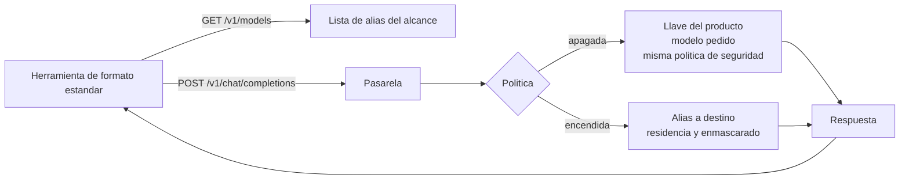

# CLI de formato de chat estándar

Cómo conectar a la pasarela las herramientas que hablan el **formato de chat estándar del sector**
(opencode, Aider en ese modo, Continue, Cline/Roo, Zed y la mayoría de los clientes de código
abierto). La pasarela les presenta la **cara genérica**: una lista de **alias** neutros y un punto
de entrada de chat, con la misma política de seguridad, enmascarado y auditoría que el resto.

**Para quién**: el integrador que configura una de estas herramientas y el soporte que atiende
tickets de ellas.

!!! warning "Estado: 🟡 sin verificación en vivo"
    La cara genérica tiene pruebas de contrato y de punta a punta con un destino **simulado**. La
    primera prueba real (opencode y Aider contra Azure) está pendiente: hasta que exista, esta cara
    **no** se marca 🟢.

!!! note "Leyenda de estado"
    🟢 **HOY** — funciona y está verificado en vivo · 🟡 **PARCIAL** — existe, con pruebas
    automatizadas y/o límites documentados · 🔵 **OBJETIVO** — roadmap, no implementado.

---

## Cómo funciona

- **Base**: `https://<dominio>/api/v1/gw/v1`. La herramienta pide `GET /models` y
  `POST /chat/completions`.
- **Autenticación**: la **llave virtual** del producto como API key. Sin llave, `401` en el formato
  de error de esa API; esta puerta no admite el reenvío de suscripciones.
- **Con la política apagada** (el estado de fábrica): se sirve el modelo pedido y se aplica la misma
  política de seguridad que a las demás rutas (bloqueos, secretos, enmascarado reversible y
  auditoría). La restauración de los marcadores en *streaming* funciona también en esta ruta. 🟡
- **Con la política encendida**: `GET /models` lista **solo** los alias publicados para el alcance de
  la llave; `chat/completions` con un alias lo reescribe al destino de su regla, con *streaming* y
  herramientas, y el campo `model` de la respuesta es el **alias**. Una persona de otro grupo no ve
  los alias. 🟡
- **Latidos**: si el destino calla en un *stream*, la pasarela envía un comentario `: keep-alive`
  cada 15 s como máximo.
- **Ajustes automáticos**: hacia los modelos recientes de OpenAI y Azure, `max_tokens` se convierte
  en `max_completion_tokens` y se aplica un mínimo de 16. Una conversación con **herramientas** hacia
  un modelo de **razonamiento** de OpenAI o Azure se envía por el camino de «Responses» (que sí
  admite herramientas con razonamiento), conservando el `reasoning_effort` que pidió el cliente. 🟡
- **Lista de modelos**: además del alias, `/models` informa `context_length` y el máximo de salida del
  destino, para las herramientas que los usan.

## Configuración

Los valores son los mismos para cualquier herramienta; cambia el nombre del ajuste en cada una.

| Valor | Contenido |
|---|---|
| Dirección base (*base URL*) | `https://<dominio>/api/v1/gw/v1` |
| API key | una llave virtual del producto del alcance correspondiente |
| Modelo | un alias publicado (por ejemplo «rápido» o «pro») |

**Kit del panel**: **Modelos → Kits → CLI genérica (API compatible)** genera un `openai.env` con
`OPENAI_BASE_URL` y `OPENAI_API_KEY` y la lista de alias disponibles. Para herramientas que lo
leen del entorno basta con cargarlo; para las que usan un archivo propio, se copian los tres valores
de la tabla. 🟡

!!! info "Conexión remota"
    Fuera de un entorno local, la dirección debe ser `https://`: la llave viaja en cada pedido.

## Qué se conoce que pasa (síntomas por contrato) 🟡

| Lo que se ve | Causa | Qué hacer |
|---|---|---|
| `401` en el formato de error de la API | Falta la llave virtual o es inválida | Cargar la llave virtual como API key |
| `404` con `model_not_found` | El alias no existe para el alcance de la llave (otro grupo, o no publicado) | Publicar el alias para ese alcance; pedir la lista con `GET /models` |
| `403` con `region_not_allowed` | Rechazo de residencia: ningún destino cumple la postura, destino sin jurisdicción de inferencia o respaldo de región | Cumplimiento revisa la postura y la ficha; no depende de la herramienta |
| `403` con `masking_required` y el texto «El pedido no pudo protegerse para este destino y fue bloqueado. Probá en una conversación nueva.» | Enmascarado forzado: contenido no analizable (PDF escaneado; una imagen solo con `MASKING_IMAGES=filter`), analizador caído o dato en una posición que no se puede reescribir | Quitar el adjunto o empezar otra conversación; si persiste, avisar al administrador |
| La herramienta muestra «error de red» en vez del motivo | Algunas herramientas no leen el cuerpo del error | Mirar la respuesta cruda; el motivo está en `error.code` y `error.message` |
| `/models` vacío | La política está apagada para ese alcance, o no hay alias publicados | Publicar alias de cara genérica para el alcance |

## Límites 🟡

- 🟡 **Verificación**: pruebas de contrato y de punta a punta con destino simulado; la primera prueba
  con opencode y Aider contra Azure está pendiente.
- 🟡 **Cobertura del enmascarado**: seudonimización reversible de identificadores **detectados**; con
  el forzado, alcance completo y bloqueo de lo no analizable.
- 🔵 **Codex CLI**: usa una superficie de «Responses» que el producto no expone; no usar esta cara
  como sustituto.

## Relacionado

- [Redirección de modelos](../administration/redireccionamiento.md) — alias, reglas, residencia y
  enmascarado desde el lado del administrador.
- [Integraciones & matriz](index.md) — la puerta de chat estándar dentro de la topología general.
- [Claude Code con la redirección de modelos](claude-code.md) — la cara Claude, para comparar.
- [Códigos de error](../api-reference/errors.md) — qué hace cada status y cuándo reintentar.
