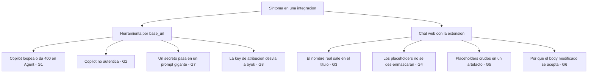

# Gotchas verificados

**Objetivo:** resolver tickets de las superficies de integración a partir de los límites y
comportamientos conocidos de cada una, en formato **síntoma → causa → fix**. Todos fueron
verificados en vivo sobre el producto — nada teórico. La configuración de cada superficie está en
[Integraciones & matriz de compatibilidad](index.md).

**Prerrequisitos:**

- Acceso al monitor en vivo (`GET /api/v1/gw/monitor`) y al feed efímero de eventos
  (`GET /api/v1/gw/events`) para reproducir y observar el síntoma.
- Una virtual key válida para verificar identidad:
  `curl …/api/v1/gw/whoami -H "X-Basa-Key: sk-basa-<usuario>-<herramienta>-<año>"`.
- Para la superficie `browser`: poder recargar la extensión (botón **↻**) y, si hace falta,
  editar su `manifest.json`.
- Base de los ejemplos: `http://localhost:8091/api/v1/gw` en desarrollo; en producción,
  `https://<host>/api/v1/gw`.

## Triage exprés

## G1 · Ask vs Agent en Copilot (loop en Agent)

- **Síntoma:** con `gpt-4o-mini` en `byok`, Copilot en **Agent/Edit** loopea: invoca tools, el
  modelo no-Claude las llama mal, VS Code rechaza el input
  (`must match pattern ^[0-9a-fA-F]{8}-…`, un UUID), reintenta cada ~8 s → termina en 400. En el
  monitor se ve `mode=byok in=0 out=NN` repetido y la tarjeta muestra el **texto del error** en
  vez del prompt.
- **Causa:** el tool-calling agéntico de Claude Code lo aguantan solo los modelos Claude; los
  modelos del motor del gateway (gpt-4o-mini, groq…) no cumplen el contrato de tools.
- **Fix:** **usar modo Ask** (sin tool-calling → el modelo responde texto y el enmascaramiento
  anda). Claude Code sí aguanta Agent porque va por **passthrough de suscripción** a Claude real.

## G2 · Key en la URL porque `x-api-key` llega vacío (Copilot)

- **Síntoma:** Copilot no autentica; el gateway no ve virtual key.
- **Causa:** Copilot manda `x-api-key` **vacío** e **ignora** el `apiKey` del
  `chatLanguageModels.json`; tampoco deja mandar headers custom.
- **Fix:** meter la key **en la URL** (`…/api/v1/gw/v1/messages?k=sk-basa-…`). El gateway la levanta con
  el fallback de key-en-URL. Es un atajo para entornos de prueba; en producción la key va por
  input seguro/SSO.

## G3 · Fuga de título en Claude.ai

- **Síntoma:** el nombre real del paciente aparece en el **título** de la conversación aunque el
  chat esté enmascarado.
- **Causa:** además de `.../completion`, Claude.ai llama a un endpoint **aparte**
  `POST .../chat_conversations/{id}/title` con `body.message_content` = **prompt crudo** para
  generar el título.
- **Fix:** el adapter `claude` de la extensión matchea **también** `/title` y enmascara
  `message_content`; y en el DOM se corre el unmask de título sobre `document.title`. Si
  reaparece el nombre en el título, revisar que el match del adapter incluya `/title`.

## G4 · Unmask en el DOM (no sobre la respuesta) por WebSocket

- **Síntoma:** intentar des-enmascarar leyendo la respuesta del `fetch` no encuentra los
  placeholders.
- **Causa:** en ChatGPT la respuesta del POST es un `stream_handoff`; los tokens llegan por
  **WebSocket**, no en el body de la respuesta.
- **Fix:** el unmask se hace **en el DOM** con un `MutationObserver` (agnóstico al transporte):
  el mapa reversible es local y se reemplaza sobre los text-nodes a medida que se pintan.

## G5 · Artefactos de Claude en `iframe`

- **Síntoma:** dentro de un **artefacto** de Claude se ven los `[PLACEHOLDER]` crudos (el chat
  normal sí des-enmascara).
- **Causa:** el artefacto renderiza en un **iframe** y el manifest usa `all_frames:false` → el
  content script (y su `MutationObserver`) no entra al iframe.
- **Fix:** limitación conocida y documentada. Roadmap: unmask dentro de iframes/artefactos. Como
  workaround, mostrar el resultado en el chat, no en el artefacto.

## G6 · Body no firmado (lo que hace viable el masking)

- **Hecho:** ni ChatGPT (`sentinel`/proof-of-work) ni Claude.ai hacen **integrity-check del
  body** → el body modificado se **acepta** (probado: MANGO→PLATANO, el modelo respondió
  PLATANO).
- **Implicación para soporte:** el masking depende de esto. Si un vendor empieza a **firmar el
  body**, el adapter deja de poder mutar el request y hay que replantear (enterprise-browser). Es
  el riesgo estructural de la superficie `browser`.

## G7 · El cap de inspección toma la **cola**, no la cabeza

- **Síntoma (bug histórico, ya corregido):** un **secreto** pasaba **PERMITIDO** en prompts
  agénticos enormes (Copilot ~22k tokens, Claude Code).
- **Causa:** la copia de inspección tomaba `system + último turno` truncados a **16.000
  caracteres desde la cabeza**; el bloque `<userRequest>` con el secreto va al **final** →
  quedaba fuera del cap. (La PII sí se enmascaraba porque eso corre sobre el body completo, no
  sobre la copia de inspección.)
- **Fix:** la inspección toma la **cola** del último turno + la cabeza del system. Ahora los
  secretos se bloquean en Copilot y Claude Code.

## G8 · La exclusión `x-basa-*` es load-bearing

- **Hecho:** el auto-byok escanea **todos** los headers buscando una virtual key `sk-basa-…`,
  **pero excluye** los headers `x-basa-*`.
- **Por qué importa:** si no se excluyeran, la `X-Basa-Key` de **atribución** de Claude Code
  dispararía el auto-byok y **desviaría al motor** una sesión que debe ir por **passthrough de
  suscripción**. La exclusión mantiene: `X-Basa-Key` = identidad; cualquier `sk-basa-…` en
  `x-api-key`/`Authorization` = credencial → byok.
- **Regla de soporte:** **no** metas la virtual key en un header `x-basa-*` esperando que enrute
  a byok; para byok va en `x-api-key`/`Authorization`/URL. Para atribución sin desviar, va en
  `X-Basa-Key`.

---

!!! tip "¿Buscás el troubleshooting rápido?"
    La tabla síntoma → causa probable → fix y los endpoints de apoyo están en
    [Operaciones & troubleshooting](../operations/index.md).

## Relacionado

- [Integraciones & matriz de compatibilidad](index.md) — la topología de superficies y la
  configuración de cada herramienta cuyo límite estás depurando.
- [Operaciones & troubleshooting](../operations/index.md) — la tabla exprés síntoma → causa → fix
  para tickets, los endpoints de apoyo y la salud del stack.
- [Administración](../administration/index.md) — alta de personas, Connections y virtual keys que
  estas superficies consumen (la identidad que valida `whoami`).
