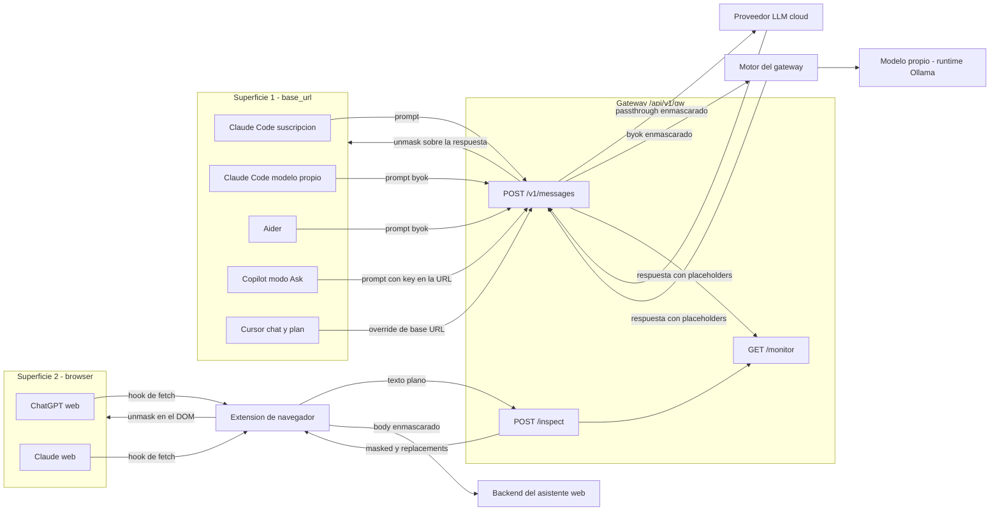
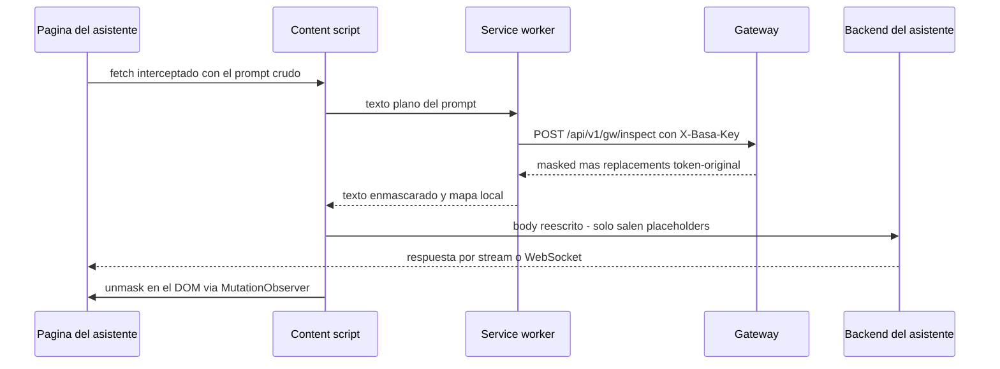

# Integraciones & matriz de compatibilidad

Guía práctica para el distribuidor y el operador: qué clientes de IA se pueden gobernar con el
firewall del gateway, cómo se configura cada superficie y dónde están los límites verificados de
cada integración. Los gotchas con su causa y su fix viven en [Gotchas verificados](gotchas.md).

**Para quién**: el integrador que conecta herramientas de IA al gateway, y el soporte del
distribuidor / operador que atiende tickets de estas superficies.

!!! note "Base de los ejemplos"
    Los ejemplos usan la base `http://localhost:8091/api/v1/gw` (entorno local de desarrollo); en
    producción es `https://<host>/api/v1/gw` (el host del gateway desplegado por el operador, con
    el **mismo path `/api/v1/gw`**).

---

## 1. Topología de superficies

**Tres superficies, un producto:**

1. **`base_url`** — herramientas de coding que permiten apuntar su endpoint de API al gateway
   (Claude Code — por suscripción o con modelo propio —, Aider, GitHub Copilot, Cursor).
2. **`browser`** — aplicaciones de chat web (ChatGPT, Claude.ai) gobernadas por la extensión de
   navegador del producto.
3. **`mcp`** — plano de tools: la DLP se aplica sobre los resultados de las tools MCP (cobertura
   limitada, ver la fila de Claude Desktop en la matriz).

Las dos superficies principales (`base_url` y `browser`) empujan al **mismo** monitor en vivo
(`GET /api/v1/gw/monitor`) con un tag `surface`. *"Un empleado, N herramientas, un firewall."*



Los dos caminos de ida — y el camino de vuelta del unmask, que es distinto por superficie:

- **Ida `base_url`**: la herramienta manda el prompt directamente a
  `POST /api/v1/gw/v1/messages`; el gateway enmascara lo detectado y reenvía al proveedor LLM
  (por passthrough de suscripción o `byok` al motor del gateway, según el modo).
- **Ida `browser`**: la extensión intercepta el `fetch` de la página **antes** de que el prompt
  salga, manda el texto plano a `POST /api/v1/gw/inspect`, recibe el texto enmascarado y los
  `replacements` (token → original), y reescribe el body — el backend del asistente web solo
  recibe placeholders.
- **Vuelta (unmask)**: en `base_url` la restauración de los valores reales cubre **ambos
  modos** — passthrough de suscripción (la aplica el gateway) y `byok` con cualquier modelo
  del motor, incluidos los puenteados (la aplica el motor; el histórico [G9](gotchas.md)
  quedó corregido) — en streaming y no-streaming. En `browser` el mapa token → original
  queda **en la extensión** y el unmask se aplica **en el DOM** con un `MutationObserver` —
  porque en ChatGPT la respuesta no llega en el body del POST sino por WebSocket (ver
  [G4](gotchas.md)).

Endpoints auxiliares de la superficie `base_url`: `GET /api/v1/gw` responde el **discovery**
(uso y endpoints disponibles), y `POST /api/v1/gw/v1/messages/count_tokens` +
`GET /api/v1/gw/v1/models` dan **paridad de rutas** con el API nativo mediante reenvío verbatim
(estas dos rutas auxiliares no enmascaran: el conteo de tokens necesita el texto real y el
destino es el propio upstream de la sesión).

---

## 2. Tabla de compatibilidad

Estados (leyenda del sitio): 🟢 funciona hoy, verificado · 🟡 parcial · ⚪ fuera de las dos
superficies principales.

| Cliente | Estado | Superficie | Mecanismo | Gotcha clave |
|---|---|---|---|---|
| **Claude Code** | 🟢 Funciona | `base_url` | `ANTHROPIC_BASE_URL` → `/api/v1/gw/v1/messages`. Passthrough de **suscripción** (OAuth reenviado verbatim por el gateway) **o** `byok` al motor del gateway. | Hay que **reiniciar `claude`** para tomar `ANTHROPIC_CUSTOM_HEADERS`. Para trabajo agéntico: suscripción, o **modelo propio** (§3.5 — el modo Agent está verificado por esa vía; el límite de G1 es del loop agéntico de Copilot). |
| **Claude Code → modelo propio** | 🟢 Funciona | `base_url` | `byok` + el modelo del cliente servido por su runtime local (p. ej. **Ollama**) registrado en el motor del gateway — ver §3.5. | **El modo Agent funciona** (verificado con tools reales) y el ciclo mask→restauración completa ([G9](gotchas.md): corregido). Con el cache del motor activo, repetir un prompt idéntico puede devolver placeholders de una respuesta cacheada (limitación conocida en evaluación). |
| **Aider** | 🟢 Funciona | `base_url` | `ANTHROPIC_API_BASE` → `…/api/v1/gw` + `ANTHROPIC_API_KEY=sk-basa-…` + `--model anthropic/<modelo-del-motor>`. Cero config extra. | El flujo editor completo (diff-apply) funciona, **no** se corrompe con el masking y los archivos quedan con los valores reales ([G9](gotchas.md): corregido). Misma nota de cache del motor que Claude Code → modelo propio. |
| **Codex CLI** | 🔵 Objetivo (roadmap) | — | Codex ≥0.142 solo habla la Responses API (OpenAI) y el gateway **no expone esa superficie hoy** — no hay camino gobernado que ofrecer en una instalación estándar. | **No se ofrece hoy.** El camino identificado (roadmap) es exponer una superficie OpenAI/Responses gobernada en el propio gateway; hasta entonces, no conectar Codex por rutas internas del despliegue: quedan **fuera** de la política y la auditoría del firewall. |
| **VS Code / GitHub Copilot** | 🟡 Parcial — **solo modo Ask** | `base_url` | `chatLanguageModels.json` con `apiType:"messages"` → `byok` al motor del gateway. Auto-byok por virtual key. | En **Agent/Edit** entra en loop (los modelos no-Claude llaman mal las tools). La key va **en la URL** (`?k=…`) porque manda `x-api-key` vacío. |
| **ChatGPT (web)** | 🟢 Funciona | `browser` | Extensión de navegador: hookea `fetch` sobre `POST /backend-api/f/conversation`, enmascara `messages[].content.parts[]` vía `/api/v1/gw/inspect`. | La respuesta **no** viene en el POST: llega por **WebSocket** (`stream_handoff`) → el unmask se hace en el **DOM**, no sobre la respuesta. |
| **Claude (web, claude.ai)** | 🟢 Funciona | `browser` | Extensión de navegador: hookea `fetch` sobre `.../completion` **y** `.../title`, enmascara `body.prompt` / `body.message_content`. | **Fuga de título**: el endpoint `/title` manda el prompt crudo → hay que enmascararlo también. **Artefactos** en `iframe` → el unmask del DOM no llega. |
| **Gemini (web)** | 🔵 Objetivo (roadmap) | `browser` | **DOM-hook** sobre el editor **Quill** (`.ql-editor`) en `gemini.google.com`: enmascarar el texto del prompt en el editor antes del envío (no vía `fetch`). | **Aún sin verificar — no se ofrece todavía.** A diferencia de ChatGPT/Claude no se mapea endpoint/stream: el approach definido es hookear el editor Quill, no interceptar el POST. Los `content_scripts` del manifest deben matchear `gemini.google.com`. |
| **Cursor** | 🟡 Parcial — **solo chat/plan** | `base_url` | **Override OpenAI Base URL** (settings de Cursor) → apunta el endpoint OpenAI-compatible del modelo al gateway. Gobierna el **chat** y el **modo plan**. | El **agente Composer** y el **autocomplete** **no** pasan por el override (enrutan por el backend propio de Cursor) → quedan fuera del firewall. **Misma casilla que Copilot en modo Ask** (ver §3.4 y [G1](gotchas.md)). |
| **Claude Desktop** | ⚪ MCP tool-plane only | `mcp` | No expone override de `base_url`; la gobernanza entra por **MCP**: la DLP se aplica sobre los **results de las tools** MCP, **no** sobre el prompt del chat. | El prompt del usuario al modelo **no** es interceptable (fuera del reverse-proxy); sólo se gobierna el **plano de tools**. Fuera del scope de las dos superficies principales. |

**Cómo se detecta la herramienta.** El gateway mapea el `User-Agent` a un nombre amigable
(`claude` → Claude Code, `copilot` → GitHub Copilot, `vscode` → VS Code, `cursor` → Cursor,
`gemini` → Gemini CLI, `curl`/`httpx`/`python-requests` → API directa…). Un UA no reconocido cae a
**"Desconocido"** y **no** crashea: se audita con esa etiqueta.

---

## 3. Cómo configurar cada superficie

### 3.1 Claude Code (`base_url`, superficie 1)

Modo recomendado: **suscripción** (la calidad de los modelos Claude reales + la gobernanza del
gateway). Aislar el `ANTHROPIC_BASE_URL` **al proyecto** con un `.claude/settings.json` (no toca
el Claude global):

```jsonc
// ~/mi-proyecto/.claude/settings.json
{
  "env": {
    "ANTHROPIC_BASE_URL": "http://localhost:8091/api/v1/gw",
    "ANTHROPIC_CUSTOM_HEADERS": "X-Basa-Key: sk-basa-<usuario>-<herramienta>-<año>"
  }
}
```

- `ANTHROPIC_BASE_URL` → apunta a `…/api/v1/gw` (Claude Code le agrega `/v1/messages`; las rutas
  auxiliares `…/v1/messages/count_tokens` y `…/v1/models` también existen en el gateway, así que
  la paridad de rutas se mantiene).
- `ANTHROPIC_CUSTOM_HEADERS` → `X-Basa-Key: sk-basa-…` da **atribución de identidad**
  (usuario/equipo). Sin ella, el evento se atribuye al identity por defecto.
- La suscripción OAuth del cliente viaja en `Authorization` y **atraviesa verbatim** — `X-Basa-Key`
  está **excluido** del auto-byok, así que la key de atribución NO desvía a Claude Code al motor
  (el porqué de esa exclusión, en [G8](gotchas.md)).
- **Reiniciá `claude`** después de tocar el archivo (los headers se leen al arrancar).

Forzar modo `byok` (consumir modelos gobernados del motor del gateway) por request:

```bash
# header por request; o BASA_GW_UPSTREAM_DEFAULT=byok en el entorno del gateway
curl -s http://localhost:8091/api/v1/gw/v1/messages \
  -H "content-type: application/json" \
  -H "X-Basa-Key: sk-basa-<usuario>-<herramienta>-<año>" \
  -H "X-Basa-Upstream: byok" \
  -d '{"model":"gpt-4o-mini","max_tokens":256,"messages":[{"role":"user","content":"hola"}]}'
```

Verificar identidad:

```bash
curl -s http://localhost:8091/api/v1/gw/whoami \
  -H "X-Basa-Key: sk-basa-<usuario>-<herramienta>-<año>"
# → {"ok":true,"user":"<usuario>","team":"<equipo>","key_label":"…"}
```

### 3.2 VS Code / GitHub Copilot (`base_url`, **modo Ask**)

`Chat: Manage Language Models` → **Custom** → `apiType` = **`messages`**. Copilot manda `x-api-key`
**vacío** e **ignora** el `apiKey` del config, así que la virtual key se mete **en la URL**
(`?k=…`). El archivo vive en `~/Library/Application Support/Code/User/chatLanguageModels.json`:

```jsonc
// chatLanguageModels.json
[
  {
    "apiType": "messages",
    "url": "http://localhost:8091/api/v1/gw/v1/messages?k=sk-basa-<usuario>-<herramienta>-<año>",
    "id": "gpt-4o-mini"
  }
]
```

- **Usar modo Ask**, no Agent/Edit (ver [G1](gotchas.md)).
- El gateway lee la key de la URL como fallback → auto-byok + atribución. La key en la URL es un
  **atajo para entornos de prueba**; en producción va por input seguro/SSO.
- Los modelos disponibles son los `model_name` que el operador tenga configurados en el
  motor (con sus credenciales BYOK); la lista viva se consulta en
  `GET /api/v1/gw/v1/models` con la virtual key.

### 3.3 Browser — ChatGPT / Claude web (superficie 2, extensión de navegador)

Un empleado gobierna sus chats web con la **extensión de navegador** del producto. La conexión la
configura el **propio usuario**: **dirección del gateway** + **API key**. La dirección es
**editable y agnóstica** al despliegue — el paquete **no** trae ninguna URL horneada.

1. **Instalar la extensión (descomprimida):** `chrome://extensions` o `brave://extensions` →
   activar **Modo de desarrollador** → **Cargar descomprimida** → la carpeta de la extensión
   provista con el producto. Para actualizar el código, botón **↻** sobre la tarjeta.
2. **Conectar (login):** click en el ícono → **⚙** → ingresar la **dirección del gateway**
   (`https://<host>/api/v1/gw`) y pegar la **API key** (p. ej.
   `sk-basa-<usuario>-<herramienta>-<año>`) → **Guardar y conectar**. El popup valida contra
   `GET /api/v1/gw/whoami` y, si la key es válida, muestra "Conectado como `<usuario>` ·
   `<equipo>`".
3. **Conceder el permiso de host:** al conectar, el navegador pide **permiso para acceder al host**
   del gateway ingresado (permiso en runtime). Hay que **concederlo** — sin ese permiso la
   extensión no puede hablar con el gateway. Cambiar de host vuelve a pedir permiso del host nuevo.

!!! warning "Dirección remota = `https://`"
    Una dirección **remota** debe ser `https://`: sobre `http` la key por usuario viajaría en
    claro. `http://` se admite **sólo** para un gateway local. La extensión rechaza una dirección
    remota en `http` **antes** de tocar la red.

La dirección y la key son un **setup de una vez**: se guardan detrás del **⚙** y no se vuelven a
mostrar (la key nunca se re-inyecta en el campo — para cambiarla se escribe una nueva). La vista
principal queda con el estado y tres acciones — **Conectar** (revalida contra el gateway),
**Desconectar** (borra la key) y **⚙** (configuración). Una key que no valida **no** se guarda.

!!! warning "La protección no se puede desactivar"
    El enmascarado no es una preferencia del usuario: no hay toggle en el popup. Apagarlo
    equivaldría a mandar el contenido en crudo al proveedor.

**Chip de honestidad (cobertura parcial).** Al conectar, el panel muestra un indicador **ámbar**
"**Detección por patrones · cobertura parcial**" — nunca verde, nunca "protegido". En esta
superficie la detección de datos personales es **por patrones** (correo, teléfono, documentos,
credenciales), no por análisis lingüístico: puede no reconocer nombres o direcciones escritos en
texto libre. El texto del chip **lo provee el servidor** (`whoami.proteccion`, fuente única de
copy): el día que la superficie cambie, el mensaje cambia sin re-empaquetar. Si el servidor no
informa el nivel, la extensión asume la promesa más chica ("patrones"). Presentarlo **siempre**
como cobertura parcial, nunca como protección total.

**Motivo real de bloqueo.** Si el gateway **bloquea** un envío por política (p. ej. un secreto o
credencial, una práctica prohibida por la normativa de IA), la extensión frena el envío y muestra
el **motivo del servidor** — no un genérico "servicio no disponible". Un gateway **caído** (sin
indicación de bloqueo) sí muestra "servicio no disponible". Distinguir bloqueo de caída es
deliberado: el usuario ve *por qué* no salió su prompt.

El ciclo completo de un prompt (mask a la ida, unmask a la vuelta):



El contrato de `POST /api/v1/gw/inspect` (verificado en el producto):

- Request: `{"text": "<texto plano>", "tool": "<nombre opcional>"}` + header `X-Basa-Key`.
- Respuesta: `masked` (el texto enmascarado **completo** — el enmascaramiento no se trunca; el
  cap corto aplica solo al preview del monitor), `replacements` (pares token → original con los
  que la extensión reescribe el body y des-enmascara el DOM) y `entities` (conteo agregado por
  tipo, sin contenido).
- **Fail-closed**: sin key válida responde **401** — no enmascara ni audita a medias.
- Un `text` no-string (número, lista) se trata como vacío y responde `200` con `replacements`
  vacíos, en vez de un error 500.
- Cada llamada empuja al monitor con `surface="browser"` y audita **metadata-only**; el preview
  del monitor viaja siempre enmascarado y con secretos scrubbeados.

**Sesión y offboarding.** La extensión gobierna el estado de sesión, distingue tres situaciones y
**revalida sola** (una comprobación periódica ~30 min y al reabrir el navegador):

- **Conectado** — la validación contra `whoami` dio ok.
- **Sin conexión (se reintenta solo)** — un **corte de red** no borra la key: la sesión se
  conserva y se recupera sola cuando vuelve la conexión.
- **Desconectado** — la key fue **rechazada**: key **inválida o vencida** → mensaje "Tu API key no
  es válida"; **plaza revocada** → mensaje propio "Tu plaza ya no está activa. Consultá con tu
  administrador". En ambos casos la extensión **borra** la key guardada.

Dar de baja a un usuario (revocar su Connection) o **vencer** su key lo **desconecta**: en la
próxima revalidación la extensión recibe el rechazo, borra la key y pide reconfigurar. El ciclo de
vida de Connections y el vencimiento de keys viven en [Administración](../administration/index.md).

Notas de arquitectura útiles para soporte:

- La key vive en el **almacenamiento local** de la extensión y **sólo el service worker** habla con
  el gateway (permiso de host concedido en runtime → sin CORS); el content script no maneja la key
  en ningún flujo.
- **Fail-closed:** sin key válida, un overlay **bloquea** la página (no hay key → no se usa la IA).
  Si el gateway se cae estando conectado, también bloquea.
- **Cambiar el host del gateway** es un cambio de configuración del **usuario**: se ingresa la nueva
  dirección en el **⚙** y se concede el permiso del host nuevo cuando el navegador lo pida. Ya **no**
  hay ninguna URL horneada en el paquete ni un host fijo declarado por adelantado.

**Paquete white-label.** La extensión se entrega como un **zip por partner**, con la marca del
partner y un identificador estable, **sin** dirección de gateway horneada, y viaja dentro del
bundle de instalación. El mismo contenido de runtime se rebrandea por cliente; la dirección del
gateway siempre la pone el usuario al conectar.

### 3.4 Cursor (`base_url`, **solo chat/plan**)

Cursor se gobierna **parcialmente** vía **Override OpenAI Base URL** (en los settings de Cursor):
se apunta el endpoint OpenAI-compatible del modelo al gateway y el **chat** y el **modo plan**
pasan por el firewall (masking/bloqueo + monitor). Es la **misma casilla** que Copilot en modo
Ask (§3.2).

!!! warning "Cobertura parcial"
    El **agente Composer** y el **autocomplete** **no** honran el override — enrutan por el
    backend propio de Cursor y quedan **fuera** del firewall (igual que Agent/Edit en Copilot,
    [G1](gotchas.md)). La gobernanza alcanza la ruta de chat/plan, no la agéntica. Presentarlo
    siempre como "Cursor chat/plan gobernado, Composer/autocomplete no", **nunca** como cobertura
    total.

### 3.5 Modelo propio / local — entorno controlado

Para **clientes de infraestructura**: el cliente aloja su propio modelo (p. ej. con un
runtime local como Ollama) y el gateway lo gobierna con la misma política que un modelo
cloud — incluido el **modo Agent de Claude Code**, verificado en vivo. La guía completa
(alta del modelo, configuración por herramienta, gotchas y límites) vive en su propia
página: **[Modelo propio / local](modelo-propio.md)**.

---

## 4. Límites verificados por superficie

Leyenda del sitio: 🟢 **HOY** (funciona y está verificado) · 🟡 **PARCIAL** (existe con límites
documentados) · 🔵 **OBJETIVO** (roadmap explícito, no implementado).

- 🟢 **Claude Code por passthrough de suscripción** — cubre también el flujo agéntico
  (tool-calling) porque el upstream son los modelos Claude reales.
- 🟢 **Claude Code con modelo propio (byok)** — el modo Agent **funciona** (verificado en
  vivo: el motor traduce las tools en ambas direcciones, §3.5) y la restauración de PII en
  las respuestas está verificada ([G9](gotchas.md): corregido). El "byok rompe el agéntico"
  aplica al loop de **Copilot** ([G1](gotchas.md)), no a Claude Code. La calidad agéntica
  depende del modelo que aloje el cliente.
- 🟢 **Aider** — flujo editor completo gobernado, con los valores reales en los archivos
  (aplica la misma nota del cache del motor que el resto del camino byok).
- 🔵 **Codex CLI** — sin camino gobernado hoy: el gateway no expone la superficie
  OpenAI/Responses que Codex necesita. Roadmap; no conectar por rutas internas del
  despliegue (quedan fuera de la política del firewall).
- 🟡 **Copilot: solo modo Ask** — Agent/Edit loopea con modelos no-Claude
  ([G1](gotchas.md)); la key viaja en la URL como atajo de prueba ([G2](gotchas.md)).
- 🟡 **Cursor: solo chat/plan** — Composer y autocomplete no honran el override y quedan fuera
  del firewall (§3.4).
- 🟢 **ChatGPT / Claude web con la extensión** — mask antes de salir, unmask en el DOM; incluye
  el endpoint de título de Claude.ai ([G3](gotchas.md)). La detección en esta superficie es **por
  patrones** y la extensión lo comunica con un chip **ámbar** de **cobertura parcial** (§3.3):
  nunca se presenta como protección total. La conexión la configura el usuario (dirección del
  gateway + key, con permiso de host en runtime; remota siempre `https://`). Límite conocido: los
  artefactos de Claude renderizan en un `iframe` y el unmask del DOM no entra ([G5](gotchas.md));
  el unmask dentro de iframes/artefactos es 🔵 roadmap.
- 🔵 **Gemini web** — roadmap con approach definido (DOM-hook sobre el editor), **aún sin
  verificar** — no se ofrece todavía.
- 🟡 **Plano MCP** — la DLP cubre los resultados de las tools; el prompt de chat de un cliente
  desktop sin override de `base_url` no es interceptable.
- 🟡 **Cobertura de detección** — lo **detectado** se enmascara siempre; la cobertura depende del
  modo: patrones por default (pilotos, entornos sin PHI real) o **motor NLP**, precondición de
  producción con PHI. Ningún detector garantiza un recall del 100 %.
- **Riesgo estructural de la superficie `browser`** — el masking depende de que el vendor no
  firme el body del request ([G6](gotchas.md)); si eso cambia, el adapter de esa superficie debe
  replantearse.

## Relacionado

- [Gotchas verificados](gotchas.md) — los límites G1–G10 de estas superficies con su síntoma,
  causa y fix verificados en vivo.
- [Operaciones & troubleshooting](../operations/index.md) — la tabla exprés síntoma → causa → fix
  para tickets y los endpoints de apoyo del gateway.
- [Administración](../administration/index.md) — cómo se crean las personas, Connections y
  virtual keys que estas superficies consumen.
- [Overview & arquitectura](../overview/index.md) — el pipeline de cinco capas que atraviesa cada
  request, sea cual sea la superficie de entrada.
