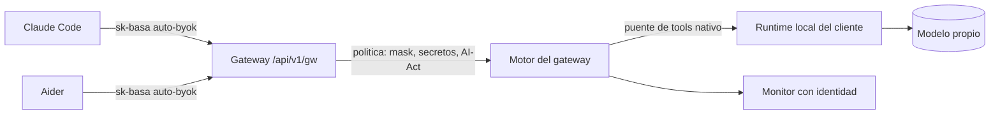

# Modelo propio / local — entorno controlado

El tráfico de IA **no sale a ningún proveedor cloud**: el cliente aloja su propio modelo
(p. ej. con un runtime local como **Ollama** o vLLM) y el gateway lo gobierna con la misma
política que un modelo cloud — masking de PII, bloqueo de secretos, AI-Act y auditoría con
identidad. Es la modalidad pensada para **clientes de infraestructura** (alto riesgo /
residencia de datos estricta); para perfiles de oficina el camino recomendado sigue siendo
el passthrough de suscripción.

**Para quién**: el operador que da de alta un modelo propio en el motor del gateway, y el
integrador que conecta las coding tools del cliente a esa modalidad.

## Cómo funciona

La herramienta del empleado habla con el gateway como siempre; el gateway rutea en modo
`byok` al motor, y el motor sirve la petición con el modelo alojado por el cliente. La
política corre en el mismo lugar de siempre — nada de esto depende del modelo elegido:



- **Ida**: la PII se enmascara antes de salir — el modelo propio **jamás ve el dato real**
  (verificado en vivo: el modelo recibe `[EMAIL_ADDRESS_…]`, no el valor).
- **Vuelta**: la restauración devuelve los valores originales al empleado, en streaming y
  no-streaming.
- **Monitor**: cada petición queda auditada con herramienta, cliente y tenant
  (metadata-only, jamás contenido).

## Alta del modelo (operador)

Es **configuración del motor, no código**: se registra el modelo local con su `api_base`
(el runtime del cliente — una dirección **alcanzable desde el motor** en el despliegue
real; en el stack de desarrollo local es el host de la máquina) y un `model_name` que las
herramientas usarán como identificador. Costo por token 0 (el modelo es del cliente). La
lista viva de modelos se consulta en `GET /api/v1/gw/v1/models` con la virtual key.

## Configuración por herramienta

### Claude Code — 🟢 incluido el modo Agent

```bash
export ANTHROPIC_BASE_URL="https://<host>/api/v1/gw"
export ANTHROPIC_AUTH_TOKEN="sk-basa-<usuario>-<herramienta>-<año>"   # auto-byok
export ANTHROPIC_MODEL="<model_name-del-motor>"
```

**Verificado en vivo**: chat, tool-calling y el **loop agéntico completo** (leer/escribir
archivos y verificar) funcionan con un modelo local — el motor traduce las llamadas de
tools en ambas direcciones, así que el modo Agent **sí** aguanta modelos no-Claude por
esta vía. La calidad del resultado depende del modelo que aloje el cliente (un modelo
chico resuelve tareas simples; la elección es del cliente).

### Aider — 🟢 flujo editor completo

```bash
export ANTHROPIC_API_BASE="https://<host>/api/v1/gw"
export ANTHROPIC_API_KEY="sk-basa-<usuario>-<herramienta>-<año>"
aider --model anthropic/<model_name-del-motor>
```

El diff-apply no se corrompe con el masking y los archivos quedan con los **valores
reales** ([G9](gotchas.md): corregido).

## Gotchas de onboarding

- El runtime necesita **contexto amplio** para los prompts de sistema de las coding
  tools: con Ollama, `OLLAMA_CONTEXT_LENGTH=32768` (el default los truncaría en
  silencio).
- Si la máquina ya tiene una sesión de `claude` logueada con suscripción, esa sesión
  **pisa las variables de entorno** — ver [G10](gotchas.md).
- Si un modelo cloud del motor se queda sin credenciales, el **fallback** configurado
  puede servir la petición con el modelo local. ⚠ La sustitución es **silenciosa** (el
  campo `model` de la respuesta conserva el nombre pedido): si la instalación exige
  trazabilidad estricta del modelo que respondió, deshabilitar ese fallback en el motor.

## Límites verificados

- 🟢 **Round-trip completo de PII** — mask de ida y restauración de vuelta verificados en
  vivo y cubiertos por verificación automática permanente contra el stack vivo.
- 🟢 **Modo Agent de Claude Code** — verificado con tools reales sobre modelo local.
- 🟡 **Cache del motor** — con el cache activado, repetir un prompt crudo idéntico dentro
  de la ventana de cache puede devolver una respuesta cacheada con placeholders
  (limitación conocida en evaluación; desactivar el cache del motor la elimina).
- 🔵 **Superficie de compatibilidad nativa del runtime** — que otras herramientas del
  ecosistema (editores y chats que ya saben hablar con runtimes locales) se conecten al
  gateway con su configuración nativa es roadmap explícito, no implementado.

## Relacionado

- [Integraciones & matriz de compatibilidad](index.md) — la topología completa de
  superficies y el estado verificado de cada herramienta.
- [Gotchas verificados](gotchas.md) — G9 (restauración, corregido) y G10 (sesión con
  suscripción) con síntoma → causa → fix.
- [Operaciones & troubleshooting](../operations/index.md) — la tabla exprés para tickets
  y los endpoints de apoyo del gateway.
- [Instalación & deploy](../install-deploy/index.md) — dónde vive el motor en cada forma
  de despliegue (cloud, on-prem, air-gapped) y qué implica para el `api_base` del runtime.
