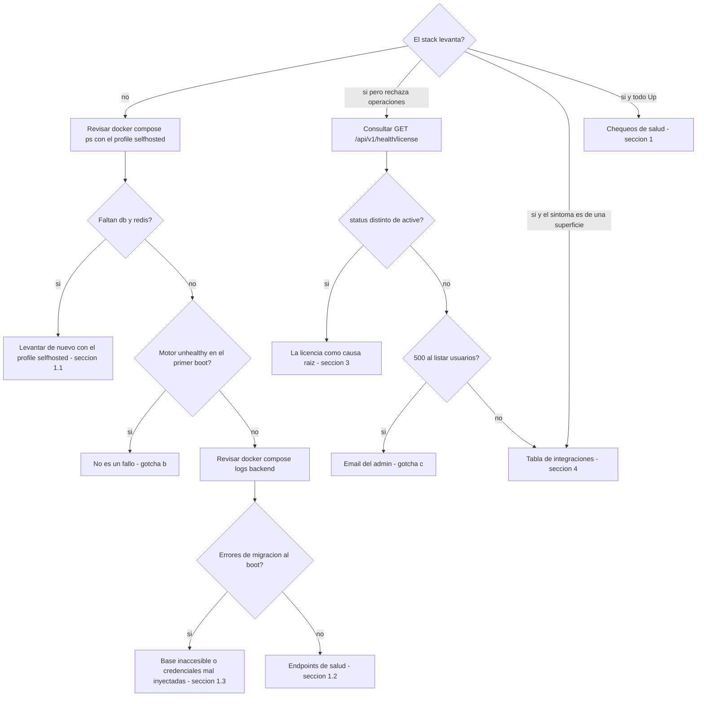

# Operaciones & troubleshooting

**Objetivo**: runbook del **operador** — verificar que el stack está sano, diagnosticar por
síntoma con un árbol de triage, resolver los gotchas operativos verificados en despliegues
reales (síntoma → causa → fix), aislar la licencia como causa raíz, atender tickets de las
superficies de integración y ejecutar el mantenimiento (actualización del motor del gateway
y backup/restore de los volúmenes durables en on-prem).

**Leyenda de estado** (honestidad de producto, se usa en todo el sitio):

| Marca | Significado |
|---|---|
| 🟢 **HOY** | Implementado y verificable hoy |
| 🟡 **PARCIAL** | Existe la base, falta endurecerlo para producción |
| 🔵 **OBJETIVO** | Roadmap / estado-objetivo, no existe aún |

## Prerrequisitos

- **Acceso shell** al host donde corre el stack, con `docker` y el plugin `docker compose` (v2).
- La **definición del despliegue** a mano (compose de producción / módulo IaC): es la fuente de
  verdad de imágenes (tag + digest), volúmenes y variables.
- **En on-prem / self-hosted, todo comando `docker compose` lleva `--profile selfhosted`**
  (o se exporta `COMPOSE_PROFILES=selfhosted` una vez por sesión). Sin el profile, **db y redis
  no existen para compose**: no levantan, y tampoco aparecen en `ps`/`logs`. En cloud
  (base de datos y cache gestionados) el profile se omite.
- `curl` para los endpoints de salud; para el **tier detallado** del health de licencia hace
  falta además una **sesión con rol de operación** (admin / compliance).
- Para la sección de backup: un **destino fuera del host** donde guardar los dumps.

---

## Triage: ¿el stack levanta?

Árbol de decisión para llegar rápido a la sección correcta. Cada hoja apunta a un fix
verificado de este runbook.



---

## 1. Chequeos de salud del stack

### 1.1 Contenedores

```bash
docker compose --profile selfhosted ps   # en cloud (5 servicios): docker compose ps
```

En producción son **5 servicios** (backend, frontend, motor del gateway, docs, **sidecar NLP**).
En **on-prem / self-hosted** el stack se levanta con `--profile selfhosted` (o exportando
`COMPOSE_PROFILES=selfhosted`), que suma **ingress**, **db** y **redis** → **8 contenedores**.
Todos deben estar `Up` / `healthy`. (El compose de desarrollo, con más servicios, es sólo para
desarrollo.)

El **sidecar NLP** (`nlp-analyzer`) viaja en todo compose de producción, piloto o no — no es
un extra que se activa después. Lo consultan el backend y el motor del gateway para la
detección de PII/PHI; si cae, la postura de degradación (`nlp_fail_mode`) decide si el
tráfico sigue con el detector por patrones o se corta — ver
[límites conocidos](../overview/index.md#limites-conocidos).

!!! note "El motor puede reportarse `unhealthy` en el primer boot sin estar caído"
    En el primer arranque las migraciones internas del motor tardan varios minutos y el healthcheck
    puede agotar su timeout aunque el servicio haya arrancado bien. Ver el [gotcha b](#b-el-motor-del-gateway-reportado-unhealthy-en-el-primer-boot-no-es-un-fallo).

### 1.2 Endpoints de salud

| Chequeo | Endpoint | Qué esperar |
|---|---|---|
| Backend (liveness) | `GET /health` del backend | `200` — el **proceso** del backend responde. Es una respuesta estática: **no** verifica la base de datos |
| Motor del gateway | `GET /health/readiness` del motor | `200` — el motor terminó sus migraciones y acepta tráfico |
| Producto | `GET /api/v1/health` del backend | Estado del **producto** (no del contenedor): `healthy` / `degraded`, con el detalle de auditoría y de la detección de datos personales para roles de operación |
| Licencia | `GET /api/v1/health/license` del backend | Estado de la licencia instalada, en **dos niveles** (ver abajo) |

El health de licencia responde en **dos niveles**, a propósito:

- **Sin autenticación** (probe de monitoreo): sólo `{status, clock_rollback_suspected}` —
  suficiente para saber si la licencia está sana, sin filtrar dimensionamiento a un caller
  anónimo.
- **Con sesión de rol de operación** (admin / compliance): agrega `reason`, `expiry`,
  `grace_days`, `max_seats`, `seats_used`, el resumen de la última reconciliación de seats y la
  identidad de la cadena de auditoría. Nunca devuelve el token crudo ni material de claves.

Para señales de **base de datos**, `GET /health` no alcanza: mirar los logs de migraciones del
backend al arranque (sección 1.3) y el estado de los servicios
(`docker compose --profile selfhosted ps`).

#### Estado de la detección de datos personales

El health de producto lleva un bloque `nlp` con el estado del **motor de detección** (el
servicio de lenguaje que hace la detección real). Va en el tier de operación, con la misma
lógica de dos niveles: el `status` global sí es público, el detalle no.

```bash
curl -s -H "Authorization: Bearer $TOKEN" \
     http://<host>/api/v1/health | jq .nlp
```

| `status` | Significa | Acción |
|---|---|---|
| `ok` | El motor está configurado y responde. | Ninguna. |
| `not_configured` | No hay motor de detección cableado: la instalación corre con detección local por patrones (modo de desarrollo). **No** degrada el estado global — no es una avería. | Si el despliegue trata datos reales, cablear el servicio. |
| `unreachable` | El motor está configurado y **no responde**. El estado global pasa a `degraded`. | Sección 1.3 (logs) y el estado del servicio de detección en `ps`. |

Cuando el estado es `unreachable`, `fail_mode_efectivo` dice qué le está pasando al tráfico
**ahora mismo** — y son dos situaciones muy distintas:

- `block` (por defecto): las peticiones con enmascarado activo se están **rechazando**. El
  síntoma que reporta el usuario es "el asistente devuelve un error", no "va lento".
- `degrade`: las peticiones **siguen saliendo** con detección por patrones, con cobertura de
  datos personales reducida. `degraded_since` y `degraded_requests` acotan el alcance: desde
  cuándo y cuántas peticiones se sirvieron así.

!!! warning "`degraded_requests: null` no es cero"
    Igual que el contador de auditoría: `null` significa que **no se pudo leer** el contador
    (cache no disponible), no que no haya habido degradación. Cero es cero; `null` es "no lo
    sé".

El contador se limpia solo cuando el backend **confirma** que el motor volvió a responder — no
por el paso del tiempo, para que una racha corta no desaparezca sin que nadie la haya visto.
La política ante esta caída se configura en el panel: ver
[Gobernanza — qué pasa si el motor de detección deja de responder](../administration/gobernanza.md#que-pasa-si-el-motor-de-deteccion-deja-de-responder).

!!! warning "La licencia es fail-closed"
    Sin una licencia válida instalada, el producto rechaza la operación licenciada en lugar de
    continuar en silencio. `GET /api/v1/health/license` es el primer endpoint a consultar cuando
    "todo está `Up` pero algo se rechaza": permite distinguir un problema de infraestructura de un
    problema de licencia (expirada, firma inválida o seats agotados). El detalle síntoma → causa →
    fix está en la [sección 3](#3-la-licencia-como-causa-raiz-sintoma-causa-fix).

### 1.3 Qué mirar en los logs

```bash
docker compose --profile selfhosted logs -f backend   # o el servicio que corresponda
```

- **Backend, al boot**: corre las migraciones de esquema automáticamente. Errores en esta fase casi
  siempre significan base de datos inaccesible o credenciales mal inyectadas.
- **Motor del gateway, al boot**: la línea `Application startup complete` confirma que arrancó bien,
  aunque el healthcheck del compose lo haya marcado `unhealthy` por timeout (gotcha b).
- **Licencia**: cuando el bloqueo total está activo (sección 3), el **motivo real** del corte va a
  los logs del backend — el cliente sólo recibe un mensaje genérico, para no filtrar estado
  interno a un caller sin autenticar.
- **Auditoría durable**: es **metadata-only** — los logs y la auditoría persistida no contienen
  texto de prompt ni PII cruda. Si un log mostrara contenido de prompt, es un hallazgo a reportar,
  no un comportamiento esperado.

---

## 2. Gotchas operativos verificados (síntoma → causa → fix)

Todos verificados en despliegues reales o en el código actual del producto.

### a) On-prem sin egress: clonar/pull falla

- **Síntoma:** en redes sin salida a Internet, `git clone` devuelve **403** y `docker pull` no resuelve.
- **Causa:** no hay egress hacia registries ni repositorios externos.
- **Fix:** para código, usar un **espejo** accesible desde esa red. Para imágenes, entregar el
  **tarball air-gapped** (`docker save` / `docker load`). Recordar además que **el acceso a los
  proveedores de LLM también requiere egress** salvo que se usen **modelos locales** (Ollama/vLLM) —
  en air-gapped puro, el catálogo de modelos del motor debe apuntar sólo a modelos locales.

### b) El motor del gateway reportado `unhealthy` en el primer boot (no es un fallo)

- **Síntoma:** en el primer arranque, el healthcheck de `docker compose` marca el motor `unhealthy`.
- **Causa:** el primer boot tarda varios minutos (migraciones internas de base de datos) y el timeout
  de espera del healthcheck puede agotarse **aunque el contenedor haya arrancado bien**.
- **Fix:** verificar con `docker logs <contenedor-del-motor>` — si dice `Application startup complete`
  y `/health/readiness` responde 200, está sano. Correr `docker compose --profile selfhosted up -d`
  **de nuevo** (o exportar `COMPOSE_PROFILES=selfhosted`; **sin el profile, db y redis no
  arrancan**): como db/redis/motor ya quedan corriendo, la segunda pasada sólo levanta el resto de
  los servicios y es rápida.

### c) Bootstrap de admin con email `.local` rompe la pestaña de Usuarios

- **Síntoma:** cualquier respuesta que incluya la lista de usuarios devuelve **500** — la pestaña
  "Usuarios & Presupuestos" entera deja de funcionar.
- **Causa:** el bootstrap de admin usa un email hardcodeado. Con `admin@basa.local` (o cualquier TLD
  reservado `.local`/`.test`/`.example`/`.invalid`), una versión reciente del validador de emails de
  la capa de API lo rechaza como inválido.
- **Fix:** **corregido en el código actual** (el bootstrap usa `admin@basa.com.ar`). Para un deploy
  que **ya** tiene un admin con el email viejo, corregir a mano en la base:

```bash
docker exec <db-container> psql -U <user> -d <db> \
  -c "UPDATE users SET email='admin@basa.com.ar' WHERE username='admin';"
```

### d) La consola web parte secretos/URLs de más de ~80 caracteres

- **Síntoma:** error confuso de autenticación ("Malformed input to a URL function" /
  "Authentication failed") al pegar una URL o secreto largo en una consola web (sin GUI).
- **Causa:** la consola inserta un **salto de línea real** en medio de cualquier texto de más de
  ~80 caracteres, rompiendo el valor pegado.
- **Fix:** partir cualquier secreto/URL larga en variables de shell cortas (≤25-30 caracteres cada
  una) en líneas separadas, y concatenarlas al usarlas:

```bash
P1="mitad1delaclave"
P2="mitad2delaclave"
echo "${P1}${P2}" | wc -c   # verificar longitud antes de usarla
```

### e) "Sin usuario" en el desglose de costos — no es un bug

- **Síntoma:** consultas que aparecen atribuidas a "Sin usuario" en el desglose de costos.
- **Causa:** el gasto se atribuye a una persona sólo cuando ésta tiene una **llave personal** en el
  motor, creada automáticamente recién al asignarle un perfil de presupuesto. Las consultas hechas
  **antes** de asignar presupuesto viajan con la llave maestra compartida y aparecen como
  "Sin usuario". No es retroactivo.
- **Fix:** no hay nada que arreglar — explicarlo en training para no confundirlo con un fallo de
  atribución. Asignar el perfil de presupuesto lo antes posible en el onboarding.

### f) Rotar la password de un usuario ya creado

- **Síntoma:** hay que cambiar la contraseña de alguien (la olvidó, se filtró, o es la que le entregó
  el administrador al darle de alta).
- **Causa:** ninguna — hay dos caminos según **quién** la cambia, y son distintos a propósito.
- **Fix:**
    - **Cada persona, la suya**: botón *Cambiar mi contraseña* en el bloque de sesión de la barra
      lateral (cualquier rol), o `POST /api/v1/users/me/password` con
      `{"current_password": "...", "new_password": "..."}`. Exige la **actual**: el token de sesión
      sigue siendo válido en un equipo ajeno y no alcanza como prueba de identidad. Un `401` acá
      significa "la actual no coincide", no sesión vencida.
    - **El administrador, la de otro (reseteo)**: botón *Restablecer contraseña* en
      *Usuarios & Presupuestos*, o `POST /api/v1/users/{user_id}/password` con
      `{"new_password": "..."}`. **No** pide la actual, porque el administrador no la conoce.
      Requiere rol admin y devuelve `404` si el usuario no existe.

El mínimo es **12 caracteres** (`422` con el detalle en español si no llega). La contraseña anterior
deja de funcionar de inmediato: entregar la nueva por un canal seguro, y pedirle a la persona que la
cambie con *Cambiar mi contraseña* para que quede una que sólo ella conozca.

!!! warning "No rotar por SQL"
    Este apartado documentaba antes un `UPDATE users SET password_hash='<sha256>'`. **No usarlo**: el
    almacenamiento pasó a bcrypt (sal por hash + coste de cómputo) y escribir un sha256 a mano
    degrada la credencial a un formato invertible con una tabla precomputada. El verificador todavía
    ACEPTA ese formato viejo —para no dejar afuera a los usuarios ya cargados, que se convierten
    solos en su siguiente login— y por eso el `UPDATE` "funcionaría" sin avisar de nada.

---

## 3. La licencia como causa raíz (síntoma → causa → fix) { #3-la-licencia-como-causa-raiz-sintoma-causa-fix }

El licenciamiento es 🟢 **fail-closed y 100% offline** (verificación de firma local, sin
phone-home). Por diseño, varios "errores raros" de un stack sano son en realidad estados de
licencia. El modelo completo (estados `active → grace → expired`, seats, reconciliación,
true-up) está en [Administración](../administration/index.md); acá va el diagnóstico.

### L1 · Crear una Connection o un usuario devuelve **402**

- **Síntoma:** el alta falla con `402 license_seat_limit_exceeded` y el mensaje indica
  `N/N seats activos`.
- **Causa:** tope de seats alcanzado. Un **seat = una Connection ACTIVA** (virtual key activa y
  no expirada) del tenant — **no** un usuario: desactivar un usuario **no** libera seats.
- **Fix:** **revocar Connections** que ya no se usan, o ampliar la licencia con el emisor
  (renovación / true-up **fuera de banda**, sin egress). Verificar `seats_used` vs `max_seats`
  con el tier autenticado de `GET /api/v1/health/license`.

### L2 · Crear devuelve **403** `license_creation_blocked`

- **Síntoma:** toda creación de seats se rechaza con 403, aunque el stack esté `Up` y el tráfico
  existente funcione.
- **Causa:** licencia **ausente**, de **firma inválida**, **de otro tenant** (no coincide con el
  tenant del despliegue) o en estado degradado (`grace`/`expired`/`over_seat`). Fail-closed:
  "sin token" jamás significa "ilimitado".
- **Fix:** instalar el archivo de licencia correcto del tenant del despliegue y reiniciar el
  backend. `reason` en el tier autenticado del health de licencia dice cuál de las causas es.
  Flujo de emisión/instalación en [Licenciamiento offline](../install-deploy/licensing.md).

### L3 · **Todo** el tráfico del gateway responde **403** con mensaje genérico

- **Síntoma:** las rutas de servicio bajo `/api/v1/gw` (messages, count_tokens, models, whoami,
  inspect) devuelven `403 license_degraded…` con un mensaje fijo, sin detalle.
- **Causa:** el **bloqueo total** está habilitado por toggle en el despliegue y la licencia está
  `expired` (más allá de la gracia) o el tenant en `over_seat`. El corte ocurre **antes** de
  rutear o tocar upstream, y el mensaje al cliente es genérico a propósito — el motivo real va a
  los **logs del backend**. `GET /api/v1/gw` (discovery) queda abierto para diagnóstico.
- **Fix:** instalar la renovación de la licencia (o resolver el over-seat, L5). Importante para
  no sobre-diagnosticar: `grace` **jamás** corta tráfico, con o sin bloqueo total; y **sin** el
  toggle, el modo degradado por defecto sólo bloquea **altas** — el tráfico existente sigue.

### L4 · `clock_rollback_suspected: true` en el health de licencia

- **Síntoma:** el probe anónimo de `GET /api/v1/health/license` devuelve
  `clock_rollback_suspected: true`; las altas se degradan.
- **Causa:** el reloj del host aparece **detrás** de la última marca monotónica registrada — la
  evidencia de expiración deja de ser confiable, así que la creación se degrada de forma
  conservadora. El episodio queda en la **auditoría hash-encadenada**.
- **Fix:** corregir el reloj/NTP del host. Cuando el reloj vuelva a superar la marca registrada,
  la creación se rehabilita sola.

### L5 · Seats liberados, pero el alta sigue bloqueada un rato

- **Síntoma:** después de revocar Connections, crear sigue devolviendo error durante algunos
  minutos.
- **Causa:** el estado `over_seat` lo publica un **job periódico de reconciliación**; el bloqueo
  persiste hasta que una corrida recuente y vuelva a `ok`. Toda transición queda auditada.
- **Fix:** esperar la siguiente corrida (el intervalo es configurable en el despliegue) y
  verificar con el tier autenticado del health de licencia (`reconcile.tenant_status`).

---

## 4. Troubleshooting rápido de integraciones

Referencia express para tickets sobre las superficies de integración (`base_url` y `browser`).
Los códigos **G#** refieren al detalle causa → fix en
[Gotchas de integración](../integrations/gotchas.md).

| Síntoma | Causa probable | Fix |
|---|---|---|
| Claude Code ignora la identidad (aparece admin/default) | No reinició `claude` tras editar `settings.json`; o falta `X-Basa-Key` | Reiniciar `claude`; verificar con `curl …/api/v1/gw/whoami -H "X-Basa-Key: …"` |
| Copilot 401 / no autentica | `x-api-key` vacío, `apiKey` ignorado (G2) | Poner la key en la URL: `…/api/v1/gw/v1/messages?k=sk-basa-…` |
| Copilot loopea, tarjetas `in=0 out=NN` repetidas (G1) | Modo Agent/Edit con modelo no-Claude | Cambiar a **modo Ask** |
| El nombre real sale en el título de Claude.ai (G3) | Endpoint `/title` con prompt crudo | Confirmar que el adapter matchea `/title`; recargar la extensión (↻) |
| Placeholders `[PERSON_0]` visibles en un artefacto de Claude (G5) | Artefacto en `iframe`, `all_frames:false` | Limitación conocida; mostrar en el chat |
| La página web queda bloqueada por un overlay 🛡️ | Fail-closed: sin key válida o gateway caído | Conectar con key válida en el popup; verificar que el gateway responde `/api/v1/gw/whoami` |
| La extensión no llega al gateway (sin CORS pero sin respuesta) | Falta el **permiso de host** del gateway, o la dirección ingresada no apunta al gateway real | En el popup (**⚙**) verificar la **dirección del gateway** y **conceder el permiso de host** cuando el navegador lo pida; una dirección remota debe ser `https://` |
| La extensión no conecta y el navegador avisa «sitio no seguro» en esa dirección | El puesto no confía en la **CA interna** del ingress (el `.crt` se instaló con doble-click → almacén del **usuario**, no de la máquina) | Correr `install-ca.bat` del kit de confianza en ese puesto y comprobar el VERDE — ver [§5.1](#51-confianza-del-certificado) |
| Todos los puestos pierden la confianza a la vez tras tocar el ingress | Se recreó el volumen del ingress: la **CA interna se regeneró** y la anterior ya no vale | Re-exportar el kit (`export-ca.sh`) y redistribuir; con GPO, reimportar el `root.crt` nuevo en la directiva |
| Al conectar, el navegador pide un permiso y sin él no conecta | Permiso de host en runtime (la dirección la ingresa el usuario, no viene horneada) | Conceder el permiso al host del gateway; cambiar de host vuelve a pedirlo. Denegar deja la sesión sin conectar |
| Chip **ámbar** "Detección por patrones · cobertura parcial" en el panel | Indicador de honestidad de la superficie: la detección es por patrones, no lingüística | **No es un fallo** — es el indicador correcto (texto del servidor). Nunca presentarlo como "protegido" / cobertura total |
| El envío se frena con un **motivo**, no con "servicio no disponible" | Bloqueo de política del gateway (el motivo lo da el servidor) | Es correcto: la extensión muestra el motivo real. "Servicio no disponible" es sólo cuando el gateway está **caído** |
| El usuario aparece **desconectado** sin haber tocado nada | Rechazo del gateway en la revalidación (~30 min o al reabrir): key inválida/vencida o plaza revocada | Reemitir/renovar la Connection del usuario y que reingrese la key en el popup. Un **corte de red no desconecta** (conserva la key y se recupera solo) |
| Un secreto pasa PERMITIDO en un prompt gigante | Cap de inspección desde la cabeza (G7) | Debe estar el fix de la **cola**; confirmar versión del gateway |
| Tool-calling agéntico falla con modelo no-Claude (`tool_use_failed`) | Es el **loop de Copilot/Cursor** (G1), no una regla de byok: Claude Code en Agent SÍ funciona con modelos no-Claude vía el puente de tools del motor | Copilot → **modo Ask**; para agéntico: Claude Code por suscripción **o** con modelo propio (§3.5 de Integraciones) |
| Nada aparece en el monitor | Superficie no llama al gateway (masking local viejo) o buffer efímero vacío | La extensión debe llamar `POST /api/v1/gw/inspect`; revisar `GET /api/v1/gw/events` (el buffer vive en memoria y se vacía al reiniciar el gateway) |
| Rutas `/gw` de servicio devuelven 403 genérico en **todas** las superficies | Bloqueo total por licencia (L3) | Ver la [sección 3](#3-la-licencia-como-causa-raiz-sintoma-causa-fix) — no es un problema de la superficie |

**Endpoints de apoyo (superficie `base_url` + `browser`):**
`GET /api/v1/gw` (discovery), `POST /api/v1/gw/v1/messages` (firewall),
`POST /api/v1/gw/v1/messages/count_tokens`, `GET /api/v1/gw/v1/models`,
`GET /api/v1/gw/whoami` (valida key → identidad), `POST /api/v1/gw/inspect` (masking de texto
plano, fail-closed), `GET /api/v1/gw/events` (feed efímero) y `GET /api/v1/gw/monitor` (consola
en vivo). No existen otros endpoints `/gw` que estos.

!!! warning "Recordatorio de honestidad (para no sobrevender)"
    La detección de PII hoy es **por patrones, in-process** (el motor NLP avanzado es 🔵 roadmap); el monitor
    es una **vitrina de demo** con feed efímero en memoria — la auditoría durable (Postgres) sigue
    siendo **metadata-only** (cero texto de prompt, cero PII cruda). El masking reversible reenvía el
    original salvo con redacción activa (`X-Basa-Redact`), donde el modelo solo ve placeholders y el
    caller recibe los valores reales.

---

## 5. Reparto y operación de la extensión de navegador

La superficie `browser` (ChatGPT / Claude web) se gobierna con la **extensión de navegador**. El
operador la **reparte** y acompaña la conexión de cada usuario; la configuración de la extensión la
hace el **propio usuario** (dirección del gateway + key). El detalle de la superficie, su contrato y
su diagrama están en [Integraciones §3.3](../integrations/index.md).

### 5.1 Requisito previo: que el puesto confíe en el certificado { #51-confianza-del-certificado }

**Cuándo aplica:** sólo cuando el ingress termina TLS con su **CA interna** (`tls internal`
en el Caddyfile), que es el caso de una LAN sin dominio público. Con un certificado público
o emitido por la CA del propio cliente **no hay nada que distribuir** y esta subsección no
aplica.

**Por qué NO es opcional:** la extensión exige `https` válido para cualquier host que no sea
`localhost`. Un certificado en el que el puesto no confía no deja la superficie "con
avisos": la deja **fuera de servicio**. Por eso el reparto del certificado va **antes** que
el reparto del paquete (§5.2), no después.

**Kit de confianza — armarlo una vez, en el servidor de la instalación**, desde el
directorio del bundle desplegado (el mismo desde el que se levantó el stack):

```bash
./trust-kit/export-ca.sh --project <proyecto-compose> \
                         --url https://<direccion-de-la-pasarela>
```

Extrae la raíz de la CA interna del contenedor del ingress
(`/data/caddy/pki/authorities/local/root.crt`), la deja junto a los instaladores de puesto
y **muestra su huella SHA-256**. Si el ingress sirve HTTP plano o TLS con otro certificado,
el script lo dice y no genera nada — no hay CA interna que repartir.

| Fichero del kit | Destino |
|---|---|
| `root.crt` | la CA raíz de esa instalación |
| `install-ca.bat` + `install-ca.ps1` | puesto Windows (doble-click en el `.bat`) |
| `install-ca-macos.sh` | puesto macOS |
| `gateway-url.txt` | la URL que el instalador usa para verificar sin que nadie teclee |

**La huella SHA-256 viaja por un canal distinto** del que lleva la carpeta. No es
ceremonia: una CA en el almacén raíz de la máquina hace que ese puesto acepte **cualquier**
certificado que ella firme, para todo destino y sin ningún síntoma visible si el fichero
que llegó no era el correcto. Cotejar la huella fuera de banda es la **única** salvaguarda
del kit, así que **los instaladores no escriben en el almacén hasta que queda verificada** —
y el operador es quien tiene que poner esa huella en manos del IT antes de que empiecen.

**Puesto a puesto:** doble-click en `install-ca.bat` (se auto-eleva) o `./install-ca-macos.sh`.
Muestran la huella y **se detienen a preguntar**; el default es **No**, así que un INTRO
distraído cancela en vez de instalar. En Windows la pregunta sale en la **ventana elevada**
(la que abre el UAC), no en la original — dígaselo al IT o se quedará mirando la ventana
equivocada. Ambos son idempotentes y terminan con un **VERDE/ROJO** que no sale de mirar el
almacén: abren un **handshake TLS real** contra la pasarela y validan la cadena contra el
almacén del sistema —el mismo camino que hace el navegador—, distinguiendo un fallo de
**conexión** (red, dirección equivocada) de uno de **validación** (confianza, nombre del
certificado).

**Desatendido (GPO con script de inicio, gestión de flota, MDM): con `-Fingerprint`, y no
hay alternativa.** Sin nadie que pueda contestar por pantalla, la huella se pasa por
parámetro y la comprueba el propio instalador en cada equipo:

```bat
install-ca.bat -NoPause -Fingerprint <HUELLA-SHA-256> -Url https://<direccion-de-la-pasarela>
```

```bash
./install-ca-macos.sh --fingerprint <HUELLA-SHA-256> --url https://<direccion-de-la-pasarela>
```

El equipo al que le llegue otro fichero **aborta con código 4 y no instala nada**, en vez de
confiar en una CA que nadie miró. `export-ca.sh` imprime estas dos líneas ya rellenas al
armar el kit: páselas tal cual. Se acepta la huella con `:` o sin él, en mayúsculas o
minúsculas, que es como el IT la va a pegar.

!!! warning "`-NoPause` no es un bypass"
    `-NoPause` declara «no hay nadie delante». **Sin `-Fingerprint`, el instalador aborta
    (código 4) en lugar de instalar a ciegas**: el modo que toca más máquinas no puede ser
    el que no comprueba nada. La salida explícita es `-Fingerprint`; existe además
    `-AcceptFingerprint` / `--accept-fingerprint` para renunciar a la comprobación a
    propósito, y sólo tiene sentido si el IT ya cotejó la huella por otro medio.

    **Y `-NoPause` no es la única forma de quedarse sin operador.** Desde el 2026-07-31
    los dos instaladores tratan como desatendida también la ejecución **con la entrada
    redirigida** (sin consola, desde una herramienta de flota, con `stdin` en `/dev/null`
    o por tubería) y la sesión sin escritorio: ahí tampoco preguntan, abortan con `4`.
    En macOS eso ya lo hacía `[ ! -t 0 ]`; en Windows faltaba, y por ese hueco la pregunta
    se daba por contestada que **sí** y la CA entraba en el almacén de la máquina.
    Si una herramienta de despliegue empieza a devolver `4` donde antes daba verde, la
    lectura correcta es que **esos equipos nunca cotejaron la huella**: hay que rehacer
    el despliegue con `-Fingerprint`, no buscar cómo volver al comportamiento anterior.

    Códigos de salida para la herramienta de despliegue: `0` verde · `1` la verificación
    TLS falló · `2` error de entrada · `3` no se pudo elevar · `4` **huella no verificada,
    no se instaló nada**.

**Flota Windows en dominio:** directiva de grupo, que evita tocar equipo por equipo →
*Configuración del equipo → Directivas → Configuración de Windows → Configuración de
seguridad → Directivas de clave pública → **Entidades de certificación raíz de confianza***
→ botón derecho → **Importar** → `root.crt`; vincular la directiva a la OU de los equipos y
`gpupdate /force` en uno de prueba. **Ojo con este camino:** la consola de directivas no
coteja ninguna huella y lo que se importe ahí se instala solo en todo el dominio, así que
el IT tiene que verificarla a mano **antes** de importar (`certutil -hashfile root.crt
SHA256`). Si prefiere repartir el instalador en vez del certificado, use la forma con
`-Fingerprint` de arriba: es la que mantiene la comprobación en cada equipo. La guía para
el cliente final vive en el **sitio de documentación de cliente** (`docs-cliente/`, sección
«Confiar el certificado en los equipos»).

**Gotchas verificados en el piloto (síntoma → causa → fix):**

- **El certificado "se instaló" y el navegador sigue avisando** → el doble-click sobre el
  `.crt` abre el asistente de Windows, que por defecto importa en el almacén del **usuario
  actual** y termina diciendo «importación correcta»: cero feedback de que fue al almacén
  equivocado → correr `install-ca.bat`, que va a `Cert:\LocalMachine\Root` (equivalente de
  `certutil -addstore -f Root <fichero>`) y **comprueba**. Ésta fue la causa raíz de la
  fricción del 30-jul.
- **Funciona en Edge/Chrome y falla en Firefox** → Firefox no usa el almacén de Windows,
  trae el suyo (NSS) → los instaladores activan la directiva `ImportEnterpriseRoots`
  (`HKLM\SOFTWARE\Policies\Mozilla\Firefox\Certificates` en Windows,
  `/Library/Preferences/org.mozilla.firefox` en macOS); **Firefox debe reiniciarse** para
  tomarla.
- **ROJO en etapa «validación» con la CA correcta instalada** → la dirección por la que se
  entra no está en el certificado del servidor: si se emitió con SAN de **IP**, hay que
  entrar por esa IP, no por un nombre → reemitir el certificado del servidor con el SAN que
  corresponda; no se arregla en el puesto.
- **Todos los puestos dejan de confiar a la vez** → caducó la CA interna → reemitirla en el
  ingress y volver a distribuir el kit (la CA interna se regenera con el volumen del
  ingress: **borrarlo obliga a repetir la distribución en toda la flota**).
- **El instalador termina en «LA HUELLA NO COINCIDE» (código 4)** → el `root.crt` de ese
  puesto no es el de esta instalación: copia de un kit anterior, kit de otro cliente, o
  fichero alterado en tránsito → **no lo instale**; reponer el `root.crt` desde el kit
  recién exportado y volver a cotejar la huella por el canal aparte. Si aparece **después
  de recrear el volumen del ingress**, la causa es la CA regenerada: hay kit y huella
  nuevos, y toca redistribuir.
- **El despliegue desatendido no instala en ningún equipo y devuelve 4** → se lanzó con
  `-NoPause` sin `-Fingerprint`, y ese camino aborta a propósito → añadir la huella al
  comando (la imprime `export-ca.sh`).

!!! note "Esto es el fallback, no el destino"
    Distribuir una CA interna funciona y es lo correcto en air-gap, pero pone un paso manual
    en cada alta de equipo. El camino sin fricción —certificado público real por cliente, sin
    nada que instalar en los puestos— y el camino BYO/AD CS para el tier pesado se siguen en
    el **issue #51**.

### 5.2 Reparto del paquete

- **Paquete por partner:** la extensión se entrega como un **zip con la marca del partner** y un
  **identificador estable**, **sin dirección de gateway horneada**. Viaja dentro del **bundle de
  instalación** (ver [Install / Deploy](../install-deploy/index.md)); no se descarga de una tienda
  pública.
- **Instalación:** el IT del cliente la carga descomprimida (`chrome://extensions` →
  **Modo de desarrollador** → **Cargar descomprimida**), o la distribuye por su gestión de flota.
- **Marca neutra:** el mismo contenido de runtime se rebrandea por cliente. El operador **no** edita
  código para cambiar de marca ni para apuntar a su propio gateway.

### 5.3 Conexión y permiso de host

El usuario, **una sola vez**, ingresa en el popup (**⚙**) la **dirección del gateway**
(`https://<host>/api/v1/gw`) y su **API key**, y **Guardar y conectar**:

- **Permiso de host en runtime:** al conectar, el navegador pide permiso para acceder al host del
  gateway. **Hay que concederlo**; sin él la extensión no llega al gateway. Cambiar de host lo
  vuelve a pedir.
- **Remota = `https://`:** una dirección remota debe ser `https://` (sobre `http` la key viajaría en
  claro); `http://` sólo para un gateway local.
- **Chip de honestidad:** conectado, el panel muestra un chip **ámbar** "cobertura parcial" — la
  detección en esta superficie es **por patrones**. El texto lo provee el servidor. En soporte,
  presentarlo siempre como **cobertura parcial**, nunca como "protegido".
- **Bloqueo con motivo real:** un envío bloqueado por política muestra el **motivo del servidor**;
  sólo un gateway caído muestra "servicio no disponible".

### 5.4 Offboarding (revocación / vencimiento)

Dar de baja a un usuario o vencer su acceso lo **desconecta** de la superficie `browser` sin tocar
su navegador:

- **Revocar la Connection** del usuario (o **vencer** su key) hace que la próxima revalidación
  (**~30 min** o al **reabrir el navegador**) reciba un rechazo del gateway: la extensión **borra**
  la key guardada y pide reconfigurar. El ciclo de vida de Connections y el vencimiento están en
  [Administración](../administration/index.md).
- **Mensajes al usuario:** key inválida/vencida → "Tu API key no es válida"; plaza revocada →
  "Tu plaza ya no está activa. Consultá con tu administrador".
- **Corte de red ≠ baja:** un corte de conexión **no** desconecta al usuario ni borra su key — la
  sesión se conserva y se recupera sola. No confundir "sin conexión, se reintenta solo" con un
  offboarding.

## 6. Mantenimiento

### 6.1 Actualización del motor del gateway

La imagen del motor del gateway se **fija por tag + digest** en la definición del despliegue
(`docker-compose.yml` / módulo IaC): el despliegue es reproducible y el motor no cambia por debajo
sin una decisión explícita del operador.

Para actualizar el motor:

1. Cambiar el **digest** en la definición del despliegue.
2. Correr las **dos verificaciones**:
    - La **suite de contrato del backend** — verifica los contratos que el producto tiene con el
      motor: las firmas de los puntos de extensión del guardrail, la autenticación de virtual keys
      y una ejecución real sobre `/v1/messages`:

        ```bash
        docker compose --profile selfhosted run --rm --no-deps backend pytest tests/contract -q
        # en cloud, sin el profile
        ```

    - `make -C deploy check` — valida los artefactos del release.
3. Si ambas pasan → aplicar el cambio. Si algo falla → **no parchear la integración a ciegas**:
   investigar qué contrato cambió en la nueva versión del motor.

!!! tip "Regla de oro"
    **Actualizar el motor = correr las verificaciones, no reescribir a mano.** Un check en rojo es
    información (el contrato del motor cambió), no una invitación a parchear hasta que pase.

### 6.2 Backup / restore de volúmenes durables (on-prem)

En cloud con base de datos y cache **gestionados**, los backups y la alta disponibilidad quedan del
lado del proveedor gestionado. En **on-prem** (contenedores con volúmenes locales), el backup es
responsabilidad del operador. Los volúmenes durables del stack son tres:

| Volumen | Contiene | Patrón de backup |
|---|---|---|
| **Postgres** | Configuración, tenants, usuarios/Connections, presupuestos y la auditoría durable | Dump lógico periódico: `docker exec <db-container> pg_dump -U <user> -d <db> > backup-$(date +%F).sql` |
| **Redis** | Estado de runtime (contadores, cache) | Snapshot del volumen (o `BGSAVE` y copiar el `dump.rdb`). Perderlo no pierde datos de negocio, pero reinicia contadores de runtime |
| **Licencia** | El archivo de licencia firmada instalado | Copia simple del archivo/volumen de licencia junto con el resto del backup |

Reglas del patrón:

- **Backup consistente**: correr el dump de Postgres con el stack en marcha es válido (dump lógico);
  para snapshot de volúmenes a nivel filesystem, detener el stack primero
  (`docker compose --profile selfhosted stop`).
- **Guardar fuera del host**, con checksum, siguiendo la política de retención del cliente.
- **Restore** = restaurar el volumen/dump en un stack limpio (`psql < backup.sql` para Postgres,
  reponer el archivo de licencia) y levantar con `docker compose --profile selfhosted up -d`
  (o exportar `COMPOSE_PROFILES=selfhosted`; sin el profile, db y redis no arrancan). El backend
  re-aplica sus migraciones al boot si hace falta.
- **Probar el restore** periódicamente: un backup que nunca se restauró no es un backup.

!!! warning "Incluir la licencia en el backup"
    Como la licencia es fail-closed, un restore sin el archivo de licencia deja un stack que arranca
    pero rechaza la operación licenciada (sección 3). El archivo de licencia forma parte del backup,
    no un extra opcional.

## Relacionado

- [Install / Deploy](../install-deploy/index.md) — el flujo de instalación de punta a punta, los
  deliverables (incluido el tarball air-gapped que piden los fixes de egress) y los mismos gotchas
  vistos desde el momento de instalar.
- [Licenciamiento offline](../install-deploy/licensing.md) — emisión, renovación (true-up) y postura
  de IP del archivo de licencia cuyos síntomas diagnostica la sección 3.
- [Gotchas de integración](../integrations/gotchas.md) — el detalle causa → fix de los códigos G#
  de la tabla de troubleshooting rápido.
- [Administración](../administration/index.md) — el modelo completo detrás de los síntomas: tenants,
  roles, budgets y el ciclo de vida de licencias y seats.
- [Infraestructura](../install-deploy/infrastructure.md) — topología de red, secretos por
  instalación y las diferencias cloud vs on-prem que cambian qué comandos llevan el profile.
