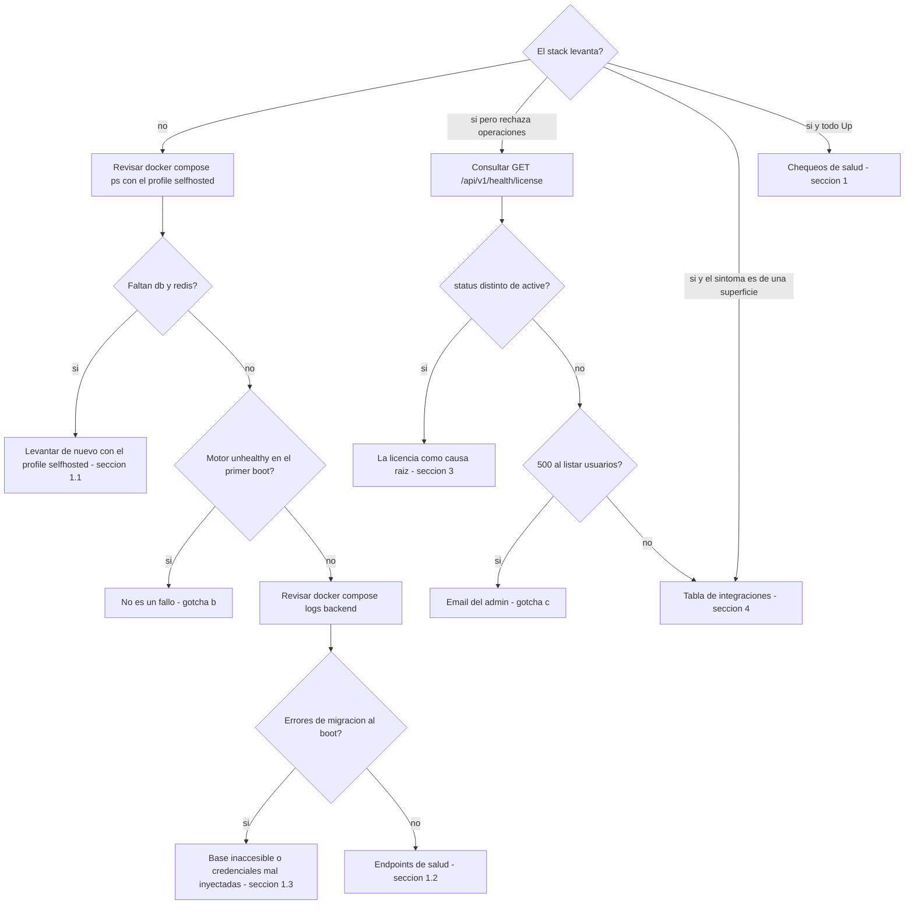

# Operaciones & troubleshooting

**Objetivo**: runbook del **operador** — verificar que el stack está sano, diagnosticar por
síntoma con un árbol de triage, resolver los gotchas operativos verificados en despliegues
reales (síntoma → causa → fix), aislar la licencia como causa raíz, atender tickets de las
superficies de integración y ejecutar el mantenimiento (actualización del motor del gateway
y backup/restore de los volúmenes durables en on-prem).

**Leyenda de estado** (honestidad de producto, se usa en todo el sitio):

| Marca | Significado |
|---|---|
| 🟢 **HOY** | Implementado y verificable hoy |
| 🟡 **PARCIAL** | Existe la base, falta endurecerlo para producción |
| 🔵 **OBJETIVO** | Roadmap / estado-objetivo, no existe aún |

## Prerrequisitos

- **Acceso shell** al host donde corre el stack, con `docker` y el plugin `docker compose` (v2).
- La **definición del despliegue** a mano (compose de producción / módulo IaC): es la fuente de
  verdad de imágenes (tag + digest), volúmenes y variables.
- **En on-prem / self-hosted, todo comando `docker compose` lleva `--profile selfhosted`**
  (o se exporta `COMPOSE_PROFILES=selfhosted` una vez por sesión). Sin el profile, **db y redis
  no existen para compose**: no levantan, y tampoco aparecen en `ps`/`logs`. En cloud
  (base de datos y cache gestionados) el profile se omite.
- `curl` para los endpoints de salud; para el **tier detallado** del health de licencia hace
  falta además una **sesión con rol de operación** (admin / compliance).
- Para la sección de backup: un **destino fuera del host** donde guardar los dumps.

---

## Triage: ¿el stack levanta?

Árbol de decisión para llegar rápido a la sección correcta. Cada hoja apunta a un fix
verificado de este runbook.



---

## 1. Chequeos de salud del stack

### 1.1 Contenedores

```bash
docker compose --profile selfhosted ps   # en cloud (4 servicios): docker compose ps
```

En producción son **4 servicios** (backend, frontend, motor del gateway, docs). En **on-prem /
self-hosted** el stack se levanta con `--profile selfhosted` (o exportando
`COMPOSE_PROFILES=selfhosted`), que suma **db** y **redis** → **6 contenedores**. Todos deben estar
`Up` / `healthy`. (El compose de desarrollo, con 5 servicios, es sólo para desarrollo.)

!!! note "El motor puede reportarse `unhealthy` en el primer boot sin estar caído"
    En el primer arranque las migraciones internas del motor tardan varios minutos y el healthcheck
    puede agotar su timeout aunque el servicio haya arrancado bien. Ver el [gotcha b](#b-el-motor-del-gateway-reportado-unhealthy-en-el-primer-boot-no-es-un-fallo).

### 1.2 Endpoints de salud

| Chequeo | Endpoint | Qué esperar |
|---|---|---|
| Backend (liveness) | `GET /health` del backend | `200` — el **proceso** del backend responde. Es una respuesta estática: **no** verifica la base de datos |
| Motor del gateway | `GET /health/readiness` del motor | `200` — el motor terminó sus migraciones y acepta tráfico |
| Licencia | `GET /api/v1/health/license` del backend | Estado de la licencia instalada, en **dos niveles** (ver abajo) |

El health de licencia responde en **dos niveles**, a propósito:

- **Sin autenticación** (probe de monitoreo): sólo `{status, clock_rollback_suspected}` —
  suficiente para saber si la licencia está sana, sin filtrar dimensionamiento a un caller
  anónimo.
- **Con sesión de rol de operación** (admin / compliance): agrega `reason`, `expiry`,
  `grace_days`, `max_seats`, `seats_used`, el resumen de la última reconciliación de seats y la
  identidad de la cadena de auditoría. Nunca devuelve el token crudo ni material de claves.

Para señales de **base de datos**, `GET /health` no alcanza: mirar los logs de migraciones del
backend al arranque (sección 1.3) y el estado de los servicios
(`docker compose --profile selfhosted ps`).

!!! warning "La licencia es fail-closed"
    Sin una licencia válida instalada, el producto rechaza la operación licenciada en lugar de
    continuar en silencio. `GET /api/v1/health/license` es el primer endpoint a consultar cuando
    "todo está `Up` pero algo se rechaza": permite distinguir un problema de infraestructura de un
    problema de licencia (expirada, firma inválida o seats agotados). El detalle síntoma → causa →
    fix está en la [sección 3](#3-la-licencia-como-causa-raiz-sintoma-causa-fix).

### 1.3 Qué mirar en los logs

```bash
docker compose --profile selfhosted logs -f backend   # o el servicio que corresponda
```

- **Backend, al boot**: corre las migraciones de esquema automáticamente. Errores en esta fase casi
  siempre significan base de datos inaccesible o credenciales mal inyectadas.
- **Motor del gateway, al boot**: la línea `Application startup complete` confirma que arrancó bien,
  aunque el healthcheck del compose lo haya marcado `unhealthy` por timeout (gotcha b).
- **Licencia**: cuando el bloqueo total está activo (sección 3), el **motivo real** del corte va a
  los logs del backend — el cliente sólo recibe un mensaje genérico, para no filtrar estado
  interno a un caller sin autenticar.
- **Auditoría durable**: es **metadata-only** — los logs y la auditoría persistida no contienen
  texto de prompt ni PII cruda. Si un log mostrara contenido de prompt, es un hallazgo a reportar,
  no un comportamiento esperado.

---

## 2. Gotchas operativos verificados (síntoma → causa → fix)

Todos verificados en despliegues reales o en el código actual del producto.

### a) On-prem sin egress: clonar/pull falla

- **Síntoma:** en redes sin salida a Internet, `git clone` devuelve **403** y `docker pull` no resuelve.
- **Causa:** no hay egress hacia registries ni repositorios externos.
- **Fix:** para código, usar un **espejo** accesible desde esa red. Para imágenes, entregar el
  **tarball air-gapped** (`docker save` / `docker load`). Recordar además que **el acceso a los
  proveedores de LLM también requiere egress** salvo que se usen **modelos locales** (Ollama/vLLM) —
  en air-gapped puro, el catálogo de modelos del motor debe apuntar sólo a modelos locales.

### b) El motor del gateway reportado `unhealthy` en el primer boot (no es un fallo)

- **Síntoma:** en el primer arranque, el healthcheck de `docker compose` marca el motor `unhealthy`.
- **Causa:** el primer boot tarda varios minutos (migraciones internas de base de datos) y el timeout
  de espera del healthcheck puede agotarse **aunque el contenedor haya arrancado bien**.
- **Fix:** verificar con `docker logs <contenedor-del-motor>` — si dice `Application startup complete`
  y `/health/readiness` responde 200, está sano. Correr `docker compose --profile selfhosted up -d`
  **de nuevo** (o exportar `COMPOSE_PROFILES=selfhosted`; **sin el profile, db y redis no
  arrancan**): como db/redis/motor ya quedan corriendo, la segunda pasada sólo levanta el resto de
  los servicios y es rápida.

### c) Bootstrap de admin con email `.local` rompe la pestaña de Usuarios

- **Síntoma:** cualquier respuesta que incluya la lista de usuarios devuelve **500** — la pestaña
  "Usuarios & Presupuestos" entera deja de funcionar.
- **Causa:** el bootstrap de admin usa un email hardcodeado. Con `admin@basa.local` (o cualquier TLD
  reservado `.local`/`.test`/`.example`/`.invalid`), una versión reciente del validador de emails de
  la capa de API lo rechaza como inválido.
- **Fix:** **corregido en el código actual** (el bootstrap usa `admin@basa.com.ar`). Para un deploy
  que **ya** tiene un admin con el email viejo, corregir a mano en la base:

```bash
docker exec <db-container> psql -U <user> -d <db> \
  -c "UPDATE users SET email='admin@basa.com.ar' WHERE username='admin';"
```

### d) La consola web parte secretos/URLs de más de ~80 caracteres

- **Síntoma:** error confuso de autenticación ("Malformed input to a URL function" /
  "Authentication failed") al pegar una URL o secreto largo en una consola web (sin GUI).
- **Causa:** la consola inserta un **salto de línea real** en medio de cualquier texto de más de
  ~80 caracteres, rompiendo el valor pegado.
- **Fix:** partir cualquier secreto/URL larga en variables de shell cortas (≤25-30 caracteres cada
  una) en líneas separadas, y concatenarlas al usarlas:

```bash
P1="mitad1delaclave"
P2="mitad2delaclave"
echo "${P1}${P2}" | wc -c   # verificar longitud antes de usarla
```

### e) "Sin usuario" en el desglose de costos — no es un bug

- **Síntoma:** consultas que aparecen atribuidas a "Sin usuario" en el desglose de costos.
- **Causa:** el gasto se atribuye a una persona sólo cuando ésta tiene una **llave personal** en el
  motor, creada automáticamente recién al asignarle un perfil de presupuesto. Las consultas hechas
  **antes** de asignar presupuesto viajan con la llave maestra compartida y aparecen como
  "Sin usuario". No es retroactivo.
- **Fix:** no hay nada que arreglar — explicarlo en training para no confundirlo con un fallo de
  atribución. Asignar el perfil de presupuesto lo antes posible en el onboarding.

### f) No hay endpoint para cambiar la password de un usuario ya creado

- **Síntoma:** ni en la UI ni en la API se puede rotar la password de un usuario existente (sólo se
  define al crearlo).
- **Causa:** el endpoint de cambio de password es 🔵 roadmap (tramo de endurecimiento de
  autenticación); hoy no existe.
- **Fix:** hasta que llegue el endpoint, la rotación (incluida la del admin post-instalación) es por
  SQL:

```bash
docker exec <db-container> psql -U <user> -d <db> \
  -c "UPDATE users SET password_hash='<sha256-del-nuevo-valor>' WHERE username='admin';"
```

Este hueco es más relevante cuanta más gente tenga acceso a la red donde corre el stack — rotar la
credencial del admin inmediatamente después de la instalación.

---

## 3. La licencia como causa raíz (síntoma → causa → fix) { #3-la-licencia-como-causa-raiz-sintoma-causa-fix }

El licenciamiento es 🟢 **fail-closed y 100% offline** (verificación de firma local, sin
phone-home). Por diseño, varios "errores raros" de un stack sano son en realidad estados de
licencia. El modelo completo (estados `active → grace → expired`, seats, reconciliación,
true-up) está en [Administración](../administration/index.md); acá va el diagnóstico.

### L1 · Crear una Connection o un usuario devuelve **402**

- **Síntoma:** el alta falla con `402 license_seat_limit_exceeded` y el mensaje indica
  `N/N seats activos`.
- **Causa:** tope de seats alcanzado. Un **seat = una Connection ACTIVA** (virtual key activa y
  no expirada) del tenant — **no** un usuario: desactivar un usuario **no** libera seats.
- **Fix:** **revocar Connections** que ya no se usan, o ampliar la licencia con el emisor
  (renovación / true-up **fuera de banda**, sin egress). Verificar `seats_used` vs `max_seats`
  con el tier autenticado de `GET /api/v1/health/license`.

### L2 · Crear devuelve **403** `license_creation_blocked`

- **Síntoma:** toda creación de seats se rechaza con 403, aunque el stack esté `Up` y el tráfico
  existente funcione.
- **Causa:** licencia **ausente**, de **firma inválida**, **de otro tenant** (no coincide con el
  tenant del despliegue) o en estado degradado (`grace`/`expired`/`over_seat`). Fail-closed:
  "sin token" jamás significa "ilimitado".
- **Fix:** instalar el archivo de licencia correcto del tenant del despliegue y reiniciar el
  backend. `reason` en el tier autenticado del health de licencia dice cuál de las causas es.
  Flujo de emisión/instalación en [Licenciamiento offline](../install-deploy/licensing.md).

### L3 · **Todo** el tráfico del gateway responde **403** con mensaje genérico

- **Síntoma:** las rutas de servicio bajo `/api/v1/gw` (messages, count_tokens, models, whoami,
  inspect) devuelven `403 license_degraded…` con un mensaje fijo, sin detalle.
- **Causa:** el **bloqueo total** está habilitado por toggle en el despliegue y la licencia está
  `expired` (más allá de la gracia) o el tenant en `over_seat`. El corte ocurre **antes** de
  rutear o tocar upstream, y el mensaje al cliente es genérico a propósito — el motivo real va a
  los **logs del backend**. `GET /api/v1/gw` (discovery) queda abierto para diagnóstico.
- **Fix:** instalar la renovación de la licencia (o resolver el over-seat, L5). Importante para
  no sobre-diagnosticar: `grace` **jamás** corta tráfico, con o sin bloqueo total; y **sin** el
  toggle, el modo degradado por defecto sólo bloquea **altas** — el tráfico existente sigue.

### L4 · `clock_rollback_suspected: true` en el health de licencia

- **Síntoma:** el probe anónimo de `GET /api/v1/health/license` devuelve
  `clock_rollback_suspected: true`; las altas se degradan.
- **Causa:** el reloj del host aparece **detrás** de la última marca monotónica registrada — la
  evidencia de expiración deja de ser confiable, así que la creación se degrada de forma
  conservadora. El episodio queda en la **auditoría hash-encadenada**.
- **Fix:** corregir el reloj/NTP del host. Cuando el reloj vuelva a superar la marca registrada,
  la creación se rehabilita sola.

### L5 · Seats liberados, pero el alta sigue bloqueada un rato

- **Síntoma:** después de revocar Connections, crear sigue devolviendo error durante algunos
  minutos.
- **Causa:** el estado `over_seat` lo publica un **job periódico de reconciliación**; el bloqueo
  persiste hasta que una corrida recuente y vuelva a `ok`. Toda transición queda auditada.
- **Fix:** esperar la siguiente corrida (el intervalo es configurable en el despliegue) y
  verificar con el tier autenticado del health de licencia (`reconcile.tenant_status`).

---

## 4. Troubleshooting rápido de integraciones

Referencia express para tickets sobre las superficies de integración (`base_url` y `browser`).
Los códigos **G#** refieren al detalle causa → fix en
[Gotchas de integración](../integrations/gotchas.md).

| Síntoma | Causa probable | Fix |
|---|---|---|
| Claude Code ignora la identidad (aparece admin/default) | No reinició `claude` tras editar `settings.json`; o falta `X-Basa-Key` | Reiniciar `claude`; verificar con `curl …/api/v1/gw/whoami -H "X-Basa-Key: …"` |
| Copilot 401 / no autentica | `x-api-key` vacío, `apiKey` ignorado (G2) | Poner la key en la URL: `…/api/v1/gw/v1/messages?k=sk-basa-…` |
| Copilot loopea, tarjetas `in=0 out=NN` repetidas (G1) | Modo Agent/Edit con modelo no-Claude | Cambiar a **modo Ask** |
| El nombre real sale en el título de Claude.ai (G3) | Endpoint `/title` con prompt crudo | Confirmar que el adapter matchea `/title`; recargar la extensión (↻) |
| Placeholders `[PERSON_0]` visibles en un artefacto de Claude (G5) | Artefacto en `iframe`, `all_frames:false` | Limitación conocida; mostrar en el chat |
| La página web queda bloqueada por un overlay 🛡️ | Fail-closed: sin key válida o gateway caído | Conectar con key válida en el popup; verificar que el gateway responde `/api/v1/gw/whoami` |
| La extensión no llega al gateway (sin CORS pero sin respuesta) | `host_permissions` del manifest no cubre el host | Editar `manifest.json` (`host_permissions`) y recargar |
| Un secreto pasa PERMITIDO en un prompt gigante | Cap de inspección desde la cabeza (G7) | Debe estar el fix de la **cola**; confirmar versión del gateway |
| En `byok` Claude Code falla tool-calling (`tool_use_failed`) | Modelo no-Claude no soporta el tool-calling agéntico | Usar **suscripción** (default `anthropic`), no byok, para Claude Code |
| Nada aparece en el monitor | Superficie no llama al gateway (masking local viejo) o buffer efímero vacío | La extensión debe llamar `POST /api/v1/gw/inspect`; revisar `GET /api/v1/gw/events` (el buffer vive en memoria y se vacía al reiniciar el gateway) |
| Rutas `/gw` de servicio devuelven 403 genérico en **todas** las superficies | Bloqueo total por licencia (L3) | Ver la [sección 3](#3-la-licencia-como-causa-raiz-sintoma-causa-fix) — no es un problema de la superficie |

**Endpoints de apoyo (superficie `base_url` + `browser`):**
`GET /api/v1/gw` (discovery), `POST /api/v1/gw/v1/messages` (firewall),
`POST /api/v1/gw/v1/messages/count_tokens`, `GET /api/v1/gw/v1/models`,
`GET /api/v1/gw/whoami` (valida key → identidad), `POST /api/v1/gw/inspect` (masking de texto
plano, fail-closed), `GET /api/v1/gw/events` (feed efímero) y `GET /api/v1/gw/monitor` (consola
en vivo). No existen otros endpoints `/gw` que estos.

!!! warning "Recordatorio de honestidad (para no sobrevender)"
    La detección de PII hoy es **regex in-process** (el motor NLP avanzado es 🔵 roadmap); el monitor
    es una **vitrina de demo** con feed efímero en memoria — la auditoría durable (Postgres) sigue
    siendo **metadata-only** (cero texto de prompt, cero PII cruda). El masking reversible reenvía el
    original salvo con redacción activa (`X-Basa-Redact`), donde el modelo solo ve placeholders y el
    caller recibe los valores reales.

---

## 5. Mantenimiento

### 5.1 Actualización del motor del gateway

La imagen del motor del gateway se **fija por tag + digest** en la definición del despliegue
(`docker-compose.yml` / módulo IaC): el despliegue es reproducible y el motor no cambia por debajo
sin una decisión explícita del operador.

Para actualizar el motor:

1. Cambiar el **digest** en la definición del despliegue.
2. Correr las **dos verificaciones**:
    - La **suite de contrato del backend** — verifica los contratos que el producto tiene con el
      motor: las firmas de los puntos de extensión del guardrail, la autenticación de virtual keys
      y una ejecución real sobre `/v1/messages`:

        ```bash
        docker compose --profile selfhosted run --rm --no-deps backend pytest tests/contract -q
        # en cloud, sin el profile
        ```

    - `make -C deploy check` — valida los artefactos del release.
3. Si ambas pasan → aplicar el cambio. Si algo falla → **no parchear la integración a ciegas**:
   investigar qué contrato cambió en la nueva versión del motor.

!!! tip "Regla de oro"
    **Actualizar el motor = correr las verificaciones, no reescribir a mano.** Un check en rojo es
    información (el contrato del motor cambió), no una invitación a parchear hasta que pase.

### 5.2 Backup / restore de volúmenes durables (on-prem)

En cloud con base de datos y cache **gestionados**, los backups y la alta disponibilidad quedan del
lado del proveedor gestionado. En **on-prem** (contenedores con volúmenes locales), el backup es
responsabilidad del operador. Los volúmenes durables del stack son tres:

| Volumen | Contiene | Patrón de backup |
|---|---|---|
| **Postgres** | Configuración, tenants, usuarios/Connections, presupuestos y la auditoría durable | Dump lógico periódico: `docker exec <db-container> pg_dump -U <user> -d <db> > backup-$(date +%F).sql` |
| **Redis** | Estado de runtime (contadores, cache) | Snapshot del volumen (o `BGSAVE` y copiar el `dump.rdb`). Perderlo no pierde datos de negocio, pero reinicia contadores de runtime |
| **Licencia** | El archivo de licencia firmada instalado | Copia simple del archivo/volumen de licencia junto con el resto del backup |

Reglas del patrón:

- **Backup consistente**: correr el dump de Postgres con el stack en marcha es válido (dump lógico);
  para snapshot de volúmenes a nivel filesystem, detener el stack primero
  (`docker compose --profile selfhosted stop`).
- **Guardar fuera del host**, con checksum, siguiendo la política de retención del cliente.
- **Restore** = restaurar el volumen/dump en un stack limpio (`psql < backup.sql` para Postgres,
  reponer el archivo de licencia) y levantar con `docker compose --profile selfhosted up -d`
  (o exportar `COMPOSE_PROFILES=selfhosted`; sin el profile, db y redis no arrancan). El backend
  re-aplica sus migraciones al boot si hace falta.
- **Probar el restore** periódicamente: un backup que nunca se restauró no es un backup.

!!! warning "Incluir la licencia en el backup"
    Como la licencia es fail-closed, un restore sin el archivo de licencia deja un stack que arranca
    pero rechaza la operación licenciada (sección 3). El archivo de licencia forma parte del backup,
    no un extra opcional.

## Relacionado

- [Install / Deploy](../install-deploy/index.md) — el flujo de instalación de punta a punta, los
  deliverables (incluido el tarball air-gapped que piden los fixes de egress) y los mismos gotchas
  vistos desde el momento de instalar.
- [Licenciamiento offline](../install-deploy/licensing.md) — emisión, renovación (true-up) y postura
  de IP del archivo de licencia cuyos síntomas diagnostica la sección 3.
- [Gotchas de integración](../integrations/gotchas.md) — el detalle causa → fix de los códigos G#
  de la tabla de troubleshooting rápido.
- [Administración](../administration/index.md) — el modelo completo detrás de los síntomas: tenants,
  roles, budgets y el ciclo de vida de licencias y seats.
- [Infraestructura](../install-deploy/infrastructure.md) — topología de red, secretos por
  instalación y las diferencias cloud vs on-prem que cambian qué comandos llevan el profile.
