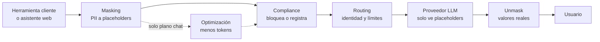
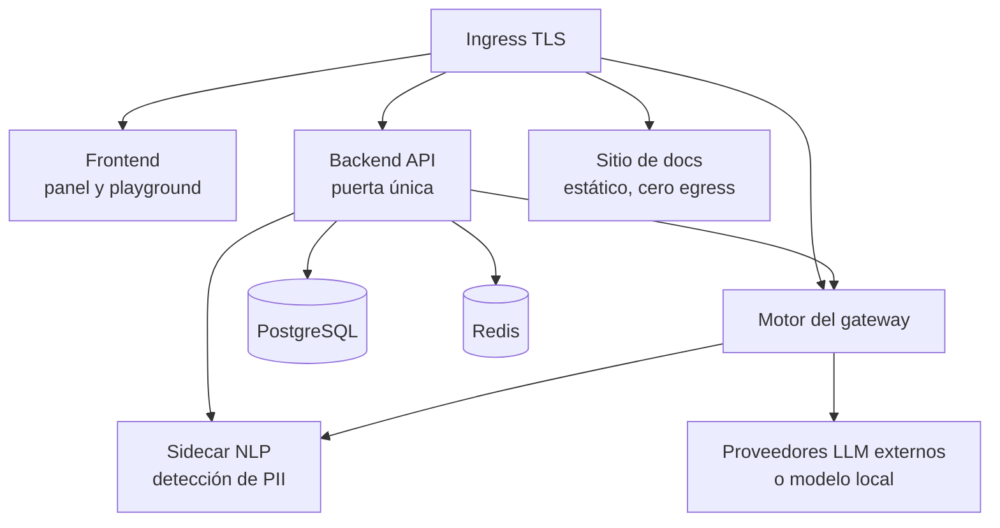

# Overview & arquitectura

El producto es un **gateway seguro de IA para entornos regulados** — sanidad primero, y cualquier
sector con obligaciones GDPR / EU AI Act después. Es la **puerta única** por la que pasan todos los
prompts de una organización hacia los proveedores LLM: antes de que un prompt salga, el gateway
**detecta y enmascara PII/PHI**, aplica **políticas de compliance**, gobierna **costes** y deja
**evidencia auditable** de cada paso.

**Para quién**: cualquier persona que necesite el mapa mental del producto antes de entrar al
detalle — distribuidores que lo revenden con su marca, operadores que lo administran, integradores
que conectan herramientas y DPOs que auditan la evidencia.

!!! note "Leyenda de estado"
    Esta página usa la leyenda de honestidad del sitio: 🟢 **HOY** (funciona y está verificado),
    🟡 **PARCIAL** (existe con límites documentados), 🔵 **OBJETIVO** (roadmap explícito, no
    implementado). Nada marcado 🔵 se describe como si existiera.

## La idea central: des-enmascarar en vez de bloquear

El proveedor LLM recibe placeholders (`[PERSON_0]`, `[DNI_0]`); el usuario ve la respuesta con los
valores reales restaurados. La experiencia de uso no se rompe — y todo dato sensible **detectado**
se enmascara antes de salir de la plataforma y se restaura al volver: esa es la garantía
arquitectural. La **cobertura** de la detección depende del modo activo (ver
[límites](#limites-conocidos)) — ningún detector garantiza un recall del 100 %.

Cada request atraviesa las mismas capas, siempre en el mismo orden. **Cuatro aplican
a todo el tráfico**; la optimización es la excepción y sólo corre en el plano de chat:

**Qué plano es cuál:** el **gateway** (`/api/v1/gw`) sirve a las herramientas que se
conectan por `base_url` y a la extensión de navegador — masking, compliance, routing y
unmask, sin compresión. El plano de **chat** (asistente web y playground) suma la
optimización, y solo ahí. El ajuste `compression_mode` **hoy solo tiene efecto a nivel
grupo**: la precedencia real es un override por request, después `compression_mode`
del grupo, después el default de la política — a nivel tenant o llave individual el
valor no participa en la decisión.

El orden no es casual: el masking corre **primero** porque es la capa más fuerte; donde
hay optimización, corre después, porque los placeholders son tokens atómicos que la
compresión jamás toca; y el unmask ocurre al final, dentro de la plataforma, con un mapa
reversible que nunca la abandona.

## Qué es el producto

- **Enmascaramiento reversible de PII/PHI** 🟢 — la detección y el enmascaramiento ocurren en la
  plataforma **antes** de que el prompt salga hacia el proveedor. Un mapa reversible reconstruye los
  valores reales en la respuesta; ese mapa nunca abandona la plataforma ni se delega a un tercero
  que rompa la reversibilidad.
- **Detección con motor NLP** 🟡 — la detección por patrones es el default actual (apta para pilotos
  y entornos sin PHI real); un despliegue productivo con PHI exige activar el **motor NLP** de
  detección, y esa activación es una precondición documentada de producción.
- **Compliance GDPR + EU AI Act** 🟢 — en dos niveles que el producto no confunde: *enforcement duro*
  que bloquea en runtime (prácticas prohibidas del AI Act Art. 5, entidades marcadas `BLOCK`,
  secretos/credenciales, residencia de datos EU en el flujo proxy) y *evidencia auditada* que no
  bloquea pero queda registrada (base legal, DPA, Data Subject Requests Art. 15-22, consentimiento
  versionado, retención, DPIA, reporting RoPA Art. 30). La auditoría es **metadata-only**: jamás se
  persiste texto de prompt ni PII cruda.
- **Gobernanza de costes** 🟢 — ninguna request pasa sin una key válida (fail-closed: nada cae a un
  usuario por defecto). Presupuestos en USD con corte **HTTP 402 pre-request** y contabilidad
  post-request, en doble capa persona → grupo, con techo duro y límites rpm/tpm como red de
  seguridad. El enforcement es **post-hoc, no "tiempo real"**: una request en curso puede sobrepasar
  el límite antes del corte. El enforcement de presupuesto sobre respuestas en streaming es 🔵
  roadmap.
- **Optimización de contexto** 🟢 — compresión determinista de prompts que reduce tokens sin
  corromper URLs, código ni placeholders; el ahorro es medible y se netea del presupuesto. No existe
  compresión asistida por LLM — no se gastan tokens para ahorrar tokens.
- **Multi-tenant** 🟡 — aislamiento por tenant desde el esquema de datos: toda entidad lleva su
  tenant y toda query se scopea a nivel de aplicación 🟢. Row-Level Security en PostgreSQL está
  **cableado** como segunda barrera, pero el contexto por request aún no se establece — el
  aislamiento efectivo hoy es a nivel de aplicación 🟡. El mismo código corre single-tenant
  on-premise y multi-tenant cloud.
- **Alta de herramientas como datos** 🟢 — dar de alta una herramienta para una persona es crear una
  conexión y emitir su key: datos y configuración, nunca código. Herramientas sin base URL
  configurable o con red hostil (certificate pinning) se documentan como no compatibles.
- **White-label** 🟢 — el producto se revende bajo la marca del distribuidor. Cada instalación es
  **configuración + seed** sobre el mismo código base, nunca un fork. Ningún nombre de motor ni de
  proveedor externo aparece en la API pública, los errores ni la UI.
- **Licenciamiento fail-closed** 🟢 — la licencia se verifica **offline** con firma Ed25519; el
  producto jamás "llama a casa", apto para air-gap. Sin licencia válida el gateway responde
  **HTTP 402/403** y bloquea — nunca degrada en silencio (ver
  [licenciamiento](#licenciamiento-y-modelo-de-distribucion)).

Las herramientas cliente (CLIs y editores con base URL configurable, extensión de navegador para
asistentes web) se conectan como **superficies de integración** — el detalle por herramienta y la
matriz de compatibilidad viven en [Integraciones](../integrations/index.md).

## El pipeline por request, capa a capa

**1. Masking** 🟢 — se detecta la PII/PHI del prompt y se sustituye por placeholders atómicos
(`[PERSON_0]`, `[DNI_0]`…), con un mapa reversible que queda dentro de la plataforma.
*Garantiza*: todo lo que la detección identifica viaja como placeholder — ni el motor del gateway
ni el proveedor LLM ven esos valores. La cobertura de la detección depende del modo: patrones por
default (pilotos, entornos sin PHI real) o motor NLP, precondición de producción con PHI 🟡;
ningún detector garantiza un recall del 100 %. Es la capa más fuerte del producto y por eso corre
**primero**.

**2. Optimización** 🟢 — compresión determinista del contexto (consciente de tokens) con caché en
Redis y guardia de reversión. Corre **después** del masking porque los placeholders son tokens
intocables: la compresión jamás los corrompe, ni a URLs ni a bloques de código.
*Garantiza*: menos coste por request sin pérdida de integridad del prompt.

**3. Compliance** 🟢 — el gate duro: prácticas prohibidas del AI Act Art. 5 → **HTTP 400**;
entidades configuradas como `BLOCK` y secretos/credenciales → bloqueo; violación de residencia EU en
el flujo proxy → **HTTP 503**; presupuesto agotado → **HTTP 402**. Lo que no bloquea, queda
registrado como evidencia auditada (metadata-only). La política se resuelve de forma **jerárquica**:
tenant → grupo → cliente → conexión.
*Garantiza*: lo prohibido no sale; lo permitido deja rastro auditable.

**4. Routing / LLM** 🟢 — el **motor del gateway** resuelve la identidad de la request (virtual key
→ tenant/cliente/herramienta, fail-closed: sin key válida no hay request), y rutea al proveedor LLM
configurado por el operador (**BYOK**: OpenAI, Anthropic, Azure OpenAI, Google Gemini, modelos
locales tipo Ollama/vLLM, y decenas más — agregar un proveedor es configuración, no código). La
residencia EU es el default del flujo proxy; techo de gasto y rpm/tpm actúan como backstop.
*Garantiza*: cada request viaja con identidad, límites y destino controlados.

**5. Unmask** 🟢 — la respuesta del proveedor vuelve con los placeholders, y la plataforma restaura
los valores reales usando el mapa reversible — incluido el camino de streaming (SSE) en la
superficie de passthrough.
*Garantiza*: el usuario ve los valores reales restaurados — valores que el proveedor nunca
recibió, porque en su lugar solo viajaron placeholders; la UX no se rompe.

### Observabilidad capa a capa

Cada request emite su **`pipeline_metadata`**: qué detectó el masking (tipos de entidad y scores,
nunca el contenido), cuánto ahorró la optimización, qué veredicto dio compliance, a qué modelo se
ruteó y cuánto costó, y el timing de cada capa. Son **datos reales por request**, no una animación:
alimentan la auditoría, el monitor en vivo y el **Playground** del panel (la vitrina interactiva
donde se ve el pipeline actuar paso a paso). El detalle operativo está en
[Operaciones](../operations/index.md).

## La puerta única de API

Toda la superficie del gateway vive bajo **`/api/v1/gw`** (en desarrollo,
`http://localhost:8091/api/v1/gw`):

| Endpoint | Rol |
|---|---|
| `GET /api/v1/gw` | Descubrimiento y estado de la puerta |
| `POST /api/v1/gw/v1/messages` | Superficie de mensajes — passthrough con streaming SSE |
| `POST /api/v1/gw/v1/messages/count_tokens` | Conteo de tokens de un payload de mensajes |
| `GET /api/v1/gw/v1/models` | Modelos disponibles para la conexión |
| `GET /api/v1/gw/whoami` | Identidad resuelta de la key — tenant, cliente, herramienta |
| `POST /api/v1/gw/inspect` | Inspección de contenido contra el pipeline |
| `GET /api/v1/gw/events` | Eventos por request para auditoría y monitor |
| `GET /api/v1/gw/monitor` | Estado agregado del monitor en vivo |

Salud: `GET /health` es un **liveness estático** (responde si el proceso vive; no valida base de
datos ni proveedores) y `GET /api/v1/health/license` expone la salud de la licencia con dos niveles
de detalle. El contrato completo de cada endpoint está en la
[referencia de API](../api-reference/index.md).

## Arquitectura en containers

El producto se despliega como un conjunto de **containers separados** — mismo código y mismas
imágenes en cloud y on-prem; lo que cambia es dónde viven los servicios de datos:

El **sidecar NLP** lo consultan los dos planos: el backend y el motor del gateway. Viaja en
todo compose de producción, piloto o no — no es un add-on que se activa después (tabla
abajo). Lo que separa un despliegue de piloto de uno apto para PHI real no es la presencia
del container sino si el detector de lenguaje natural está **configurado y activo** en la
postura del guardián, en vez de quedar en el detector por patrones (ver
[límites](#limites-conocidos)).

El backend habla con los servicios de datos de la variante desplegada — gestionados en cloud, en
containers propios on-prem:

| Container | Rol | Cloud (SaaS multi-tenant) | On-prem / air-gapped (single-tenant) |
|---|---|---|---|
| **Backend API** | La puerta única (`/api/v1/gw/...`), políticas, compliance, presupuestos, auditoría, licencia | Container | Container |
| **Motor del gateway** | Identidad fail-closed, guardrails, routing a proveedores LLM, límites rpm/tpm | Container | Container |
| **Frontend** | Panel de administración, Playground, monitor en vivo | Container | Container |
| **Sitio de docs** | Esta documentación — imagen estática por marca y versión, cero egress | Container | Container (viaja dentro del bundle) |
| **Sidecar NLP** | Detección de PII/PHI con motor NLP — lo consultan el backend y el motor | Container | Container |
| **PostgreSQL** | Estado: tenants, políticas, presupuestos, auditoría | Servicio gestionado (región EU por defecto) o container | Container con volumen durable |
| **Redis** | Caché de optimización y contadores | Servicio gestionado o container | Container |

Puntos clave del modelo de despliegue:

- **Un solo codebase, dos perfiles**: el perfil de desarrollo (bind-mounts, recarga en caliente,
  secretos de juguete) jamás sale a un cliente; lo único que se entrega son las **imágenes de
  producción** (código horneado, non-root, sin toolchain ni recarga).
- **El compose de producción tiene dos formas**: **5 servicios** cuando los datos son gestionados
  (backend, motor, frontend, docs, sidecar NLP) y **8 servicios** con `--profile selfhosted` (suma
  ingress, PostgreSQL y Redis en containers con volumen durable).
- **On-prem / air-gapped**: la instalación viaja como un **bundle** (tarball con las imágenes, el
  perfil del cliente y el branding). Se publica desde una máquina con red, se mueve al host por
  USB/SFTP, se cargan las imágenes y se levanta el compose de producción con el perfil
  `selfhosted`. El único egress necesario es hacia los proveedores LLM; con un **modelo local**
  (Ollama/vLLM) el egress es **cero**. La licencia se verifica offline.
- **Secretos por instalación**: se generan en cada instalación y viajan cifrados en reposo — jamás
  viven en claro dentro del perfil del cliente ni en la configuración versionada.
- **Cloud**: el módulo de infraestructura como código incluido provisiona red, base de datos, caché,
  cómputo, secretos e ingress, con **EU como región por defecto** y estado remoto por cliente — el
  detalle está en [Infraestructura](../install-deploy/infrastructure.md).
- **Empaquetado para Kubernetes** 🔵 — camino v2 con bundle firmado y SBOM; hoy la vía soportada es
  Docker Compose.

## Licenciamiento y modelo de distribución

El modelo comercial: el producto se vende como **instalación + licencias** a un **distribuidor**,
que lo revende bajo su propia marca y lo levanta donde quiera — el fabricante no instala ni opera
servidores del cliente. El detalle de marca está en [White-label](../white-label/index.md).

El enforcement de licencia es 🟢 y **fail-closed**:

- La licencia va **firmada (Ed25519)** y se verifica **offline** — sin llamadas a casa, apto para
  air-gap.
- Estados **`active` → `grace` → `expired`**: en gracia el gateway avisa; expirada la gracia, el
  bloqueo es **duro** (HTTP 402/403 según el caso). Nunca hay degradación silenciosa.
- Un **seat** licencia una **conexión activa** (la key de una herramienta), no un usuario nominal:
  una persona con dos herramientas conectadas consume dos seats.
- El uso de seats queda en un registro **hash-encadenado** (evidencia ante manipulación) y soporta
  **true-up**: reconciliación periódica del uso real contra los seats licenciados.
- `GET /api/v1/health/license` expone la salud de la licencia con dos niveles de detalle, para
  sondas y para el operador.

El procedimiento operativo (emitir, instalar y renovar licencias) está en
[Licenciamiento](../install-deploy/licensing.md).

## Jerarquía y modelo de acceso

La gobernanza se organiza en cuatro niveles: **Tenant (empresa) → Grupo → Cliente (persona) →
Conexión (key por herramienta)**. La política y el presupuesto se resuelven jerárquicamente por esos
niveles; la gobernanza legal vive a nivel **persona**, y los toggles por herramienta a nivel
**conexión**.

Roles en dos ejes:

- **Tier administrativo**: *super-admin* (cross-tenant, propio de la operación cloud) y
  *tenant-admin* (gestiona solo su tenant: grupos, personas, políticas).
- **Roles dentro del tenant**: *compliance officer / DPO* (gobernanza y evidencia) y *cliente* (la
  persona que consume IA vía sus herramientas, sujeto de la gobernanza legal).

Los rótulos sectoriales (p. ej. "clínico", "desarrollador") son **etiquetas de display
configurables**, no roles del sistema. La administración del día a día está en
[Administración](../administration/index.md).

## Audiencias de esta documentación

| Audiencia | Qué necesitás | Empezá por |
|---|---|---|
| **Distribuidor** | Instalar el producto con tu marca y entregarlo a tus clientes | [Install / Deploy](../install-deploy/index.md) |
| **Operador** | Administrar tenants, personas, políticas y presupuestos del día a día | [Administración](../administration/index.md) y [Operaciones](../operations/index.md) |
| **Integrador** | Conectar herramientas de IA al gateway y conocer la matriz de compatibilidad | [Integraciones](../integrations/index.md) |
| **DPO / Compliance** | Evidencia GDPR / EU AI Act, auditoría y derechos de los interesados | [Compliance](../compliance/index.md) |

## Límites conocidos

- 🟢 Masking reversible, gate de compliance, corte de presupuesto 402, licenciamiento fail-closed y
  passthrough con streaming SSE: verificados hoy.
- 🟡 **Detección**: patrones por default; el **motor NLP** es precondición de producción con PHI.
  Ningún modo garantiza un recall del 100 %.
- 🟡 **Row-Level Security**: cableado en PostgreSQL, pero el contexto por request aún no se
  establece — el aislamiento efectivo es a nivel de aplicación.
- 🟡 **Modo interceptación** (herramientas que operan dentro de su propio cliente): el enrutado de
  residencia EU no aplica ahí — la garantía se traslada a masking, auditoría y allowlist de
  herramientas y modelos. Detalle en [gotchas de integración](../integrations/gotchas.md).
- 🔵 **Presupuesto sobre streaming**: el corte 402 es pre-request; el enforcement durante una
  respuesta en streaming es roadmap.
- 🔵 **Empaquetado Kubernetes**: la vía soportada hoy es Docker Compose.
- `GET /health` es liveness **estático**: no valida dependencias — para salud real, monitor y salud
  de licencia.

## Relacionado

- [Install / Deploy](../install-deploy/index.md) — el paso a paso de instalación cloud, on-prem y
  air-gap que materializa esta arquitectura.
- [Licenciamiento](../install-deploy/licensing.md) — operación del enforcement fail-closed: emitir,
  instalar y renovar licencias, estados y true-up.
- [Integraciones](../integrations/index.md) — qué herramientas se conectan a la puerta única y la
  matriz de compatibilidad.
- [Referencia de API](../api-reference/index.md) — contrato completo de los endpoints de la puerta
  única.
