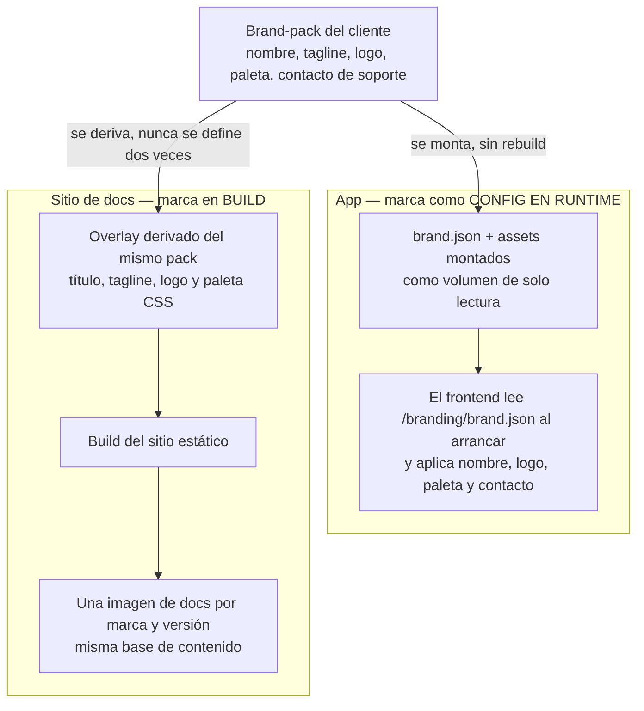

# White-label & branding

La marca blanca es un principio de diseño del producto, no una capa de pintura: **el
despliegue de cada cliente es configuración + seed, nunca un fork**. Esta página describe
cómo fluye la marca desde el brand-pack del cliente hasta la app y el sitio de docs, qué
garantiza el core marca-neutro y qué queda fuera de la promesa de marca blanca.

**Para quién**: el **distribuidor** que revende la plataforma bajo su propia marca (o
co-marca) y arma el brand-pack por cliente; el **operador** que quiere entender qué partes
de su instancia son configurables sin tocar código.

## Cómo fluye la marca

Una sola fuente de marca por cliente: el **brand-pack**. De él salen las dos superficies
con marca — la app y el sitio de documentación — por dos vías deliberadamente distintas:

- **La app consume la marca en runtime**: el `brand.json` y sus assets se montan como
  volumen de solo lectura; el frontend los lee al arrancar. Cambiar la marca **no
  reconstruye nada**.
- **El sitio de docs consume la marca en build**: del mismo pack se deriva un overlay de
  configuración (título, tagline, logo, paleta CSS) que produce **una imagen por marca y
  versión**. El contenido markdown es idéntico entre marcas.



La regla que evita la deriva: la marca del sitio de docs **se deriva** del brand-pack de la
app — jamás existen dos definiciones de marca que puedan divergir.

**Leyenda de estado**:

| Marca | Significado |
|---|---|
| 🟢 **HOY** | Implementado y verificable en la versión actual del producto |
| 🟡 **PARCIAL** | Existe la base, falta endurecerlo para producción |
| 🔵 **OBJETIVO** | Roadmap / estado-objetivo, no existe aún |

## Naming neutro en el core 🟢

El distribuidor revende la plataforma bajo su propia marca (o co-marca). Ningún nombre del
motor interno ni de proveedor LLM aparece en la UI, la API pública, los errores ni los logs:

- El código usa naming neutro (`AIEngineClient` / `engine_*`).
- Los errores que origina el motor se reescriben con naming neutro antes de exponerse al
  usuario.

Los nombres de proveedores LLM sólo aparecen donde son la superficie de integración del
operador (BYOK, configuración de modelos del perfil), nunca en la experiencia del usuario
final.

## Never fork 🟢

Sumar un cliente, un demo o una marca jamás implica tocar código:

- **Onboarding-as-data**: personas, herramientas, Connections y presupuestos se siembran
  desde el YAML del perfil por cliente — ver
  [Install / Deploy](../install-deploy/index.md).
- **Marca como configuración en runtime**: el branding se carga al arrancar, no se hornea en
  la imagen.
- **Un solo codebase**: el mismo código corre single-tenant on-premise y multi-tenant cloud;
  toda la variación entre clientes vive en configuración + seed.

## El branding pack 🟢

Por cada cliente/marca, el distribuidor arma un **branding pack**: nombre de producto,
tagline, logo, favicon, paleta de colores y datos de contacto de soporte del distribuidor.
Se aplica durante el flujo de instalación (paso de seed + branding) y se puede actualizar
sin recompilar: basta reemplazar el archivo montado.

El pack sale del **perfil del cliente**: el tooling de instalación renderiza el
`brand.json` desde las variables de branding del perfil, de modo que la marca tiene una
sola fuente de verdad por cliente.

### Marca como config en runtime 🟢

El frontend carga la configuración de marca al arrancar desde `/branding/brand.json`; los
assets (logo, favicon…) se montan en runtime junto a ese archivo — **jamás horneados** en la
imagen. Si el archivo no existe (por ejemplo en desarrollo), la app cae a la marca default
neutra del fabricante sin romper. Ejemplo de `brand.json` de un distribuidor ficticio:

```json
{
  "name": "Aegis AI Firewall",
  "tagline": "Su pasarela de IA corporativa",
  "logo": "logo.png",
  "supportContact": "soporte@aegis.example",
  "colors": {
    "primary": "#e63946",
    "background": "#10141f",
    "panel": "#1d2433"
  },
  "docsUrl": "https://docs.aegis.example/"
}
```

Qué aplica la app con cada campo:

| Campo | Efecto en la app |
|---|---|
| `name` | Nombre de producto en la UI y título de la pestaña del navegador |
| `tagline` | Subtítulo de la marca |
| `logo` | Logo servido desde el mismo volumen montado (`/branding/<archivo>`) |
| `supportContact` | Contacto de soporte del distribuidor que ve el usuario final |
| `colors.primary` / `background` / `panel` | Paleta aplicada como variables CSS al arrancar (el pack escribe hex normal) |
| `docsUrl` | URL del sitio de documentación de la marca; default: `/docs/` detrás del mismo ingress |

Además, el frontend resuelve la URL de la API solo a partir de `window.location.hostname`:
cambiar el dominio de un despliegue **no requiere recompilar** el frontend.

### Documentación por marca 🟢

El sitio de documentación de producto (este sitio) también es un artefacto de marca blanca,
pero por la vía **build-time**: se publica **una imagen por marca** (`sentinel-docs:<brand>-<version>`),
100% estática y 0-egress, que viaja dentro del bundle air-gapped junto al resto de imágenes
pinneadas.

- Del brand-pack del cliente se **deriva** un overlay de configuración del sitio: título,
  tagline, logo y paleta (variables CSS del tema). Sólo tokens de marca — el tema y el
  contenido quedan intactos.
- El contenido markdown **nunca se edita por marca**: un check del release verifica que la
  base de contenido es idéntica entre la imagen neutra y las imágenes por marca.
- La marca del sitio nunca se define a mano por segunda vez: si cambia el brand-pack, se
  re-deriva el overlay y se reconstruye la imagen de docs de esa marca.

## Límites de la marca blanca

- **Naming y branding, no protección de código**: la marca blanca no incluye promesas de
  código "protegido" u ofuscado. La respuesta oficial a "¿qué protección tiene la imagen
  instalada?" está en [Licenciamiento](../install-deploy/licensing.md).
- **La app es runtime, las docs son build**: actualizar la marca de la app es reemplazar el
  `brand.json` montado; actualizar la marca del sitio de docs implica re-derivar el overlay
  y reconstruir esa imagen. Son dos cadencias distintas por diseño.
- **Contenido de docs compartido**: no existe contenido de documentación exclusivo de una
  marca; toda variación entre marcas es tokens de marca (nombre, logo, paleta).
- 🟡 **Favicon**: el favicon del pack se monta como asset junto al `brand.json`; la app hoy
  aplica automáticamente nombre, tagline, logo, paleta, contacto y URL de docs — la
  aplicación automática del favicon por marca falta endurecerla.

## Relacionado

- [Install / Deploy](../install-deploy/index.md) — el flujo de instalación donde se aplica
  el branding pack (paso de seed + branding) y se renderiza el perfil por cliente.
- [Licenciamiento](../install-deploy/licensing.md) — qué protege de verdad la imagen
  instalada: licencias firmadas offline y fail-closed, no ofuscación.
- [Overview & arquitectura](../overview/index.md) — el modelo fabricante → distribuidor →
  operador en el que la marca blanca es una pieza del canal.
