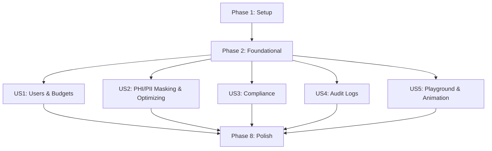

# Tasks: Sentinel Secure AI Gateway (by sentinel dev)

**Input**: Design documents from `/specs/001-sentinel-ai-gateway/`

**Prerequisites**: [plan.md](plan.md) (required), [spec.md](spec.md) (required for user stories), [research.md](research.md), [data-model.md](data-model.md), [contracts/api.md](contracts/api.md)

**Design System**: [design-system/sentinel-secure-ai-gateway/MASTER.md](../../design-system/sentinel-secure-ai-gateway/MASTER.md) (Accessible & Ethical style, Fira Code/Fira Sans typography, Calm Cyan & Health Green palette)

**Organization**: Tasks are grouped by setup, foundation, and user stories to enable independent implementation and testing.

---

## Phase 1: Setup (Shared Infrastructure)

**Purpose**: Project initialization and basic structure

- [x] T001 Create project directories (`backend/`, `frontend/`, `litellm/`) per implementation plan
- [x] T002 Initialize the FastAPI project with dependencies in `backend/requirements.txt` and `backend/Dockerfile`
- [x] T003 Initialize the Vite + React + TypeScript project with TailwindCSS in `frontend/package.json` and `frontend/Dockerfile`
- [x] T004 Create the base `docker-compose.yml` defining the 6 containers (`sentinel-frontend`, `sentinel-backend`, `sentinel-litellm`, `sentinel-db`, `presidio-analyzer`, `presidio-anonymizer`)
- [x] T005 [P] Create the `.env.example` file and configure local development environment variables

---

## Phase 2: Foundational (Blocking Prerequisites)

**Purpose**: Core database and routing infrastructure

- [x] T006 Setup the PostgreSQL database schema and migrations in `backend/src/models/` (based on `data-model.md`)
- [x] T007 [P] Create the base LiteLLM configuration in `litellm/config.yaml` with routing rules for OpenAI and Anthropic
- [x] T008 [P] Implement the database connection pooling and session management in `backend/src/database.py`
- [x] T009 Create the base FastAPI application with error handling and logging middleware in `backend/src/main.py`
- [x] T010 [P] Implement the custom API router structure in `backend/src/api/`

---

## Phase 3: User Story 1 - User and Budget Management (Priority: P1) 🎯 MVP

**Goal**: Manage users, groups, and assign budget limits (monetary and tokens) enforced in real-time.

**Independent Test**: Create a user and budget via the API or DB, make requests, and verify that once the budget is exhausted, the gateway blocks further requests.

- [x] T011 [P] [US1] Create the User, Group, and Budget SQLAlchemy models in `backend/src/models/user.py` and `backend/src/models/budget.py`
- [x] T012 [US1] Implement the budget check and enforcement service in `backend/src/services/budget_service.py`
- [x] T013 [US1] Implement the user and budget management endpoints in `backend/src/api/users.py` and `backend/src/api/budgets.py`
- [x] T014 [P] [US1] Build the "Users & Budgets" page UI in `frontend/src/pages/UsersPage.tsx` using the *Accessible & Ethical* design system (Fira Sans, high contrast, clean tables, clear focus rings)
- [x] T015 [US1] Integrate the "Users & Budgets" page with the backend API in `frontend/src/services/api.ts`

---

## Phase 4: User Story 2 - Privacy, PHI/PII Masking, and Context Optimization (Priority: P1) 🎯 MVP

**Goal**: Automatically scan and mask PHI/PII using Microsoft Presidio, and optionally compress context using Headroom before sending to the LLM.

**Independent Test**: Send a prompt with a patient name, ID, and long context. Verify it is masked and compressed, and verify the response is unmasked and returned.

- [x] T016 [US2] Configure the Presidio PII guardrail in `litellm/config.yaml` to connect to the analyzer and anonymizer containers
- [x] T017 [US2] Implement the custom masking/unmasking middleware or helper in `backend/src/services/presidio_service.py` to handle prompt intercepting and token restoration
- [x] T018 [US2] Implement the Headroom context compression service in `backend/src/services/optimization_service.py`
- [x] T019 [US2] Build the "Security & Optimization" configuration page in `frontend/src/pages/SecurityPage.tsx` allowing administrators to select entities and toggle Headroom compression
- [x] T020 [US2] Integrate the "Security & Optimization" page with the backend API settings

---

## Phase 5: User Story 3 - Compliance and Policy Templates (Priority: P2)

**Goal**: Enforce GDPR (data residency) and AI Act policies using preconfigured templates.

**Independent Test**: Configure a policy requiring EU-only routing, send a request, and verify it is routed to an EU-based endpoint.

- [x] T021 [P] [US3] Create the SecurityPolicy model in `backend/src/models/policy.py`
- [x] T022 [US3] Implement the GDPR geo-routing rule enforcement in `backend/src/services/routing_service.py` (forcing EU endpoints for sensitive data)
- [x] T023 [US3] Implement the AI Act risk classification and prompt flagging service in `backend/src/services/compliance_service.py`
- [x] T024 [US3] Build the "Policies & Templates" page in `frontend/src/pages/PoliciesPage.tsx` with toggles for GDPR and AI Act compliance
- [x] T025 [US3] Integrate the "Policies & Templates" page with the backend API

---

## Phase 6: User Story 4 - Audit Logs and Observability (Priority: P2)

**Goal**: Record audit logs of transactions containing metadata but no raw PII/PHI.

**Independent Test**: Make a request with PII, check the database `audit_logs` table, and verify that the patient's name is not stored, but the entity type "PERSON" is recorded.

- [x] T026 [P] [US4] Create the AuditLog model in `backend/src/models/audit.py`
- [x] T027 [US4] Implement the asynchronous audit logging callback in `backend/src/services/audit_service.py` (extracting token counts, costs, and masked entities)
- [x] T028 [US4] Implement the audit log retrieval API in `backend/src/api/audit.py`
- [x] T029 [P] [US4] Build the "Audit Logs" page in `frontend/src/pages/AuditPage.tsx` showing a clean, high-contrast, filterable table of transactions
- [x] T030 [US4] Integrate the "Audit Logs" page with the backend API

---

## Phase 7: User Story 5 - Interactive Playground with Layer Animation (Priority: P1)

**Goal**: A chat interface that displays a step-by-step layer animation of the prompt's journey through the gateway.

**Independent Test**: Submit a message in the Playground, verify that the UI animates through the layers (Masking ➔ Optimizing ➔ Compliance ➔ Routing/Budget ➔ LLM ➔ Unmasking) and displays the final response.

- [x] T031 [US5] Implement the custom `/api/v1/chat/completions` endpoint in `backend/src/api/chat.py` that executes the pipeline and returns the detailed layer metadata
- [x] T032 [US5] Build the "Playground" chat page in `frontend/src/pages/PlaygroundPage.tsx`
- [x] T033 [US5] Implement the step-by-step pipeline layer animation in the Playground using Framer Motion (visualizing the active layer, showing the text transformation, and displaying the budget status)
- [x] T034 [US5] Integrate the Playground chat and animation with the backend API

---

## Phase 8: Polish & Cross-Cutting Concerns

**Purpose**: Branding, security hardening, and final verification

- [x] T035 Verify that all UI screens and API headers contain absolutely no references to "litellm"
- [x] T036 [P] Add CSS focus-visible styles and keyboard navigation improvements to all pages to satisfy the *Accessible & Ethical* design system
- [x] T037 Run the end-to-end validation scenarios described in `quickstart.md`
- [x] T038 Update the project `README.md` with instructions for production deployment

---

## Dependencies & Execution Order

### Parallel Opportunities
- Within **Phase 1 (Setup)**, T002 (Backend), T003 (Frontend), and T005 (Env) can be worked on in parallel.
- Within **Phase 2 (Foundational)**, T007 (LiteLLM config), T008 (DB pooling), and T010 (API routing) can be developed in parallel.
- Once **Phase 2** is complete, all User Stories (US1 through US5) can be developed in parallel.
- Within each User Story, the backend service implementation and the frontend page design can be worked on in parallel.
