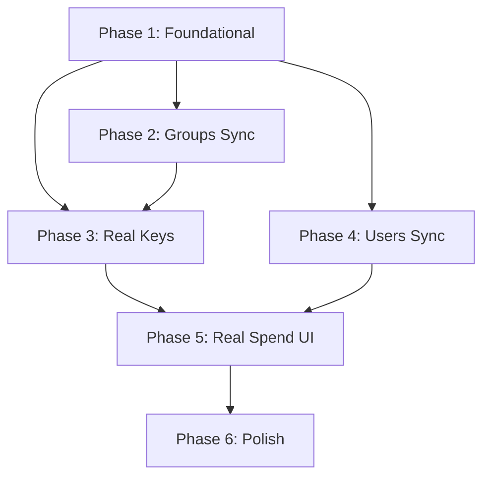

# Tasks: LiteLLM Real Integration

**Input**: Design documents from `/specs/002-litellm-sync/`

**Prerequisites**: [plan.md](plan.md) (required), [spec.md](spec.md) (required para user stories)

**Organization**: Tasks agrupadas por fase. Las fases 1 y 2 son bloqueantes. Las fases 3-5 pueden ejecutarse en paralelo una vez que la fase 2 esté completa.

---

## Phase 1: Foundational — AIEngineClient + Config

**Purpose**: Crear la infraestructura de comunicación con LiteLLM. Ninguna feature de sync puede empezar sin esto.

- [x] T001 Actualizar `litellm/config.yaml` — agregar `general_settings.store_model_in_db: true` y verificar que `LITELLM_MASTER_KEY` esté referenciado
- [x] T002 Crear `backend/src/services/ai_engine_client.py` — wrapper async con `httpx` para los endpoints: `POST /team/new`, `POST /user/new`, `POST /key/generate`, `GET /key/info`, `GET /user/info`, `GET /team/info`, `DELETE /key/delete`
- [x] T003 [P] Agregar campo `engine_team_id: String nullable` al modelo `Group` en `backend/src/models/user.py`
- [x] T004 [P] Agregar campo `engine_user_id: String nullable` al modelo `User` en `backend/src/models/user.py`
- [x] T005 [P] Agregar campo `engine_key_token: String nullable` (primeros 10 chars de la sk-...) al modelo `APIKey` en `backend/src/models/budget.py`
- [x] T006 Actualizar `backend/src/schemas/user.py` — agregar `engine_team_id` y `engine_user_id` en los schemas de response `GroupResponse` y `UserResponse`

**Checkpoint**: El AIEngineClient existe, los modelos tienen los nuevos campos, y LiteLLM está configurado para aceptar gestión de keys via API.

---

## Phase 2: User Story 1 (parte A) — Sync de Grupos/Teams (Priority: P1) 🎯 MVP

**Goal**: Cuando se crea un grupo, se crea también en LiteLLM y se guarda el `engine_team_id`.

**Independent Test**: Crear un grupo "Cardiología" via la UI o Swagger, luego llamar a `GET litellm:4000/team/info?team_id=<engine_team_id>` y verificar que existe en LiteLLM.

- [x] T007 [US1] Modificar `create_group` en `backend/src/api/users.py` — después de guardar en DB, llamar a `AIEngineClient.create_team(name, max_budget)` y actualizar el registro con el `engine_team_id` devuelto
- [x] T008 [US1] Agregar manejo de error: si LiteLLM falla al crear el team, hacer rollback del grupo en nuestra DB y retornar HTTP 503
- [x] T009 [US1] Actualizar `GroupResponse` schema para incluir `engine_team_id` en la respuesta de la API

**Checkpoint**: Crear un grupo via Swagger crea el team en LiteLLM y devuelve `engine_team_id` en la respuesta.

---

## Phase 3: User Story 1 (parte B) + User Story 4 — Keys Reales (Priority: P1) 🎯 MVP

**Goal**: Las virtual keys se generan via LiteLLM y la revocación también pasa por LiteLLM.

**Independent Test**: Generar una key via UI, usarla en un `curl` contra `POST /api/v1/chat/completions` y verificar que la request se procesa. Luego revocarla y verificar que retorna 401.

- [x] T010 [US1] Refactorizar `generate_key` en `backend/src/api/keys.py` — reemplazar la generación local por llamada a `AIEngineClient.generate_key(name, team_id, user_id, max_budget, budget_duration, models)`
- [x] T011 [US1] La key `sk-...` devuelta por LiteLLM se muestra una sola vez en la respuesta. En DB se guarda: `key_hash` (SHA-256 de la sk-...), `key_preview` (sk-...últimos6), `engine_key_token` (primeros 10 chars para referenciarla en LiteLLM)
- [x] T012 [US1] Agregar manejo de error: si falla el guardado en DB después de crear la key en LiteLLM, intentar revocar la key en LiteLLM (rollback best-effort)
- [x] T013 [US4] Refactorizar `revoke_key` en `backend/src/api/keys.py` — antes de eliminar de nuestra DB, llamar a `AIEngineClient.delete_key(engine_key_token)`. Si LiteLLM falla, igual eliminar de nuestra DB (la key ya no será aceptada por nuestra capa de auth)
- [x] T014 [US1] Actualizar el schema de respuesta de generación de key para incluir `plain_key` (la sk-... real) en el campo existente — sin cambios en el contrato de la API

**Checkpoint**: Generar una key via Swagger devuelve una `sk-...` real. Usarla en curl procesa la request. Revocarla hace que LiteLLM retorne 401.

---

## Phase 4: User Story 3 — Sync de Usuarios Individuales (Priority: P2)

**Goal**: Cuando se crea un usuario, se crea también en LiteLLM con su `engine_user_id`.

**Independent Test**: Crear un usuario "dr.garcia@hospital.es" via UI, luego llamar a `GET litellm:4000/user/info?user_id=<engine_user_id>` y verificar que existe.

- [x] T015 [US3] Modificar `create_user` en `backend/src/api/users.py` — llamar a `AIEngineClient.create_user(user_id, email)` y guardar el `engine_user_id` devuelto
- [x] T016 [US3] Agregar manejo de error: si LiteLLM falla al crear el usuario, hacer rollback y retornar HTTP 503
- [x] T017 [US3] Actualizar `UserResponse` schema para incluir `engine_user_id` en la respuesta

**Checkpoint**: Crear un usuario via Swagger crea también el usuario en LiteLLM.

---

## Phase 5: User Story 2 — Gasto en Tiempo Real (Priority: P1) 🎯 MVP

**Goal**: La UI muestra el gasto real de cada key/usuario/equipo consultando LiteLLM.

**Independent Test**: Procesar 2-3 requests desde el Playground, abrir la página de Usuarios y verificar que el gasto es mayor a $0.00.

- [x] T018 [P] [US2] Agregar endpoint `GET /api/v1/keys/{key_id}/spend` en `backend/src/api/keys.py` — lee `engine_key_token` de DB y llama a `AIEngineClient.get_key_info(token)`, retorna `{spend_usd, max_budget, remaining}`
- [x] T019 [P] [US2] Agregar endpoint `GET /api/v1/groups/{group_id}/spend` en `backend/src/api/users.py` — llama a `AIEngineClient.get_team_info(engine_team_id)`, retorna `{spend_usd, max_budget, remaining}`
- [x] T020 [P] [US2] Agregar endpoint `GET /api/v1/users/{user_id}/spend` en `backend/src/api/users.py` — llama a `AIEngineClient.get_user_info(engine_user_id)`
- [x] T021 [US2] Actualizar `frontend/src/services/api.ts` — agregar `getKeySpend(keyId)`, `getGroupSpend(groupId)`, `getUserSpend(userId)`
- [x] T022 [US2] Actualizar `frontend/src/pages/UsersPage.tsx` — agregar columna "Gasto actual" con barra de progreso (spend/max_budget %) y colores: verde < 70%, amarillo 70-90%, rojo > 90%
- [x] T023 [US2] En `UsersPage.tsx`, los registros legacy (sin `engine_team_id`) muestran `-` en la columna de gasto sin errores

**Checkpoint**: La UI muestra gasto real en la página de Usuarios después de procesar requests en el Playground.

---

## Phase 6: Polish & Validación e2e

**Purpose**: Asegurar consistencia, manejo de edge cases, y validar el flujo completo.

- [x] T024 Verificar que el `Authorization: Bearer sk-...` llega correctamente al motor desde nuestro endpoint de chat (`backend/src/api/chat.py`) — actualmente usa el master key, debe usar la key del cliente
- [x] T025 [P] Validar edge case: grupo sin `engine_team_id` al generar una key — retornar error claro al cliente sin mencionar tecnología: "Este equipo no soporta generación de keys. Recréalo para activar esta función."
- [x] T029 [P] Auditoría white-label: grep en todo `backend/src/` y `frontend/src/` buscando strings "litellm", "LiteLLM", "openai" en mensajes de error, nombres de campos de respuesta y logs. Corregir cualquier ocurrencia encontrada.
- [x] T026 [P] Validar edge case: LiteLLM devuelve `spend: null` — normalizar a `0.0` en el AIEngineClient
- [x] T027 Actualizar `specs/002-litellm-sync/changelog.md` con todo lo implementado, bugs encontrados y decisiones técnicas
- [x] T028 Commit final y merge a `master` con tag `v1.1.0`

---

## Dependencies & Execution Order

### Parallel Opportunities
- T003, T004, T005 (nuevos campos en modelos) pueden ejecutarse en paralelo
- T018, T019, T020 (endpoints de spend) pueden ejecutarse en paralelo
- T021 (api.ts) puede ejecutarse en paralelo con T022 y T023 (UI)
- Phase 3 y Phase 4 pueden ejecutarse en paralelo una vez que Phase 1 esté completa