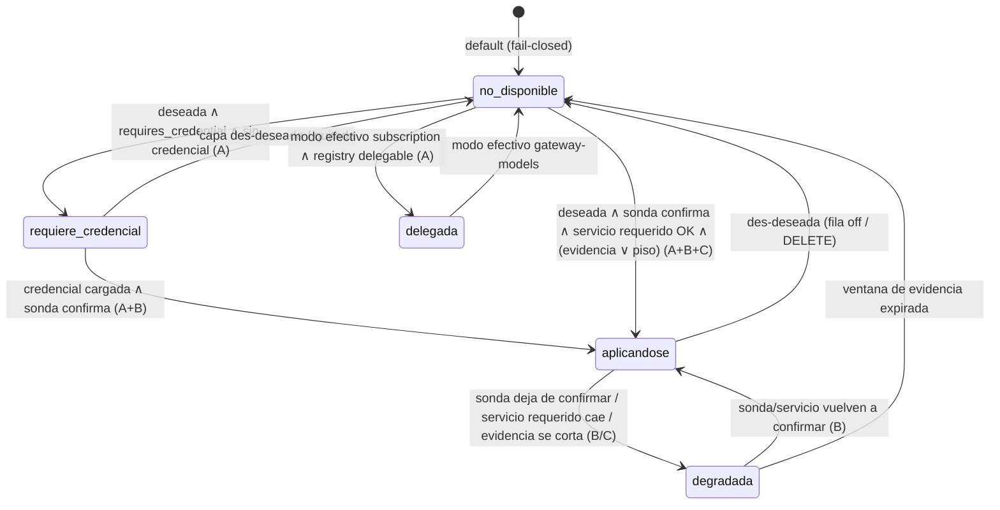

# Data Model — 027 Governance configurable y enforcement honesto

**Feature**: 027 | **Fase**: 1 | **Spec**: [spec.md](./spec.md) | **Research**: [research.md](./research.md) (D1-D8)

Alcance de esquema, deliberadamente chico (plan.md, Scale/Scope): **1 tabla nueva**
(`governance_profiles`), **2 columnas nuevas** en `audit_logs` (`applied_layers`,
`blocked_by_layer`), **1 registry en código** (`GOVERNANCE_LAYERS`) y **1 estado calculado
que jamás se persiste** (`estado_efectivo`). Todo el esquema vive en la base del backend
(`basa_gateway`); **la base del motor (`basa_engine` en prod) no recibe esquema nuevo**.
`guardian_events` queda **congelado como legado** (D6): ni migración, ni productores nuevos,
ni lectores nuevos.

---

## 1. Entidad `GovernanceProfile` (tabla `governance_profiles`)

La configuración de gobernanza del tenant: **una fila por decisión** (D2), no un documento.
Cada fila dice "para este alcance, esta capa opcional está `on`/`off`". La **ausencia de fila
es "heredar"** — el mismo idioma `NULL = heredar` de los toggles por-key
([budget.py:71-75](../../backend/src/models/budget.py#L71)). El precedente de forma es
`ComplianceProject` ([compliance.py:13-34](../../backend/src/models/compliance.py#L13)):
entidad por tenant, referenciada por clave, sin columnas espejo en `Tenant`.

### 1.1 Esquema

```sql
CREATE TABLE governance_profiles (
    id           UUID PRIMARY KEY,                 -- default uuid4 (app)
    tenant_id    UUID NOT NULL REFERENCES tenants(id),
                 -- default DEFAULT_TENANT_ID (tenant.py:9), index
    scope_type   VARCHAR NOT NULL,
    scope_value  VARCHAR NOT NULL,
    layer_key    VARCHAR NOT NULL,                 -- clave del registry (§2) — SIN FK, SIN CHECK
    decision     VARCHAR NOT NULL,
    updated_by   VARCHAR NOT NULL,                 -- username del admin autenticado
    created_at   TIMESTAMP,                        -- default utcnow (app)
    updated_at   TIMESTAMP,                        -- default utcnow, onupdate utcnow (app)

    CONSTRAINT uq_governance_profiles_scope
        UNIQUE (tenant_id, scope_type, scope_value, layer_key),
    CONSTRAINT ck_governance_profiles_scope_type
        CHECK (scope_type IN ('tenant_default', 'connection_mode', 'surface')),
    CONSTRAINT ck_governance_profiles_decision
        CHECK (decision IN ('on', 'off')),
    CONSTRAINT ck_governance_profiles_scope_pair
        CHECK (
            (scope_type = 'tenant_default' AND scope_value = '*')
            OR (scope_type = 'connection_mode'
                AND scope_value IN ('subscription', 'gateway-models'))
            OR (scope_type = 'surface'
                AND scope_value IN ('claude-code', 'copilot', 'cursor',
                                    'claude-desktop', 'chatgpt', 'chat-ui'))
        )
);
CREATE INDEX ix_governance_profiles_tenant_id ON governance_profiles (tenant_id);

-- RLS: governance_profiles es tabla TENANT-SCOPED (Principio III, SC-4). Mismo tratamiento
-- que las 13 tablas tenant-scoped de la 010 — predicado LITERALMENTE idéntico al que usa
-- audit_logs, no una segunda semántica de aislamiento.
ALTER TABLE governance_profiles ENABLE ROW LEVEL SECURITY;
ALTER TABLE governance_profiles FORCE ROW LEVEL SECURITY;  -- sin FORCE el dueño bypasea

CREATE POLICY tenant_isolation ON governance_profiles
    USING       (tenant_id = NULLIF(current_setting('app.current_tenant', true), '')::uuid
                 OR current_setting('app.bypass_rls', true) = 'on')
    WITH CHECK  (tenant_id = NULLIF(current_setting('app.current_tenant', true), '')::uuid
                 OR current_setting('app.bypass_rls', true) = 'on');

-- Ventana de deploy heredada de la 010: sin GUC seteado la sesión opera como hasta hoy
-- (on-prem). Se elimina en la 017 al cablear identidad fail-closed, y debe eliminarse para
-- TODAS las tablas a la vez, incluida ésta.
CREATE POLICY tenant_isolation_bootstrap ON governance_profiles
    USING       (NULLIF(current_setting('app.current_tenant', true), '') IS NULL)
    WITH CHECK  (NULLIF(current_setting('app.current_tenant', true), '') IS NULL);
```

`governance_profiles` queda **registrada como tabla tenant-scoped**: es la única tabla nueva
con `tenant_id` y, encima, la que decide **qué capas de seguridad corren**. El RLS es
*backstop de base*, no la validación primaria (el router admin filtra por tenant): sin él, el
CRUD de US2 —UPSERT/DELETE por PK, patrón habitual del repo— dejaría que el admin del tenant A
apague `pii_masking` del tenant B pasando un id ajeno.

Estilo SQLAlchemy: como `Budget`/`APIKey`
([budget.py:9-24](../../backend/src/models/budget.py#L9)) — `UUID(as_uuid=True)`,
`DateTime` con `default=datetime.utcnow` / `onupdate` (no el `String` isoformat de
compliance.py), `CheckConstraint` e `Index` nombrados en `__table_args__`, `tenant_id` con
`default=DEFAULT_TENANT_ID, index=True`. Archivo nuevo: `backend/src/models/governance.py`.

### 1.2 Dominios de `scope_value`

| `scope_type` | `scope_value` | Ancla en datos existentes |
|---|---|---|
| `tenant_default` | `'*'` (centinela — el UNIQUE de Postgres no deduplica NULLs, así que el default de tenant necesita un valor concreto) | — |
| `connection_mode` | `'subscription'` \| `'gateway-models'` | **Codominio de la función de mapeo de D5** desde el ruteo EFECTIVO — nunca `upstream_mode` crudo ([budget.py:92-95](../../backend/src/models/budget.py#L92) es la intención declarada, no el ruteo real). Los tokens NO cambian; el display de `gateway-models` es **"Modelo propio"** y el de `subscription`, **"Suscripción"** |
| `surface` | los 6 valores de `tool_type` | Espejo exacto de `ck_api_keys_tool_type` ([budget.py:88-91](../../backend/src/models/budget.py#L88)) — jamás User-Agent (D5) |

**El enum de `scope_value` para `scope_type='surface'` cubre SOLO herramientas declaradas**
(los valores de `tool_type` provisionados por el admin en la Connection). **Navegador y API
no son superficies de este enum**: su tráfico **resuelve por modo** — es decir, cae en la
cascada a `connection_mode` → `tenant_default` → default de producto (coherente con spec.md).
No existe fila `surface` que los alcance, y no se inventa una: sería configuración muerta.

Los dos CHECKs de superficie (`ck_api_keys_tool_type` y `ck_governance_profiles_scope_pair`)
deben evolucionar **en la misma migración** cuando se agregue una superficie declarada (p.ej.
la API de Responses, issue #28). Mientras una superficie no esté en el enum, su tráfico
resuelve por fallback a `connection_mode` → `tenant_default` (riesgo asumido en D5).

### 1.3 Semántica de herencia (fila-por-decisión)

- **Ausencia de fila = heredar** del nivel inferior de la cascada (D3, refinada en Fase 1):
  `Connection (override por-key, solo capas que lo declaran) > superficie confiable > modo de
  conexión > tenant_default > default de producto` (§2.3), con el piso siempre fuera de la
  cascada. El nivel Connection no vive en esta tabla: es el toggle per-key **existente**
  (`redact_enabled`, [budget.py:72](../../backend/src/models/budget.py#L72)), absorbido como la
  decisión de `pii_masking` con su `NULL=heredar` intacto (D8 — absorber sin derogar).
- **Fila con `decision='on'|'off'`** = decisión explícita en ese alcance.
- **Volver a heredar = DELETE de la fila.** No existe `decision='inherit'`: el idioma es la
  ausencia, igual que `redact_enabled=NULL` en la Connection.
- Regla de seguridad (D5 refinada): una fila `surface` que **RELAJA** (`decision='off'` sobre
  una capa opcional) es legal, pero el resolutor solo la aplica cuando la superficie del pedido
  proviene de un origen **confiable** — el `tool_type` de la Connection, dato provisionado por
  el admin. Cuando la superficie es derivada del User-Agent (spoofeable — tráfico del plano
  gateway sin `X-Basa-Key`), las filas que relajan se tratan como *heredar* y solo aplican las
  que **agregan**. Así el caso insignia de D8 (masking off para coding tools) es expresable sin
  abrir vector de evasión: spoofear el UA no consigue nada; cambiar el `tool_type` requiere al
  admin. El invariante vive en el resolutor — el único lugar que los 3 planos comparten.

### 1.4 Validación del piso (FR-003 / SC-004)

`layer_key` **no tiene FK ni CHECK**: el catálogo vive en código (D1) y duplicarlo en el
esquema lo volvería a hacer mutable por DB. La validación es en capas:

1. **API (la que responde)**: el router admin valida `layer_key` contra `GOVERNANCE_LAYERS`.
   Si no existe → 422. Si `tier == floor` → **422** con detalle explícito, **sin fila
   escrita**, y **registro del intento**: evento de monitor `governance_floor_violation`
   {tenant_id, layer_key, scope_type, scope_value, updated_by, ts} — metadata-only, sin
   payload — más entrada del logger estructurado del backend. (La durabilidad completa del
   registro de intentos cabalga sobre el mecanismo de auditoría de la 018, mismo corte que
   D6 — acá se define el evento y sus campos.)
2. **Resolutor (defensa en profundidad)**: `resolve_profile` ignora toda fila cuyo
   `layer_key` sea de `tier=floor` o no exista en el registry. Una fila contrabandeada por
   SQL directo es **inerte**: el piso se construye dentro del `Profile` y no es representable
   como apagado (D3). SC-004 es estructural, no una validación.

### 1.5 `updated_by`

Lo escribe **siempre el router admin** (`require_role("admin")`, espejo de
[guardians.py:17](../../backend/src/api/guardians.py#L17)) con el username del admin
autenticado — precedente `RetentionPolicy.updated_by`
([compliance.py:99](../../backend/src/models/compliance.py#L99)), endurecido a `NOT NULL`
porque no existe camino de escritura sin identidad; escrituras de sistema (seed/CLI futura)
usan el centinela `'system'`. No es FK a `users`: sobrevive al borrado del usuario y es lo
que exporta un informe de auditoría.

### 1.6 Límite con la 015 — punto de enganche

El enum de `scope_type` queda **cerrado** a los tres valores. `group`/`client` son de la
cascada 015: cuando exista, se insertan como dos niveles más en la **misma** lista de
precedencia del resolutor (D3) y como dos valores nuevos del CHECK — sin cambiar el contrato
de la tabla.

---

## 2. Registry `GOVERNANCE_LAYERS` (código, no DB)

El **catálogo de capas es una constante de código** (D1): si el piso no está en DB, no hay
`UPDATE` que lo apague. Vive —junto al resolutor puro— en
**`litellm/extensions/basa_governance.py`**, el paquete compartido que ambos planos montan;
`backend/src/services/governance_catalog.py` es el **re-export delgado** que le da al backend
su única puerta de entrada. Ver el ajuste de ubicación documentado en
[contracts/resolutor-perfil.md](./contracts/resolutor-perfil.md): el registry no puede vivir en
`backend/` porque el contenedor del motor no importa `backend/`, y no puede vivir dentro de
`basa_guardian_policy.py` porque el PR #21 lo reescribe. Una sola fuente, sin espejo.

### 2.1 Estructura

```python
@dataclass(frozen=True)
class GovernanceLayer:
    layer_key: str                       # identidad ESTABLE — la que viaja a applied_layers
    tier: Literal["floor", "optional"]   # floor = inapagable, fuera de la cascada
    planes: frozenset[str]               # subconjunto de {"gateway", "engine", "backend"}
    requires_credential: bool            # sin credencial → requiere_credencial, jamás activa
    requires_service: str | None = None  # dependencia de servicio propio (p.ej. el sidecar NLP
                                         # de la 016: env var + healthcheck) — distinta de la
                                         # credencial; sin el servicio confirmado la capa JAMÁS
                                         # reporta aplicandose (§4.1 regla 2b). None en todo el
                                         # catálogo inicial; la instancia NLP de
                                         # pii_detection/pii_masking lo declara al mergear la 016
    delegable_to_upstream: bool          # solo puede darse con modo efectivo 'subscription'
    delegation_reason: str | None        # motivo FR-013 — copy que distingue
                                         # "no la aplicamos nosotros" de "desprotegido"
    default_decision: Literal["on", "off"] | None
                                         # default de producto (último nivel de la cascada);
                                         # None para el piso: el piso no tiene decisión
    guardian_types: tuple[str, ...]      # enlace LÓGICO a guardians.guardian_type — NUNCA FK

GOVERNANCE_LAYERS: Mapping[str, GovernanceLayer]   # MappingProxyType — inmutable
```

Nota de forma: `planes` es **conjunto**, no escalar — las capas de piso corren en los tres
call-sites del resolutor (gateway passthrough, guardrail del motor, chat UI; D3), mientras
las capas de proveedor solo existen en el plano `engine`.

### 2.2 Catálogo inicial completo

Derivado del mapa real de los 9 guardianes sembrados
([guardian_service.py:39-141](../../backend/src/services/guardian_service.py#L39)) + la
partición de D8 (detectar=piso / enmascarar=gobernable).

**Piso (`tier=floor`)** — sin decisión, sin fila posible en `governance_profiles`:

| `layer_key` | Qué protege | `planes` | `requires_credential` | `guardian_types` (instancia config) | Origen en código |
|---|---|---|---|---|---|
| `interception_audit` | Interceptar todo pedido y registrarlo con su atribución | gateway, engine, backend | no | — (cableado estructural, sin fila en `guardians`) | los 3 call-sites + audit logger |
| `pii_detection` | **Detectar** datos personales (aunque no se enmascaren — D8) | gateway, engine, backend | no | `pii_masking` (entidades y `custom_names` del config), `presidio` (instancia NLP futura, spec 016 — hoy sin rama de ejecución, P5) | [guardian_service.py:39-48](../../backend/src/services/guardian_service.py#L39), [:130-141](../../backend/src/services/guardian_service.py#L130) |
| `secret_detection` | Bloquear claves y secretos | gateway, engine, backend | no | `secret_detection` | [guardian_service.py:49-56](../../backend/src/services/guardian_service.py#L49) |
| `ai_act_evaluation` | **Evaluar** cumplimiento AI-Act en cada pedido | gateway, engine, backend | no | — (vive en `evaluate_request_policy`, no en `guardians`) | política compartida |

> El **tiering** de la evaluación AI-Act (qué evidencia pasa a gate duro, bloqueo por
> prácticas prohibidas) NO se define acá: es de la spec **018**. En 027 la evaluación es piso
> **como evaluación** (siempre corre y se registra).

**Gobernables (`tier=optional`)** — configurables por fila en `governance_profiles`:

| `layer_key` | Qué hace | `planes` | `requires_credential` | `delegable_to_upstream` | `default_decision` | `guardian_types` |
|---|---|---|---|---|---|---|
| `pii_masking` | **Transformar**: enmascarar lo que `pii_detection` detectó, antes de salir | gateway, engine, backend | no | no | **`on`** | `pii_masking`, `presidio` |
| `sensitive_routing` | Reruteo de prompts con términos sensibles a modelo local | backend | no | no | `off` (nace off en el seed, [guardian_service.py:57-69](../../backend/src/services/guardian_service.py#L57)) | `sensitive_routing` |
| `content_moderation` | Moderación de contenido (categorías hate/harassment/…) | engine | **sí** | **sí** — "en modo suscripción, el proveedor upstream modera el contenido en su propio endpoint" | `off` | `openai_moderation` ([:70-81](../../backend/src/services/guardian_service.py#L70)) |
| `prompt_injection` | Anti-jailbreak / anti-inyección de prompts | engine | **sí** | **sí** — "los endpoints de suscripción aplican sus propias defensas anti-inyección" | `off` | `lakera_prompt_injection` ([:82-93](../../backend/src/services/guardian_service.py#L82)), `llamaguard_moderations` ([:106-116](../../backend/src/services/guardian_service.py#L106)) |
| `content_safety` | Content-safety de proveedor cloud (severidad) | engine | **sí** | no | `off` | `azure_content_safety` ([:94-105](../../backend/src/services/guardian_service.py#L94)) |
| `provider_guardrails` | Guardrails de plataforma cloud (temas restringidos) | engine | **sí** | no | `off` | `bedrock_guardrails` ([:117-128](../../backend/src/services/guardian_service.py#L117)) |

Semántica especial de `pii_masking` (D8, FR-002): absorbe `redact_enabled` (013 FR-014,
[budget.py:72](../../backend/src/models/budget.py#L72)) como la decisión de esta capa. **Punto
de entrada en la cascada**: el toggle per-Connection es el nivel **más específico** (una
Connection es más fina que una superficie) — `Connection > superficie confiable > modo >
tenant_default > producto` — y llega al resolutor como `connection_overrides` leído por el
caller (el gateway ya resuelve `redact_enabled` en `ident`; el motor ya lo lleva en
`metadata['basa']`). **Requisito tri-estado**: `connection_overrides` se propaga desde el valor
CRUDO de la columna (`None`/`on`/`off`) — `None` = sin override, la cascada sigue. Hoy
`custom_auth` **colapsa** el NULL al armar el dict
(`redact_enabled if redact_enabled is not None else True`,
[custom_auth.py:149](../../litellm/extensions/custom_auth.py#L149)): con eso, toda Connection sin
toggle presentaría un override explícito de nivel Connection que taparía superficie/modo/tenant.
Cambio requerido: custom_auth deja de colapsar; el default se resuelve **dentro** del resolutor
(último nivel, default de producto). Las Connections existentes siguen funcionando sin migración.
Con `pii_masking=off`, `pii_detection` **sigue corriendo** y el pedido queda registrado como
*"PII detectada, no enmascarada por configuración"* — `applied_layers` lleva
`pii_detection: applied` + `pii_masking: skipped` (§3.2). Nunca invisible.

### 2.3 Default de producto

`default_decision` **es** el último nivel de la cascada (D3). Consecuencia directa: un tenant
recién creado **sin ninguna fila** en `governance_profiles` ya tiene postura completa y
explícita — piso activo + `pii_masking=on` + resto `off` (SC-007 sin seed de datos).

### 2.4 Relación con la tabla `guardians` — enlace lógico, NUNCA FK

La fila de `guardians` sigue siendo la **instancia configurable** de la capa: credencial
(`service_api_key_encrypted`), `fail_mode`, `apply_on`, `config`
([guardian.py:16-20](../../backend/src/models/guardian.py#L16)). El enlace es
`GovernanceLayer.guardian_types ↔ guardians.guardian_type`, resuelto en query, **jamás por
FK**: `get_or_create_default_guardians` borra **toda** la tabla y re-siembra cuando hay
menos de 9 filas ([guardian_service.py:33-36](../../backend/src/services/guardian_service.py#L33))
— cualquier FK a `guardians.id` se pierde en cascada en el próximo arranque (P2, D1).
Cardinalidad: una capa puede tener N instancias (p.ej. `prompt_injection` con proveedor
Lakera o Azure); la capa es la protección conceptual, la fila es el proveedor concreto.
`Guardian.is_active` deja de ser "estado" y pasa a leerse como **"deseado"** (D4).

---

## 3. Columnas nuevas de `audit_logs` (atribución por pedido)

Dos columnas hermanas de `masked_entities`/`guardian_events`
([audit.py:26,32](../../backend/src/models/audit.py#L26)):

```sql
ALTER TABLE audit_logs
    ADD COLUMN applied_layers   JSONB,      -- NULL en filas históricas (pre-027)
    ADD COLUMN blocked_by_layer VARCHAR;    -- layer_key del registry, o NULL

CREATE INDEX ix_audit_logs_tenant_blocked_layer
    ON audit_logs (tenant_id, blocked_by_layer)
    WHERE blocked_by_layer IS NOT NULL;     -- parcial: los bloqueos son la excepción
```

### 3.1 Esquema JSON de `applied_layers`

Lista de objetos, uno por capa del registry evaluada para el pedido:

```json
[
  {"layer_code": "interception_audit", "status": "applied",  "decision": "allow"},
  {"layer_code": "pii_detection",      "status": "applied",  "decision": "flag",  "count": 3},
  {"layer_code": "pii_masking",        "status": "skipped",  "decision": null},
  {"layer_code": "secret_detection",   "status": "applied",  "decision": "allow"},
  {"layer_code": "ai_act_evaluation",  "status": "applied",  "decision": "allow"},
  {"layer_code": "content_moderation", "status": "requires_credential", "decision": null},
  {"layer_code": "prompt_injection",   "status": "delegated", "decision": null}
]
```

| Campo | Dominio | Semántica |
|---|---|---|
| `layer_code` | `layer_key` del registry (§2) — **no** el nombre de display del guardián, que es editable/white-label y rompería la atribución histórica ([guardian_service.py:190](../../backend/src/services/guardian_service.py#L190), D6) | identidad estable |
| `status` | `applied` \| `skipped` \| `not_configured` \| `requires_credential` \| `delegated` \| `degraded` | qué le pasó **a la capa** en este pedido |
| `decision` | `allow` \| `mask` \| `flag` \| `block`; `null` cuando `status != applied` | qué decidió la capa **sobre el pedido** |
| `count` | entero opcional, solo con `status=applied` | nº de ocurrencias (entidades detectadas/enmascaradas, secretos) |

Separa los **tres ejes hoy conflados** en el `action` de los triggers: identidad de capa,
estado de la capa, decisión sobre el pedido (hoy `DELEGATED` convive con `MASK` y `BLOCK` en
el mismo campo, D6). El ejemplo de arriba es el registro honesto de D8: PII detectada
(`flag`, `count`), no enmascarada por configuración (`skipped`).

**Restricción C1 — metadata-only**: `applied_layers` lleva **solo códigos y contadores**.
Prohibido cualquier texto libre, valor detectado o fragmento de prompt — el patrón actual de
los `detail` con el nombre propio bloqueado
([guardian_service.py:268](../../backend/src/services/guardian_service.py#L268)) es una fuga
y **no se copia**.

### 3.2 Invariantes

- `blocked_by_layer IS NOT NULL` ⟺ el pedido fue bloqueado, y su valor ∈ `layer_key` del
  registry ∧ existe en `applied_layers` una entrada con ese `layer_code` y
  `decision='block'`. Coherencia con `compliance_status='blocked_by_policy'`.
- El escalar existe para que la atribución sea una query trivial con índice, sin abrir el
  JSONB (D6).
- `pipeline_metadata` (respuesta del chat) pasa a **derivarse** de `applied_layers`, no a
  armarse a mano (Principio VIII, plan.md).

### 3.3 `guardian_events` — congelado como legado

Sin migración, sin backfill, sin lectores nuevos. Sus tres productores incompatibles (triggers
del pipeline, marcador `PROXY`, hash-chain de licencias que se relee **posicionalmente** —
[audit_events.py:92-93](../../backend/src/licensing/audit_events.py#L92)) siguen intactos;
la hash-chain de licenciamiento **depende** de esa columna y no se toca. El agregado de
analytics migra a `applied_layers` (hoy consulta una clave que nadie escribe,
[analytics.py:94](../../backend/src/api/analytics.py#L94)). La contaminación histórica de
`DELEGATED` fabricados es P3, fuera de este esquema.

### 3.4 Corte con la 018

En los planos donde el bloqueo precede al registro — **motor** (`return reason` → 400 → el
logger de éxito nunca dispara, [basa_guardrail.py:86](../../litellm/extensions/basa_guardrail.py#L86))
y **chat backend** (los `raise` preceden al `log_transaction`, research D6) — **no hay fila**.
Esta spec **define los campos**, emite la atribución en el punto de bloqueo y la publica en el
evento de monitor en los tres planos; **la fila durable del bloqueo en esos caminos es de la
018**. SC-005 no se marca verde sobre esa promesa.

---

## 4. Máquina de estados del estado efectivo

`estado_efectivo` se **calcula** en cada consulta y **jamás se persiste** (D4). Tres fuentes:

| Fuente | Pregunta | Implementación | Aplica a |
|---|---|---|---|
| **A. Declarativo** | ¿Qué *es* la capa y qué se desea? | Registry (§2) + `governance_profiles` (§1) + credencial en `guardians` | todas |
| **B. Sonda al motor** | ¿Está *cargada* en el motor? | `GET /guardrails/list`, cache ~30 s, **solo backend** — el payload crudo (nombres de proveedor) jamás llega a la UI (white-label, VII) | solo capas con `engine ∈ planes`; para capas gateway/backend la carga es estructural (el código corre en el propio proceso) |
| **C. Evidencia por pedido** | ¿*Corrió* de verdad? | header `x-litellm-applied-guardrails` + `applied_layers` recientes (ventana de evidencia, constante de implementación) | capas de plano engine |

### 4.1 Función de estado (evaluación en orden, primer match gana)

| # | Condición | Estado |
|---|---|---|
| 1 | deseada (`on` resuelto) ∧ `requires_credential` ∧ sin credencial configurada (`service_api_key_encrypted` vacío) | `requiere_credencial` — una capa apagada por decisión cae al default (#5), no a un falso "te falta credencial" |
| 2 | el registry declara `delegable_to_upstream` **y** el modo efectivo del alcance consultado es `subscription` (con `delegation_reason` como copy, FR-013) | `delegada` |
| 2b | deseada ∧ `requires_service` ∧ el servicio no se confirma (env ausente o healthcheck fallando) | `no_disponible` — o `degradada` si venía `aplicandose` (regla 4). El "estructural" de la fuente B **no aplica** a capas con `requires_service`: el código puede estar en el proceso y el servicio caído igual |
| 3 | deseada (`on` resuelto) ∧ sonda confirma cargada (o plano sin motor **y sin `requires_service` pendiente**) ∧ (evidencia reciente ∨ capa de piso) | `aplicandose` |
| 4 | estuvo `aplicandose` (sonda/evidencia previa dentro de la ventana) ∧ dejó de confirmarse | `degradada` |
| 5 | **cualquier otro caso** — incluidos: motor inalcanzable, nombre desconocido para la sonda, capa no deseada, sin información | `no_disponible` (**default, fail-closed**) |

El default inseguro es la respuesta al hallazgo central de D4: LiteLLM **ignora en silencio**
los nombres de guardrail desconocidos — ninguna fuente sola distingue "corre" de "no-op
silencioso". Motor caído → `no_disponible`, **jamás** `aplicandose`.

### 4.2 Diagrama



El estado se reporta **por (plano, superficie)**, nunca como escalar global (FR-010):
`/v1/responses` corre con cero política
([basa_guardrail.py:43](../../litellm/extensions/basa_guardrail.py#L43)) y debe reportarse
"no gobernada" explícitamente (issue #28) — un estado global volvería a mentir, solo que
más fino.

---

## 5. Migración Alembic

**Archivo**: `backend/alembic/versions/012_governance_profiles_audit_attribution.py`
(`revision='012'`, `down_revision='011'` — head actual:
[011_license_runtime_state.py](../../backend/alembic/versions/011_license_runtime_state.py)).
Estilo del repo: `op.execute` con `CREATE TABLE IF NOT EXISTS` / `ADD COLUMN IF NOT EXISTS`
(precedentes 002 y 011).

**Qué agrega**:
1. Tabla `governance_profiles` completa (§1.1: UNIQUE + 3 CHECKs nombrados + índice tenant).
2. **RLS sobre `governance_profiles`** (§1.1): `ENABLE` + `FORCE ROW LEVEL SECURITY` y las
   **2 policies** —`tenant_isolation` y `tenant_isolation_bootstrap`— con el **mismo
   predicado** que la 010 aplica a `audit_logs` y al resto de las tablas tenant-scoped
   ([010_multitenant_foundation.py](../../backend/alembic/versions/010_multitenant_foundation.py)).
   Idempotente: `DROP POLICY IF EXISTS` antes de cada `CREATE`, porque la migración se
   re-corre sobre esquemas ya migrados. El predicado se **duplica literal** (el módulo de la
   010 no es importable: empieza con dígito) y queda anclado por el test de RLS, que compara
   el predicado real de `pg_policies` contra el de las otras tablas.
3. `audit_logs.applied_layers JSONB` y `audit_logs.blocked_by_layer VARCHAR` + índice parcial
   `ix_audit_logs_tenant_blocked_layer` (§3).

**Qué NO hace — tan importante como lo que hace**:
- **Cero seed de datos**: la postura por defecto emerge de `default_decision` del registry
  (§2.3); sembrar filas convertiría el default de producto en dato borrable.
- **No toca `guardians`**: ni columnas, ni filas, ni cardinalidad. Crítico por P2: el seed
  destructivo re-siembra el catálogo si `len(guardians) < 9`
  ([guardian_service.py:33-36](../../backend/src/services/guardian_service.py#L33)); esta
  migración no altera ese conteo y por eso es segura de correr, pero la **neutralización del
  seed destructivo (P2) es un cambio de código previo en el orden de tareas** — primera
  tarea de la feature, antes de cualquier cambio del catálogo (D1, riesgo).
- **No toca `guardian_events`** ni hace backfill de `applied_layers`: las filas históricas
  quedan `NULL` (semántica: "anterior a la atribución 027"). La contaminación histórica de
  `DELEGATED` fabricados se decide aparte (P3).
- **No toca la base del motor**: `basa_engine` no recibe esquema; el motor consume el perfil
  resuelto vía `custom_auth` (D3), no leyendo estas tablas.

**Downgrade** (simétrico del upgrade): `DROP INDEX` + `ALTER TABLE audit_logs DROP COLUMN`
(ambas) + **reverso del RLS** —`DROP POLICY` de las 2 policies, `NO FORCE` y `DISABLE ROW
LEVEL SECURITY`— y recién después `DROP TABLE governance_profiles`. El `DROP TABLE` se
llevaría las policies igual, pero se sueltan explícitamente para que un downgrade parcial (o
una tabla que sobreviva por datos) no deje RLS forzada **sin policies**: eso sería un
deny-all silencioso. El bloque va dentro de un `DO $$ … $$` guardado por
`to_regclass('governance_profiles') IS NOT NULL`, porque `DROP POLICY IF EXISTS` igual falla
si la **tabla** no existe (el `IF EXISTS` es de la policy, no de la relación). Sin pérdida
fuera de la feature.
