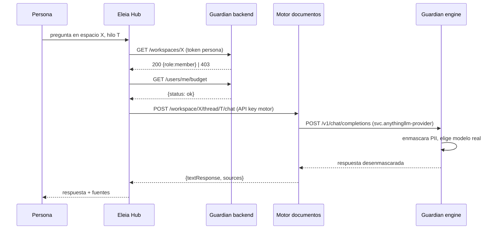
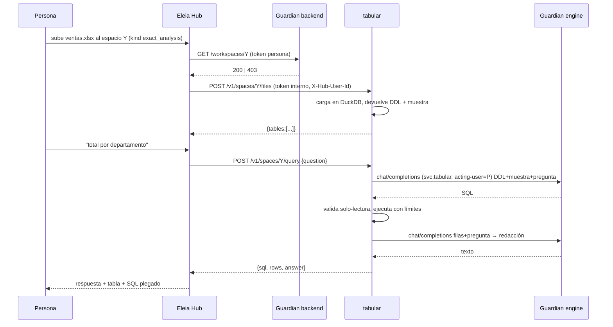
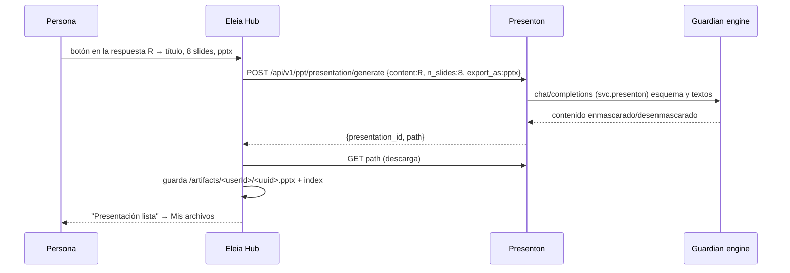
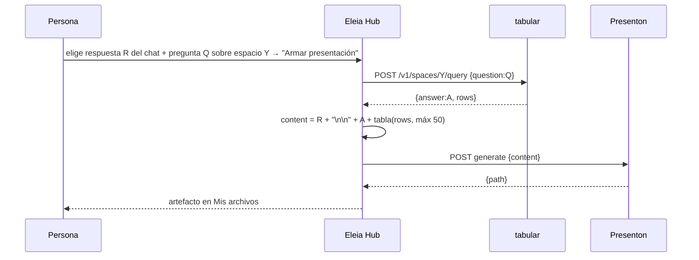
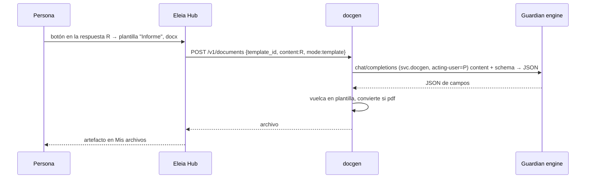

# Feature Specification: IA Hub — Eleia Hub como conector fino sobre Guardian (firewall) y cuatro motores

**Feature Branch**: `050-ia-hub-conector-motores`

**Created**: 2026-09-12

**Status**: 🟢 **Implementada (hitos 1 a 6, 12 al 14-sep-2026)** — estado canónico en
[`CHANGELOG.md`](CHANGELOG.md); pruebas: Hub 37, tabular 74, firewall 30 nuevas; prueba
integral local 12/12 y multiusuario 17/17; imágenes publicadas en `ghcr.io/cluna-8`
(`elea-rag-client`, `elea-tabular`, `elea-guardian-backend`, `elea-guardian-engine`, tag
`2026-09-14`). Pendiente: prueba del instalador desde cero en máquina limpia. **Absorbe** la [spec 046](../_retiradas/046-analisis-exacto-datos-eleia-hub/spec.md)
(UI de Excel) y la [spec 048](../_retiradas/048-motor-analisis-exacto-dbgpt/spec.md) (motor DB-GPT), que quedan
retiradas. **Recorta** la [spec 045](../045-generacion-carga-documentos-eleia-hub/spec.md) (queda solo la
carga de `.pptx` al RAG) y la [spec 049](../049-motor-generacion-documentos/spec.md) (queda solo el
motor de documentos docx/xlsx/pdf, sin presentaciones).

**Repos/carpetas que toca**: `client/` (Eleia Hub), `tabular/` (nuevo), `docker-compose.yml`,
`elea-installer/` (llaves de servicio). **Toca `backend/` solo para dos cosas acotadas y listadas
en FR-040/FR-041**: retirar el código de DB-GPT que la 048 había metido, y aceptar el tipo de
espacio al crearlo. **NO toca `litellm/`**, con una excepción aprobada por el dueño el 13-sep: el
arreglo del hook de streaming del firewall (ver [CHANGELOG](CHANGELOG.md)). Toda la seguridad
sigue viviendo en Guardian.

**Input**: decisiones del dueño del producto del 12-sep-2026, tras revisar punto por punto qué
hace hoy el Hub. Texto literal de las reglas: "Guardian es un firewall, lo único que recibe es la
petición vía GPT API y él enmascara"; "el CLI [Eleia Hub] y las herramientas son aparte, otro
software"; "el CLI hace lo menos posible"; "Guardian y Eleia Hub comparten base de usuarios e hilos
para que solo un usuario pueda ver su trabajo"; "elijo [usar la API de Guardian] porque cuando
Guardian se loguee por SSO quiero que el CLI no necesite hacer todo de nuevo".

**Decisiones selladas (12-sep)**:

1. Guardian = firewall + base de usuarios. Recibe peticiones **como si fuera un modelo** (API
   OpenAI) y enmascara ahí. No recibe archivos, no guarda mensajes, no conoce los motores.
2. El Hub usa la API de Guardian como hoy para login, identidad, presupuesto, modelos, chat
   directo y registro de espacios/hilos. Se acepta que el Hub no arranca sin Guardian.
3. El Hub es un conector fino: **se elimina todo el enmascarado de archivos del Hub**. Los
   archivos crudos viven en los motores locales, dentro del servidor del cliente.
4. Motores: (1) documentación = motor de documentos actual, se mantiene; (2) Excel = servicio
   propio **tabular** con DuckDB, contenedor aparte, reemplaza a DB-GPT; (3) presentaciones =
   **Presenton** en su contenedor, saliendo por Guardian; (4) otros documentos docx/xlsx/pdf =
   motor propio de la spec 049, **solo spec por ahora**.
5. Objetivo de uso "IA Hub": chatear eligiendo el mejor modelo (`auto`) y desde cualquier
   respuesta "enviar a" presentación, Excel o documento; encadenar "Excel + investigación → PPT".

---

## Parte A — Qué hace Guardian (y qué NO hace)

Esta sección describe **lo que existe hoy** en el backend y el motor de Guardian, verificado en
código el 12-sep-2026. Nada de esta parte se construye en esta spec; es el contrato que el Hub y
los motores consumen. El detalle campo por campo está en
[`contracts/01-guardian-api-consumida.md`](contracts/01-guardian-api-consumida.md).

### A.1 Plano de identidad (backend, `:8000`, prefijo `/api/v1`)

| Qué provee | Cómo | Quién lo usa |
|---|---|---|
| **Login y sesión** | `POST /users/login` con usuario y clave → token JWT de 24 h (claims: id, rol, usuario, tenant). No hay refresh: al vencer, se vuelve a loguear. Cuando Guardian tenga SSO, este endpoint (o su reemplazo) es el único punto que cambia. | Hub |
| **Identidad** | Viene en la respuesta del login: `{id, username, role, display_label, email}`. **No existe `GET /users/me`**; el Hub no lo necesita. | Hub |
| **Presupuesto propio** | `GET /users/me/budget` → `{used_usd, max_usd, status: ok\|exceeded}`. Personal primero, grupo como respaldo. | Hub |
| **Catálogo de modelos** | `GET /chat/models` → lista de modelos con `model_name`, `is_configured`, `is_eu_compliant`. **`auto` aparece primero** cuando el router semántico está activo. | Hub |
| **Chat directo con router** | `POST /chat/completions` `{message, model}` → `{response, pipeline_metadata}`. Un turno, sin streaming. **Es el único lugar que entiende `model: "auto"`**: el motor no lo conoce. | Hub (chat sin espacio) |
| **Registro de espacios, miembros e hilos** | `GET/POST /workspaces`, `/workspaces/{id}/members`, `/workspaces/{id}/threads`. Guarda **solo quién es dueño y miembro de qué**, y qué hilo del motor le pertenece a cada persona. **No guarda mensajes.** Acceso denegado = 403 siempre, con fila de auditoría. | Hub |
| **Cuentas y llaves de servicio** | `POST /users` con usuario `svc.*` (el prefijo define que es servicio) + `POST /keys` con `tool_type: "servicio"` y `can_act_on_behalf: true`. La llave se devuelve una sola vez. | Instalador |
| **Auditoría y costos** | Tabla `audit_logs`; reportes agrupan por `COALESCE(acted_for_user_id, user_id)` y excluyen cuentas `svc.*`. | Panel admin |

### A.2 Plano firewall (motor LiteLLM, `engine:4000`, API OpenAI)

| Qué hace | Detalle verificado |
|---|---|
| **Autentica** | `Authorization: Bearer <llave virtual>`. Llave desconocida/inactiva → 401. La llave maestra saltea todo (identidad "master", sin tenant, sin presupuesto, sin auditoría): **ningún motor debe usarla**. |
| **Corta por presupuesto** | Si el dueño de la llave agotó su tope → 402 antes de llegar al proveedor. **Se mira el presupuesto del dueño de la llave, no el del usuario en nombre de quien actúa.** |
| **Bloquea** | AI Act art. 5, secretos/API keys, tipos de entidad marcados "bloquear" → **400** con motivo. Cada bloqueo deja fila de auditoría antes de rechazar. |
| **Enmascara** | PII detectada por el analizador NLP (Presidio) con la política del tenant → placeholders reversibles en el prompt. Si el NLP cae: bloquea (default) o degrada a regex según config. |
| **Desenmascara** | La respuesta vuelve con los datos reales (mapa del request + bóveda de 90 días). Streaming soportado. |
| **Atribuye** | Cabecera `X-Guardian-Acting-User: <user_id>` honrada solo si la llave tiene `can_act_on_behalf` y el usuario es del mismo tenant. Nunca bloquea. |
| **Enruta** | Solo nombres reales del catálogo (`azure-gpt-4o-mini`, `azure-gpt-5.1-chat`, `azure-gpt-5.4-mini`). Fallbacks silenciosos: la respuesta conserva el nombre pedido. |
| **Audita** | Tokens, costo, entidades enmascaradas (conteo), estado de cumplimiento. Los placeholders nunca se persisten. |

### A.3 Lo que Guardian NO hace (límites explícitos, verificados)

- **No recibe archivos.** No hay endpoint de subida. El único endpoint que recibía texto de
  documentos (`POST /gw/inspect`) deja de tener consumidor en el Hub; queda en Guardian sin
  borrar, por si otra superficie lo usa.
- **No guarda mensajes de chat.** Ni del RAG (viven en el motor de documentos) ni de los
  motores nuevos.
- **No conoce los motores.** No sabe que detrás de una llave `svc.tabular` hay DuckDB. Solo ve
  peticiones OpenAI.
- **No enmascara embeddings.** `POST /v1/embeddings` pasa auth y presupuesto pero **no** el
  guardrail (el tipo de llamada no está en la lista de tipos de texto). Restricción a documentar
  en cada motor: ningún motor manda embeddings por Guardian con texto sensible (hoy el motor de
  documentos usa su embedder local; tabular y Presenton no usan embeddings).
- **No entiende `auto` en el motor.** Solo `POST /chat/completions` del backend lo resuelve.
- **No registra `acted_for_user_id` en la fila de éxito del motor.** Solo en filas de bloqueo.
  Consecuencia: el gasto de una petición hecha por `svc.tabular` en nombre de Ana **cae hoy en
  `svc.tabular`**, aunque la cabecera se haya honrado. Ver "Riesgos residuales".
- **No devuelve cabeceras propias.** El cliente del motor solo ve cuerpo OpenAI estándar y los
  códigos 400/401/402.
- **Streaming (corregido 13-sep-2026, ver CHANGELOG):** hasta el 12-sep el firewall no restituía
  placeholders en respuestas `stream: true` de la API OpenAI (solo en la ruta Anthropic). Lo
  descubrió Presenton en el hito 4. Arreglado en Guardian con aprobación del dueño; hoy texto,
  JSON y tool calls por streaming vuelven con los valores reales.

---

## Parte B — Qué hace Eleia Hub (y qué NO hace)

### B.1 Responsabilidades (estado objetivo)

| Responsabilidad | Cómo |
|---|---|
| **UI única** | Chat, espacios de documentos, espacios de Excel, presentaciones, "mis archivos generados". Marca configurable; nunca muestra nombres internos de motores (spec 044 US5). |
| **Sesión de la persona** | Guarda el token JWT de Guardian en memoria de servidor (cookie de sesión). En cada petición a Guardian reenvía ese token. 401 de Guardian ⇒ cierra sesión y pide login. |
| **Verificación de acceso antes de tocar un motor** | Para cualquier acción sobre un espacio, primero `GET /workspaces/{id}` con el token de la persona. 403 ⇒ no se llama al motor. Es la **única** autorización que existe: los motores confían en el Hub. |
| **Reenvío a cada motor** | Documentos → motor de documentos (API key compartida). Excel → tabular (token interno). Presentaciones → Presenton (red interna). Documentos generados → docgen (token interno, spec 049). |
| **Chat directo** | Sin espacio: `POST /chat/completions` de Guardian con el modelo elegido (incluido `auto`). |
| **Orquestación "enviar a"** | Toma el texto de una respuesta (o de varias) y lo entrega como `content` al motor destino. Síncrono, sin cola. |
| **Almacén de artefactos** | Guarda lo que generan Presenton y docgen en un volumen propio, por persona, con índice `{id, kind, title, thread_key, created_at, size}`. Descarga solo para el dueño. |
| **Detección de motores ausentes** | `GET /api/features` dice qué motores están configurados (por variable de entorno). La UI oculta lo que no hay. El Hub arranca con cualquier combinación de motores. |

### B.2 Lo que el Hub NO hace (límites explícitos)

- **No enmascara.** Se eliminan las funciones de enmascarado de texto, CSV y Excel, el endpoint
  `/gw/inspect` y la llave `MASKING_VIRTUAL_KEY`. Los archivos suben crudos al motor local.
- **No tiene usuarios propios ni contraseñas.** Todo pasa por Guardian (regla SSO).
- **No guarda mensajes de chat.** El historial de documentos sigue en el motor de documentos; el
  de Excel lo mantiene tabular por espacio; el Hub solo guarda artefactos generados.
- **No llama al motor `engine:4000` directamente.** Solo al backend de Guardian.
- **No autoriza en nombre de los motores más allá de la membresía.** No hay roles por motor.
- **No arranca sin Guardian** (decisión 2). Sí arranca sin cualquiera de los motores.

### B.3 Rutas del Hub (contrato completo en [`contracts/02-hub-api.md`](contracts/02-hub-api.md))

Se mantienen: `/api/auth/*`, `/api/user/*`, `/api/models`, `/api/branding`, `/api/workspaces/*`
(documentos), `/api/threads/*`, `/api/chat`. Se **renombran** `/api/exact-analysis/*` →
`/api/tabular/*`. Se **agregan** `/api/features`, `/api/presentations/generate`,
`/api/documents/generate` (spec 049), `/api/handoff`, `/api/artifacts`, `/api/artifacts/{id}/download`.
Se **elimina** toda ruta o función de enmascarado.

---

## Parte C — Cómo se conectan

Cada flecha es un contrato. Quién autentica a quién está en la columna "Credencial". El detalle
de cuerpos y errores está en [`contracts/03-motores.md`](contracts/03-motores.md).

### C.1 Tabla de enlaces

| # | De → A | Transporte | Credencial | Qué viaja | Qué NO viaja |
|---|---|---|---|---|---|
| 1 | Hub → Guardian backend | HTTP `/api/v1` | Token JWT de la persona | login, presupuesto, modelos, espacios, miembros, hilos, chat directo | archivos, mensajes de motores |
| 2 | Hub → motor de documentos | HTTP `/api/v1` | API key del motor (compartida, del Hub) | crear/borrar espacios e hilos del motor, subir texto extraído, chatear, leer historial | credenciales de Guardian |
| 3 | Hub → tabular | HTTP `/v1`, red interna | `Authorization: Bearer <TABULAR_INTERNAL_TOKEN>` + `X-Hub-User-Id` | crear espacio, subir csv/xlsx, listar, preguntar | token de la persona |
| 4 | Hub → Presenton | HTTP `/api/v1/ppt`, red interna | ninguna (red interna, sin puertos publicados) | `content`, instrucciones, nº slides, formato | identidad de la persona (Presenton no la modela) |
| 5 | Hub → docgen (spec 049) | HTTP `/v1`, red interna | token interno + `X-Hub-User-Id` | plantilla, contenido, modo | — |
| 6 | Motor de documentos → Guardian engine | API OpenAI `/v1/chat/completions` | llave `svc.anythingllm-provider` | prompt RAG (contexto + pregunta) | embeddings (embedder local) |
| 7 | tabular → Guardian engine | API OpenAI `/v1/chat/completions` | llave `svc.tabular` + `X-Guardian-Acting-User` | DDL + muestra + pregunta; luego filas + pregunta | el archivo |
| 8 | Presenton → Guardian engine | API OpenAI `/v1/chat/completions` | llave `svc.presenton` (sin acting-user: Presenton no permite cabeceras extra) | `content` + prompts internos de Presenton | imágenes (generación apagada) |
| 9 | docgen → Guardian engine | API OpenAI `/v1/chat/completions` | llave `svc.docgen` + `X-Guardian-Acting-User` | contenido + schema de la plantilla | la plantilla, el archivo |
| 10 | Guardian engine → proveedor | API del proveedor | credenciales del tenant | prompt enmascarado | datos reales |

**Regla transversal:** los enlaces 6 a 9 son **los únicos** por donde un dato del cliente sale
hacia un modelo, y los cuatro pasan por el firewall. Ningún motor tiene credenciales de proveedor.

### C.2 Diagramas de secuencia por caso de uso

#### Caso 1 — Chat sobre documentos (RAG)

#### Caso 2 — Pregunta a Excel

#### Caso 3 — "Crear presentación con esta respuesta"

#### Caso 4 — "Excel + investigación → PPT"

#### Caso 5 — "Crear documento con esta respuesta" (spec 049, no se implementa ahora)

---

## Diagnóstico (verificado 12-sep-2026 en código)

| Dónde | Qué pasa hoy | Causa |
|---|---|---|
| Hub, subida de documentos | El Hub enmascara el texto trozo a trozo llamando a Guardian antes de subirlo al motor de documentos (~260 líneas). | Diseño de la spec 043 US3 (enmascarado determinista por documento). El dueño lo retira: Guardian no recibe archivos. |
| Hub, Excel | Rutas `/api/exact-analysis/*` reenvían al backend de Guardian, que reenvía a DB-GPT. La QA del 11-sep falló dos veces. El backend guarda `conv_uid` en el cliente. | Spec 048: motor de terceros con CVE crítica, dentro de Guardian. |
| Guardian backend | Contiene `api/exact_analysis.py` y `services/exact_analysis_service.py` (322 líneas), cliente HTTP de DB-GPT. | Spec 048. Viola la regla "Guardian no conoce motores". |
| Guardian backend | `POST /workspaces` no acepta `kind`; solo el endpoint de DB-GPT creaba espacios `exact_analysis`. | Asimetría documentada en `schemas/workspace.py:29-35`. |
| Compose | `client` depende de `anythingllm`; sin él no arranca. DB-GPT en red interna aparte. | Perfil `rag` original (spec 040). |
| Compose dev | El motor de documentos usa la **llave maestra** contra el engine: sin tenant, sin presupuesto, sin auditoría. | Comodidad de dev; prod usa `svc.anythingllm-provider`. |
| Presentaciones | No existe camino de salida de archivos. | Spec 045 US2 sin planificar. |

---

## User Scenarios & Testing *(mandatory)*

### User Story 1 - El Hub deja de enmascarar y sube crudo al motor de documentos (Priority: P1)

Alguien sube un `.pdf` a su espacio. El Hub extrae el texto y lo sube directo al motor de
documentos, sin pasar por Guardian. Cuando después pregunta, el motor arma el prompt con ese texto
y lo manda por Guardian, que enmascara la PII antes de que salga al proveedor y la restituye en la
respuesta. La persona ve la respuesta con los datos reales, y en el panel de Guardian el admin ve
las entidades enmascaradas contadas en esa consulta.

**Why this priority**: es la regla base del dueño ("Guardian no recibe archivos") y la limpieza
que destraba todo lo demás. Menos código, menos superficie.

**Independent Test**: subir un PDF con un DNI y un nombre inventados; preguntar por ellos; la
respuesta los muestra; en `audit_logs` la fila del motor tiene `masked_entities > 0`; en el Hub no
queda ninguna llamada a `/gw/inspect` (prueba automática que recorre `server.js`).

**Acceptance Scenarios**:

1. **Given** un espacio de documentos del que soy miembro, **When** subo un PDF, **Then** el Hub lo extrae y lo sube al motor sin llamar a Guardian, y el documento queda disponible para preguntar.
2. **Given** el documento subido con un teléfono adentro, **When** pregunto por el teléfono, **Then** lo veo en la respuesta y la auditoría de Guardian registra al menos una entidad enmascarada en esa petición.
3. **Given** Guardian sin presupuesto para la llave `svc.anythingllm-provider`, **When** pregunto, **Then** veo "El servicio de documentos no está disponible por presupuesto" (copy neutro) y nada llega al proveedor.
4. **Given** el código fuente del Hub, **When** se busca `mask`, `gw/inspect` o `MASKING_VIRTUAL_KEY`, **Then** no hay ocurrencias.

---

### User Story 2 - Espacios de Excel con el motor tabular propio (Priority: P1)

Alguien crea un espacio de análisis de Excel, sube dos archivos (ventas y vendedores), y pregunta
"total vendido por departamento del vendedor". El Hub verifica que es miembro, reenvía a tabular,
que carga los archivos en una base propia del espacio, pide a Guardian el SQL, lo valida como solo
lectura, lo ejecuta y devuelve filas y una respuesta redactada. La persona ve la respuesta, la
tabla y el SQL plegado. Otra persona que no es miembro recibe "sin acceso".

**Why this priority**: reemplaza al motor que falló en QA dos veces; es lo que Elea pidió desde el
31-ago (cruces exactos). Cubre las historias de la 046.

**Independent Test**: guion de 8 casos de la QA 046 (`specs/RESULTADOS-QA-046-ANALISIS-EXACTO.md`)
repetido contra tabular, con los mismos fixtures sintéticos, más un caso de join entre dos archivos
y un caso de SQL destructivo rechazado.

**Acceptance Scenarios**:

1. **Given** dos archivos csv/xlsx subidos al mismo espacio, **When** pregunto algo que exige cruzarlos, **Then** la respuesta es correcta y el SQL mostrado tiene un `JOIN`.
2. **Given** una pregunta cuya respuesta el modelo intenta resolver con `DROP`, `DELETE`, `COPY` o `ATTACH`, **When** tabular la valida, **Then** rechaza sin ejecutar y la persona ve "No pude responder con una consulta segura".
3. **Given** un usuario que no es miembro del espacio, **When** intenta subir o preguntar, **Then** recibe 403 desde el Hub y tabular nunca es llamado.
4. **Given** un archivo de 60 MB, **When** lo subo, **Then** el Hub lo rechaza antes de enviarlo con el límite indicado.
5. **Given** un espacio de Excel, **When** miro la lista de espacios de documentos, **Then** no aparece ahí (y viceversa).
6. **Given** el motor tabular apagado, **When** entro al Hub, **Then** la sección de Excel no aparece y el resto funciona.
7. **Given** una planilla exportada de SAP con columnas `Ce.`, `Alm.`, `UMB`, **When** escribo qué significa cada una desde la UI, **Then** la próxima pregunta usa esas definiciones (por ejemplo "vacío = pendiente" al contar lotes).

---

### User Story 3 - Crear una presentación desde una respuesta (Priority: P1)

Después de una respuesta del chat (de documentos o directa), la persona toca "Crear presentación
con esta respuesta", elige título, cantidad de diapositivas y formato, y en menos de dos minutos
tiene el archivo en "Mis archivos generados", descargable solo por ella.

**Why this priority**: el dueño confirmó que "las PPT son importantes" para Elea.

**Independent Test**: generar una presentación de 8 diapositivas desde una respuesta de 600
palabras; el archivo abre en PowerPoint y LibreOffice; otra sesión con otro usuario recibe 403 al
pedir la descarga por id.

**Acceptance Scenarios**:

1. **Given** una respuesta del chat, **When** toco "Crear presentación", **Then** veo un formulario con título, nº de diapositivas (3 a 20) y formato (pptx/pdf).
2. **Given** el formulario confirmado, **When** termina la generación, **Then** el archivo aparece en "Mis archivos generados" con fecha y tamaño y puedo descargarlo.
3. **Given** un archivo generado por Ana, **When** Bruno pide su descarga por id, **Then** recibe 403.
4. **Given** Presenton caído, **When** toco "Crear presentación", **Then** veo "El servicio de presentaciones no está disponible" en menos de 5 s.
5. **Given** el contenedor de Presenton, **When** se inspecciona la red, **Then** no tiene puertos publicados al host y su única salida es Guardian.

---

### User Story 4 - Encadenar Excel + investigación en una presentación (Priority: P2)

La persona hizo una consulta en el chat de documentos y otra en un espacio de Excel. Desde la
respuesta del chat elige "Armar presentación con datos de un espacio de Excel", escribe la pregunta
para el Excel, y el Hub arma el contenido con ambas respuestas y genera la presentación.

**Why this priority**: es la idea del "IA Hub" del dueño; depende de US2 y US3.

**Independent Test**: flujo completo con fixtures; la presentación contiene al menos una
diapositiva con cifras que provienen de la tabla de Excel.

**Acceptance Scenarios**:

1. **Given** una respuesta del chat y un espacio de Excel del que soy miembro, **When** elijo "Armar presentación con datos de Excel" y escribo la pregunta, **Then** la presentación incluye la respuesta del chat y la tabla resultante (hasta 50 filas).
2. **Given** que la consulta al Excel falla, **When** el Hub intenta armar el contenido, **Then** me avisa y no genera una presentación parcial sin decírmelo.

---

### User Story 5 - Ningún motor es obligatorio y ningún nombre interno se ve (Priority: P2)

El Hub se levanta con cualquier combinación de motores configurados. Lo que no está, no se
muestra. Los mensajes de error nunca nombran el motor.

**Why this priority**: instalaciones por cliente con distinto alcance (constitución III y VII).

**Independent Test**: levantar el Hub solo con Guardian; luego con Guardian + documentos; luego
todo. Recorrer la UI y los errores.

**Acceptance Scenarios**:

1. **Given** solo `ELEA_BACKEND_URL` configurada, **When** entro, **Then** veo chat directo y nada más; sin errores en consola.
2. **Given** un motor caído, **When** lo uso, **Then** el copy es neutro y el nombre interno solo está en el log del servidor.

---

### User Story 6 - Motor de documentos declarado como cuarto motor (Priority: P3, solo spec)

El Hub reserva el botón "Crear documento con esta respuesta" y las rutas `/api/documents/*`,
ocultas mientras `DOCGEN_URL` no esté configurada. El motor se especifica en la
[spec 049](../049-motor-generacion-documentos/spec.md) con el mismo contrato de enlace que
tabular (token interno + `X-Hub-User-Id`; salida solo por `svc.docgen`).

**Why this priority**: el dueño pidió dejarlo en la spec para hacerlo en las próximas semanas, no
ahora.

**Independent Test**: con `DOCGEN_URL` vacía, el botón no existe en el HTML servido.

**Acceptance Scenarios**:

1. **Given** `DOCGEN_URL` vacía, **When** cargo el Hub, **Then** no hay botón ni ruta activa de documentos.

---

### Edge Cases

- Token JWT vencido a las 24 h en medio de una generación larga: el Hub completa la llamada al
  motor (no depende del token) y al volver a Guardian recibe 401 → pide login sin perder el
  artefacto ya guardado.
- Espacio de Excel cuyo dueño fue dado de baja: Guardian lo pasa a "sin asignar"; tabular conserva
  los datos hasta que un admin lo reasigne o borre.
- Presenton devuelve 200 con un archivo vacío: el Hub valida tamaño > 0 y tipo antes de guardar.
- Dos personas suben el mismo nombre de archivo al mismo espacio de Excel: tabular versiona por
  id, no por nombre.
- Pregunta al Excel que devuelve 100.000 filas: `LIMIT 500` forzado; el Hub muestra 50 y ofrece
  "ver más" hasta 500.
- El modelo devuelve SQL con comentarios o varias sentencias: se rechaza (una sola sentencia).

---

## Requirements *(mandatory)*

### Functional Requirements

**Hub — limpieza (`client/`)**

- **FR-001**: El Hub MUST NOT enmascarar contenido de archivos ni llamar a `POST /gw/inspect`; MUST eliminar las funciones de enmascarado de texto, CSV y Excel, su configuración y sus pruebas.
- **FR-002**: La subida de documentos MUST ir: extracción de texto local → subida directa al motor de documentos → reindexado, sin pasar por Guardian.
- **FR-003**: El Hub MUST NOT llamar al motor `engine:4000` directamente; toda llamada a Guardian MUST ir al backend con el token de la persona.
- **FR-004**: `docker-compose.yml` MUST permitir levantar `client` con solo `backend` como dependencia; los motores se activan por perfil y por variable de entorno.

**Hub — motores y orquestación**

- **FR-010**: `GET /api/features` MUST devolver qué motores están configurados (`documents`, `tabular`, `presentations`, `docgen`) según variables de entorno; la UI MUST ocultar cada sección ausente.
- **FR-011**: Antes de cualquier llamada a un motor sobre un espacio, el Hub MUST verificar membresía con `GET /workspaces/{id}` usando el token de la persona; 403 de Guardian ⇒ 403 al cliente sin tocar el motor.
- **FR-012**: Las rutas `/api/tabular/*` MUST reemplazar a `/api/exact-analysis/*`: crear espacio (registro en Guardian + espacio en tabular), listar, subir archivo (límite 50 MB), listar archivos, preguntar. El Hub MUST NOT guardar estado de conversación de tabular en el navegador.
- **FR-013**: `POST /api/presentations/generate` MUST aceptar `{content, title, n_slides (3-20), export_as (pptx|pdf), instructions?, thread_key?}`, llamar a Presenton, descargar el resultado y guardarlo como artefacto de la persona.
- **FR-014**: `POST /api/handoff` MUST aceptar `{target: presentation|document, content, tabular?: {workspace_id, question}}`; cuando `tabular` viene, el Hub MUST consultar primero a tabular y concatenar respuesta + tabla (máx 50 filas) al `content` antes de llamar al motor destino; si la consulta falla, MUST abortar con error claro.
- **FR-015**: `GET /api/artifacts` MUST listar solo los artefactos de la persona; `GET /api/artifacts/{id}/download` MUST devolver 403 si no es la dueña. Los artefactos MUST vivir en un volumen propio del Hub.
- **FR-016**: Todo error de motor MUST mostrarse con copy neutro (spec 044 US5, FR-030) y registrarse con detalle solo en el log del servidor.
- **FR-017**: Las llamadas a motores MUST tener timeout: 30 s tabular, 120 s Presenton/docgen; al vencer, el Hub responde 504 con copy neutro.

**Motor tabular (`tabular/`, nuevo)**

- **FR-020**: tabular MUST exponer `POST /v1/spaces`, `POST /v1/spaces/{id}/files`, `GET /v1/spaces/{id}/files`, `DELETE /v1/spaces/{id}/files/{file_id}`, `POST /v1/spaces/{id}/query`, autenticadas con `Authorization: Bearer <TABULAR_INTERNAL_TOKEN>`; sin token ⇒ 401.
- **FR-021**: tabular MUST cargar csv/xlsx (cada hoja = tabla) en una base DuckDB por espacio, en un volumen propio, y devolver DDL y muestra de 5 filas por tabla.
- **FR-022**: tabular MUST generar el SQL pidiéndoselo a Guardian (`engine:4000/v1/chat/completions`) con la llave `svc.tabular`, un modelo real del catálogo configurado por variable, y la cabecera `X-Guardian-Acting-User` con el id recibido en `X-Hub-User-Id`.
- **FR-023**: tabular MUST validar el SQL antes de ejecutar: una sola sentencia `SELECT`/`WITH`; lista negra de funciones de archivo y de sentencias de escritura; conexión de solo lectura; `LIMIT 500` forzado; timeout 20 s; límite de memoria. Lo que no pasa MUST rechazarse sin ejecutar ni "sanear".
- **FR-024**: tabular MUST redactar la respuesta con una segunda llamada a Guardian que reciba a lo sumo 50 filas; MUST devolver `{sql, rows, answer, model_used}`.
- **FR-025**: tabular MUST NOT tener puertos publicados al host ni credenciales de proveedor; MUST estar solo en una red interna con el Hub y el engine.
- **FR-026**: tabular MUST NOT llamar a `/v1/embeddings`.
- **FR-027 (diccionario de datos, pedido del dueño 13-sep)**: cada espacio MUST permitir una
  descripción por columna (`PUT /v1/spaces/{id}/dictionary`), editable por cualquier miembro
  desde la UI (clic en la columna), que MUST viajar al modelo en el esquema de cada pregunta.

**Presenton**

- **FR-030**: Presenton MUST correr como servicio de compose con imagen fijada por digest, `LLM=custom`, `CUSTOM_LLM_URL=http://engine:4000/v1`, llave `svc.presenton`, un modelo real del catálogo, `DISABLE_IMAGE_GENERATION=true`, sin puertos publicados.
- **FR-031**: El instalador MUST crear las cuentas `svc.tabular` y `svc.presenton` y sus llaves (`tool_type: servicio`, `can_act_on_behalf: true` para tabular) con el mismo mecanismo que `svc.anythingllm-provider`, y volcar las llaves al `.env`.
- **FR-032**: La UI de Presenton MUST NOT ser alcanzable por las personas; el Hub es la única cara.

**Guardian — cambios acotados (`backend/`)**

- **FR-040**: MUST retirarse `api/exact_analysis.py`, `services/exact_analysis_service.py`, su registro en `api/__init__.py`, su prueba de integración, el servicio `exact-analysis-engine`, la red `exact-analysis-net`, el volumen `exact_analysis_data` y la variable `DBGPT_ENGINE_VIRTUAL_KEY`. Se conservan `workspaces.kind` y las membresías.
- **FR-041 (único cambio funcional en Guardian, a confirmar por el dueño)**: `POST /workspaces` MUST aceptar `kind` (`rag` por defecto, `exact_analysis`) y devolverlo; `GET /workspaces/{id}` MUST devolver `kind`. Justificación: sin esto el Hub no puede crear espacios de Excel una vez retirado el endpoint de DB-GPT. Es registro de acceso, no lógica de motor.

**Transversal**

- **FR-050**: Ningún motor MUST usar la llave maestra del engine, ni en dev ni en prod; cada uno MUST tener su llave `svc.*`.
- **FR-051**: Ningún motor MUST mandar texto del cliente a `/v1/embeddings` de Guardian mientras ese camino no pase por el guardrail (Parte A.3).
- **FR-052**: Las specs 046 y 048 MUST marcarse como absorbidas por esta; la 045 MUST recortarse a la carga de `.pptx`; la 049 MUST recortarse a docx/xlsx/pdf; el CHANGELOG de la 043 MUST registrar que US3 (enmascarado determinista por documento) deja de tener consumidor en el Hub.

### Key Entities

- **Espacio (workspace)**: registro en Guardian con `kind` (`rag` | `exact_analysis`), dueño y miembros. El mismo id es la clave del espacio en el motor correspondiente.
- **Hilo**: registro en Guardian de qué hilo del motor de documentos pertenece a qué persona (spec 043). Tabular no tiene hilos: el historial corto lo manda el Hub en cada pregunta.
- **Archivo tabular**: csv/xlsx cargado en un espacio de Excel; una o más tablas en la base del espacio. Vive en tabular.
- **Artefacto**: archivo generado (pptx/pdf ahora; docx/xlsx después) con dueño, tipo, título, hilo de origen, fecha y tamaño. Vive en el Hub.
- **Cuenta de servicio**: usuario `svc.*` de Guardian con una llave virtual que un motor usa para salir por el firewall.

---

## Success Criteria *(mandatory)*

### Measurable Outcomes

- **SC-001**: `client/server.js` pierde al menos 250 líneas y 0 ocurrencias de `mask`, `gw/inspect`, `MASKING_VIRTUAL_KEY`; la suite del Hub pasa en CI.
- **SC-002**: Los 8 casos de la QA 046 pasan contra tabular, más el caso de join y el de SQL destructivo rechazado: 10 de 10.
- **SC-003**: Una pregunta a un Excel de 10.000 filas responde en menos de 15 s de punta a punta, medido en el Hub.
- **SC-004**: 0 de 20 intentos de SQL con `DROP/DELETE/UPDATE/COPY/ATTACH/read_csv` se ejecutan.
- **SC-005**: Una presentación de 8 diapositivas desde 600 palabras se genera en menos de 120 s y abre sin error en PowerPoint y LibreOffice, 5 de 5 intentos.
- **SC-006**: 0 puertos de tabular y Presenton alcanzables desde el host; 0 llamadas de tabular o Presenton a hosts externos con la red de salida cortada (comprobado con el firewall del host).
- **SC-007**: En `audit_logs`, el 100% de las peticiones de tabular y Presenton aparecen con llave `svc.*` propia y 0 con identidad "master".
- **SC-008**: El Hub arranca con solo Guardian en menos de 10 s y sin errores en consola; las secciones ausentes no se renderizan.
- **SC-009**: 0 nombres internos de motores en el HTML/JS servido y en los textos de error (prueba automática de la 044 extendida a tabular y Presenton).

---

## Assumptions

- **Decisiones del dueño del 12-sep listadas arriba**: no se rediscuten en `plan.md`.
- La atribución de gasto por persona en peticiones de motores queda como está hoy (cae en la
  cuenta `svc.*`); el Hub registra quién generó cada artefacto y quién preguntó. Si se quiere
  atribuir en Guardian, es una spec aparte de backend (ver Riesgos residuales).
- El presupuesto que corta a un motor es el de su cuenta `svc.*`, no el de la persona. El Hub
  sigue mostrando y chequeando el presupuesto personal antes de cada acción, como hoy.
- Presenton no tiene multiusuario: el aislamiento lo da el Hub copiando el artefacto al espacio
  de la persona y no exponiendo la UI de Presenton.
- Los mensajes de chat de documentos siguen en el motor de documentos; el "historial único" es
  el conjunto de artefactos por persona en el Hub, no un hilo unificado en Guardian.
- Versiones exactas (DuckDB, FastAPI, digest de Presenton), nombre del modelo por motor y forma
  del prompt SQL son decisiones de `plan.md`.
- El motor docgen (motor 4) se planifica en la 049; acá solo se reservan botón y rutas.

---

## Riesgos residuales y lo que queda fuera (revisado 12-sep)

| Riesgo | Estado | Mitigación en esta spec |
|---|---|---|
| Gasto de motores cae en `svc.*`, no en la persona (fila de éxito del engine sin `acted_for_user_id`) | Conocido, en Guardian | Fuera de alcance; anotado para spec de backend. El Hub registra autoría. |
| Presupuesto del engine mira al dueño de la llave, no al acting-user | Conocido, en Guardian | El Hub chequea presupuesto personal antes de cada acción. |
| `/v1/embeddings` sin guardrail | Conocido, en Guardian | FR-051: ningún motor lo usa con texto del cliente. |
| Documentos crudos con PII en el motor de documentos y en tabular | Aceptado por el dueño (12-sep) | Viven en el servidor del cliente; solo salen enmascarados por Guardian. Documentar en el manual de instalación. |
| Presenton descarga recursos (fuentes, CSS) al arrancar | Verificado 12-sep: genera con red interna sin salida | SC-006 cumplido. |
| Términos de negocio tomados por nombres de persona ("OTC", "FASON") por el NLP | Real, visto 12-sep | Se restituyen igual (tras el fix de streaming). Falsos positivos = config de entidades/allow-list del tenant en Guardian, fuera de esta spec. |
| Prompt injection desde un archivo hacia el SQL | Real | FR-023: validación estricta; el modelo nunca ejecuta, tabular ejecuta. |
| Hub sin Guardian no arranca | Aceptado por el dueño | — |
| Retiro del enmascarado determinista por documento (043 US3) | Decisión del dueño | FR-052: registrar en CHANGELOG 043; `/gw/inspect` queda en Guardian. |

**Fuera de alcance**: implementación del motor docgen (spec 049); atribución de gasto por
persona en el engine; SSO (cuando llegue, el Hub lo hereda por el login de Guardian); hilo único
de conversación cruzando motores.
